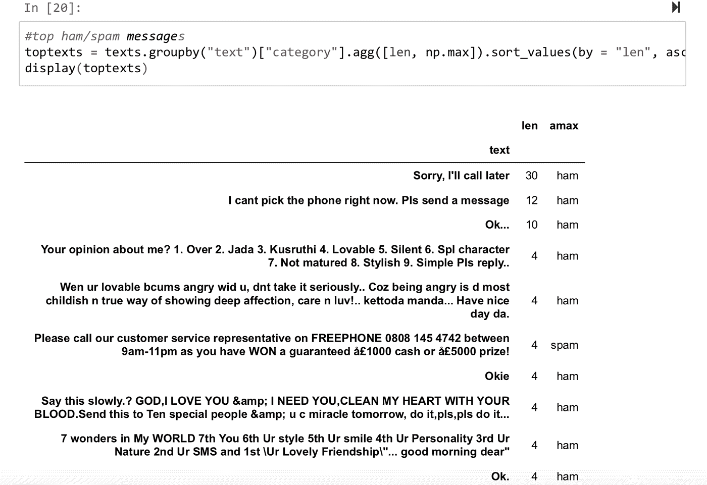
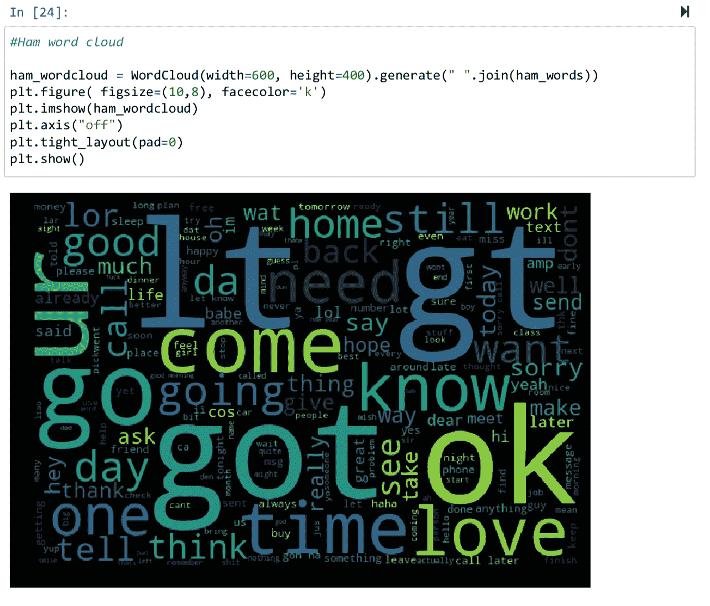
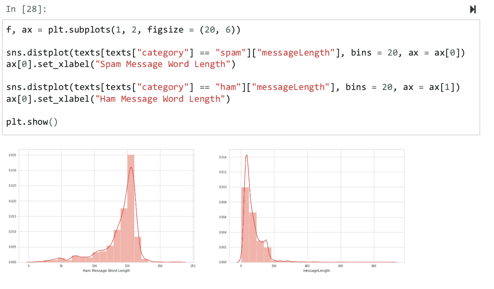
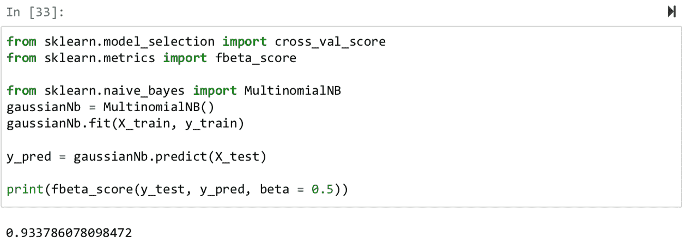

# 构建预测模型来分类垃圾文本

> 原文：<https://towardsdatascience.com/building-a-prediction-model-to-classify-texts-that-are-spam-a2ccded75e77?source=collection_archive---------32----------------------->

## 在这篇文章中，我和我的同事使用了一个文本信息数据集来建立一个预测模型，以分类哪些文本是垃圾邮件。


照片由[杰米街](https://unsplash.com/@jamie452?utm_source=unsplash&utm_medium=referral&utm_content=creditCopyText)在 [Unsplash](https://unsplash.com/s/photos/phone-message?utm_source=unsplash&utm_medium=referral&utm_content=creditCopyText)

# **数据集**

该数据集包含 5，574 封被标记为垃圾邮件或非垃圾邮件的邮件。该数据集被视为黄金标准，因为合法文本是为新加坡国立大学计算机科学系的研究而收集的，而垃圾短信是从英国的一个论坛中提取的，手机用户在该论坛上公开声称收到垃圾短信。

# **步骤**

应对挑战的步骤包括:数据探索、数据预处理(标记化、词干化、词条化、空白、停用词等。)，通过词云识别排名靠前的垃圾词，建立训练集和测试集，在训练集上建立分类模型，测试模型，最后对模型进行评估。

# **初始发行**

最初面临的一个问题是，大部分数据集包含更高比例的合法文本消息。在将欺诈/垃圾邮件检测建模为分类问题时，一个常见的挑战是，在现实世界的数据中，大多数都不是欺诈性的，留给我们的是不平衡的数据。我们必须确保我们的训练数据集不会偏向合法的消息。处理不平衡数据有多种方法，如 SMOTE、RandomUnderSampler、ENN 等。我和我的团队引入了分层抽样。我们希望避免这种情况，即我们的模型预测大多数消息是合法的，而团队接受模型是合适的，因为尽管有偏差，但准确性很高。

# **流程**

开发垃圾短信分类解决方案的方法包括:

*初步文本分析*

*   使用饼图检查有多少邮件是垃圾邮件或合法邮件
*   创建一个由垃圾邮件和非垃圾邮件组成的单词云
*   识别前 10 个垃圾邮件单词和前 10 个合法单词
*   分析垃圾邮件和合法文本消息的长度，并分别绘制两个图表来检查它们的长度分布。

*文本转换*

*   通过删除停用词、执行标记化、词干化、词条化、空白等来清理数据。
*   我们使用 NLTK 库中的‘SnowballStemmer’从单词中移除形态词缀，只留下单词词干
*   我们使用“TfidfVectorizer”从提供的计数矩阵执行 TF-IDF 转换
*   我们在数据集中对类别进行了编码:“垃圾邮件”为 1，“合法”为 0
*   我们以 80:20 的比例分割训练和测试数据

# **分析**

我们通过数据可视化和探索注意到的几个快速观察结果是，大约 86.6%的数据是合法的，而其余 13.4%是垃圾数据。我们还捕获了最常见的垃圾邮件单词(“呼叫”、“免费”、“Txt”、“发送”、“停止”、“回复”)和合法单词(“u”、“gt”、“lt”、“ok”、“get”、“go”)。发现的其他见解是，与合法消息相比，垃圾消息的长度往往更长。我们绘制了以下图表进行探索性分析:

*被归类为垃圾邮件或火腿的文本百分比(合法)*

```
#Lets see what precentage of our data is spam/ham texts["category"].value_counts().plot(kind = 'pie', explode = [0, 0.2], figsize = (6, 6), a plt.ylabel("Spam vs Ham") plt.legend(["Ham", "Spam"]) plt.show()
```


*来自数据集的前 10 条短信*

```
#top ham/spam messages message toptexts = texts.groupby("text")["category"].agg([len, np.max]).sort_values(by = "len", asc display(toptexts)
```



*垃圾词云*

```
#Spam Word cloud spam_wordcloud = WordCloud(width=600, height=400).generate(" ".join(spam_words)) plt.figure( figsize=(10,8), facecolor='k') plt.imshow(spam_wordcloud) plt.axis("off") plt.tight_layout(pad=0) plt.show()
```


*火腿(合法)字云*

```
#Ham word cloud ham_wordcloud = WordCloud(width=600, height=400).generate(" ".join(ham_words)) plt.figure( figsize=(10,8), facecolor='k') plt.imshow(ham_wordcloud) plt.axis("off") plt.tight_layout(pad=0) plt.show()
```



*火腿和垃圾短信长度分布*

```
f, ax = plt.subplots(1, 2, figsize = (20, 6)) sns.distplot(texts[texts["category"] == "spam"]["messageLength"], bins = 20, ax = ax[0]) ax[0].set_xlabel("Spam Message Word Length") sns.distplot(texts[texts["category"] == "ham"]["messageLength"], bins = 20, ax = ax[1]) ax[0].set_xlabel("Ham Message Word Length") plt.show()
```



# **结果**

## 模型应用

我们使用朴素贝叶斯来训练我们的模型。我们选择这种模型是因为在处理文本时，将每个独特的单词视为一个特征是非常常见的，并且由于典型的人的词汇量是成千上万的单词，这导致了大量的特征。当单词的多次出现在分类问题中很重要时，该算法是相关的。该算法的相对简单性和朴素贝叶斯的独立特征假设使其成为分类文本的强有力的执行者，因此我们决定使用朴素贝叶斯分类器来将文本消息分类为合法的或垃圾邮件。

## 模型评估

我们认为精确度是更好的评估标准，因为更有必要不将合法邮件归类为垃圾邮件。因此，我们致力于创建一个具有更好的可接受的 f-beta 分数的模型，并倾向于将精确度作为我们提出的问题的解决方案的准确性度量。结果，我们发现该模型的 f-beta 分数为 0.93，这可以被认为是足够好的，可以推断所建立的模型非常接近预期使用的理想模型。



—

***娜塔莉·加尔塞斯*** *是一名来自大西雅图地区的数据分析师。她获得了华盛顿大学的商业和 MSBA 学士学位。她写作并热衷于数据可视化、投资和所有科技方面的东西。*