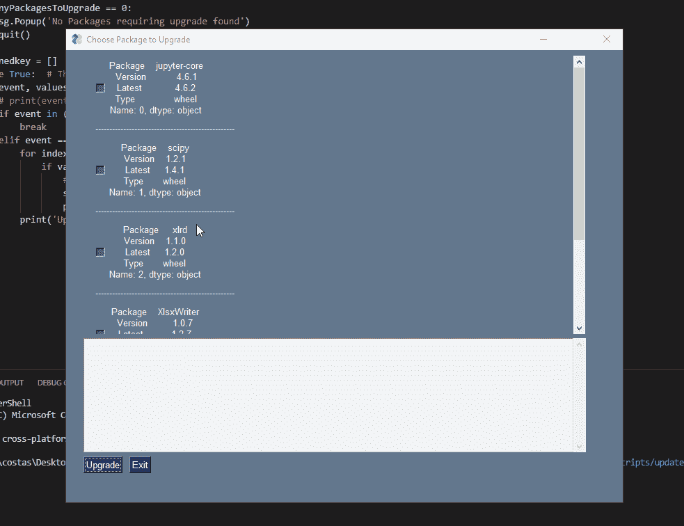

# 如何更新你所有的 Python 库

> 原文：<https://towardsdatascience.com/building-a-python-ui-to-keep-your-libraries-up-to-date-6d3465d1b652?source=collection_archive---------23----------------------->

## 了解我如何使用 PySimpleGUI 来更新我的 Python 库

# 概观

就在几天前，我试图通过使用 python 库中最近引入的功能来解决我的一个问题。没多久就意识到不在了。我使用的是一个如此陈旧的库版本，以至于很多新功能都不存在。

我通过 pip 管理我的包，所以一次升级一个库非常简单。不幸的是，如果你想全部升级，情况并非如此。没有内置的功能让你一次升级所有的软件包。

我最终拼凑了一些东西，这些东西将循环遍历我的包并升级它们。然而，这个解决方案不允许我选择单独的库来升级；这意味着，无论出于什么原因，如果我不想升级我的某个库，我就会被卡住。这就是为什么我决定建立一个 UI，让我挑选要升级的库。

在这个博客里，我把这个作品分享给你，这样你也可以使用它。随意构建和改进它；或者大家有什么建议，留下评论，也许我会更新。

马库斯·斯皮斯克在 [Unsplash](https://unsplash.com?utm_source=medium&utm_medium=referral) 上的照片

# 调味汁

整个脚本不到 100 行，我使用了四个广泛使用的库来完成。

## 1.子过程

这个库允许我们与命令行交互，并传递我们想要的任何命令。这就是我将如何找出哪些库是过时的，然后升级它们。

## 2.熊猫

熊猫以处理数据而闻名。在这个实例中，我们将使用它将一个 CSV 文件读入数据帧，这也很适合我们选择的 UI 库:PySimpleGUI

了解有关将文件读入 pandas 的更多信息:

 [## 用 Python 从 Excel 到数据库

### 了解如何使用 Python 进行快速数据分析

medium.com](https://medium.com/financeexplained/from-excel-to-databases-with-python-c6f70bdc509b) 

## 3.铼

Re 是 Python Regex 库，它允许我们轻松地匹配模式。在这种情况下，我们将使用它来剔除任何不必要的信息，只显示有用的信息。

了解有关正则表达式的更多信息:

 [## 正则表达式简介

### 使用 Python 逐步介绍正则表达式

medium.com](https://medium.com/better-programming/introduction-to-regex-8c18abdd4f70) 

## 4.PySimpleGUI

最后，PySimpleGUI 将是我们用于 UI 的库。我们将定义 UI，然后定义事件:

了解有关构建 Python 用户界面的更多信息:

 [## 了解如何用 Python 快速创建 ui

### 最后，你可以在 10 分钟内找到一个图书馆

towardsdatascience.com](/learn-how-to-quickly-create-uis-in-python-a97ae1394d5)  [## 构建用于比较数据的 Python UI

### 如何快速让您的非技术团队能够比较数据

towardsdatascience.com](/building-a-python-ui-for-comparing-data-13c10693d9e4) 

# 完整的代码

# 结论

好了，伙计们。在不到 100 行代码中，您可以看到所有 Python 过时的库，并选择想要升级的库。

出于几个原因，您当然应该定期这样做:

1.  获取最新的错误修复
2.  解决任何漏洞
3.  性能增强
4.  访问软件包的最新和最强大的功能

希望你觉得有用。