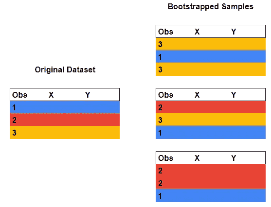

# 从零开始的随机森林算法

> 原文：<https://towardsdatascience.com/building-a-random-forest-classifier-c73a4cae6781?source=collection_archive---------17----------------------->

## 直觉、伪代码和代码

从头开始实现随机森林 ML 算法听起来像是一项令人生畏的任务。仅仅是想到我们要做对多少细节，就很容易感到不知所措。或者至少我是这么觉得的。我从哪里开始？第一步是什么？我如何知道它是否有效？


[图米苏](https://pixabay.com/users/Tumisu-148124/)在 [Pixabay](https://pixabay.com/photos/mistake-error-question-mark-fail-1966448/) 上的照片

转折点是当我意识到我需要从**而不是**思考代码开始。想象一下，我站在算法里面，在一棵树的根部，我会怎么做？然后呢？问这些问题有助于分解和简化问题。回答这些问题将建立对算法内部工作的直觉。在本帖中，我们将和[泰坦尼克号数据集](https://www.kaggle.com/c/titanic)一起探讨这些问题和答案。

我们的议程:

1.  涵盖随机森林功能的高级概述
2.  为一个**二进制随机森林分类器**编写伪代码
3.  解决一些最小的数据预处理需求
4.  编写代码(可在此处完整访问
5.  对照 scikit-learn 算法检查结果

请注意，这篇帖子的灵感来自于 [Fast.ai 机器学习课程](http://course18.fast.ai/ml)，我强烈推荐给那些通过做来学习最好的人。

让我们开始吧！

# **树**

如果你在泰坦尼克号上，你会幸存吗？


“均值”是指那个群体中每个人的平均存活率。

*   开始时，船上每个人的预期存活率是 40%
*   那么对于所有女性，75%
*   而对于所有男性，20%……等等。

对我来说，我是一个女性，说我有一张三等票。按照这个决策树，我在泰坦尼克号上幸存的概率是 50/50。

另一个人，男性，也在第三类，将有 10%的生存机会；除非他未满 15 岁，否则他生还的可能性是 90%。

这是随机森林中的一棵决策树。我们已经被提供了根据哪个特征(即年龄)以及在哪个级别(即 15 岁以下)进行划分。为了预测一个新轮廓的存活几率，我们简单地跟踪这些分支。

现在让我们拿走树枝。想象我们在树根处。


据我们所知，所有样本中，有 40%存活了下来。我们必须决定拆分哪个功能，以及在什么级别上拆分。怎么会？

我们将尝试每一个功能和每一个级别，对每一个组合进行评分，并选择最好的。

```
for feature in list of features: 
     for (unique) row in data: 
          what is the score of we split here? 
          if the score is better what we have: update it 
```

但是分数是多少呢？我们如何知道哪种分割是最好的？

## 分数

对于分类问题，一个常用的指标是基尼不纯度(这也是 scikit-learn 的缺省值)。每个分割都有一个基尼系数:


让我们看一个简单的例子:

*如果我把女性和男性分开，基尼系数会是多少？*

```
x = [1, 1, 1, 1, 1, 2, 2, 2] #5 female & 4 male
y = [1, 1, 1, 1, 0, 0, 0, 0] #4 survived & 4 died
```


```
**Decision Tree:**def check_features: 
     for feature in list of features: 
          find_best_split of this featuredef find_best_split(feature):
     for (unique) row in data:
          left = list of all rows <= current row          
          right = list of all rows > current row 
          calculate the score           
          if the score is better than what we have: update itdef find_gini(left_split, right_split, y): 
     p(left) = n_left/n_y
     p(right) = n_right/n_y
     for each outcome: #in this case, Survived or Died
          p = probability of this outcome for the left 
          sum_left += p^2 
          p = probability of this outcome for the right
          sum_right += p^2
     gini = weighted average of (1-sum_left) and (1-sum_right)def prediction():  
     return array of predictions for this tree 
```

# 随机森林

一个森林由无数的决策树组成。*随机部分呢？*假设我们有一个包含 1000 个样本和 5 个特征的数据集。我们想建 10 棵树。所有的树都会在同一个地方裂开，最后形成 10 棵完全相同的树。这对我们帮助不大。

如果我们每次取数据集的不同部分会怎么样？假设我们想要 100 棵树，这意味着每棵树 10 个样本，这将导致相当高的方差。

有没有办法让我们每次都用 1000 个样品？而且每棵树的数据也略有不同？是: [**自举**](http://faculty.marshall.usc.edu/gareth-james/ISL/ISLR%20Seventh%20Printing.pdf) 。我们从数据集中抽取 1000 个样本，进行替换。平均来说，大约 63%的原始观测值将被包括在内。这对于减少过度拟合很重要。



使用 3 个样本自举

使用这种方法，我们将为每棵树提供不同的数据。随机森林的目标是拥有彼此尽可能不同的树，但非常擅长预测给定的数据。然后，如果你有许多不相关的树，每个树都有很高的预测能力，当你把它们加起来时，误差总和将为零。剩下的将是 X 和 y 变量之间的真实关系。

```
**Random Forest**:def __init__ (x, y, n_trees, sample_size, min_leaf):
     for numbers up till 1-n_trees: 
          create a tree def create_tree():
     get sample_size samples, use np.random.choice w/ replacement
     create an instance of the Decision Tree class def predict():
     average of predictions from n_trees 
     return binary outcome 0 or 1 
```

我们现在有了这两个类的伪代码。让我们将它转换成代码，并与 scikit-learn 的 RandomForestClassifier 的结果进行比较。

## 数据

*   输入和目标必须是数字
*   分类特征是标签编码的(如果是有序的)或一个热编码的

*离群值和特征缩放怎么办？*原来随机森林一般对这些免疫。它的决定是有序的。请记住，在每次考虑分割时，我们将样本分为两组:大于分割值的样本，以及小于或等于分割值的样本。如果我们考虑在 15 岁分开:不管你的年龄是 16 岁还是 60 岁，两者都将被放在一组。随机森林很少假设数据的分布，这是一个很好的起点。

以下是预处理后的 Titanic 数据集的输入内容:


现在，让我们关注 2 个特性的子集:Pclass 和 Sex。

# 代码

## 第一次拆分

我们回到了第一棵树的根部。让我们写吧

scikit-learn 树告诉我们这是第一次分裂。


我们的树也做了同样的决定！

```
tree = RandomForest(x_sub, y_train, 1).tree[0]
[output] gini: 0.318; split:1, var: Sex
```

## 进一步分裂

如果我们允许 scikit-learn 树再分裂一次(深度=2):


第一次分开后，我们把所有的女人分在一组，所有的男人分在另一组。对于下一次拆分，这两个组将有效地成为他们自己的决策树的根。对于女性来说，下一步的划分是将第三等级从其他等级中分离出来。对男人来说，下一个分裂是把第一阶层从其他阶层中分裂出来。

让我们修改一下我们的伪代码:

```
def check_features: 
     for feature in list of features: 
          find_best_split of this feature
     left_hand_side = rows <= our split point 
     right_hand_side = rows > our split point 
     DecisionTree(left_hand_side)
     DecisionTree(right_hand_side) 
```

结果与 scikit-learn 的结果相匹配:

```
tree = RandomForest(x_sub, y_train, 1).tree[0]
[output] gini: 0.318; split:1, var: Sextree.lhs 
[output] gini: 0.264; split:2, var: Pclasstree.rhs
[output] gini: 0.272; split:1, var: Pclass
```

# 预测

让我们加入更多特性，看看我们的模型是如何工作的:


使用 10 个决策树，我们的模型在测试集上有 81%的准确率。分数低于 scikit-learn 的分数。但是对于一个我们从零开始构建的算法来说还不错！

所以你看，从零开始建立一个随机的森林并不一定是令人生畏的。学习过程的这一部分让我能够区分出算法的哪些部分我真正理解了，哪些部分我还需要继续努力。有时候，除非你尝试自己去实现，否则你不会明白。

谢谢你让我分享我所学到的东西。我希望这篇文章对你有所帮助。欢迎提出问题和建议！

参考资料:

*   J.霍华德， [Fast.ai 机器学习](http://course18.fast.ai/ml)，第 7 课
*   G.詹姆斯、d .威滕、w .特雷弗和 r .蒂布拉尼，[统计学习简介](http://faculty.marshall.usc.edu/gareth-james/ISL/ISLR%20Seventh%20Printing.pdf)，第 5 章

直到下一次，

V