# 使用 Python Plotly 库和 Web 服务构建实时仪表板

> 原文：<https://towardsdatascience.com/building-a-real-time-dashboard-using-python-plotly-library-and-web-service-145f50d204f0?source=collection_archive---------1----------------------->

## [变更数据](https://towardsdatascience.com/tagged/data-for-change)

由[卢克·切瑟](https://unsplash.com/@lukechesser?utm_source=unsplash&utm_medium=referral&utm_content=creditCopyText)在 [Unsplash](https://unsplash.com/s/photos/dashboard?utm_source=unsplash&utm_medium=referral&utm_content=creditCopyText) 上拍摄的照片

***编者按:*** [*走向数据科学*](http://towardsdatascience.com/) *是一份以数据科学和机器学习研究为主的中型刊物。我们不是健康专家或流行病学家，本文的观点不应被解释为专业建议。想了解更多关于疫情冠状病毒的信息，可以点击* [*这里*](https://www.who.int/emergencies/diseases/novel-coronavirus-2019/situation-reports) *。*

仪表板是一个图形界面，提供与特定现象或业务相关的一些关键指标的综合视图。在这篇文章中，我将一步一步地展示我们如何使用 **Python Plotly 支线剧情**构建一个仪表板来实时执行新冠肺炎病例的每日报告。我们的目标是制作一个实时仪表板，如下所示:

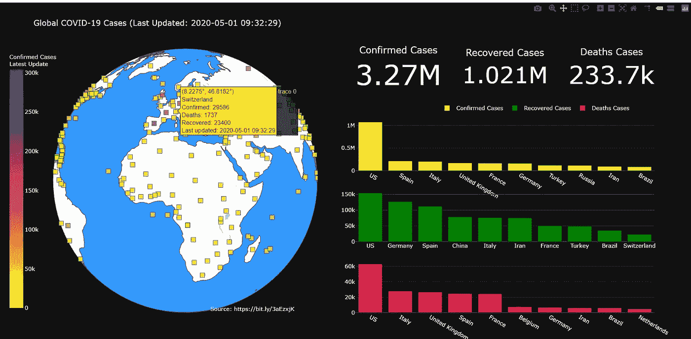

显示全球新冠肺炎数据的仪表板

仪表盘的实时版本可从以下网址获得

[**https://covid-19-data-visualizer.herokuapp.com/**](https://covid-19-data-visualizer.herokuapp.com/)

*您在访问实时仪表盘时可能会遇到一些延迟，因为它是使用免费的 Heroku 帐户部署的，处理资源有限。*

# 数据源和 web 服务

因为我们将基于实时数据构建一个仪表板，所以数据源来自 web 服务，而不是静态的 CSV 或文本文件。简而言之，web 服务是一个在线数据库，我们可以通过它联系并请求一些想要的信息，然后将它们获取到我们的应用程序中。

在本教程中，我们将使用从 Esri 提供的 [**Web 服务中获得的**新冠肺炎数据来构建我们的仪表板。来自该网络服务的新冠肺炎数据每天更新。****](https://coronavirus-resources.esri.com/datasets/bbb2e4f589ba40d692fab712ae37b9ac_1/geoservice?geometry=34.182%2C-38.069%2C-16.794%2C63.033&orderBy=Country_Region&selectedAttribute=Confirmed&where=Last_Update%20%3E%3D%20TIMESTAMP%20%272020-02-23%2000%3A00%3A00%27%20AND%20Last_Update%20%3C%3D%20TIMESTAMP%20%272020-04-25%2023%3A59%3A59%27)

# 先决条件 Python 库

*   阴谋地—[https://plotly.com/python/](https://plotly.com/python/)
*   熊猫—[https://pandas.pydata.org/](https://pandas.pydata.org/)
*   请求—[https://pypi.org/project/requests/](https://pypi.org/project/requests/)

# 从 Github 下载源代码

为了让你更轻松地学习本教程，你可以从我的 [Github 库](https://github.com/teobeeguan/COVID-19-Visualization-Project)获得完整的源代码(**新冠肺炎 _ 仪表板. ipynb** )。

您可以使用我的源代码作为参考来理解构建仪表板的过程，我将在下面的部分中介绍这个过程。

# 构建新冠肺炎控制板的步骤

## **第 1 部分:**设置 Python 库

我们通过导入本教程所需的所有必要库来开始我们的 Python 脚本。

用于导入库的 Python 代码

## 第 2 部分:从 web 服务请求数据

接下来，我们访问 [**esri 网站**](https://coronavirus-resources.esri.com/datasets/bbb2e4f589ba40d692fab712ae37b9ac_1/geoservice?geometry=34.182%2C-38.069%2C-16.794%2C63.033&orderBy=Country_Region&selectedAttribute=Confirmed&where=Last_Update%20%3E%3D%20TIMESTAMP%20%272020-02-23%2000%3A00%3A00%27%20AND%20Last_Update%20%3C%3D%20TIMESTAMP%20%272020-04-25%2023%3A59%3A59%27) 以获取一个查询 URL，并将该 URL 复制并粘贴到我们脚本中的 Python *request* 模块，以向 web 服务发送 HTTP 请求(第 1 行)。HTTP 请求将以 JSON 格式从 web 服务向我们的应用程序返回最新的新冠肺炎数据(第 2 行)。我们从" *features* "属性中选择数据，并使用它来构建一个 *Pandas* *dataframe，df* (第 3 行)。

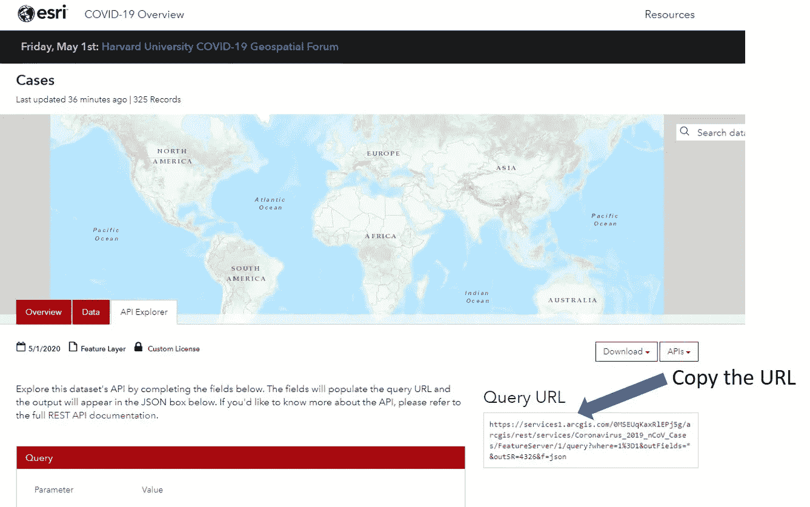

esri Web 服务网站

请求 web 服务的 Python 代码

我们可以使用*熊猫头*方法预览返回的新冠肺炎数据的前五条记录。

预览数据的 Python 代码

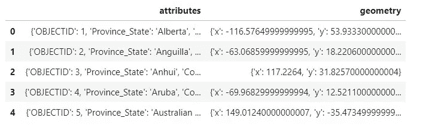

web 服务数据预览

要更详细地查看属性值，我们只需选择其中一项。

查看属性的 Python 代码

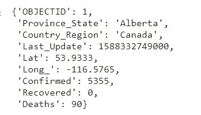

单个记录的属性

从预览中，我们可以看到新冠肺炎记录由一个字典列表组成，其中包括地理属性(如*省 _ 州、国家 _ 地区、纬度、经度 _* )和数字属性(如*确诊、痊愈、死亡*)。此外，它还包括一个时间戳属性( *Last_Update* )。

## 第 3 部分:转换数据

从上一部分中，我们了解到新冠肺炎记录的结构是一个字典列表，在这里我们试图将它们转换成一个新的 *Pandas 数据帧，df_final* 。为此，我们首先使用 *tolist* 方法将字典转换成一个*列表，data_list* (第 1 行)。接下来使用 *data_list* 构建一个新的数据帧 *df_final* (第 2 行)。接下来，我们使用 *set_index* 方法将“OBJECTID”属性设置为每条记录的索引(第 3 行)。最后，重新排序 *df_final* 数据框中的列(第 4 行)并预览转换后的记录(第 5 行)。

转换数据的 Python 代码

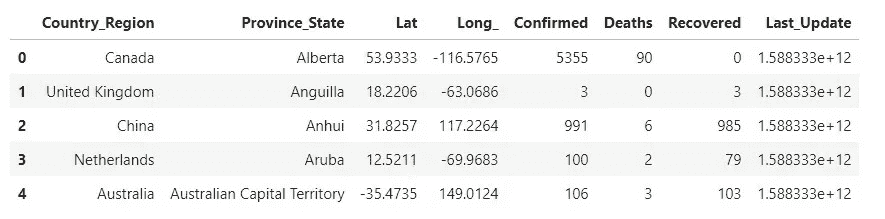

转换数据帧

## 第 4 部分:清理数据

显然，转换后的数据看起来不错，但这里仍然存在两个问题:

1.  在“*最后 _ 更新*”和“*省 _ 州*”列中有一些值 *na* 丢失。
2.  “ *Last_Update* ”列中的值是一个以毫秒为单位的时间戳，它对日期没有太多意义。

要处理第一个问题，我们可以使用 *dropna* 方法从列" *Last_Update* "中删除缺失的值(第 5 行)，使用 *fillna* 方法用一个空字符串替换列" *Province_State* "中所有缺失的值(第 6 行)。

为了解决第二个问题，我们编写了一个函数 *convertTime* ，使用 *fromtimestamp* 方法(第 1–3 行)*，将时间戳转换为格式为" *yyyy-mm-dd-hh-mm-ss"* 的日期。*列“Last_Update”首先除以 1000(第 8 行)，然后对整个列应用 *convertTime* 函数(第 9 行)。

清理数据的 Python 代码

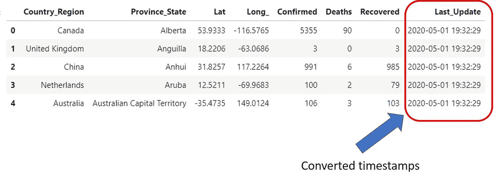

清理数据框

## 第 5 部分:聚合数据

目前，记录中确诊、康复和死亡病例的累计总数是以省为基础的，而不是以国家为基础的。构建这个仪表板的目的之一是显示排名前 10 位的国家列表。因此，我们需要对“*确诊*”、“*死亡*”和“*恢复*”列进行求和，并将求和值按“*国家/地区*分组，从而执行数据聚合。聚集的数据被分配给新的数据帧 *df_total* 。

聚合数据的 Python 代码

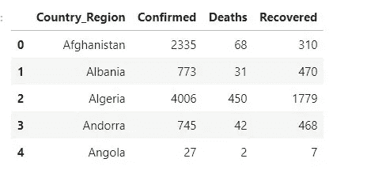

汇总数据

## 第 6 部分:计算每日新冠肺炎病例总数

在此阶段，我们准备使用前面部分的转换和汇总数据来计算两个级别的新冠肺炎病例总数:

*   全球一级
*   十大国家级别

**第一步:全局级**

全球每日新冠肺炎病例总数的计算非常简单。我们只是将*求和*的方法应用到 *df_final* 的“*确诊*”、*痊愈*、*死亡*列。 *sum* 方法将合计三列中每一列的所有值，并将最终总和分配给它们各自的变量 *total_confirmed* 、 *total_recovered* 和 *total_deaths* 。

用于计算全球范围内每日新冠肺炎病例总数的 Python 代码

**第二步:十大国家级别**

Pandas 提供了一种简便的方法，即 *nlargest* ，它使我们能够在数据帧的特定列中选择前十个值。为了选择确诊病例最多的前 10 个国家，我们向 *nlargest* 方法(第 1 行)传递一个 n 最大值和一个列名，并将返回的数据帧分配给一个新变量 *df_top10* 。接下来，我们生成国家名称列表(第 2 行)和确诊病例总数列表(第 3 行)，并将它们分别分配给两个新变量， *top10_countries_1* 和 *top10_confirmed，*。

接下来，重复上面类似的步骤，以获得已康复(第 5-7 行)和死亡病例(第 9-11 行)的前十个国家数据。

Python 代码获取前 10 个国家和确诊、恢复和死亡病例数

## 第 7 部分:使用 Python Plotly 子情节构建仪表板

仪表板应显示以下信息:

1.  世界各地每日确诊、恢复和死亡病例总数
2.  全球每个国家的确诊、痊愈和死亡病例总数。
3.  确诊、康复和死亡病例数最高的前十个国家。

我们将使用 *Python Plotly 支线剧情*创建几个支线剧情(每个信息部分一个)并将它们加入到一个单一的仪表板中。

**第一步:初始化支线剧情布局**

Python Plotly 库提供了一个 *make_subplots* 函数，使我们能够初始化 subplots 的布局安排。我们可以设置行数和列数来定位仪表板中的每个子情节。

在这种情况下，我们在支线剧情布局中定义了 4 行 6 列。我们出发了

第 1 行第 1 列:

*   *散点图*——在地图上显示每个国家的确诊、痊愈和死亡病例总数

第 1 行第 4–6 列:

*   *指示图*——显示全球每日确诊、痊愈和死亡病例总数

第 2 行第 4 列:

*   *条形图* —显示确诊病例最多的前 10 个国家

第 3 行第 4 列:

*   *条形图* —显示恢复案例数量最多的前 10 个国家

第 4 行第 4 列:

*   *条形图* —显示死亡病例最多的前 10 个国家

初始化子情节布局的 Python 代码

**步骤 2:创建注释文本**

在为*散点图*生成子图之前(将在下一步中呈现)，我们需要定义一个注释文本。每当用户将鼠标悬停在地图上的某个国家上方时，就会显示注释文本。注释文本应显示国家名称、确诊病例、死亡病例和恢复病例以及最后更新日期。

创建注释文本的 Python 代码

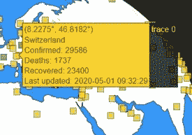

地图上的注释文本

**第三步:创建子剧情——散点图**

为了创建一个散点地图，我们可以使用 Python Plotly *go。散点图对象*。我们从先前生成的 dataframe、 *df_final* 到 *lon* 和 *lat* 属性(第 4–5 行)中设置“ *Long_* 和“ *Lat* ”数据。接下来，我们将注释文本 *df_final["text"]* 设置为 *hovertext* 属性。每当用户将鼠标悬停在某个国家/地区上方时，这将使预定义的注释文本(来自步骤 2)显示在地图上。

接下来，我们继续设置标记的参数值，如大小、不透明度、符号、颜色等(第 8–23 行)。我希望在这里强调的参数是“*颜色*”属性。我们将确诊病例的数据序列 *df_final['Confirmed']* 设置为“color”属性(第 19 行)。*出发。散点图对象*将根据每个国家的确诊病例水平为地图上显示的标记(方框)生成色标。

最后，我们将散点图的这个子图放置在第 1 行第 1 列(第 27 行)。

创建散点图的 Python 代码

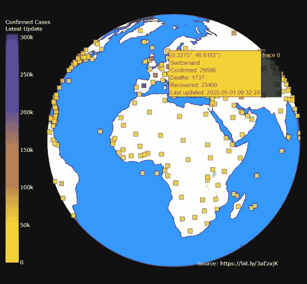

散点图

**第四步:创建子剧情—指示器**

我们使用 *Plotly go 创建了三个指标，显示全球每日确诊、痊愈和死亡病例总数。指示器对象*。我们将 *total_confirmed、*设置为 value property(第 4 行)，将标题设置为“ *Confirmed Caes* ”(第 5 行)*。*这将生成一个标题为“*确诊病例*的指示器，确诊病例总数将显示在标题下方。最后，我们将指示器的这个子图放置在第 1 行第 4 列(第 7 行)。

我们重复上述类似步骤，为恢复病例和死亡病例创建指标，并将它们放置到适当的行和列编号(第 10–26 行)。

Python 代码生成三个指标

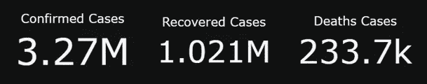

显示确诊、康复和死亡病例的三个指标

**第五步:创建支线剧情——条形图**

在这一阶段，我们将着手创建三个条形图，以显示确诊、恢复和死亡病例数最高的前十个国家。我们使用 *Plotly go.bar 对象*创建相关的条形图。

为了创建确诊病例的条形图，我们将前 10 个国家列表和前 10 个数字列表(来自第 6 部分步骤 2)分别设置为 x 轴和 y 轴属性(第 3–4 行)。最后，我们将条形图定位到适当的行和列编号(第 9 行)。

我们重复类似的步骤来制作条形图，根据康复和死亡病例的数量显示前 10 个国家，并将它们放置到适当的行号和列号(第 10-26 行)。

Python 代码创建条形图来显示排名前十的国家

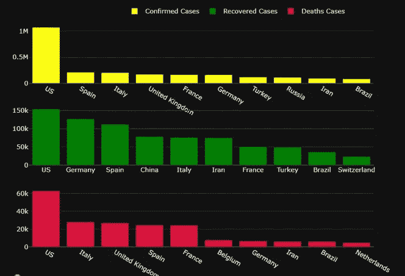

确诊、康复和死亡病例最多的前十个国家

**步骤 6:完成布局设置**

这是最后一步，我们将完成支线剧情的布局设置:

*   模板(第 2 行)-为仪表板设置深色主题。
*   标题(第 3 行)-为仪表板设置标题，并将上次更新的内容附加到标题中。
*   图例(第 4–6 行)—将图例设置为可见，并将其设置为水平方向。定义坐标 x 和 y 以显示图例。
*   geo(第 7–14 行)-将显示的地图设置为正交地球，并在地图上显示海岸线、陆地和海洋。
*   注释(第 16–24 行)-在操控板上设置附加注释文本，以在特定坐标 x 和 y 处显示数据源链接

最后，我们准备呈现我们的仪表板(第 27 行)。

最终确定仪表板布局的 Python 代码

新冠肺炎仪表板

# 第 8 部分:仪表板导航

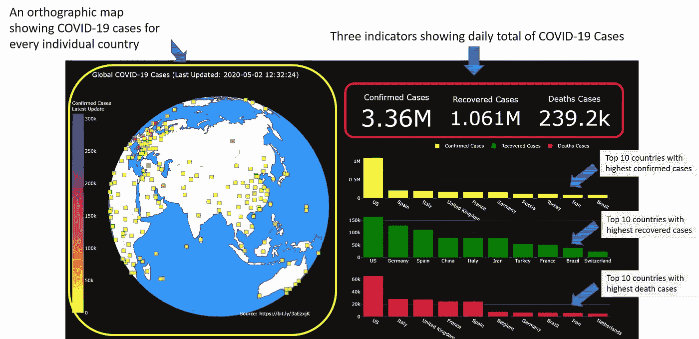

带标签的新冠肺炎仪表板

乍看之下，我们可以通过仪表板右上角的三个数字指示器轻松查看每日确诊、康复和死亡病例总数。

在这三个数字指标下面，有三个条形图显示了确诊、恢复和死亡病例数最高的前十个国家。

要查看单个国家/地区的新冠肺炎数据，我们只需将鼠标放在地图上的一个标记(正方形)上，就会出现一个注释文本，显示该国家/地区报告的确诊、康复和死亡病例数。

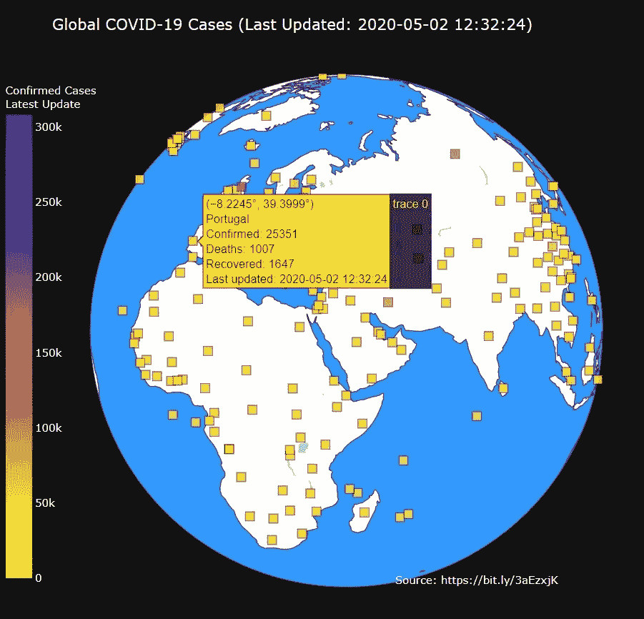

显示所选国家/地区的新冠肺炎详细信息的注释文本

我们可以使用平移工具旋转正交地图。只需点击仪表盘右上角的平移工具，然后点击地图并向左或向右拖动即可。

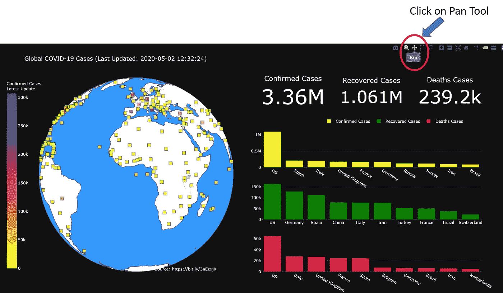

点击平移工具

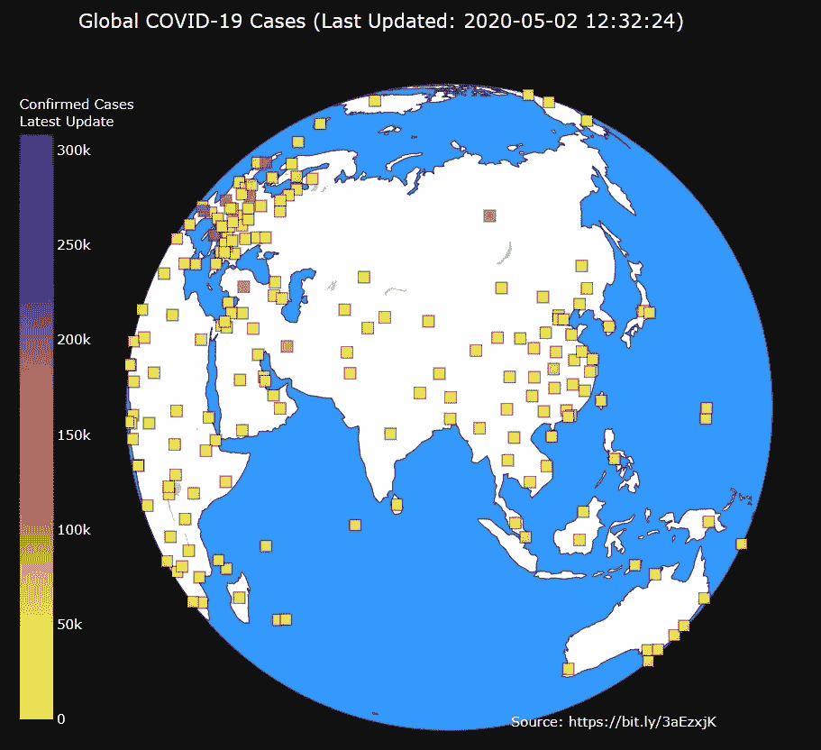

旋转地图

# 最后的想法

仪表板只是由几个支线剧情组成的可视图形，我们可以一部分一部分地构建它们。一旦我们熟悉了 Python Plotly 库来创建单独的图，我们就可以使用 Plotly Subplots 特性轻松地将它们集成到仪表板中。

让我们的仪表板变得实时的关键是不断地使用来自 web 服务的最新数据，并更新仪表板上的数据。这可以使用 Python *请求*模块轻松完成。在我们的例子中，我们可以每天重新启动我们的仪表板，运行在后端的*请求*模块将从 web 服务请求最新的信息，并在仪表板上显示最新的新冠肺炎数据。

我希望您能从本教程中受益，并应用这里介绍的过程为您关心的数据创建其他仪表板。

# 参考

1.  [https://en . Wikipedia . org/wiki/Dashboard _(商务)](https://en.wikipedia.org/wiki/Dashboard_(business))
2.  [https://plotly.com/python/subplots/](https://plotly.com/python/subplots/)