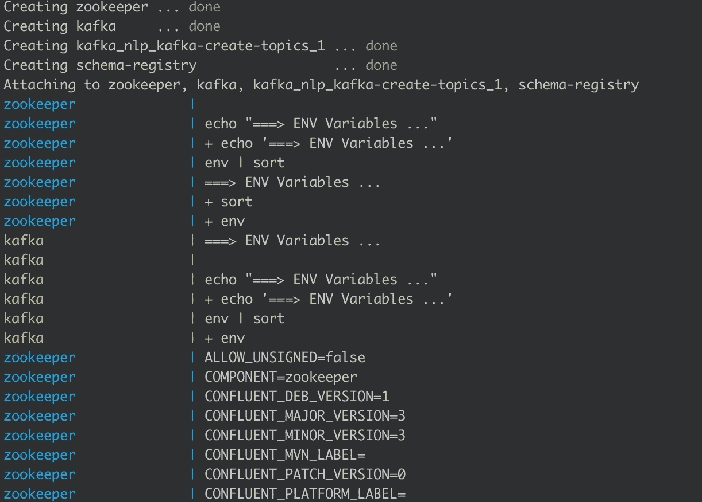

# 使用 Spark 结构化流和微服务构建实时预测管道

> 原文：<https://towardsdatascience.com/building-a-real-time-prediction-pipeline-using-spark-structured-streaming-and-microservices-626dc20899eb?source=collection_archive---------8----------------------->

## 在本教程中，我们将讨论在处理低延迟数据管道时解耦机器学习模型的好处


凯文·Ku 在 [Unsplash](https://unsplash.com/s/photos/machine-learning?utm_source=unsplash&utm_medium=referral&utm_content=creditCopyText) 上的照片

我们将为机器学习预测建立一个实时管道。我们将使用的主要框架是:

*   [Spark 结构化流](https://spark.apache.org/docs/latest/structured-streaming-programming-guide.html):成熟易用的流处理引擎
*   Kafka :我们将使用 Kafka 的融合版本作为我们的流媒体平台
*   [Flask](https://opensource.com/article/18/4/flask) :用于构建 RESTful 微服务的开源 python 包
*   [Docker](https://docs.confluent.io/current/quickstart/ce-docker-quickstart.html?utm_medium=sem&utm_source=google&utm_campaign=ch.sem_br.brand_tp.prs_tgt.confluent-brand_mt.xct_rgn.emea_lng.eng_dv.all&utm_term=confluent%20kafka%20docker&creative=&device=c&placement=&gclid=CjwKCAiAvonyBRB7EiwAadauqSDXLG4BUDfIH8weo9PodnlxrIBKdxPd76NrD0a4zL2eZLOar1XfPBoCc6AQAvD_BwE) :用于本地启动 kafka 集群
*   Jupyter 实验室:我们运行代码的环境
*   [NLTK](https://www.nltk.org) :带有预训练模型的 python 的 NLP 库。

**TL；DR:代码在**[**GitHub**](https://github.com/BogdanCojocar/medium-articles/tree/master/realtime_kafka)**上。**

## 将 ML 模型构建为微服务的优势

在实时 ML 管道中，我们以两种方式嵌入模型:将模型直接用于执行处理的框架中，或者将模型单独解耦到微服务中。通过构建 ML 模型的包装器，我们需要额外的努力，为什么要这么麻烦呢？有两大优势。首先，当我们想要部署一个新模型时，我们不需要部署整个管道，我们只需要公开一个新的微服务版本。其次，它给了你更多的能力去测试 ML 模型的不同版本。例如，我们可以使用 canary 部署，在模型的`version1`上使用 80%的数据流，在`version2`上使用 20%的数据流。一旦我们对`version2`的质量感到满意，我们就会向它转移越来越多的流量。

现在让我们深入研究应用程序的开发。

## 步骤 1:运行 docker compose 来启动 kafka 集群

为了构建集群，我们将使用一个`docker-compose`文件来启动所有需要的 docker 容器:zookeeper 和一个代理。

现在简单地说，kafka 是一个分布式流媒体平台，能够处理大量的消息，这些消息被组织或分组到主题中。为了能够并行处理一个主题，必须将它分成多个分区，来自这些分区的数据存储在称为代理的独立机器中。最后，zookeeper 用于管理集群中代理的资源。为了读写 kafka 集群，我们需要一个代理地址和一个主题。

`docker-compose`将在端口`2181`启动`zookeper`，在端口`9092`启动`kafka broker`。除此之外，我们使用另一个 docker 容器`kafka-create-topic`的唯一目的是在 kafka broker 中创建一个主题(称为 test)。

要启动 kafka 集群，我们必须在定义 docker compose 文件的同一文件夹中运行以下命令行指令:

```
docker-compose up
```

这将启动所有带有日志的 docker 容器。我们应该在控制台中看到类似这样的内容:



## 步骤 2:构建和部署微服务

我们将 REST 协议用于我们的 web 服务。我们将使用 NLTK 的`Vader`算法进行情感分析。这是一个预先训练好的模型，所以我们只能关注预测部分:

```
[@app](http://twitter.com/app).route('/predict', methods=['POST'])
def predict():
    result = sid.polarity_scores(request.get_json()['data'])
    return jsonify(result)
```

我们正在创建一个接收到形式为`{"data": "some text"}`的`JSON`消息的`POST`请求，其中字段`data`包含一个句子。我们将应用该算法，并将响应作为另一个`JSON`发送回去。

要运行该应用程序，只需运行:

```
python app.py
```

休息服务将在`[http://127.0.0.1:9000/predict](http://127.0.0.1:9000/predict)`开始。

## 步骤 3:使用 Kafka 依赖项启动 pySpark

在我们启动 Jupyter 实验室笔记本之后，我们需要确保我们拥有 kafka jar 作为 spark 的依赖项，以便能够运行代码。在笔记本的第一个单元格中添加以下内容:

```
import os
os.environ['PYSPARK_SUBMIT_ARGS'] = "--packages=org.apache.spark:spark-sql-kafka-0-10_2.11:2.4.4 pyspark-shell"
```

接下来，我们可以使用`findspark`包启动 pySpark:

```
import findspark
findspark.init()
```

## 第四步:运行卡夫卡制作程序

为了能够实时消费数据，我们首先必须将一些消息写入 kafka。我们将使用 python 中的`confluent_kafka`库来编写一个生产者:

我们将发送与之前相同的`JSON`消息`{"data": value}`，其中 value 是预定义列表中的一个句子。对于我们写入队列的每条消息，我们还需要分配一个键。我们将根据`uuid`随机分配一个，以实现集群中的良好分布。最后，我们还运行一个`flush`命令来确保所有的消息都被发送。

一旦我们运行了`confluent_kafka_producer`，我们应该会收到一个日志，告诉我们数据已经正确发送:

```
we’ve sent 6 messages to 127.0.0.1:9092
```

## 第五步:开始从卡夫卡那里读取数据

如前所述，我们将使用 Spark 结构化流来实时处理数据。这是一个易于使用的 API，将微批量数据视为数据帧。我们首先需要将输入数据读入数据帧:

```
df_raw = spark \
  .readStream \
  .format('kafka') \
  .option('kafka.bootstrap.servers', bootstrap_servers) \
  .option("startingOffsets", "earliest") \
  .option('subscribe', topic) \
  .load()
```

`startingOffset`是`earliest`,表示每次运行代码时，我们将读取队列中的所有数据。

该输入将包含不同的列，表示 kafka 的不同度量，如键、值、偏移量等。我们只对值、实际数据感兴趣，我们可以运行一个转换来反映这一点:

```
df_json = df_raw.selectExpr('CAST(value AS STRING) as json')
```

## 步骤 6:创建一个应用 ML 模型的 UDF

在结构化流中，我们可以使用用户定义的函数，这些函数可以应用于数据帧中的每一行。

```
def apply_sentiment_analysis(data):
    import requests
    import json

    result = requests.post('[http://localhost:9000/predict'](http://localhost:9000/predict'), json=json.loads(data))
    return json.dumps(result.json())
```

我们需要在函数中进行导入，因为这是一段可以分布在多台机器上的代码。我们向端点发送请求并返回响应。

```
vader_udf = udf(lambda data: apply_sentiment_analysis(data), StringType())
```

我们将调用我们的 udf 为`vader_udf`，它将返回一个新的字符串列。

## 步骤 7:应用 vader udf

在这最后一步，我们将看到我们的结果。输入数据的格式在`JSON`中，我们可以将其转换成一个字符串。为此，我们将使用助手函数`from_json`。我们可以对情绪分析算法的输出列做同样的事情，它也有`JSON`格式:

我们可以在控制台中显示我们的结果。因为我们正在使用笔记本，你将只能从你在 Jupyter 启动的终端上看到它。命令`trigger(once=True)`将只运行一小段时间的流处理并显示输出。

这就是它的乡亲，我希望你喜欢这个教程，并发现它有用。我们看到了如何通过使用结构化流 API 和调用 ML 模型的微服务，我们可以构建一个强大的模式，它可以成为我们下一个实时应用的主干。