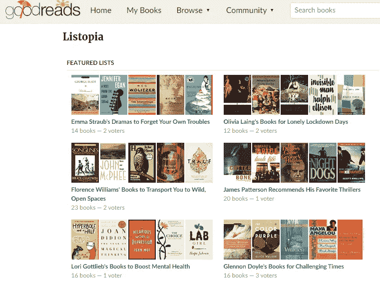
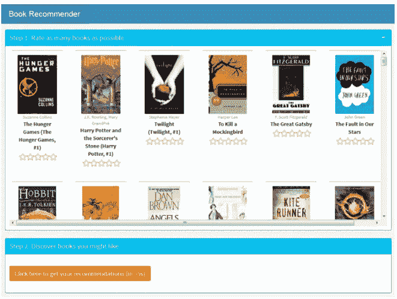
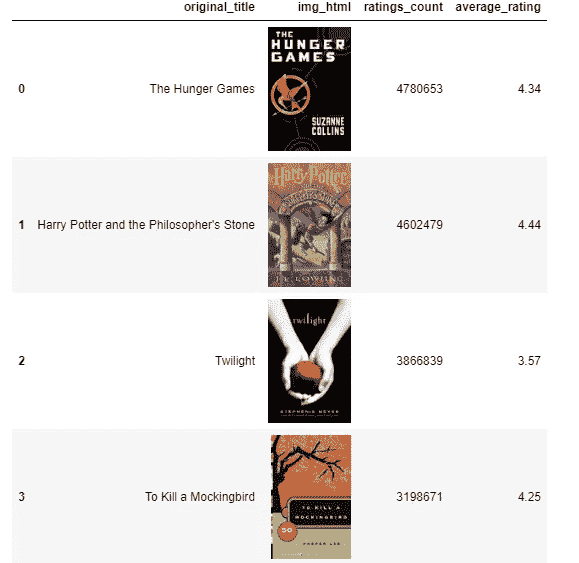
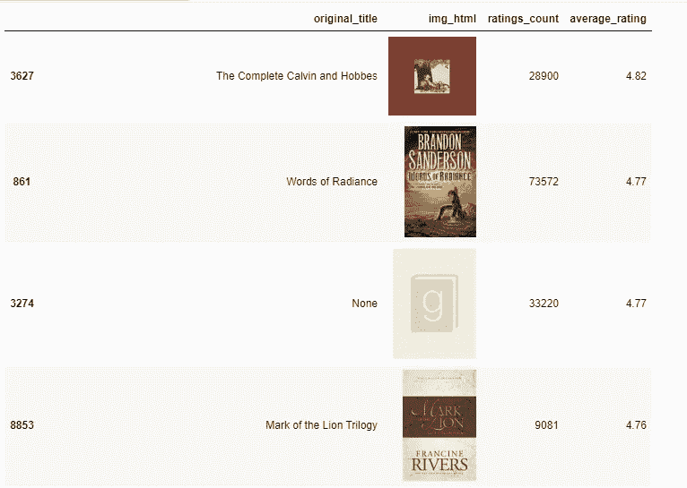
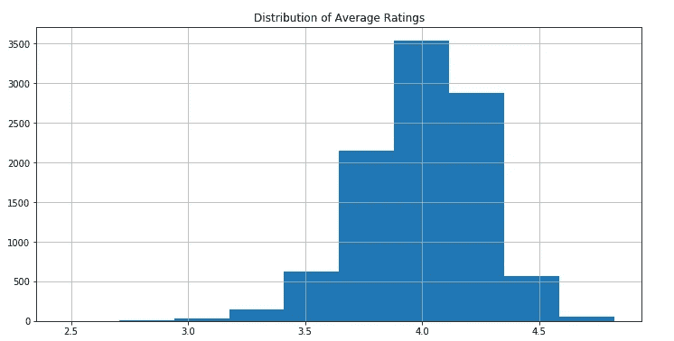
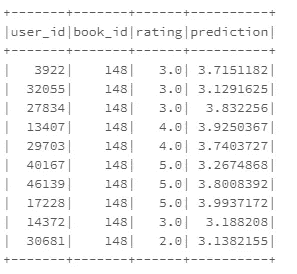
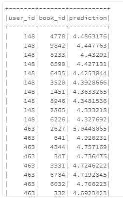
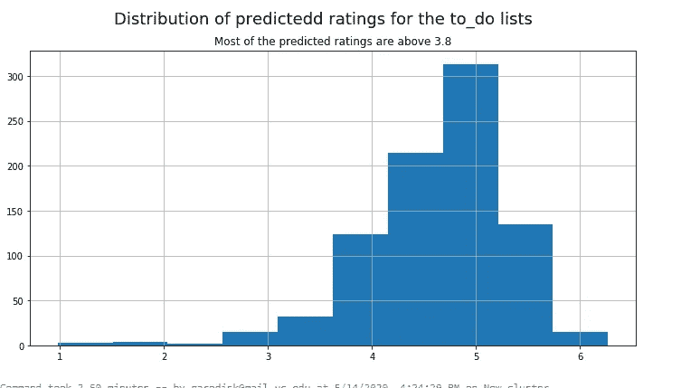

# 构建推荐引擎在 Spark 中推荐图书

> 原文：<https://towardsdatascience.com/building-a-recommendation-engine-to-recommend-books-in-spark-f09334d47d67?source=collection_archive---------21----------------------->



*使用协同过滤来预测未读书籍在“好阅读”上的评级*



**沃伦·巴菲特**曾被问及成功的关键，他指着旁边的一摞书说:“*每天像这样读 500 页。知识就是这样运作的。它就像复利一样累积起来。你们所有人都可以做到，但我保证你们中没有多少人会去做*。

书籍是我们大多数人发展和获得观点的最佳资源。我本人喜欢读书。一旦我喜欢上了一本书，我就有一个习惯，那就是去找好书，或者请有类似品味的人给我推荐下一系列我可能会喜欢的书。

人工智能通过根据过去的数据向我们推荐书籍、电影和产品，节省了我们分析不同选项的时间和精力，从而使我们的世界变得如此简单。事实上，有时机器可以比我们想象的更好地推荐我们，因为它们不会受到情绪偏见的影响。

在这篇博客中，我将解释我是如何使用“好书”数据在 Spark 中构建推荐引擎的。我使用了 Spark 库中的交替最小二乘(ALS)算法，这基本上是网飞竞赛获奖者发表的论文的实现。在深入研究实现之前，让我先解释一下 ALS 算法。

如果你想直接进入“好书”的问题，请跳过这一部分。

# **交替最小二乘法背后的直觉**

对于喜欢阅读学术论文的人来说，下面是论文的链接:[https://data jobs . com/data-science-repo/Recommender-Systems-% 5 bnet flix % 5d . pdf](https://datajobs.com/data-science-repo/Recommender-Systems-%5BNetflix%5D.pdf)。

要了解不同类型的推荐系统，请访问我的其他博客，在那里我解释了不同类型的推荐系统，如基于内容、基于元数据和基于协同过滤的方法。以下是这些系列博客的链接:[**https://medium . com/analytics-vid hya/the-world-of-recommender-systems-e4ea 504341 AC？source = friends _ link&sk = 508 a 980d 8391 DAA 93530 a 32 e 9 c 927 a 87**](https://medium.com/analytics-vidhya/the-world-of-recommender-systems-e4ea504341ac?source=friends_link&sk=508a980d8391daa93530a32e9c927a87)

基本上，基于内容的推荐系统就是根据以前产品的内容来推荐一些产品。如果你读了一本名为《思考致富》的书，你会被推荐其他有类似内容(或文本)的书，比如《唤醒内心的巨人》，因为它们都是自助书籍，可能包含类似的内容。

最重要的一种推荐系统是基于协同过滤的方法。假设你认识一个和你品味相同的朋友，因为你们都热爱心理学，那么你可能会喜欢读其他你朋友读过但你没有读过的书。这是协同过滤背后的唯一概念。现在我们具体说说**交替最小二乘法**。

协同过滤可以通过矩阵分解技术轻松实现，如**奇异值分解**，其中用户评级矩阵被分解为用户概念矩阵、概念权重矩阵和评级概念矩阵。概念基本上是矩阵分解隐式生成的潜在或隐藏的因素，就像在书籍的情况下，不同的概念可以是心理学、数据科学、哲学等。

对于任何给定的项目，仅仅一个基本的点积就可以给出一个等级，但是这种方法有一个问题。

大多数矩阵分解技术，如奇异值分解，不知道如何处理不完整/稀疏矩阵，这意味着用户评级矩阵中有空值(这很常见，因为不是每个用户都读过所有的书)。传统上，工程师们在执行矩阵分解以进行协同过滤之前，一直用平均值或中值来输入这些值。这导致了过度拟合，因为从未被评级的书籍被均值或中值估算，这可能会使结果偏向它们。

**最近的方法，如交替最小二乘法**没有这些缺点。他们建议直接对观察到的评级进行建模，同时避免通过正则化模型进行过度拟合。为了学习因子向量(pu 和 qi)，系统最小化已知评级集合上的正则化平方误差:


他们基本上试图像梯度下降一样将误差最小化。在上面的等式中，直觉是 r 是给定的评级，qi*pu 基本上是预测评级的矩阵(SVD 的结果)的点积，我们试图将其最小化，但最小化上面的等式还有另一个挑战。有两个未知数要最小化，所以这不是一个导致全局最小值的凸优化问题。

ALS 纠正了这个问题，同时也提供了一些其他的好处。ALS 技术在固定 qi 和固定 pu 之间轮换。当所有 pu 被固定时，系统通过解决最小二乘问题重新计算 qi，反之亦然。这确保了每一步都减少上述方程，直到收敛。这可能会导致算法的大规模并行化，因此可以在 Spark 中轻松实现。现在，让我们来谈谈好书的问题。

# **“好书”推荐系统**

“好书”数据集包含了来自 T2 10000 本不同书籍的大约 100 万个评分。在大多数情况下，每个用户至少给*10 本书*打分，分数在 0 到 5 之间。我们将使用这 100 万个评分来预测所有其他没有被用户阅读的书籍的评分。此外，还有一个“to_read”数据集，其中包含用户保留以供未来阅读的书籍的详细信息(如 wishlist)。在建立我们的推荐系统后，我们将尝试预测这些“值得阅读”的书籍的评级，以了解我们的算法在这些书籍上的表现。因为用户已经希望阅读这些书籍，所以对这些要阅读的书籍的预测评级应该很高。

以下是数据集的链接:

[](https://www.kaggle.com/zygmunt/goodbooks-10k?select=sample_book.xml) [## goodbooks-10k

### 一万本书，一百万收视率。还有标着要读的书，还有标签。

www.kaggle.com](https://www.kaggle.com/zygmunt/goodbooks-10k?select=sample_book.xml) 

我将使用**‘data bricks’社区版**，因为它是在 spark 上运行 ML 的最佳平台，而且是免费的。

让我们看看收视率和书籍的数据框架。“评级”数据包含 book_id、user_id 和评级。图书数据集类似于所有 10000 本图书的元数据，包含图书名称、评级数量、book_id 和图书封面图像的 URL。我发现把书的封面印在“熊猫”数据框里很有趣。


评级数据集


图书数据集

因为我喜欢看书，所以我对这些书做了一些调查，根据它们的出版年份来了解这些书有多老，它们的平均评级是多少，哪些书的评级最高，哪些书的评论数量最多。

我看到《基督之前》中的一些书也和这本一样。吉尔伽美什的这部史诗出版的年份是公元前 1750 年。有意思。不是吗？


公元前 1750 年出版的书

我们来看看 1950 年以后的图书出版数量分布。

```
%sqlselect original_publication_year, count(*) as count from books where original_publication_year > 1950 group by original_publication_year
```


出版书籍数量的分布

1990 年后，每年似乎有 100 本书，然后每年都在增加，直到达到顶峰。

来看看收视率最多的书。

```
 most_ratings = books_df.sort_values(by = ‘ratings_count’, ascending = False)[[‘original_title’,’ratings_count’, ‘average_rating’, ‘image_url’ ]][0:10]import pandas as pd
from IPython.display import Image, HTML
most_ratings[‘img_html’] = most_ratings[‘image_url’]\
 .str.replace(
 ‘(.*)’, 
 ‘</img>’
 )
with pd.option_context(‘display.max_colwidth’, 10000):

 display(HTML(most_ratings[[‘original_title’, ‘img_html’, ‘ratings_count’, ‘average_rating’ ]].to_html(escape=False)))
```



**我们可以看到，收视率最高的书籍是《饥饿游戏》、《哈利·波特》等名著。**

现在，让书籍按平均评分排名(不考虑评分的数量)。

```
high_rating_books = books_df.sort_values(by = ‘average_rating’, ascending = False)[[‘original_title’,’ratings_count’,’image_url’, ‘average_rating’ ]][0:10]high_rating_books[‘img_html’] = high_rating_books[‘image_url’]\
 .str.replace(
 ‘(.*)’, 
 ‘</img>’
 )
with pd.option_context(‘display.max_colwidth’, 10000):

 display(HTML(high_rating_books[[‘original_title’, ‘img_html’,’ratings_count’, ‘average_rating’ ]].to_html(escape=False)))
```



**嗯，《加尔文与霍布斯全集》和《光辉之言》在 10000 本书中平均收视率最高。**

**来看看出书数量最多的作者:**

```
authors_with_most_books = pd.DataFrame(books_df.authors.value_counts()[0:10]).reset_index()
authors_with_most_books.columns = [‘author’, ‘number_of_books’]
```


在数据集中，斯蒂芬·金有 60 本书是以他的名字命名的。

现在，让我们看看所有 10000 本书的平均评分分布:

```
import matplotlib.pyplot as plt
plt.figure(figsize=(12,6))
plt.title(‘Distribution of Average Ratings’)
books_df[‘average_rating’].hist()
displaay()
```



在评级“数据框架”中，大约有 100 万个评级，每本书大约有 100 个评级，这是一个非常公正的数据集。评分低于 100 的书很少。

现在，让我们看看用户评级矩阵的稀疏性，以了解如果我们不使用 ALS 而使用传统的 SVD 进行协同过滤，会产生多少偏差。

```
# Count the total number of ratings in the dataset
numerator = ratings.select(“rating”).count()# Count the number of distinct Id’s
num_users = ratings.select(“user_id”).distinct().count()
num_items = ratings.select(“book_id”).distinct().count()# Set the denominator equal to the number of users multiplied by the number of items
denominator = num_users * num_items# Divide the numerator by the denominator
sparsity = (1.0 — (numerator * 1.0)/ denominator) * 100
print(“The ratings dataframe is “, “%.2f” % sparsity + “% empty.”)
```

评级数据框 99.82%为空。

当然，不可能每个用户都给所有的书评分，因此最好只在原始评分的基础上建立一个算法。**进入 ALS 世界。**

# **算法-实现**

现在，让我们**将**数据分割成训练集和测试集，使用交替最小二乘法进行协同过滤。

```
(training, test) = ratings.randomSplit([0.8, 0.2])
```

让我们导入 ALS 和回归评估器来查找 RMSE。

```
from pyspark.ml.evaluation import RegressionEvaluator
from pyspark.ml.recommendation import ALS
from pyspark.sql import Rowals = ALS( userCol=”user_id”, itemCol=”book_id”, ratingCol=”rating”,
 coldStartStrategy=”drop”, nonnegative = True, implicitPrefs = False)
```

**implicitPrefs** '参数在我们不使用像评级数据这样的显式数据时使用。有时，公司没有明确的数据，如评分，但仍然希望使用其他代理，如视图、点击、意愿列表等来构建推荐引擎。在这种情况下，使用了隐式偏好，但这超出了我们好书项目的范围。**当我们没有用户的任何数据时使用 coldStartStrategy** ，如果测试集上的用户在训练集中没有评级，这可能导致零预测。我们已经放弃了冷启动策略，因为我们想为我们手头的问题避免这种情况。

现在，让我们建立我们的超参数列表，然后在训练数据上拟合算法。

```
from pyspark.ml.tuning import ParamGridBuilder, CrossValidatorparam_grid = ParamGridBuilder() \
 .addGrid(als.rank, [10, 50, 75, 100]) \
 .addGrid(als.maxIter, [5, 50, 75, 100]) \
 .addGrid(als.regParam, [.01, .05, .1, .15]) \
 .build()# Define evaluator as RMSE
evaluator = RegressionEvaluator(metricName = “rmse”, 
 labelCol = “rating”, 
 predictionCol = “prediction”)
# Print length of evaluator
print (“Num models to be tested using param_grid: “, len(param_grid))
```

使用 param_grid 测试的模型数量:64

总共有 64 款**车型**将在我们收到最终车型之前进行测试和调试。**并行化和 spark 的力量将使它变得非常快。**

```
# Build cross validation using CrossValidator
cv = CrossValidator(estimator = als, 
 estimatorParamMaps = param_grid, 
 evaluator = evaluator, 
 numFolds = 5)model = als.fit(training)predictions = model.transform(test)predictions.show(n = 10)
```



测试集上的预测表明，它非常接近原始评级。例如，user_id 14372 的评分最初是 3，我们的算法预测它是 3.13，这非常接近。

```
rmse = evaluator.evaluate(predictions)
print(“Root-mean-square error = “ + str(rmse))
```

均方根误差= 0.913，平均误差为 0.9，即原始评级和预测评级之间的差值。现在，让我们为每个用户预测 10 本书和评级。

```
# Generate n recommendations for all users
ALS_recommendations = model.recommendForAllUsers(numItems = 10) # n — 10ALS_recommendations.show(n = 10)
# Temporary table
ALS_recommendations.registerTempTable("ALS_recs_temp")clean_recs = spark.sql("""SELECT user_id,
                            movieIds_and_ratings.book_id AS book_id,
                            movieIds_and_ratings.rating AS prediction
                        FROM ALS_recs_temp
                        LATERAL VIEW explode(recommendations) exploded_table
                            AS movieIds_and_ratings""")
clean_recs.show()
# Recommendations for unread books
(clean_recs.join(ratings, ["user_id", "book_id"], "left")
    .filter(ratings.rating.isNull()).show())new_books = (clean_recs.join(ratings, ["user_id", "book_id"], "left")
    .filter(ratings.rating.isNull()))
```



为每个用户推荐 10 本书。

现在，让我们使用'**来 _read** '数据(愿望列表数据),看看我们的算法会为愿望列表中的书预测什么。

这应该是非常好的，因为用户把它们保存在他们的愿望清单中。

```
recommendations = new_books.join(to_read,
 on = [“user_id”, “book_id”], 
 how = “inner”)
print(recommendations.show())(recommendations
     .withColumn('pred_trunc', recommendations.prediction.substr(1,1))
     .groupby('pred_trunc')
     .count()
     .sort('pred_trunc')
    .show())import matplotlib.pyplot as plt
plt.figure(figsize=(12,6))
plt.title('Most of the predicted ratings are above 3.8', fontsize = 12)
plt.suptitle('Distribution of predictedd ratings for the to_do lists', fontsize = 18)
rec = recommendations.toPandas()
rec['prediction'].hist()
display()
```



愿望清单中的大多数书籍都被预测为预期的 4.5 或更高版本。

**你可以在这里访问我的代码:-**

[**https://github.com/garodisk/Goodreads-recommendation-engine**](https://github.com/garodisk/Goodreads-recommendation-engine)

非常感谢你的阅读！

**参考文献**:

[](https://www.kaggle.com/zygmunt/goodbooks-10k?select=sample_book.xml) [## goodbooks-10k

### 一万本书，一百万收视率。还有标着要读的书，还有标签。

www.kaggle.com](https://www.kaggle.com/zygmunt/goodbooks-10k?select=sample_book.xml) [](https://spark.apache.org/docs/2.2.0/ml-collaborative-filtering.html) [## 协同过滤

### 协同过滤通常用于推荐系统。这些技术旨在填补缺失的条目…

spark.apache.org](https://spark.apache.org/docs/2.2.0/ml-collaborative-filtering.html) 

# **我的其他数据科学博客:-**

**语境多臂大盗——(网飞作品推荐背后的直觉)**

[https://medium . com/analytics-vid hya/contextual-multi-armed-bandit-直觉-背后-网飞-艺术品-推荐-b221a983c1cb？source = friends _ link&sk = 732 f 4 e 74 afce 45 c 184 dedc 7 c 817 de 844](https://medium.com/analytics-vidhya/contextual-multi-armed-bandit-intuition-behind-netflix-artwork-recommendation-b221a983c1cb?source=friends_link&sk=732f4e74afce45c184dedc7c817de844)

## 用统计学家的大脑赌博。

[](https://medium.com/analytics-vidhya/gambling-with-a-statisticians-brain-ae4e0b854ca2) [## 用统计学家的大脑赌博。

### 用蒙特卡罗模拟法分析赌场的胜算

medium.com](https://medium.com/analytics-vidhya/gambling-with-a-statisticians-brain-ae4e0b854ca2) 

## 使用 Spark 对 Instacart 的 300 万份订单进行购物篮分析

[https://medium . com/analytics-vid hya/market-basket-analysis-on-300 万-orders-from-insta cart-using-spark-24c 6469 a92e？source = friends _ link&sk = ad 580 EFA 7c 7697 b 731 EB 36 DD 2c 33 ad 82](https://medium.com/analytics-vidhya/market-basket-analysis-on-3-million-orders-from-instacart-using-spark-24cc6469a92e?source=friends_link&sk=ad580efa7c7697b731eb36dd2c33ad82)