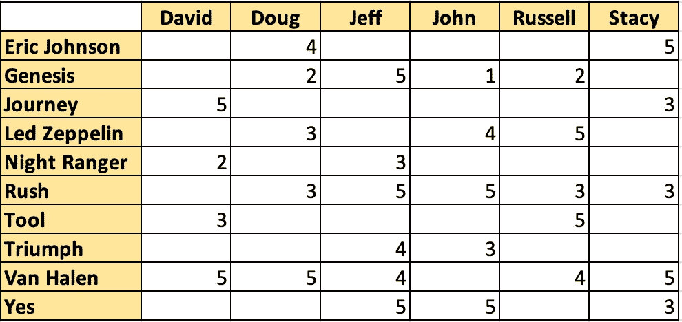
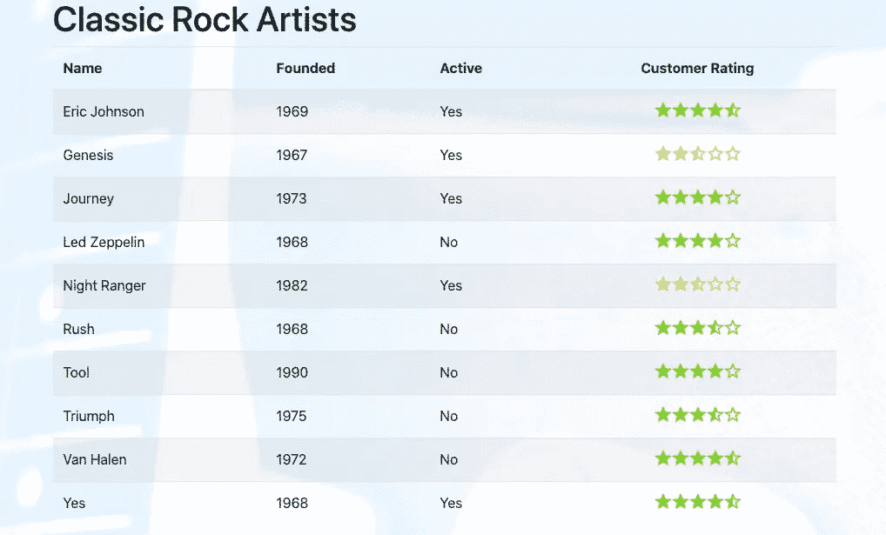
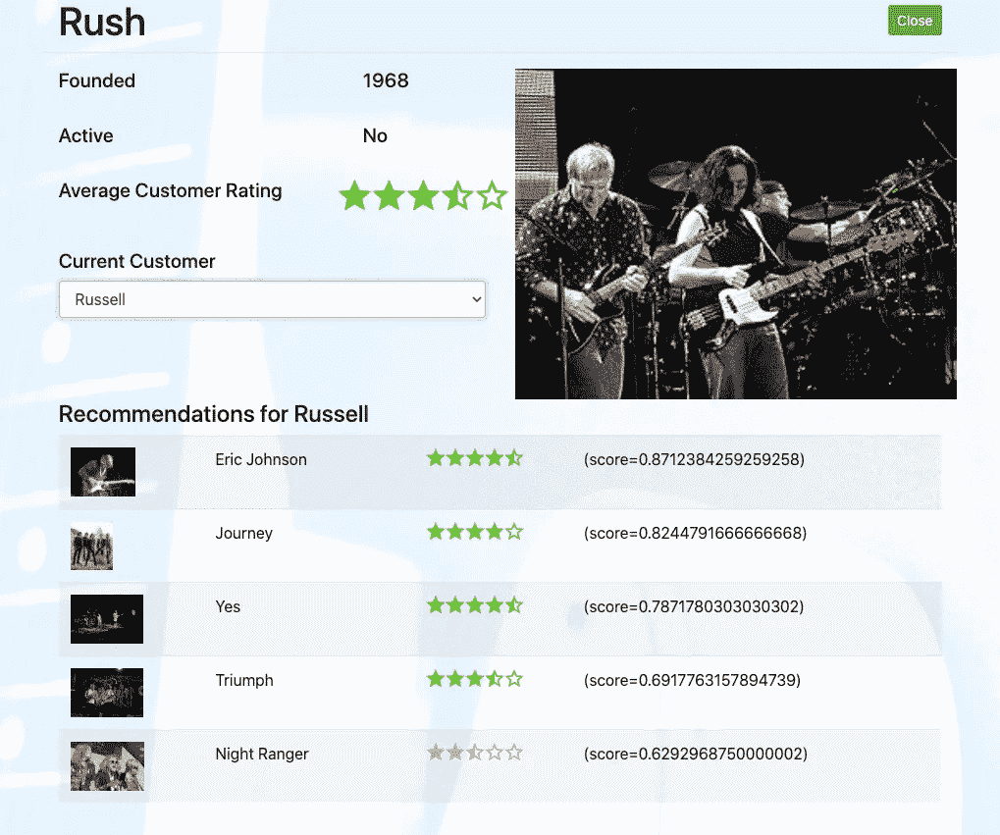
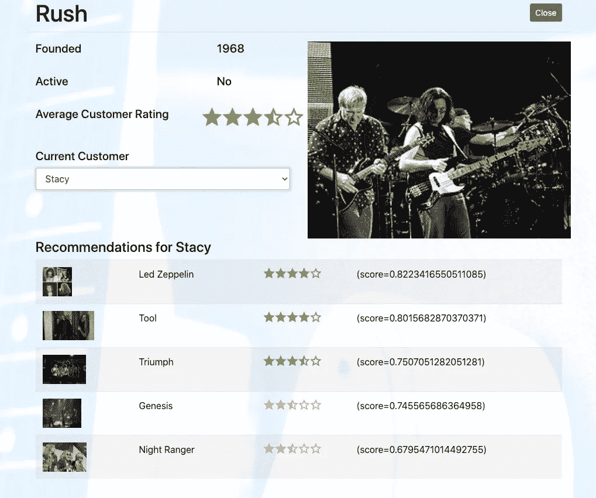

# 使用 Slash GraphQL 构建推荐引擎—第 2 部分

> 原文：<https://towardsdatascience.com/building-a-recommendation-engine-using-slash-graphql-part-2-c19e64659af4?source=collection_archive---------52----------------------->

【TL；DR:在本系列的第二部分，我微调了最初的推荐引擎，添加了一个辅助数据源，并编写了一个 Angular 客户端来消费数据。]

在[“使用 Spring Boot 和斜杠 GraphQL](/building-an-amazon-like-recommendation-engine-using-slash-graphql-9635f0ce49b1?source=email-2b0f7c850aed-1601911510683-activity.collection_post_published) 构建推荐引擎”的文章中，最近发布的由 [Dgraph](https://dgraph.io/) 托管的[斜杠 GraphQL](https://dgraph.io/slash-graphql) 后端被用作基于 Java 的推荐引擎的记录系统。图形数据存储非常适合推荐引擎这样的用例，其中数据之间的关系与数据本身一样重要。使用 Slash GraphQL 允许我以最少的努力快速建立并运行一个完全托管的 GraphQL 数据库。

这篇文章还提供了关于如何利用 Slope One 系列的协同过滤算法，根据现有的评级来预测产品兴趣水平的见解。简而言之，Slope One 评级算法将是推荐引擎的核心。

文章最后通过在 Spring Boot 推荐引擎中提供 RESTful URIs 来提供来自存储在 Dgraph Slash GraphQL SaaS 服务产品中的数据的推荐。

本文将更进一步，介绍一个 Angular 客户端，以一种更容易使用的方式呈现这些数据……并希望得到赞赏。

# Data Domain 的增强功能

虽然最初的文章展示了推荐引擎是如何工作的，但我觉得我的原始数据样本为一些样本客户提供了太多的评级。此外，我觉得我需要为第二个例子增加艺术家的数量。

因此，我清除了现有 Slash GraphQL 数据库中的数据，并重新开始。虽然它很容易更新，但在本练习中，底层模式不必更改，仍然如下所示:

```
type Artist {
   name: String! @id @search(by: [hash, regexp])
   ratings: [Rating] @hasInverse(field: about)
}type Customer {
   username: String! @id @search(by: [hash, regexp])
   ratings: [Rating] @hasInverse(field: by)
}type Rating {
   id: ID!
   about: Artist!
   by: Customer!
   score: Int @search
}
```

使用斜线 GraphQL 用户界面中的以下变化添加了新的`Artist`项目列表:

```
mutation {
 addArtist(input: [
   {name: "Eric Johnson"},
   {name: "Genesis"},
   {name: "Journey"},
   {name: "Led Zeppelin"},
   {name: "Night Ranger"},
   {name: "Rush"},
   {name: "Tool"},
   {name: "Triumph"},
   {name: "Van Halen"},
   {name: "Yes"}]) {
   artist {
     name
   }
 }
}
```

更新的`Customer`记录也被插入:

```
mutation {
 addCustomer(input: [
   {username: "David"},
   {username: "Doug"},
   {username: "Jeff"},
   {username: "John"},
   {username: "Russell"},
   {username: "Stacy"}]) {
   customer {
     username
   }
 }
```

使用与原始文章相同的突变，根据下表添加评级:



作者图片

# H2(内存中)数据库简介

在第二篇文章中，我想介绍一个额外的数据源。这样做可以突出信息和事实通常来自多个数据源的事实。我决定使用[H2](http://h2database.com/html/main.html)——一个开源的、轻量级的内存 Java 数据库。使用以下 Maven 依赖项，可以快速轻松地将 H2 数据库添加到 Spring Boot:

```
<dependency>
   <groupId>com.h2database</groupId>
   <artifactId>h2</artifactId>
   <scope>runtime</scope>
</dependency>
```

H2 数据库将为存储在 Slash GraphQL 中的`Artist`记录提供附加信息。这些记录将被存储在一个名为`Artists`的表中，主键就是`Artist`的名字:

```
@Data
@Entity
@Table(name = "artists")public class Artist {
   @Id
   private String name;
   private String yearFormed;
   private boolean active;
   private String imageUrl;
}
```

一个包含该表信息的`data.sql`文件被创建并存储在 Spring Boot 存储库的 resources 文件夹中。因此，每次服务器启动时，都会填充 H2 数据库。

# 发展推荐引擎

为了在推荐引擎中看到价值，引擎提供的结果需要包括关于推荐的所有必要信息。为了满足这一需求，响应中建议的有效负载被更新为包含更多的`Artist`属性，如下所示:

```
{
   "matchedCustomer": {
       "username": string
   }, "recommendations": [
       {
           "name": string,
           "yearFormed": string,
           "active": boolean,
           "imageUrl": string,
           "rating": number,
           "score": number
       } ...
   ]
}
```

推荐引擎需要增强以接受两种额外形式的元数据:

*   当前选择的艺术家
*   当前客户

通过知道当前选择的艺术家，推荐引擎将知道排除对同一艺术家的任何推荐。此外，了解当前客户的能力避免了简单地随机挑选客户的需要。

# 介绍 Angular 客户端

为了快速创建客户端，我决定使用 [Angular CLI](https://cli.angular.io/) 。Angular CLI 是一个命令行界面，允许您快速轻松地创建和细分组件、服务和基本功能，允许开发人员专注于编写业务逻辑以满足他们当前的需求。对我的技能来说，这是一个理想的选择。

在很短的时间内，我能够使用 Angular CLI 介绍以下项目:

*   与 Spring Boot 的艺术家、客户和推荐对象相关的服务
*   list-artists 组件提供艺术家的简单列表
*   view-artist 组件显示对活动客户和艺术家的推荐

因为有一个强大的 Angular 和`npm`社区，我甚至能够通过几个命令和基本的配置更改，使用 [angular-star-rating](https://github.com/BioPhoton/angular-star-rating) 和 css-star-rating 包来包含一个图形化的星级评定解决方案。当然， [@ng-bootstrap](https://ng-bootstrap.github.io/#/home) 和 bootstrap 包也包括在内，这使得造型看起来更像样一些。

# 使用 Angular 客户端

配置好 Angular 客户端并运行 Spring Boot 推荐引擎后，可以使用以下 URL 来启动应用程序:

`[http://localhost:4200](http://localhost:4200)`

当应用程序加载时，将显示以下屏幕:



作者图片

该列表(来自列表艺术家组件)提供了来自 H2 数据库的信息和来自 Dgraph Slash GraphQL 数据库的平均评级。

单击 Rush 条目将调用 view-artist 组件，并显示如下所示的信息:



作者图片

在这种情况下，我选择 Russell 作为当前客户。在屏幕的顶部，显示了相同的信息，并且在右侧显示了乐队的图像。下面是来自 Spring Boot 服务中推荐 API 的信息。

结果迎合了名为 Russell 的客户，并有意避免为名为 Rush 的乐队做推荐。

如果客户更改为 Stacy，相同的屏幕会更新，如下所示:



作者图片

虽然屏幕上半部分的数据保持不变，但推荐部分完全不同，并迎合了新选择的用户。

# 结论

在本文中，推荐引擎被连接到一个客户端应用程序，并被进一步优化以提供比原始文章更多的价值。

虽然这个例子的设计非常简单，但是所采用的概念和方法可以被合并到一个功能完整的推荐引擎中。

使用 Dgraph 的[斜线 GraphQL](https://dgraph.io/slash-graphql) 和 Spring Boot 当然有助于非常短的上市时间。它们使得基于经验教训的原型设计、分析和采用新设计变得容易。

对于那些对完整源代码感兴趣的人，请查看[斜线-图形-ql-angular GitLab 资源库](https://gitlab.com/johnjvester/slash-graph-ql-angular)。

(经原作者许可发表，[约翰·维斯特](https://www.linkedin.com/in/johnjvester/))