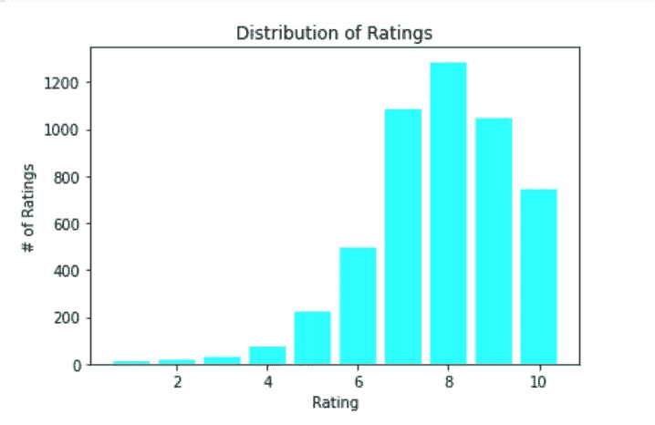
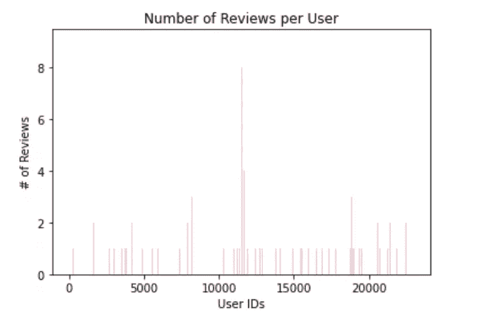
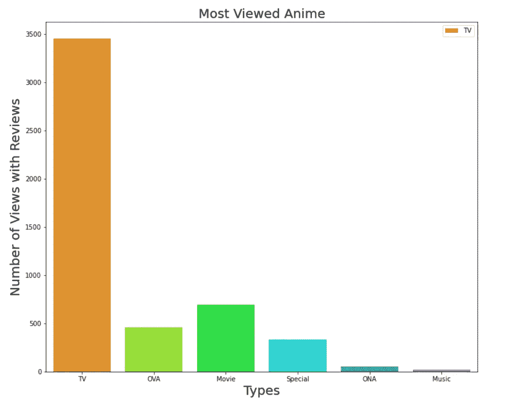
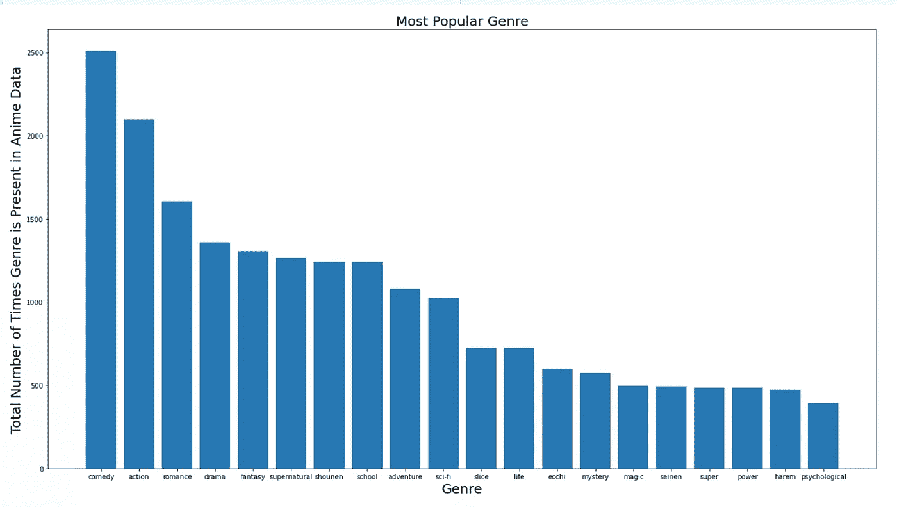

# 构建动漫推荐系统

> 原文：<https://towardsdatascience.com/building-a-recommendation-system-for-anime-566f864acea8?source=collection_archive---------31----------------------->

## 我已经决定做一个简单的动漫推荐系统。

## 背景资料

动漫是一种源自日本的手绘电脑动画，在世界各地吸引了大批追随者。动画产业由 430 多家公司组成。口袋妖怪和游戏王是西方电视上最受欢迎的动漫节目。由宫崎骏创作并由吉卜力工作室制作动画的《千与千寻》是动画电影中票房最高的一部。它在西方如此受欢迎的原因是宫崎骏的一个好朋友说服他将发行权卖给华特·迪士尼。像*千与千寻*，有数以千计的真正好的动画电影和节目是由同一家动画公司制作的。许多其他人可以以此为例，将其作为将此类艺术作品引入迪士尼+或西方任何流媒体网站的一种方式。这让我想到了我最近一直在做的事情:**一个可以帮助任何人或任何公司查看/添加最高评级动漫的推荐系统。日本贸易振兴机构估计，2004 年该行业的海外销售额为 18 𝑏𝑖𝑙𝑙𝑖𝑜𝑛(仅美国就达 52 亿英镑)。这肯定已经增长，并有潜力进一步增长，尤其是在这个世界上的这段时间。像一些国家一样，日本正面临第一次长期衰退。**

下面，你可以看到我对一个动漫推荐系统的逐步指导。这将有助于解决上述问题，并可以创造更多的需求动漫。它还可以帮助任何不熟悉小众流派的人快速找到收视率最高的项目。(帮助发展市场)。

我已经从[https://www . ka ggle . com/Cooper union/anime-recommendations-database](https://www.kaggle.com/CooperUnion/anime-recommendations-database)下载了动漫和用户评分。我将进行探索性的数据分析，让读者和我自己熟悉所呈现的数据。在那里，我使用奇异值分解(SVD)创建了一个基线模型。然后，我会做基于记忆的模型，将着眼于基于用户的 v 项目。我将使用 KNNBase、KNNBaseline 和 KNNWithMeans。然后我会选择表现最好的模型，评估其均方根误差(rmse)和平均绝对误差(mae)。

## 导入

```
import pandas as pd
import numpy as npimport random
from random import randintimport matplotlib.pyplot as plt
%matplotlib inline
import seaborn as snsfrom scipy.sparse import csc_matrix
from scipy.sparse.linalg import svdsfrom surprise.model_selection import train_test_splitfrom surprise.model_selection import GridSearchCV
from surprise.model_selection import cross_validatefrom surprise.prediction_algorithms import KNNWithMeans, KNNBasic, KNNBaselinefrom surprise.prediction_algorithms import knns
from surprise.prediction_algorithms import SVDfrom surprise.similarities import cosine, msd, pearsonfrom surprise import accuracyfrom surprise import Reader
from surprise import Dataset
```

在这个项目的大部分时间里，我决定坚持上面的方法，而且效果很好。我已经在 google colab 中尝试了下面的其他模型，我将在那里为导入库添加必要的代码。

## 擦洗/清洁

```
anime_df = pd.read_csv('./anime.csv')
anime_df.head()
```

形状看起来像什么？这很重要，因为它有助于查看任何空值

```
anime_df.shape
```

删除空值(如果存在)

```
anime_df.dropna(inplace=True)
```

我们将再次检查上述命令后的形状

```
anime_df.shape #this seemed to have reduced it down a bit
```

这实际上减少了我们的动漫数据框架！

在清理时，显示每一列代表什么是很重要的，这样我们就可以知道什么可以擦洗、转换，或者我们是否需要进行一些功能工程。

## 每列代表什么:

***anime_id:每部动漫的 id 号片名***
***名称:电影片名***
***类型:类别***
***类型:描述动漫分成电视、电影、OVA 等 3 个类别***
**集数:总集数**
***评分:-1-10，最低到***

接下来，它们和上面的匹配吗？

```
anime_df.info() #having a look at all of the columns and types from the above cell and current to remove#any unneccessary extraneous data
```

让我们看看这个推荐项目的第二个 csv 文件。

```
rating_df = pd.read_csv('./rating.csv')
rating_df.head()
```

让我们看看他们代表了什么。

## 每列代表什么:

**user_id:不可识别的随机生成的 user-id**
**anime_id:用户已评级的动漫**
**评级:该用户已分配的 10 分中的评级(如果用户观看了该动漫但未分配评级，则为-1)**

检查评级的形状

```
rating_df.shape
```

都有 anime_id。让我们将这两者结合起来，使事情变得容易得多。

```
df_merge = pd.merge(anime_df, rating_df, on = 'anime_id')
df_merge.head()
```

让我们再次检查形状。

```
df_merge.shape
```

我艰难地认识到奇异值分解(SVD)对如此大的数据集更敏感。我要看看最低评级。

```
df_merge.rating_x.min()
```

我已经决定去掉没有评级的列，它们表示为-1。在做推荐系统时，这取决于个人、任务和公司。我可能会在我的业余时间回去，把这个加回来，看看未完成的评级和它对推荐的影响。(确实起了巨大的作用)。我决定把它拿出来纯粹是为了娱乐。

```
df_merge = df_merge[df_merge.rating_y != -1]
df_merge.head()
```

现在，我再次检查形状，看看这减少了多少 SVD 数据。

```
df_merge.shape #have removed over 1 million rows
```

这对于免费的 google colab 来说仍然不够小。

```
sample = df_merge.sample(frac=.25)
sample.shape # this is still too large
```

我在我的 SVD 上运行了很多测试(这花了一天半的时间，我最终不得不满足于下面的样本大小)。

```
sample = df_merge.sample(n=5000)sample.shape #below I conduct SVD and it cannot handle anything larger than 5000 (i've tried)
```

让我们看看数据类型

```
sample.dtypes #rating_x needs to be an int, for it to work in ALS
```

让我们在这里转换它们

```
sample['rating_x'] = sample['rating_x'].astype(int)
```

可以在这里检查数据类型。从一开始，我就发现检查我的代码是非常重要的。当有调试问题时，它对消除问题很有帮助。

```
sample.dtypes
```

看起来评级数据框架是基于每个用户和他们对每个动画 id 的个人评级，而动画数据框架是来自其所有观众的平均总体评级。

```
#we are going to look at how many times each rating appears in a columnratings_x = sample['rating_x'].value_counts() #continuous
ratings_y = sample['rating_y'].value_counts() #discreteprint(ratings_x)
print(ratings_y)
```

另一件对 SVD 来说非常重要的事情是让变量变得谨慎，否则，它会占用你更多的时间。

```
sample.rating_x = sample.rating_x.apply(round) 
sample.head()
```

太好了，我想我已经洗完了。让我们进入有趣的部分！

## 探索性数据分析

用户评级的分布

```
# plot distribution in matplotlib
ratings_sorted = sorted(list(zip(ratings_y.index, ratings_y)))
plt.bar([r[0] for r in ratings_sorted], [r[1] for r in ratings_sorted], color='cyan')
plt.xlabel("Rating")
plt.ylabel("# of Ratings")
plt.title("Distribution of Ratings")
plt.show()
```

我还没有把输出添加到清洗中，视觉效果非常重要，所以我会把它们添加进去。



这是我自己的图表，也可以在我的 github 上找到

```
#number of users
print("Number of Users:", df_merge.user_id.nunique()# print("Average Number of Reviews per User:", df_merge.shape[0])/df_merge.user_id.nunique()avg_rate_peruser = df_merge.shape[0]user = df_merge.user_id.nunique()
avg_num_review_per_user = avg_rate_peruser/userprint("Average Number of Reveiws per User:", avg_num_review_per_user)
```

用户数量:15382

每个用户的平均评论数:88.69

```
sample[‘user_id’].value_counts()
```

5000 的样本量，给了我们总共 3，381 个做过评论的用户。以上是整套的。

每个用户的评论数量

```
ratings_per_user = sample['user_id'].value_counts()
ratings_per_user = sorted(list(zip(ratings_per_user.index, ratings_per_user)))
plt.bar([r[0] for r in ratings_per_user], [r[1] for r in ratings_per_user], color='pink')
plt.xlabel('User IDs')
plt.ylabel('# of Reviews')
plt.title('Number of Reviews per User')
plt.show()
```



这是我自己的图表，也可以在我的 github 上找到

从我们的样本集来看，给出的很多分数都是 1 分和 2-4 分。

不同类型的动漫

```
print("Number of users:", sample.user_id.nunique())
print("Number of types of different anime:", sample.type.nunique())
print("Types of type:", sample.type.value_counts())
```

由此，我们可以看到有 6 种类型。它们是什么？

6 种类型:

```
TV 3492 
Movie 666
OVA 461
Special 314 
ONA 46 
Music 21 
Name: type, dtype: int64
```

OVA 代表原创视频动画

ONA 代表原创网络动画

特价是一次性的视频。

音乐是以动漫为主题的，通常有一个动画与之搭配，但它通常是一个非常短的视频。

点击率最高的动漫

```
# PLOT them
fig = plt.figure(figsize=(12,10))
sns.countplot(sample['type'], palette='gist_rainbow')
plt.title("Most Viewed Anime", fontsize=20)
plt.xlabel("Types", fontsize=20)
plt.ylabel("Number of Views with Reviews", fontsize = 20)
plt.legend(sample['type'])
plt.show()
```



这是我自己的图表，也可以在我的 github 上找到

让我们开始实施吧！

## 分析

最重要的是第一件事！做一个基础模型。我从转换我的数据开始。

```
#for surprise, it likes its data in a certain way and only that specific datadata = sample[['user_id', 'anime_id', 'rating_x']] #may need to do rating_x rounded and then use rating_yreader = Reader(line_format='user item rating', sep='')
anime_loaded_data = Dataset.load_from_df(data, reader)#train_test_split
trainset, testset = train_test_split(anime_loaded_data, test_size=.2)
```

确保您的数据格式正确

```
anime_loaded_data
```

接下来，我们将实例化。

```
#INSTANTIATE the SVD and fit only the train set
svd = SVD()svd.fit(trainset)
```

现在来看看预测和准确性。这对于比较您的学员模型非常重要。

```
predictions = svd.test(testset) #
accuracy.rmse(predictions)
```

这是我的基线:RMSE: 2.3128，2.3127

嗯，肯定不是 0 到 1 之间。这些分数实际上取决于领域。肯定不完美。我最初的反应是吓坏了，但事实证明 RMSE 超过 1 是没问题的。

我想看看我是否能减少这种情况。

```
#perform a gridsearch CV
params = {'n_factors': [20,50,100],
'reg_all': [.02,.05, .10]}gridsearch_svd1 = GridSearchCV(SVD, param_grid=params, n_jobs=-1, joblib_verbose=3)gridsearch_svd1.fit(anime_loaded_data)print(gridsearch_svd1.best_score)
print(gridsearch_svd1.best_params)
```

{'rmse': 2.3178，' Mae ':2.2080 } { ' RMSE ':{ ' n _ factors ':20，' reg_all': 0.02}，' mae': {'n_factors': 20，' reg_all': 0.02}}

它增加了。我现在将尝试其他模型，特别是基于内存的模型，然后是基于内容的模型。

k-最近邻(KNN)基本算法

```
#cross validate with KNNBasic
knn_basic = KNNBasic(sim_options={'name':'pearson', 'user_based':True}, verbose=True)
cv_knn_basic = cross_validate(knn_basic, anime_loaded_data, n_jobs=2)for i in cv_knn_basic.items():print(i)
print('-----------------')
print(np.mean(cv_knn_basic['test_rmse']))
```

将把你从其余的中拯救出来，这里是输出的一个简短剪辑

— — — — — — — — — 2.3178203641229667

您可以对均方距离(msd)进行同样的操作。

```
knn_basic_msd = KNNBasic(sim_options = {'name': 'msd', 'user-based':True})
cv_knn_basic_msd = cross_validate(knn_basic_msd, anime_loaded_data, n_jobs=2)for i in cv_knn_basic_msd.items():print(i)
print('-----------------')
print(np.mean(cv_knn_basic_msd['test_rmse']))
```

— — — — — — 2.31787540672289，得分较高。让我们试试另一个模型

KNNBaseline

```
#cross validate with KNN Baseline (pearson)
knn_baseline = KNNBaseline(sim_options={'name': 'pearson', 'user_based':True})
cv_knn_baseline = cross_validate(knn_baseline, anime_loaded_data, n_jobs=3)for i in cv_knn_baseline.items():print(i)
print('-----------------')
print(np.mean(cv_knn_baseline['test_rmse']))
```

— — — — — — — — — 2.317895626569356

同样，当我们希望它减少时，它却在增加。

KNN 基线与皮尔逊 _ 基线

```
knn_pearson_baseline = KNNBaseline(sim_options={'name': 'pearson_baseline', 'user_based':True})cv_knn_pearson_baseline = cross_validate(knn_pearson_baseline, anime_loaded_data, n_jobs=3)for i in cv_knn_pearson_baseline.items():print(i)
print('-------------------')
print(np.mean(cv_knn_pearson_baseline['test_rmse']))
```

这给了我们----- 2。46860 . 68868886861

KNNWithMeans

```
knn_means = KNNWithMeans(sim_options={'name': 'pearson', 'user_based': True})
cv_knn_means = cross_validate(knn_means, anime_loaded_data, n_jobs=3)for i in cv_knn_means.items():print(i)
print('------------')
print(np.mean(cv_knn_means['test_rmse']))
```

— — — — — — 2.3185632763331805

SVD 基线似乎具有最低的 RMSE。我会再次进行网格搜索

```
param_grid = {'n_factors': [5, 20, 100],
'n_epochs': [5,10],
'lr_all': [.002, .005],
'reg_all': [.02, .05, .5]}svd_gs = GridSearchCV(SVD, param_grid=param_grid, n_jobs=3, joblib_verbose=3)svd_gs.fit(anime_loaded_data)print(svd_gs.best_score)
print(svd_gs.best_params)
```

然后

```
#Now use this to fit test set, initial gridsearch was 2.77096, so will use that gs herehighest_perf_algo = gridsearch_svd1.best_estimator['rmse']#retrain the whole settrainset = anime_loaded_data.build_full_trainset()
highest_perf_algo.fit(trainset)#Biased Accuracy on trainset
predictions = highest_perf_algo.test(trainset.build_testset())print('Biased accuracy on Trainset', end='')
accuracy.rmse(predictions)#UnBiased Accuracy on testset
predictions = highest_perf_algo.test(testset)print('Unbiased Accuracy on test', end='')
accuracy.rmse(predictions)
```

我的结果是:训练集上的有偏精度 RMSE:2.3179301111112067，测试集上的无偏精度 RMSE:2.317938596

我做了一些合作模型，列在我的 [Github repo](https://github.com/anilaq/capstone/blob/master/latest.ipynb) 上。我的协作模型采用余弦相似度和基于用户的 v 项目。

基于内容

```
import nltk
from sklearn.feature_extraction.text import TfidfVectorizer
from nltk.corpus import stopwords
import string
from nltk import word_tokenize, FreqDist
import re
from sklearn.decomposition import TruncatedSVD
from sklearn.metrics.pairwise import linear_kernel
```

接下来，让我们提取必填字段。

```
genre_tag = sample.loc[:, ['anime_id','name','genre']]
```

让我们看看它是什么样子的

```
genre_tag.head()
```

目标是将每行的单词分开。

```
tags = {}
for col in ['genre']:
  for a_id in sample['name'].unique(): 
    for i in sample[sample['name'] == a_id][col]:
     if a_id in tags: 
       tags[a_id].append(' '.join(i.lower().split('|')))
     else: 
         tags[a_id] = i.lower().split('|')
```

将此转换成列表

```
tags_list = list(tags.values())
```

看看名单

```
tags_list[:5]
```

确保指定停用词为英语

```
stopwords_list = stopwords.words('english')
stopwords_list += list(string.punctuation)
```

目的是减少产生的噪音。

```
def process_article(article): 
  article = ' '. join(article)
tokens = word_tokenize(article)
tokens_2 = []
for token in tokens: 
  if token.lower() not in stopwords_list: 
     tokens_2.append(token.lower())
return tokens_2
```

让我们来处理这篇文章。这将把测试分成基于空格或撇号分隔的字符串列表

```
processed_tags = list(map(process_article, tags_list))
```

现在让我们从体裁中获取总词汇量。

```
articles_concat = []
for doc in processed_tags: 
  articles_concat += doc
```

每个单词出现多少次？

```
freqdist = FreqDist(articles_concat)
freqdist
```

让我们获得前 20 个单词，这将让我们看到最受欢迎的类型

```
most_common_genre = freqdist.most_common(20)
most_common_genre
```

让我们画出来

```
plt.figure(figsize=(22,12))
plt.bar([word[0] for word in most_common_genre], [word[1] for word in most_common_genre])
plt.title("Most Popular Genre", fontsize= 20)
plt.xlabel("Genre", fontsize=20)
plt.ylabel("Total Number of Times Genre is Present in Anime Data", fontsize=20)
plt.show()
```



这是我自己的图表，也可以在我的 github 上找到

我们的推荐系统可能会推荐喜剧、动作片、爱情片等。

现在，把它转换成矢量器

```
vectorizer = TfidfVectorizer(analyzer='word', ngram_range=(1,2), stop_words=stopwords_list)tags_list_2 = [‘ ‘.join(x) for x in tags_list]
tf_idf_data_train = vectorizer.fit_transform(tags_list_2)
```

接下来，让我们看看它如何符合标准。因为 NLTK 是一个完全不同的库，所以最好看看它解释的方差比。

```
#instantiate SVD
svd = TruncatedSVD(n_components=500, n_iter=7, random_state=42)#fit and transform the vectorized tf-idf matrix
tf_idf_data_train_svd = svd.fit_transform(tf_idf_data_train)
```

这里我们通过以下方式得到最终结果:

```
print(svd.explained_variance_ratio_.sum())
```

0.9962558733287571

在尝试了一堆模式之后，我觉得基于内容的模式是最好的。

在我的笔记本上，我还看着计算动漫和 TF-IDF 的相似度。

## 更多信息

基于所做的建模，最好是对来自相同动画工作室、作家、导演和媒体公司的收视率最高和收视率最高的动画进行更多的统计分析。从这里，我们可以调整推荐系统，以包括他们的最新发布。

另一个建议是看时间成分分析。电视节目是最受欢迎的动画类型，但是在一年中的什么时候呢？从这里开始，推荐系统可以帮助动画工作室填补财政年度内的空白。他们可以将日期分散开来，或者开辟一条新的渠道来推出更多特价商品。

参考资料:

[1]阿·库雷西，[卡普斯顿](https://github.com/anilaq/capstone) e (2020)

[2]苏珊·李，[，](/building-and-testing-recommender-systems-with-surprise-step-by-step-d4ba702ef80b) (2018)

[3] Derrick Mwiti，[如何用 Python 构建一个简单的推荐系统](/how-to-build-a-simple-recommender-system-in-python-375093c3fb7d) (2018)

[4] Robi56，[深度学习推荐系统](https://github.com/robi56/Deep-Learning-for-Recommendation-Systems) (2020)

[5] JJ、梅和 RMSE — [哪个指标更好？](https://medium.com/human-in-a-machine-world/mae-and-rmse-which-metric-is-better-e60ac3bde13d) (2016)

[6]维基百科，[动漫](https://en.wikipedia.org/w/index.php?title=Anime&action=history) (2020)

[7]维基百科，[千与千寻](https://en.wikipedia.org/wiki/Spirited_Away) (2020)

[8]玛丽·马瓦德，[冠状病毒:欧洲流媒体服务也在蓬勃发展](https://sifted.eu/articles/streaming-startups-coronavirus/) (2020)