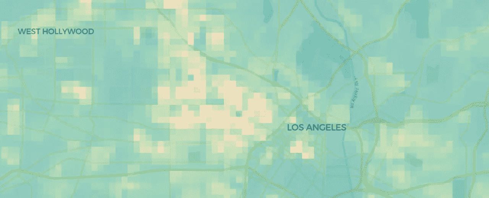
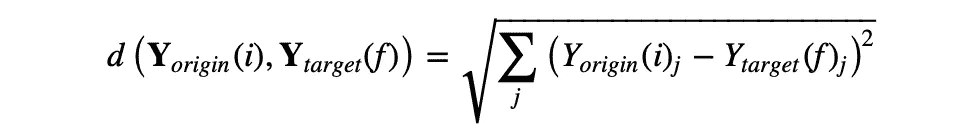
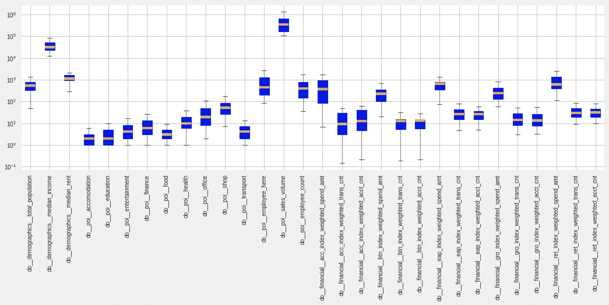
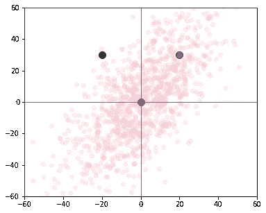
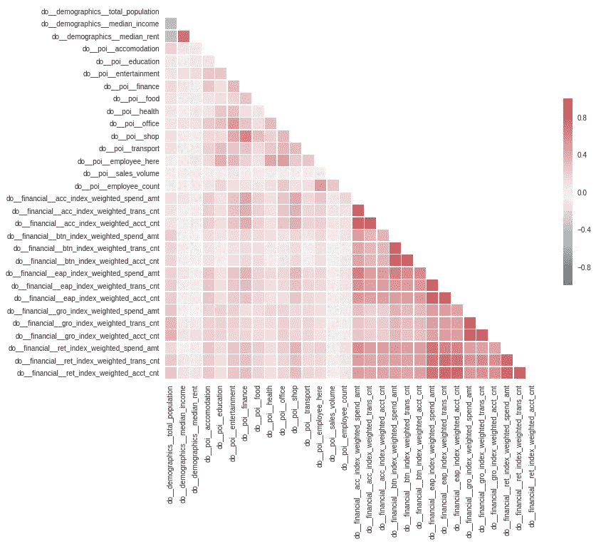
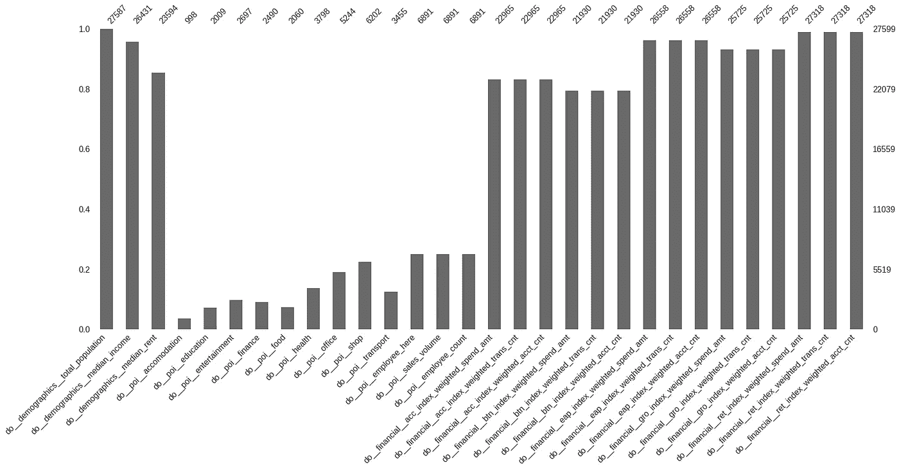
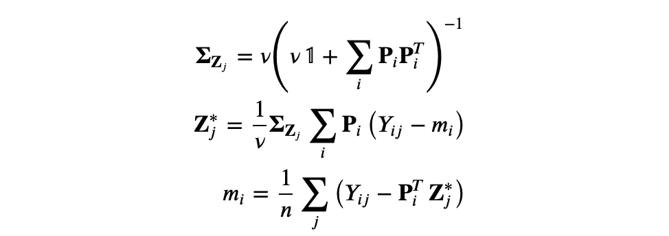
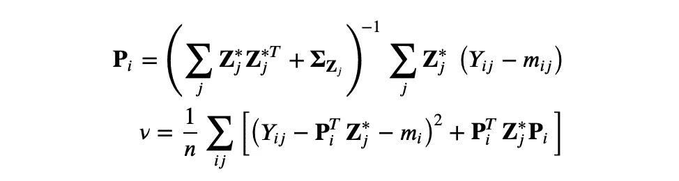
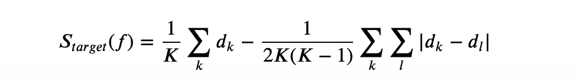

# 建立网站规划的推荐系统

> 原文：<https://towardsdatascience.com/building-a-recommendation-system-for-site-planning-e0056b4a64c5?source=collection_archive---------21----------------------->

## 计算位置间相似性的多元方法

当涉及到场地规划应用时，组织强烈希望将来自不同来源的数据结合起来，这不仅是为了获得特定位置的见解，也是为了比较不同的地理位置，例如，为了找到显示相似特征的位置。

资料来源:CARTO

如果我们的目标是比较两个地理位置，我们可能需要考虑在该位置测量的各种数据点，既有来自“传统”来源(如人口普查)的，也有来自更现代来源的，如移动、金融交易和兴趣点(POI)数据。

在 CARTO，我们开发了一种方法来计算一组目标位置相对于现有站点的相似性得分，这可以证明是站点规划者在考虑开设、迁移或整合其站点网络时的一种重要工具。计算两个位置之间的相似性分数实际上归结为计算每个感兴趣的变量在这些位置的值之间的差异，或者在下文中称为“变量空间中的距离”，与地理距离相对。

为了估计两个位置之间的相似性，我们首先需要定义“位置”的含义。例如，一些数据可能在点一级可用(例如，POI 数据)，而其他数据可能已经在空间上聚合(例如，人口普查数据通常在给定的行政单位一级可用)，并且不同的数据源可能在不同的空间分辨率下可用。因此，比较不同的位置需要首先定义一个共同的空间支持。例如，我们可以使用一个使用[四叉树数据结构](https://link.springer.com/article/10.1007/BF00288933)构建的规则网格，其中每个网格单元都由一个称为四叉树键(quadtree keys，简称“quadkeys”)的一维位串唯一定义。然后(这是难点)，我们需要将每个数据源转换到这个公共空间支持。出于本帖的目的，我们将求助于一个基于[面积插值](https://asu.pure.elsevier.com/en/publications/areal-interpolation-a-variant-of-the-traditional-spatial-problem)的快速(尽管不是最优)解决方案，它使用原始和公共支持面之间的相交面积作为权重来重新分配数据。

下面的地图显示了美国人口普查中通过面插值转换为四键格网的总人口示例:

资料来源:CARTO

# 共享工作空间公司基于计算相似性的选址示例

现在，假设您可以访问从我们的[数据观测站](https://carto.com/platform/location-data-streams/)转换到四键网格的第三方和制图数据，并且您想要使用这些数据计算不同位置(网格点)之间的相似性得分。例如，假设共享工作空间行业的市场领导者希望使用更多数据来推动其快速扩张战略。

假设我们想考虑这家公司在纽约的站点，结合人口统计、财务和 POI 数据来查找在洛杉矶具有相似特征的位置。这种相似性分析的结果将指出他们应该计划开设新空间/重新安置与纽约市目标位置具有相似特征的现有空间的最佳地点。

第一步是选择我们希望包含在分析中的相关变量。这里，我们将使用人口统计、POI 和财务数据的组合。然后，如上所述，目标是计算可变空间中的(一对一)距离:

在选定的原始单元格(I)和每个目标单元格(f)之间，其中索引 j 标识变量类型(例如，总人口)。对于这个用例，这里的目标区域是洛杉矶的整个城市。

虽然这种方法看起来很简单，但是为了正确计算距离，我们需要考虑一些缺点。

## 当变量有不同的方差时会发生什么？

*分析中所选变量的箱线图。注意 y 轴上的对数刻度。来源:CARTO*

很明显，在这种情况下，总人口和食物中毒人数中的距离将被赋予不同的权重。为了说明不同的方差，数据被标准化，使得每个变量的均值和单位方差为零。这意味着在计算距离时，所有变量都被赋予相同的权重。

## 当变量之间存在相关性时会发生什么？

当存在相关变量时，在距离的计算中存在大量冗余信息。通过在距离计算中考虑变量之间的相关性，我们可以消除冗余。为了理解相关性是如何混淆距离计算的，我们可以查看下图，该图显示了一组呈现正相关性的点。

*相关性对距离计算影响的示意图。来源:CARTO*

观察该图，我们知道蓝点比绿点更有可能与原点的红点属于同一簇，尽管它们与中心的距离相等。很明显，当有相关变量时，我们需要在距离计算中考虑相关性。

*本分析中包含的变量的相关矩阵。矩阵中的每个元素代表皮尔逊相关系数，它是两个变量之间线性相关性的度量。来源:CARTO*

正如预期的那样，上图显示了我们考虑的一些变量表现出相关性(例如，收入中值与租金中值正相关，所有财务变量彼此之间正相关)。为了考虑相关变量，距离不是在原始变量空间中计算的，而是在变量线性不相关的主成分空间(PCA)中计算的。

> **简单来说 PCA**
> 
> [主成分分析](https://users.ics.aalto.fi/praiko/papers/ilin10a.pdf) (PCA)是一种将高维向量的数据集转换成低维向量的技术。例如，这对于特征提取和降噪是有用的。PCA 找到数据向量的较小维度的线性表示，使得原始数据可以从具有最小平方误差的压缩表示中重构。最流行的 PCA 方法是基于样本协方差矩阵的特征分解

> 其中 **Y** 是居中的(逐行零经验平均值)n×d 数据矩阵，其中 d 是数据点的数量，n 是变量的数量。在计算协方差矩阵的特征向量( **U** )和特征值( **D** )矩阵后

> 并按照特征值递减的顺序重新排列它们的列，主分量(PC 或因子)计算如下

> 其中 **P** 表示对应于最大 P 个特征值的特征向量，即对应于最大数量的解释方差。然后，原始(居中)数据可以重建为

> 这里，为了说明保留的 PC 数量的不确定性，我们创建了一个距离计算集合，对于每个集合成员，我们在由分别解释 90%和 100%方差的 PC 数量定义的范围内随机设置保留的 PC 组件的数量。

## 在缺失数据的情况下，我们如何计算距离？

不幸的是，PCA 对缺失数据不起作用。如果缺失数据是常见的，那么普通的内插或均值插补解决方案并不是一个好主意。

*此分析中包含的每个变量的缺失数据部分。资料来源:CARTO*

当给定位置的 POI 变量缺失时，我们可以有把握地假设该位置中该变量的 POI 数量为零。另一方面，对于其他变量(如金融变量)，我们需要找到一种稳健的方法来处理缺失值。

为了考虑缺失数据，我们在这里使用一种概率方法进行 PCA，称为[概率 PCA](https://users.ics.aalto.fi/praiko/papers/ilin10a.pdf) ，它使用一种迭代程序来交替插入缺失数据并更新不相关的分量，直到收敛。

> **PPCA 一言以蔽之**
> 
> 在 PPCA，完整数据通过生成潜在变量模型建模，该模型迭代更新预期完整数据对数似然和参数的最大似然估计。PPCA 还具有比 PCA 更快的优点，因为它不需要计算数据协方差矩阵的特征分解。
> 
> PCA 也可以被描述为概率潜变量模型的最大似然解，它被称为 PPCA:

> 随着

> 假设主分量 **Z** 和噪声ε都是正态分布的。可以通过使用期望最大化(EM)算法找到模型参数的最大似然(ML)估计来识别模型。EM 是用于学习具有不完全数据的参数的通用框架，其迭代地更新参数的期望完全数据对数似然和最大似然估计。在 PPCA，数据是不完整的，因为没有观察到主要成分 **Z** 。当缺失数据存在时，在 E-步骤中，根据给定的观察变量，对未观察变量的条件分布进行完全数据对数似然的期望。在这种情况下，更新 EM 规则如下。
> 
> 电子步骤:

> m 步:

> 其中 **P** 和 **Z*** 的每一行仅基于 **Z*** 的那些列来重新计算，这些列有助于数据矩阵的相应行中的观测值的重建。

到目前为止，我们计算了可变空间中纽约给定共享工作空间位置和洛杉矶目标区域中每个位置之间的距离。然后，我们可以选择距离最短的目标位置作为在洛杉矶开设/搬迁办公室的最佳候选位置。

## *然而，我们如何知道距离足够小，或者我们如何定义相似性？*

为了回答这个问题，我们通过将每个目标位置的得分与平均向量数据的得分进行比较，定义了相似性技能得分(SS)

其中分数仅代表可变空间中的距离，即

如果我们通过系综生成来考虑每个目标位置的距离计算中的不确定性，则每个目标位置的得分变成

其中 K 是系综成员的数量。

*   当且仅当目标位置比平均向量数据更类似于原点时，技能得分(SS)将为正
*   在该评分规则下，具有较大 SS 的目标位置将更类似于原点

然后，我们可以按照 SS 的降序对目标位置进行排序，并且只保留满足阈值条件的结果(SS = 1 表示完全匹配或零距离)。有关评分规则的更多信息，请参见[费罗(2014)](https://rmets.onlinelibrary.wiley.com/doi/full/10.1002/qj.2270) 。

## 将这一切结合在一起

下面我们可以看到纽约市两个原点位置的目标区域的相似性技能(SS)得分图，这两个原点位置目前有共享工作区，一个在曼哈顿，一个在布鲁克林。从该图中，我们可以看到，该方法为曼哈顿和布鲁克林办公室选择了不同的目标位置，这反映了起始位置变量之间的差异。特别是，对于曼哈顿办事处，洛杉矶的选定地点集中在贝弗利山和西好莱坞地区，在洛杉矶的所有不同地区中，这些地区在人口统计、金融和 POI 数据方面与曼哈顿最为“相似”。另一方面，根据布鲁克林的 SS 评分规则，被选为最相似的地点更加分散，这表明我们的示例公司在决定开设与布鲁克林具有相似特征的新办事处时，可能会考虑洛杉矶的不同街区。

资料来源:CARTO

*本文原载于* [*CARTO 博客*](https://carto.com/blog/spatial-data-science-site-planning/) 。

*特别感谢*[*Mamata Akella*](https://twitter.com/mamataakella?lang=en)*，CARTO 的制图主管，对她在本帖地图创作中的支持。*