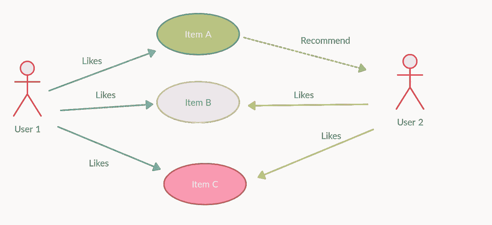
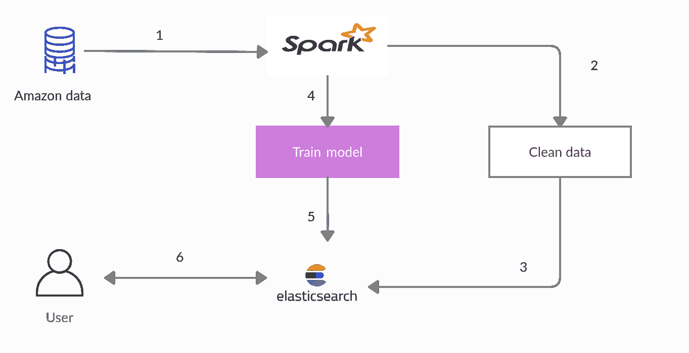
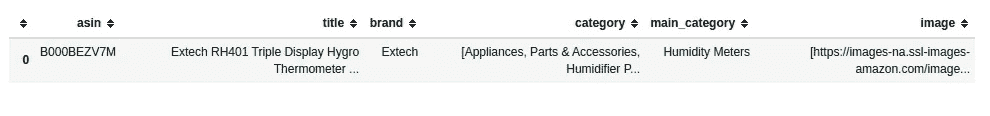
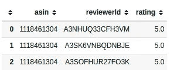
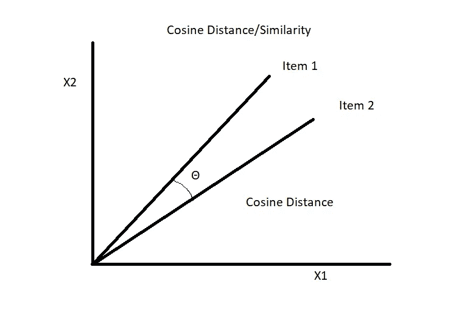
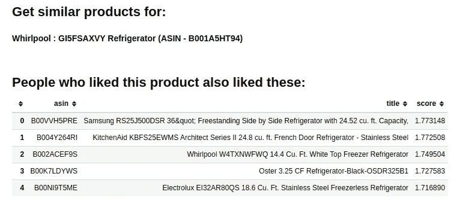

# 用 Spark ML 和 Elasticsearch 构建推荐系统

> 原文：<https://towardsdatascience.com/building-a-recommendation-system-with-spark-ml-and-elasticsearch-abbd0fb59454?source=collection_archive---------10----------------------->

## 使用交替最小二乘法和余弦相似度的产品推荐



作者图片

在不同产品公司的搜索团队工作时，总是有为用户建立推荐系统的持续需求。我们与流行的搜索引擎如 Elasticsearch、SOLR 建立了合作关系，并试图完善搜索相关性。但是当涉及到搜索相关性和仅仅用搜索引擎创建推荐系统时，总是有一个限制。我总是惊讶于亚马逊和网飞这样的公司根据我们的兴趣提供推荐。因此，通过使用 Apache spark 机器学习功能和 elasticsearch，我们将建立一个推荐系统。

如上图，如果用户 1 喜欢物品 A、物品 B、物品 C，用户 2 喜欢物品 B、物品 C，那么有很大概率用户 2 也喜欢物品 A，可以向用户 2 推荐物品 A。

在推荐系统领域，主要有三种用于提供推荐的技术。

*   协同过滤
*   基于内容
*   混合技术

我们将使用 Pyspark 中的协同过滤技术来创建一个推荐系统。Apache Spark ML 实现了用于协同过滤的交替最小二乘法(ALS ),这是一种非常流行的推荐算法。

ALS 是一种矩阵分解算法，使用交替最小二乘法和加权λ正则化(ALS-WR)。

Spark ALS 的主要问题是，它只会为特定用户(用户-产品模型)推荐顶级产品，为特定产品(产品-用户模型)推荐顶级用户。

计算所有配对的相似性并不是针对大的产品目录。O(n2)组合数量的增长很快导致了代价过高的混洗操作和不可行的计算机时间。为了计算项目-项目相似性，我们使用来自 ALS 模型的项目因素的相似性，使用 spark 和 elasticsearch 建立了项目-项目模型。

ALS 算法本质上分解两个矩阵——一个是用户特征矩阵，另一个是项目特征矩阵。我们正在对项目特征等级矩阵进行余弦相似性运算，以找到项目间的相似性。

# 关于数据集

数据集主要包含来自 Amazon.com 的两种类型的数据。一个是元数据，它包含产品元数据，另一个是用户各自的不同产品的评级数据。

**注:数据集可以从这个** [**站点**](http://deepyeti.ucsd.edu/jianmo/amazon/index.html) **下载。**

使用的 spark 版本是 2.4.6，elasticsearch 版本是 7.9.0

# 工作流程



作者图片

1.  将产品数据集加载到 Spark 中。
2.  使用 Spark DataFrame 操作来清理数据集。
3.  将清理后的数据加载到 Elasticsearch 中。
4.  使用 Spark MLlib，从评级数据中训练一个协同过滤推荐模型。
5.  将生成的模型数据保存到 Elasticsearch 中。
6.  使用弹性搜索查询，生成推荐。

## 加载数据

以下代码用于读取产品数据，并将其转换为 spark 数据帧。

在 spark 中加载数据后，数据帧如下所示。



作者图片

现在我们需要将产品数据索引到一个 Elasticsearch 索引中。为了将 elasticsearch 与 spark 连接起来，我们需要在类路径中添加一个 JAR 文件，或者将该文件放在 spark 的 jars 文件夹中。JAR [文件](https://mvnrepository.com/artifact/org.elasticsearch.client/elasticsearch-rest-high-level-client/7.9.0)需要基于我们现有的 spark 版本下载。

既然已经在 Elasticsearch 中索引了产品元数据，我们需要根据主 id 索引文档的 **model_factor** 列中每个产品的特征向量。

## 准备特征向量

特征向量是通过使用 ItemFeatures 矩阵生成的，该矩阵是在我们对用户产品评级数据运行 MLib ALS 算法时生成的。

在 spark 中加载评级数据并转换为数据帧后，将如下所示。



作者图片

在对模型进行评估后，我们得到了一个均方根误差值 RMSE=0.032，这是相当不错的。值越低，模型越好。

现在我们必须将项目向量索引回 Elasticsearch。

现在项目向量已被索引到 elasticsearch，我们需要找到类似的产品。

为了找到两个项目之间的相似性，我们将使用余弦相似性功能。余弦相似性是内积空间的两个非零向量之间相似性的度量，度量它们之间角度的余弦。



作者图片

余弦距离值越小，项目越相似。

我们将使用 elasticsearch 中的 **script_score** 功能计算产品的相似性得分。**余弦相似度**函数计算给定查询向量和文档向量之间的余弦相似度。

以下查询已用于从 elasticsearch 获取类似的项目。我们用类别过滤也是为了在类别中得到更好的结果。我们可以根据需要更改过滤器选项。该脚本将余弦相似度加 1.0，以防止分数为负。为了利用脚本优化，提供一个查询向量作为脚本参数。

以下代码已被用于获得类似的产品。我们正在传递产品的 ASIN 和我们想要的产品推荐数量。

```
display_similar('B001A5HT94', num=5)
```

这将给出前 5 名产品的结果，这与我们已经通过的产品类似。



作者图片

还不错！结果与我们搜索的产品相似。我们可以随时调整 ALS 算法，以获得更好的性能和精度。

我们也可以采用隐式反馈参数来调整算法。本质上，这种方法不是试图直接对评级矩阵建模，而是将数据视为代表用户行为观察中的*强度*的数字(如点击次数或购买产品的次数)。

源代码可以在 [Github](https://github.com/lijoabraham/spark-playground/tree/master/recommendation_system_spark_es) 上找到。

# 参考

*   协同过滤-[https://spark . Apache . org/docs/3 . 0 . 0/ml-collaborative-filtering . html](https://spark.apache.org/docs/3.0.0/ml-collaborative-filtering.html)
*   使用标签较远的评论和细化的方面来证明推荐的合理性。简墨倪，李嘉诚，朱利安麦考利。自然语言处理中的经验方法(EMNLP)，2019 ( [PDF](http://cseweb.ucsd.edu/~jmcauley/pdfs/emnlp19a.pdf) )