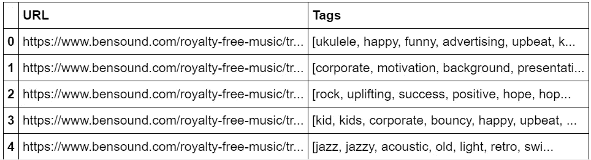
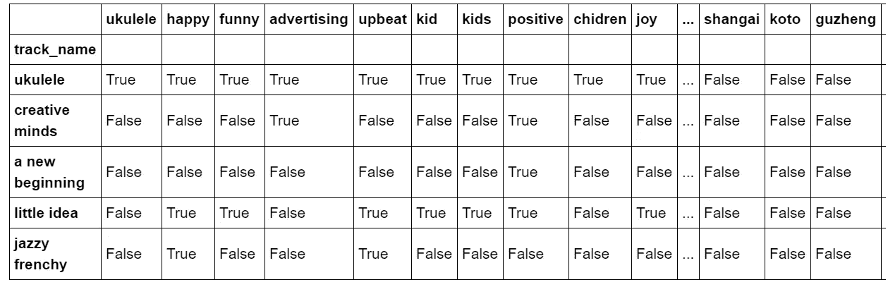
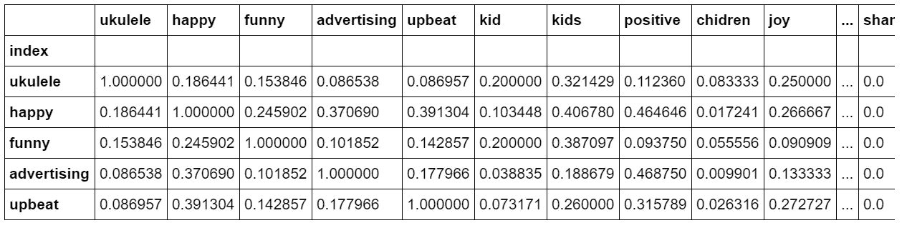

# 为标记音乐建立推荐系统

> 原文：<https://towardsdatascience.com/building-a-recommender-system-for-tagging-music-cd8457d255cc?source=collection_archive---------22----------------------->

## 找出哪些标签描述了相似的音乐！


演讲者图像由[皮克斯贝](https://www.pexels.com/de-de/foto/aluminium-audio-ausrustung-design-373632/)拍摄，背景图像由[马库斯·斯皮斯克](https://www.pexels.com/de-de/foto/arbeiten-muster-internet-abstrakt-1089438/)拍摄。

# 介绍

最近，我在听一个关于音乐行业人工智能的播客。当我们想到人工智能和音乐时，首先想到的通常是音乐分类和生成。然而，在本期播客中，[《爱与数据》](https://www.withloveanddata.com/de-de/)的亚历克斯·雅各比用一种完全不同的方式让我大吃一惊。和他的团队一起，他开发了一个 ML 模型，让媒体制作者为他们的广告、电影等找到合适的音乐。更有效率。当他们搜索一些关键词时，该模型还会向他们推荐没有任何关键词标记的音乐，但这些关键词与他们搜索的关键词有某种关联。这是天才！

想象一下，你错过了多少机会，查找书籍、学术文献、编程教程或猫视频的“错误”关键词。我觉得它令人惊叹。如果我们这样来看，标签是一种平台设置下，厂商和需求者之间的一种沟通方式。如果我们想在亚马逊上购买新袜子，搜索过程相当简单，因为我们可以口头描述我们感兴趣的对象。然而，在音乐的例子中，我们需要依靠标题和标签来描述我们寻找或提供的产品。因此，好的标签的重要性，即有效的标签将供应商和需求者聚集在一起，怎么强调都不为过！只有两种方法可以改进对带有标签的内容的搜索。

1.  找到解决不良标签的方法
2.  寻找使用更好标签的方法

亚历克斯·雅各比的工作是迈向第一步的重要一步。我想向后者迈出一小步，帮助创作者和媒体制作人通过更好的标签找到一起。我想建立一个推荐系统，计算标签之间的相似性，并使用这些来进行推荐。有很多模型是根据单词之间的关系来训练的。这些模型将能够推荐与前一个标签相匹配的标签。但音乐是一种非常特殊的东西，你是否能从博客帖子或聊天上训练的数据集得出好的音乐标记的结论是值得怀疑的。让创作者成为媒体经理要搜索的推荐标签，让媒体经理成为音乐人实际使用的推荐标签，会更有帮助。这是(现在仍然是)这个项目的目标！

我将遵循基于内容的过滤策略，计算标签之间的相似度。图 1 显示了这个项目的基本步骤。一切都将在 Python 中完成。


图 1 —这个项目的 3 个步骤

# 步骤 1 —收集数据

首先，我需要一个数据集。我真正需要的所有信息是许多音乐片段的标签数组。可能一首歌的标签是 t1 = ["funky "，" groove "，" guitar "，" uplifying "]，另一首歌的标签是 t2 = ["kids "，" happy "，" uplifying "，guitar"]。我的推荐系统应该发现“振奋”和“吉他”在某种意义上是相似的，因为它们经常一起用来描述一首音乐。因此，我想从网上搜集大量曲目的标签列表。我找到了网站[www.bensound.com，](http://www.bensound.com,)，它提供免费的电影、商业或博客音乐。图 2 显示了 bensound 主页的外观。有超过 20 页，每一页有 12 个音轨。如果我可以遍历所有页面，打开该页面上的每个轨道并提取其标签，我就有了一个不错的数据集。


图 2-www.bensound.com 主页

[](https://github.com/MaxHilsdorf/music_tag_recommender/blob/master/webscraping.ipynb) [## MaxHilsdorf/music _ tag _ recommender

### permalink dissolve GitHub 是 4000 多万开发人员的家园，他们一起工作来托管和审查代码，管理…

github.com](https://github.com/MaxHilsdorf/music_tag_recommender/blob/master/webscraping.ipynb) 

您可以在这个 github 资源库中找到整个项目的注释 jupyter 笔记本以及所有数据文件。在本文中，我将只使用代码片段。

我用“请求”和 bs4 的“美汤”来刮数据。你将在本章中找到的代码在被解析的网页内容中做了大量的实验。可能有些数字或命令对您来说没有意义，但我希望我的函数的总体结构是清楚的。

首先，我编写了一个函数来获取任何页面上的所有跟踪 URL。

```
def get_tracks(page_url):

    # Setup soup for main page
    page_r = requests.get(page_url)
    page_soup = BeautifulSoup(page_r.text, "html.parser")
    page_html = page_soup.body.div.find_all("a")

    # Setup empty list and fill it with the URLS
    track_list = []
    for i in range(33,84, 5): # these are the positions where we find the track urls in this case        
        entry = page_html[i]["href"]
        track_list.append(entry)

    return track_list
```

现在我有了一些 track urls，我需要一个函数来从中提取标签。

```
def get_tags(track_url):

    # Setup soup for track page
    track_r = requests.get(track_url)
    track_soup = BeautifulSoup(track_r.text, "html.parser")
    taglist_html = track_soup.body.div.find("p", {"class": "taglist"})
    taglist_html = taglist_html.find_all("a")
    taglist = []
    for i in taglist_html:
        for j in i:
            taglist.append(j)          
    return taglist
```

最后，我结合了上面的两个函数，遍历所有页面并从所有音轨中提取所有标签。幸运的是，不同页面的 url 仅在结尾有所不同:

1.  https://www.bensound.com/royalty-free-music
2.  【https://www.bensound.com/royalty-free-music/2 
3.  https://www.bensound.com/royalty-free-music/3
4.  […]

这使得遍历所有页面变得更加容易，因为它可以用以下 4 行代码来处理:

```
url_template = “[https://www.bensound.com/royalty-free-music/{page](https://www.bensound.com/royalty-free-music/{page)}"page_urls = ["[https://www.bensound.com/royalty-free-music/](https://www.bensound.com/royalty-free-music/)"]
for i in range(2,24):
    page_urls.append(url_template.format(page = i))
```

这是抓取标签的最后一个功能:

```
def get_all_tags(page_urls):

    # Setup the dict that we will create the df from later
    tag_dict = {"URL" : [], "Tags" : []}

    # Loop through all page urls and extract the track urls
    for i, page_url in enumerate(page_urls):    
        track_list = get_tracks(page_url)

        # Loop through the track urls and extract the revleant information
        for track_url in track_list:
            tag_list = get_tags(track_url)
            tag_dict["URL"].append(track_url)
            tag_dict["Tags"].append(tag_list)

    return tag_dict
```

当我将 tag_dict 转换成熊猫数据帧时，它看起来像这样:



表 1 —原始数据帧

数据都在那里，有超过 250 行的标记列表。当然还是很乱，需要一些清理。

# 步骤 2 —准备数据

表 1 中的数据存在一些问题。在我意识到必须转换数据帧的基本结构之前，我尝试了很多清理技术。“标签”栏由列表组成，熊猫不适合这些列表。对于我想做的每一次计算，可以遍历每个列表中的每一项，但这绝对不节省时间。我想以某种方式转换数据帧，这样我就可以利用熊猫基于矢量的计算，这将节省我很多时间！

在转换之前，我仍然需要做一些清理工作，我将在这里总结一下，但不展示实际的代码。如果你感兴趣的话，github 代表会告诉你一切。

1.  从 url 中提取曲目名称
2.  将“标签”列中的值从字符串转换为列表对象
3.  从标记中删除任何“\xa0”值(在 Latin1 中表示空格)

我的计划是创建一个基于布尔的数据帧，所有标签为列，所有轨道为行。在任何列中，轨道将具有 False 或 True 值，这取决于标签(列)是否在轨道标签列表中。这将使数据帧变得更大(从 500 到 200，000 个数据点)，但之后将允许有效的矢量化操作。转换后，数据帧应如下所示:

```
Track   | Tag 1 | Tag 2 | Tag 3 | Tag 4
Track 1 | False | False | False | True
Track 2 | True  | False | True  | True
Track 3 | True  | True  | False | False
```

为此，我需要获得所有惟一标签的列表，这将是新数据帧中的列。

```
def get_all_unique(dataframe_of_lists):
    # Create empty list
    unique_tags = []

    # Loop through the dataframe rows (lists) and each item inside
    for row in dataframe_of_lists:
        for item in row:

            # Add item to all_tags if it's not already in it
            if item not in unique_tags:
                unique_tags.append(item)

    return unique_tags
```

通过这个函数，我创建了实际的数据帧:

```
def create_boolean_df(unique_tags, track_taglists): # Create new df with a column for every tag
    boolean_df = pd.DataFrame(columns = unique_tags)

    # Create an empty dict
    data_dict = {}

    # Loop through the columns (tags) in the boolean_df and add them to the dict
    for col in boolean_df:
        data_dict[col] = []

        # Loop through the taglists in the old dataframe
        for taglist in track_taglists:

            # Check if the column (tag) is in the tracks taglist. If yes append True else append False
            data_dict[col].append(col in taglist)

    # Use the boolean lists as values for the boolean_df's columns
    for col in boolean_df:
        boolean_df[col] = data_dict[col]

    return boolean_df
```



表 2 —布尔数据框架

# 第三步——建立推荐系统

## 第 3.1 步—数学

所以我准备好了数据。现在我需要我的推荐系统的底层算法。一种方法是使用条件概率。如果我已经标记了 t1 =“提升”，算法将为数据集中的所有标记 ti 计算 P(ti / t1)。这是假设 t1 已经被标记，您在 tracks 标记列表中找到标记 ti 的概率。这也意味着 P(ti/t1)！= P(t1/ti)。虽然这种方法对于标签推荐来说是最准确的，但是它相当复杂。

我在寻找一种解决方案，它能让我事半功倍。相关性呢？从技术上讲，您不能像我们的标签那样关联分类变量，但是您可以计算关联，这是一种有点类似的度量。Association 将返回介于 0 和 1 之间的值，表示在同一标记列表中找到 tag1 和 tag2 的概率，前提是它们中至少有一个存在。这将是一个更容易和更快的计算，但这将意味着没有条件概率包括在内。任何标签 t1 和 t2 被一起标记的概率将被假定是相同的，不管是 t1 还是 t2 先被标记。一般来说，我们不认为标记是一个连续的过程，而是一个预先确定的适合标记列表的执行。我们会认为，在输入第一个标签之前，就已经确定了一段音乐的最佳标签。出于这个原因，我坚持使用相关的方法，让每个人的生活更轻松。

在下面的代码中，您会发现我的相关性度量的原型:

```
def correlation_dummy(a_and_b, 
                      a_not_b, 
                      b_not_a):

    # Formula for probability: positive_outcomes / possible_outcomes
    positive_outcomes = a_and_b
    possible_outcomes = a_and_b + a_not_b + b_not_a

    # r is the number of cases where a and b are tagged relative to the number of cases where only a or only b is tagged
    r = positive_outcomes / possible_outcomes

    return r
```

最终的函数如下所示:

```
def correlate_with_every_tag(df, tag_a, dict_mode = True): 

    unique_tags = list(df.columns)

    # In dict_mode, the results are stored in a dict, which is good for analyzing one tag
    # However, in order to transform the data into a df later, we need a list output
    if dict_mode:
        # Loop through every tag and store the correlation in the dict
        correlation_dict = {}
        for tag_b in unique_tags:
            correlation_dict[tag_b] = correlation(df, tag_a, tag_b)
        return correlation_dict
    else:
        # Loop through every tag and store the correlation in a list
        correlation_list = []
        for tag_b in unique_tags:
            correlation_list.append(correlation(df, tag_a, tag_b))
        return correlation_list
```

在这里，我创建了一个字典，所有标签作为键，它们与其他标签的所有相关性作为值。

```
unique_tags = list(music_tags.columns)correlation_matrix_dict = {}for tag_a in unique_tags:
 correlation_matrix_dict[tag_a] = correlate_with_every_tag(music_tags, tag_a, dict_mode = False)
```

这个计算差点弄坏了我的电脑，但是在它折磨完我之后，它返回了这个数据帧:



表 3 —相关矩阵

有 250 个样本，从 500 到 900，000 个数据点。升级很快。

## 第 3.2 步结果

现在，你当然想看到结果！从这么小的样本中你能得到多好的标签推荐？

我编写了几个函数来选择与输入标签最匹配(相关性最高)的标签。有关所有功能，请参见 github rep。

```
def get_recommendations(df, tag, num_of_recommendations):

    corr_df = find_correlations(df, tag)

    recommendations_df = find_highest_correlations(corr_df, num_of_recommendations)

    print("Recommendations:", list(recommendations_df["tag"]))
```

此时，您可以输入一个标签并接收三个最佳推荐。

以下是一些常见起始标签的建议:

1.  快乐:有趣、感觉良好、积极
2.  悲伤的:感人的，感人的，忧郁的
3.  精力充沛:能源、运动、电力

让我们尝试几个不常用的标签:

1.  侵略性:西方，饱和，滑行# lol
2.  侵略性(！):沉重、坚硬、极端
3.  放松的:寒冷、平静、悠闲
4.  戏剧类:电影、配乐、电影
5.  平滑:放松，嘻哈，装饰

这些推荐有的真的很好！如果我现在正在标记我的音乐，我会发现这些真的很有帮助。然而，我们也确实看到了一些问题。显然，单词“aggressive”在 bensound 上通常被拼写为“aggressive ”,这就是为什么“aggressive”比正确拼写的版本得到更好的推荐。这是一个问题。对“平滑”的推荐看起来也不太好。这可能是由于样本量小，因为“平滑”没有足够的标签来计算可靠的相关性。总的来说，所有迹象都指向更多的数据！在我开始将这个推荐系统转化为实际可用的产品之前，我需要收集更多的数据，并希望对更不常见的标签获得更好的推荐。

在这篇文章的结尾，我将使用我的推荐系统为一首歌挑选尽可能多的合适标签。让我们使用互联网上最受欢迎的“全明星”由 Smash Mouth。我将从一个标签开始，从推荐给我的三个标签中选择最合适的标签。然后我将使用这个标签作为新的输入。

标签号:输入标签→输出 1、输出 2、输出 3 →输出选择

标签 1:“积极”→“光明”、“向上”、“广告”→“向上”

标签二:“振奋”→“流行”，“光明”，“激励”→“动机”

标签三:“动机”→“企业”，“成功”，“商业”→“成功”

标签四:“成功”→“企业”、“商业”、“励志”→“励志”

标签 5:“激励”→“企业”、“业务”、“演示”→停止

好的，我们有“积极的”、“振奋的”、“激励的”、“成功的”和“激励的”。现在，我们碰壁了。然而，这首歌的标签列表还不错。毕竟，推荐系统不是为自己做标记而构建的，而是为了支持人类做出创造性的标记决定。

接下来，我将把我的样本增加到 500 首左右，看看会发生什么。当这些完成后，我肯定会再写一篇博文！

**感谢大家的阅读！**