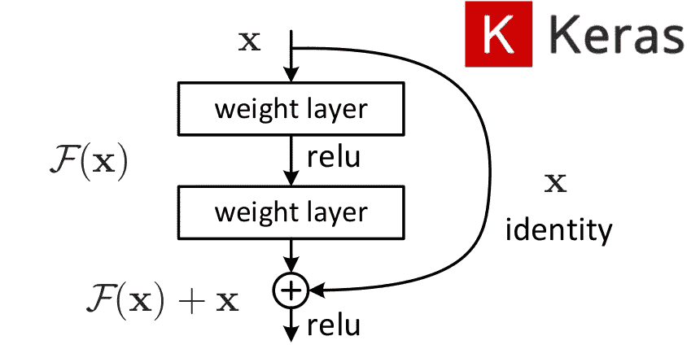
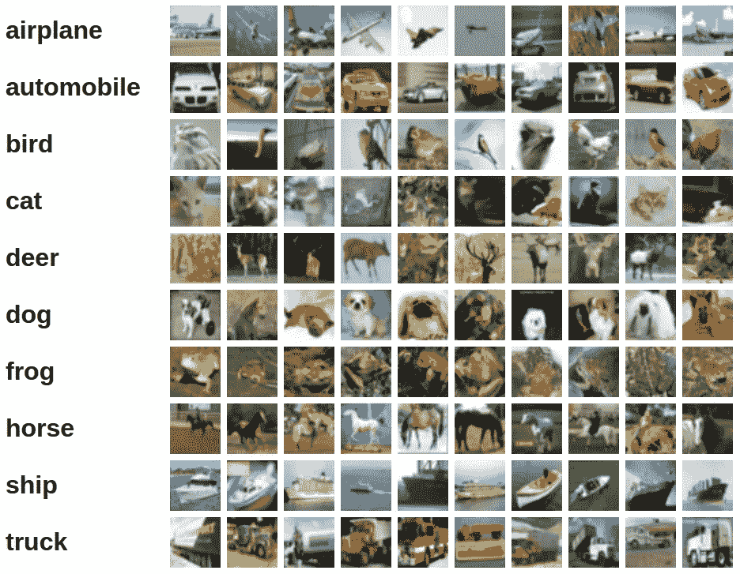
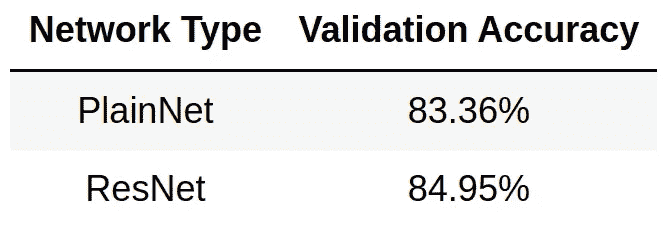

# 在喀拉斯建立一个 ResNet

> 原文：<https://towardsdatascience.com/building-a-resnet-in-keras-e8f1322a49ba?source=collection_archive---------3----------------------->

## 利用 Keras 函数 API 构造残差神经网络



# 什么是残差神经网络？

原则上，神经网络应该得到更好的结果，因为它们有更多的层。一个更深层次的网络可以学到比它更浅层次的网络所能学到的任何东西，而且(可能)不止这些。对于给定的数据集，如果网络无法通过向其添加更多图层来了解更多信息，那么它只需了解这些附加图层的身份映射。这样，它保留了前几层的信息，不会比更浅的层差。如果找不到比这更好的东西，网络至少应该能够学习身份映射。

但实际上，事情并不是这样的。更深的网络更难优化。网络每增加一层，训练的难度就会增加；我们用来寻找正确参数的优化算法变得更加困难。随着我们添加更多的层，网络得到更好的结果，直到某一点；然后，随着我们继续添加额外的层，精度开始下降。

残余网络试图通过增加所谓的*跳跃连接*来解决这个问题。上图中描绘了一个跳过连接。正如我之前所说，更深层次的网络至少应该能够学习身份映射；这就是 skip 连接所做的:它们添加从网络中的一个点到一个转发点的身份映射，然后让网络学习额外的𝐹(𝑥).如果网络没有更多可以学习的东西，那么它就将𝐹(𝑥学习为 0。原来网络比身份映射更容易学习到更接近 0 的映射。

如上图所示的具有跳跃连接的块被称为*残差块*，残差神经网络(ResNet)就是这些块的串联。

一个有趣的事实是，我们的大脑具有类似于残余网络的结构，例如，皮层第六层神经元从第一层获得输入，跳过中间层。

# Keras 函数式 API 简介

如果你正在阅读这篇文章，你可能已经熟悉了顺序类，它允许你通过一层一层地堆叠来轻松地构建神经网络，就像这样:

```
**from** keras.models **import** Sequential
**from** keras.layers **import** Dense, Activation

model **=** Sequential([
    Dense(32, input_shape**=**(784,)),
    Activation('relu'),
    Dense(10),
    Activation('softmax'),
])
```

但是这种建立神经网络的方式不足以满足我们的需求。对于顺序类，我们不能添加跳过连接。Keras 也有 Model 类，它可以和 functional API 一起使用来创建层，以构建更复杂的网络架构。
构造时，类`keras.layers.Input`返回一个张量对象。Keras 中的层对象也可以像函数一样使用，用张量对象作为参数调用它。返回的对象是一个张量，然后可以作为输入传递给另一个层，依此类推。

举个例子:

```
**from** keras.layers **import** Input, Dense
**from** keras.models **import** Model

inputs **=** Input(shape**=**(784,))
output_1 **=** Dense(64, activation**=**'relu')(inputs)
output_2 **=** Dense(64, activation**=**'relu')(output_1)
predictions **=** Dense(10, activation**=**'softmax')(output_2)

model **=** Model(inputs**=**inputs, outputs**=**predictions)
model.compile(optimizer**=**'adam',
              loss**=**'categorical_crossentropy',
              metrics**=**['accuracy'])
model.fit(data, labels)
```

但是上面的代码仍然构建了一个有序的网络，所以到目前为止还没有真正使用这种奇特的函数语法。这种语法的真正用途是在使用所谓的*合并层*时，通过它可以合并更多的输入张量。这些层的几个例子是:`Add`、`Subtract`、`Multiply`、`Average`。我们在建造剩余的积木时需要的是`Add`。

使用`Add`的例子:

```
**from** keras.layers **import** Input, Dense, Add
**from** keras.models **import** Model

input1 **=** Input(shape**=**(16,))
x1 **=** Dense(8, activation**=**'relu')(input1)
input2 **=** Input(shape**=**(32,))
x2 **=** Dense(8, activation**=**'relu')(input2)

added **=** Add()([x1, x2])

out **=** Dense(4)(added)
model **=** Model(inputs**=**[input1, input2], outputs**=**out)
```

这绝不是对 Keras functional API 的全面指导。如果你想了解更多，请参考[文件](https://keras.io/getting-started/functional-api-guide/)。

# 让我们实现一个 ResNet

接下来，为了进行比较，我们将实现一个 ResNet 和它的普通(没有跳过连接)对应物。

我们将在这里构建的 ResNet 具有以下结构:

*   形状输入(32，32，3)
*   1 个 Conv2D 层，带 64 个滤波器
*   具有 64、128、256 和 512 个滤波器的 2、5、5、2 个残差块
*   平均池 2D 层，池大小= 4
*   展平图层
*   具有 10 个输出节点的密集层

它总共有 30 个 conv+致密层。所有内核大小都是 3x3。我们在 conv 层之后使用 ReLU 激活和批处理规范化。
除了跳过连接外，普通版本是相同的。

我们首先创建一个辅助函数，它将一个张量作为输入，并向其添加 relu 和批量归一化:

```
**def** relu_bn(inputs: Tensor) **->** Tensor:
    relu **=** ReLU()(inputs)
    bn **=** BatchNormalization()(relu)
    **return** bn
```

然后我们创建一个函数来构造一个残差块。它接受一个张量`x`作为输入，并通过 2 个 conv 层；让我们把这两个 conv 层的输出称为`y`。然后把输入的`x`加到`y`，加上 relu 和批量归一化，然后返回结果张量。当参数为`downsample == True`时，第一个 conv 层使用`strides=2`将输出大小减半，我们使用输入为`x`的`kernel_size=1`的 conv 层，使其形状与`y`相同。`Add`层要求输入张量具有相同的形状。

```
**def** residual_block(x: Tensor, downsample: bool, filters: int,                                        kernel_size: int **=** 3) **->** Tensor:
    y **=** Conv2D(kernel_size**=**kernel_size,
               strides**=** (1 **if** **not** downsample **else** 2),
               filters**=**filters,
               padding**=**"same")(x)
    y **=** relu_bn(y)
    y **=** Conv2D(kernel_size**=**kernel_size,
               strides**=**1,
               filters**=**filters,
               padding**=**"same")(y)

    **if** downsample:
        x **=** Conv2D(kernel_size**=**1,
                   strides**=**2,
                   filters**=**filters,
                   padding**=**"same")(x)
    out **=** Add()([x, y])
    out **=** relu_bn(out)
    **return** out
```

`create_res_net()`函数把所有东西放在一起。以下是这方面的完整代码:

简单网络以类似的方式构建，但是它没有跳跃连接，我们也不使用`residual_block()`助手函数；一切都在`create_plain_net()`里面完成。
平原网络的代码:

# 在 CIFAR-10 上进行培训并查看结果

CIFAR-10 是一个包含 10 个类别的 32x32 rgb 图像的数据集。它包含 50k 训练图像和 10k 测试图像。
以下是每个班级 10 张随机图片的样本:



我们将在这个数据集上训练 ResNet 和 plain net 20 个时期，然后比较结果。

在配有 1 个 NVIDIA Tesla K80 的机器上，每个 ResNet 和 PlainNet 的训练时间约为 55 分钟。ResNet 和 PlainNet 在训练时间上没有显著差异。
我们得到的结果如下所示。



因此，通过在该数据集上使用 ResNet，我们在验证准确性方面获得了 **1.59%** 的提升。在更深的网络中，差异应该更大。请随意尝试，看看你得到的结果。

# 参考

1.  [用于图像识别的深度残差学习](https://arxiv.org/abs/1512.03385)
2.  [残差神经网络—维基百科](https://en.wikipedia.org/wiki/Residual_neural_network)
3.  [功能 API 指南— Keras 文档](https://keras.io/getting-started/functional-api-guide/)
4.  [模型(功能 API) — Keras 文档](https://keras.io/models/model/)
5.  [合并层— Keras 文档](https://keras.io/layers/merge/)
6.  [CIFAR-10 和 CIFAR-100 数据集](https://www.cs.toronto.edu/~kriz/cifar.html)

我希望这些信息对你有用，感谢你的阅读！

这篇文章也贴在我自己的网站[这里](https://www.nablasquared.com/building-a-resnet-in-keras/)。随便看看吧！