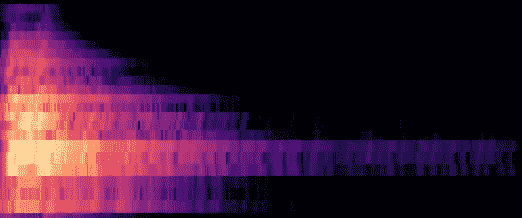
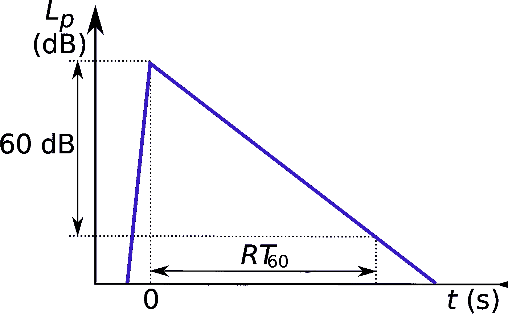
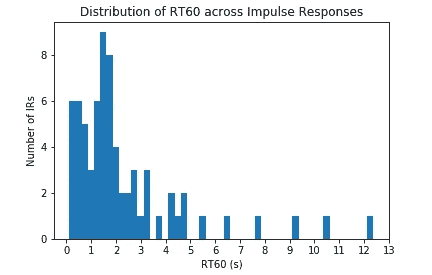
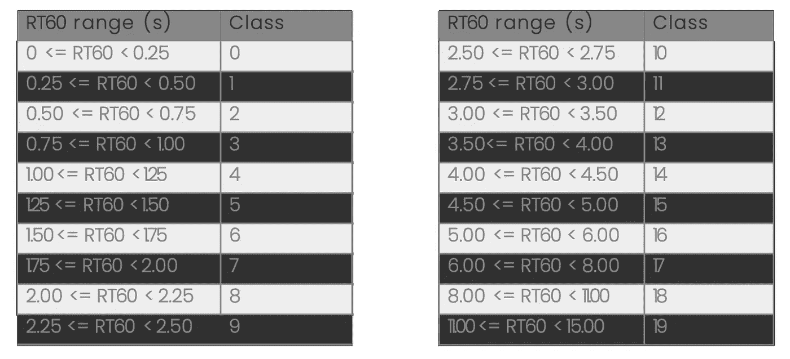
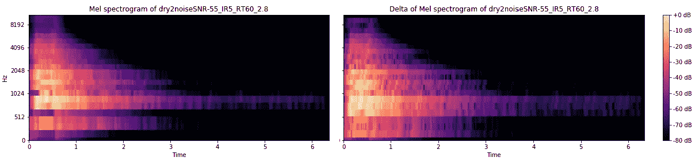
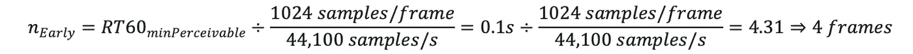
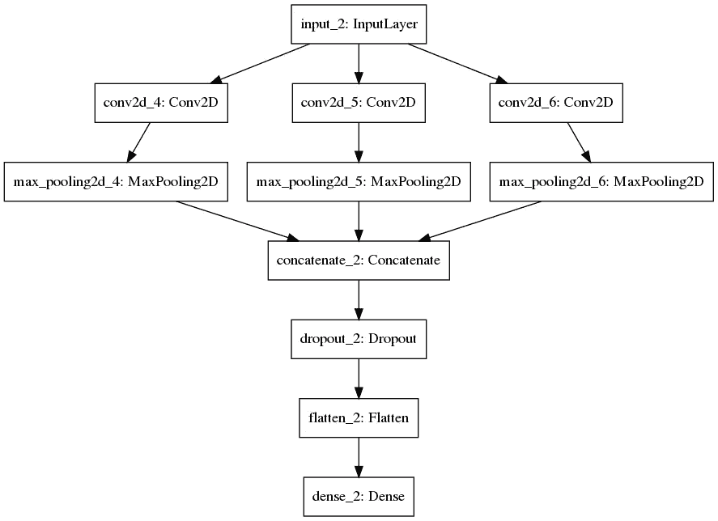
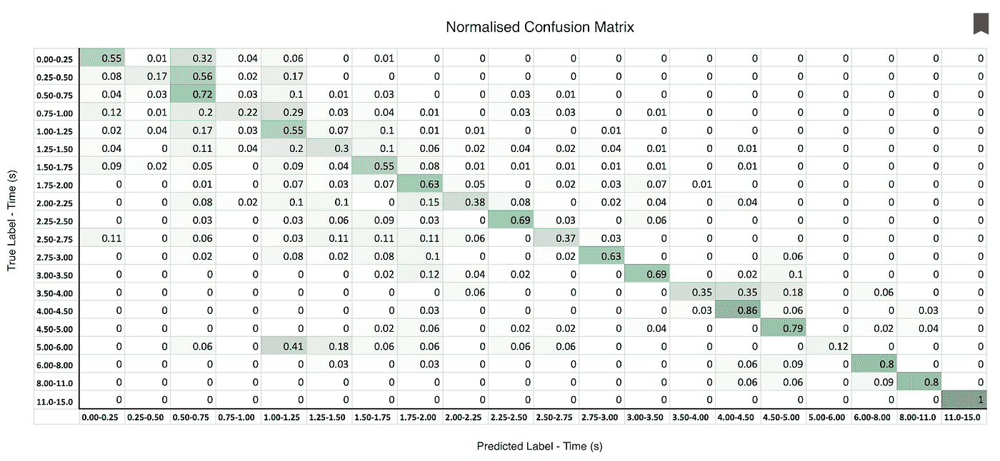

# 使用机器学习构建混响检测系统

> 原文：<https://towardsdatascience.com/building-a-reverb-detection-system-using-machine-learning-cba02a1710bf?source=collection_archive---------25----------------------->

德尔塔-梅尔光谱图

# 介绍

混响或简称混响是声学和心理声学中的一个术语，用来解释声音一旦产生后的持久性。一个例子是在一个大教堂里拍手(很有毅力)，而不是在一个铺着地毯的小房间里拍手(没有那么多毅力)。

这是由构成声音产生环境的材料的反射和吸收造成的。与石头或砖造的大教堂相比，铺着地毯、有窗帘和家具的房间会吸收更多的声音。

我们想要检测这一点的原因是，如果有人在过于混响的环境中对着手机说话或唱歌。我们可能希望能够警告进行录音的人，因为这可能会降低录制的声音质量。

这里有两个声音示例，分别演示了混响很小的录音和混响很大的录音。

混响很小。

很多混响。

我们实际上试图用我们的机器学习(ML)模型来测量的是混响衰减时间。这可以定义为声音逐渐消失所需要的时间，以秒为单位。这种情况的技术术语是 RT-60 时间，即声音的压力水平下降 60db 所需的时间。

图一。这说明了 RT-60 的衰变时间(来源:Wkipedia)。

参考上面的两段录音，第二段录音听起来像是有人在小浴室里唱歌。在浴室唱歌的效果是歌手被所有回荡的声音淹没。这是不可取的。

了解 RT-60 时间的另一个用例是，它可以作为另一个 ML 系统的输入，用于去混响信号。这种系统的一个例子可以在[1]中找到。

# 我们为什么要做这个项目？

在[艾。我们正在开发一个允许用户对着手机唱歌的系统。我们将随后使用 ML 应用音频清理过程来处理歌手的声音。清理过程的目的是使歌手的声音听起来尽可能接近专业录音室录制的声音。然而，在用真实世界的数据进行测试时，我们发现用户在有太多混响的地方录音，比如浴室。这导致音频清理过程出现不良结果，我们需要降低该过程的风险。](http://www.aimusic.co.uk)

# 我们是如何解决这个问题的？

我们提出了一个使用卷积神经网络(CNN)来解决问题的 ML 模型，其中我们设计了自己的卷积滤波器来解决问题。我们实际上采用了[2]中的模型来解决我们的问题。我们还通过脉冲响应卷积生成了自己的数据集。

# 我们用了什么数据？

我们收集了大约 4000 份人们唱歌和谈话的“干”录音。我们所说的“干燥”是指它们是在几乎没有声音反射(即混响)的环境中录制的。

我们使用“干”录音的原因是，我们可以使用不同的 RT-60 时间为每个录音人工添加混响，即我们可以给 1 号录音 1 秒的 RT-60 时间，给 2 号录音 1.1 秒的 RT-60 时间。

我们通过称为卷积的过程将人工混响添加到每个信号中。我们取一个 RT-60 时间为 1 秒的脉冲响应，并将其与“干”信号卷积，得到“湿”信号。

脉冲响应是指我们获取一个短暂的“脉冲”信号，并使其通过一个动态系统，以测量其输出，即其响应。为了捕捉音乐厅或大教堂的声学特征，我们会在空间中产生一个脉冲(我们刺破一个气球)并记录下来。一旦我们有了一个位置的脉冲响应，我们就可以用另一个录音(有人唱歌)进行卷积。这让我们能够听到他们在特定空间的声音。很酷吧？

从 OpenAIR 数据集[3]中收集了 70 个脉冲响应，我们的模型的 RT60s 从 0.24 秒到 12.3 秒不等。OpenAIR 是一个允许用户共享脉冲响应和相关声学信息的在线资源。

# 我们是如何创建数据集的？

我们将 4000 个声音记录中的每一个与所有 70 个脉冲响应进行卷积，并根据其 RT-60 时间标记每个数据点。这给了我们总共 280，000 个不同 RT-60 时间的记录。

为了模拟真实的背景噪声，我们还在每个记录中随机添加了信噪比为-55db 和-45db 的粉红噪声。

我们为所有 RT-60 时间创建了分类箱，这允许我们将它们分成 20 个不同的类。图 2 显示了 RT-60 时间的分布，表 1 描述了如何将它们放置到时间仓中。

图 2:所用数据集中的 RT-60 时间分布。

表 1:用于 RT-60 分类器的时间仓。

# 特征抽出

接下来，我们必须提取相关特征，以获得音频的良好表示。我们最初选择使用 Mel 声谱图，因为这些声谱图很好地代表了声音的音色。

音色可以描述为声音的颜色。如果我在钢琴上弹奏一个中 C 音，然后在吉他上弹奏相同的音，它们的音高相同，但听起来不同。这种声音上的差异就是音色。

Mel 光谱图看起来像图 3 的左侧。

图 3:同一声音的 Mel 声谱图和 delta-Mel 声谱图。

我们可以清楚地看到声音随着时间的推移而衰减。尾巴最长的部分在 3-6 秒。

在我们的特殊情况下，我们没有使用标准的 Mel 光谱图进行训练，而是使用 delta-Mel 光谱图。Delta-Mel 频谱图是音色随时间变化的微分或轨迹。我们认为这将更好地呈现应用于每个人声的不同 RT-60 时间。

图 3 右手侧示出了δ-Mel 谱图。你可以看到 delta-Mel 谱图中出现的视觉信息比 Mel 谱图中多得多。

一旦所有这些特征都被提取出来，我们需要把它们提供给 CNN 进行训练。我们用于特征提取的参数如下。参数:M = 40 个梅尔频带，N = 2381 帧，𝑓s = 44.1，1024 样本/帧，布莱克曼-哈里斯窗口，2048 样本 FFT 大小，1024 样本跳跃大小。

# ML 模型

如前所述，我们使用 CNN 作为我们的 ML 模型，因为这种类型的 ML 模型已经被证明在音频和图像分类上都是有效的。我们使用了[2]中提出的滤波器模型，但是我们根据我们的问题调整了尺寸。

E-net 滤波器模拟对应于早期反射的时间特征:

R-net 滤波器对与可接受的记录反射相对应的时间特征进行建模:

T-net 滤波器模拟对应于混响尾音中较长反射的时间特征:

3 个卷积层与 ReLU 激活功能并行放置(E-Net、R-Net、T-Net)。e 网、r 网、t 网由 1 × 𝑛滤波核组成，其中𝑛从短到长变化。

接下来是内核大小为 4 x N 的 3 个最大池层、1 个平坦层和 1 个丢弃层，丢弃概率为 50%，以避免过度拟合。

最后，有一个具有 20 路软最大激活函数的密集层对应于我们的类。

分类交叉熵被选为损失函数。Adam 是最乐观的，初始学习率为 0.01，在每个时期递减 0.1。

选择 80%训练/ 10%验证/ 10%测试分割，通过 10 重交叉验证来评估模型。该模型如图 4 所示。

图 Keras 中 RT-60 估算模型的图示。

# 结果

结果显示该模型对于更长的 RT-60 时间是最有效的，而当我们具有更短的时间时会有些混乱。结果可以在图 5 中看到

图 5:用于测试数据的 RT-60 估计模型的标准化混淆矩阵。

# 结论

结果是令人鼓舞的，我们设计的系统的精确度相差不远。然而，我们肯定可以做更多的事情来改进模型，例如数据集分布。

我们发现我们使用的过滤器类型非常有效，并且通过使用 delta-Mel 光谱图，我们得到了略微更好的结果。我们计划在一个更复杂的去混响模型中使用模型来通知所需的 RT-60 时间估计，该模型用于我们在 [AI 的另一个正在进行的项目。音乐](http://www.aimusic.co.uk)。如果你想了解更多我们的工作，请查看我们的时事通讯(【https://www.aimusic.co.uk/newsletter-sign-up】T2)。

# 参考

[1] —吴，博等，“一种基于深度神经网络的混响时间感知语音去混响方法”(2016)，IEEE/ACM 音频、语音和语言处理汇刊。

[2] — Pons，j .和 Serra，x .，“利用卷积神经网络设计用于建模时间特征的高效架构”(2017)，声学、语音和信号处理国际会议(ICASSP)。

[3] — Murphy，Damian T .和 Shelley，Simon，“OpenAIR:交互式听觉化网络资源和数据库”(2010)，音频工程学会第 129 次会议(AES)。

# 感谢

非常感谢方大卫(【https://www.linkedin.com/in/davidwengweifong/】)为这个项目付出的努力。