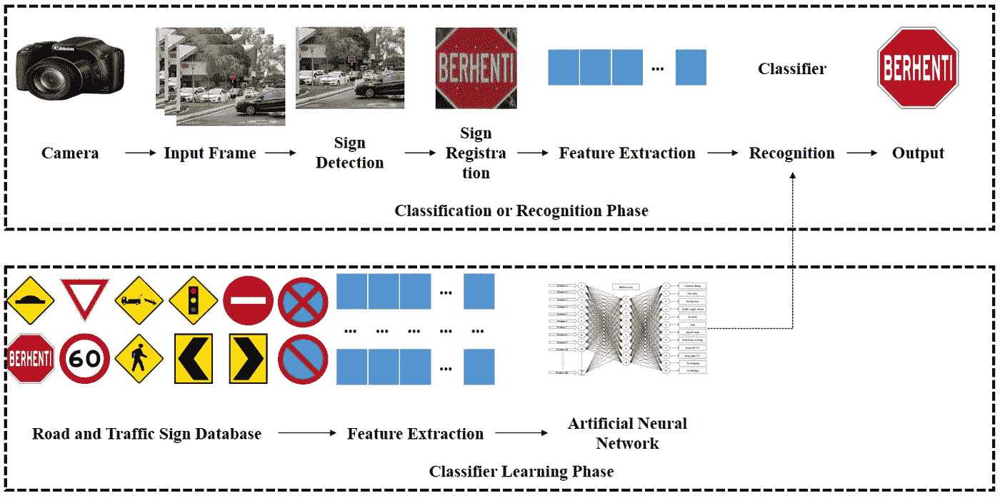
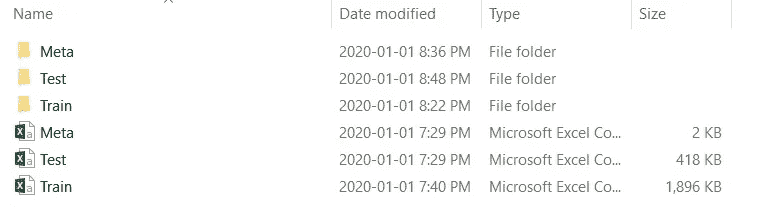
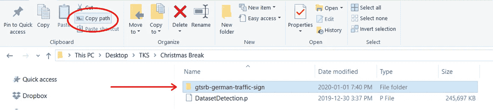
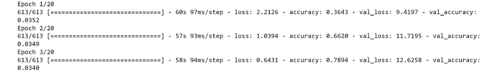
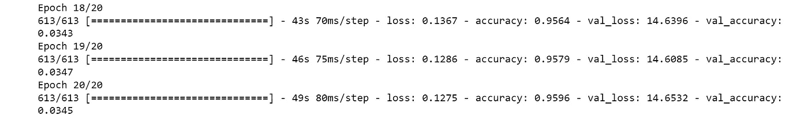

# 在 Keras 中构建路标分类器

> 原文：<https://towardsdatascience.com/building-a-road-sign-classifier-in-keras-764df99fdd6a?source=collection_archive---------8----------------------->

## 编写一个 CNN，在 Keras 框架中对超过 43 种类型的路标进行分类



路标分类过程([来源](https://www.mdpi.com/symmetry/symmetry-09-00138/article_deploy/html/images/symmetry-09-00138-g003.png)

有这么多不同类型的交通标志，每一种都有不同的颜色、形状和大小。有时，有两个标志可能有相似的颜色，形状和大小，但有两个完全不同的含义。我们究竟怎样才能给计算机编程序来正确分类道路上的交通标志呢？我们可以通过创建自己的 CNN 来为我们分类不同的路标。

## 下载数据

在本教程中，我们将使用 GTSRB 数据集，该数据集包含超过 50，000 张德国交通标志的图像。共有 43 个类别(43 种不同类型的标志，我们将对其进行分类)。单击下面的链接下载数据集。

[](https://www.kaggle.com/meowmeowmeowmeowmeow/gtsrb-german-traffic-sign) [## GTSRB -德国交通标志识别基准

### 多类别、单图像分类挑战

www.kaggle.com](https://www.kaggle.com/meowmeowmeowmeowmeow/gtsrb-german-traffic-sign) 

当你在电脑中打开数据集时，数据集内应该有 6 个路径(3 个文件夹和 3 个电子表格)，如下所示。



***meta*** 文件夹应该有 43 个不同的图像(范围从 0-42)。 ***测试*** 文件夹就是一堆测试图片。 ***train*** 文件夹应该有 43 个文件夹(范围也是从 0 到 42)，每个文件夹包含各自类别的图像。

现在您已经有了数据集，并且数据集包含了所有需要的数据，让我们开始编码吧！

本教程将分为 3 个部分: ***加载数据*** ， ***建立模型*** 和 ***训练模型*** 。

不过在开始之前，请确保您的计算机上安装了 Jupiter 笔记本，因为本教程是在 Jupiter 笔记本上完成的(这可以通过安装 Anaconda 来完成。点击下面的链接安装 Anaconda。)

[](https://www.anaconda.com/distribution/) [## Anaconda Python/R 发行版-免费下载

### 开源的 Anaconda 发行版是在…上执行 Python/R 数据科学和机器学习的最简单的方法

www.anaconda.com](https://www.anaconda.com/distribution/) 

# 加载数据

好了，现在我们已经安装了 Jupyter 笔记本，也安装了数据集，我们准备开始编码了(Yesss)！

首先，让我们导入加载数据所需的库和模块。

```
import pandas as pd
import numpy as np
import os
import cv2
import matplotlib.pyplot as plt
import randomimport tensorflow as tf
from tensorflow.keras.models import Sequential
from tensorflow.keras.layers import BatchNormalization
from tensorflow.keras.layers import Conv2D
from tensorflow.keras.layers import MaxPooling2D
from tensorflow.keras.layers import Activation
from tensorflow.keras.layers import Flatten
from tensorflow.keras.layers import Dropout
from tensorflow.keras.layers import Dense
from tensorflow.keras.utils import to_categorical
from tensorflow.keras.preprocessing.image import ImageDataGenerator
from tensorflow.keras.optimizers import Adam
```

第一束是创建 ***load_data*** 函数所需的库。第二组是我们构建模型所需要的东西。如果您愿意，可以在不同的内核中导入每个束，但这真的无关紧要。

## 创建 L *oad_Data* 函数

要开始加载数据，让我们创建一个变量来表示数据集的存储位置。确保你把字母 ***r*** 放在你的路径字符串前面，这样你的计算机就知道它应该**读**这个字符串。

注意:我的道路将与你的不同。要获得数据集的路径，您应该转到数据集所在的文件夹，单击一次数据集(不要打开它，只要让您单击它)，然后单击屏幕左上角的按钮 ***复制路径***



不要双击数据文件夹，只需单击一次将其高亮显示

然后把路径粘贴到你的 jupyter 笔记本上(就像我下面做的那样)。确保你在你的字符串前面加了一个 ***r*** ，这样 pc 就知道它应该读取这个文件了。

```
data_path = r"D:\users\new owner\Desktop\Christmas Break\gtsrb-german-traffic-sign"
```

接下来，让我们定义将数据从计算机加载到笔记本中的函数。

```
def load_data(dataset):
    images = []
    classes = [] rows = pd.read_csv(dataset)
    rows = rows.sample(frac=1).reset_index(drop=True)
```

我们的***load _ data****函数取 1 个参数，这是我们数据集的路径。之后，我们定义两个列表， ***图片*** 和 ***类*** 。 ***图像*** 列表将存储图像数组，而 ***类*** 列表将存储每个图像的类编号。*

*在下一行中，我们将打开 CSV 文件。*

*最后一行使我们的数据随机化，这将防止模型过度适应特定的类。*

```
 *for i, row in rows.iterrows():
        img_class = row["ClassId"]
        img_path = row["Path"] image = os.path.join(data, img_path)*
```

*for 循环遍历所有行。 ***。iterrows()*** 函数为每一行返回一个索引(第一行是 0，然后是 1，2，3，…)。直到最后一行)。*

*我们从 ***ClassId*** 列获取图像的类，从 ***路径*** 列获取图像数据。*

*最后，我们从电子表格中获取图像的路径，并将其与数据集的路径相结合，以获得图像的完整路径*

```
 *image = cv2.imread(image)
        image_rs = cv2.resize(image, (img_size, img_size), 3) R, G, B = cv2.split(image_rs) img_r = cv2.equalizeHist(R)
        img_g = cv2.equalizeHist(G)
        img_b = cv2.equalizeHist(B) new_image = cv2.merge((img_r, img_g, img_b))*
```

*首先，我们读取图像数组(将它从数字数组转换成实际的图片，以便我们可以调整它的大小)。然后，我们将图像尺寸调整为 32 X 32 X 3，(如果所有图像的尺寸都相同，那么训练模型的速度会更快)。*

*接下来的 5 行执行直方图均衡，这是一种提高图像对比度的均衡技术。如果您有兴趣了解直方图均衡化的更多信息，请单击此处的*

***注意**:这段代码仍然在前面代码块的 for 循环中*

```
 *if i % 500 == 0:
            print(f"loaded: {i}") images.append(new_image)
        classes.append(img_class) X = np.array(images)
    y = np.array(images)

    return (X, y)*
```

*仍然在 for 循环中，我们将编写一个 if 语句，打印我们已经加载了多少图像。这条语句将每 500 幅图像打印一次，只是为了让我们知道我们的函数实际上在工作。*

*接下来，我们将刚刚从数据集中提取的图像添加到之前定义的列表中。*

*现在在 for 循环之外，我们将把 ***图像*** 和 ***类*** 列表重新定义为 Numpy 数组。这是为了我们以后可以在阵列上执行操作。*

*最后，当我们从数据集中提取完所有图像后，我们将返回元组中的 ***图像*** 和 ***类*** 列表。*

## *定义超参数*

*超参数是神经网络无法学习的参数。它们必须由程序员在培训前明确定义*

```
*epochs = 20
learning_rate = 0.001
batch_size = 64*
```

*我们的第一个超参数(我会用缩写 HYP)， ***epochs*** ，告诉神经网络应该完成多少次完整的训练过程。在这种情况下，神经网络将训练自己 20 次(检查所有 50，000 张图像，并用 12，000 张测试图像验证自己 20 次)！*

*学习率告诉我们每次会更新多少权重。学习率往往在 0 到 1 之间。*

*批量大小告诉我们神经网络将一次循环通过多少图像。计算机不可能一次循环通过所有 50，000 张图像，它会崩溃的。这就是为什么我们有批量大小。*

## *载入数据*

```
*train_data = r"D:\users\new owner\Desktop\TKS\Christmas Break\gtsrb-german-traffic-sign\Train.csv"
test_data = r"D:\users\new owner\Desktop\TKS\Christmas Break\gtsrb-german-traffic-sign\Test.csv"(trainX, trainY) = load_data(train_data)
(testX, testY) = load_data(test_data)*
```

*首先，我们将定义测试和训练数据集的路径，使用我们以前用来定义数据集路径的相同方法*

*现在，我们将使用我们的 ***load_data*** 函数加载训练和测试数据。*

*我们将把 ***图片*** 列表存储在变量*中，把 ***类*** 列表存储在 ***trainY*** 变量中，并对***【testX】***和 ***testY 进行同样的操作。*****

****注意**:这一步可能需要一段时间，取决于你电脑的规格。我的花了 10-15 分钟。**

## **为培训准备数据**

```
**print("UPDATE: Normalizing data")
trainX = train_X.astype("float32") / 255.0
testX = test_X.astype("float32") / 255.0print("UPDATE: One-Hot Encoding data")
num_labels = len(np.unique(train_y))
trainY = to_categorical(trainY, num_labels)
testY = to_categorical(testY, num_labels)class_totals = trainY.sum(axis=0)
class_weight = class_totals.max() / class_totals**
```

**现在我们要对数据进行归一化处理。这使得我们可以将数据中的值缩小到 0 到 1 之间，而之前的值在 0 到 255 之间。**

**接下来，我们将**一次性编码**测试和训练标签。本质上，一键编码是用二进制值(1 和 0)而不是分类值(“红色”或“蓝色”)来表示每个类的一种方式。这是通过创建一个主对角线为 1，其余值为 0 的对角矩阵来实现的。矩阵的维数等于类的数量(如果有 20 个类，则矩阵是 20×20 的矩阵)。在矩阵中，每行代表一个不同的类，因此每个类都有其唯一的代码。如果你想了解更多关于一键编码的知识，[这里有](https://machinelearningmastery.com/why-one-hot-encode-data-in-machine-learning/)一个很好的资源**

**最后，我们将通过给每个等级分配一个权重来说明等级中的不平等。**

# **构建模型**

**现在是时候构建实际的 CNN 架构了。首先，让我们导入必要的库和模块:**

```
**import tensorflow as tf
from tensorflow.keras.models import Sequential
from tensorflow.keras.layers import BatchNormalization
from tensorflow.keras.layers import Conv2D
from tensorflow.keras.layers import MaxPooling2D
from tensorflow.keras.layers import Activation
from tensorflow.keras.layers import Flatten
from tensorflow.keras.layers import Dropout
from tensorflow.keras.layers import Dense**
```

**这里，我们导入 Tensorflow，这是 Python 中的一个框架，允许我们构建 ML 模型，我们从 Tensorflow 导入 Keras，这进一步简化了我们的模型！之后，我们导入一系列不同的图层来构建模型。如果你想了解更多关于这些层的具体功能，请浏览我在 CNN 上的文章。**

**[](/a-simple-guide-to-convolutional-neural-networks-751789e7bd88) [## 卷积神经网络的简单指南

### 卷积神经网络揭秘没有任何花哨的技术术语！

towardsdatascience.com](/a-simple-guide-to-convolutional-neural-networks-751789e7bd88) 

在我们开始构建模型之前，我想指出没有“合适的”方法来构建模型。你的 CNN 没有固定的层数、尺寸或层数类型。你应该试着用它来看看哪一个能给你最好的准确度。我给你一个最准确的。

```
class RoadSignClassifier:
    def createCNN(width, height, depth, classes):
        model = Sequential()
        inputShape = (height, width, depth)
```

这一次，我们要创建一个类，名为***RoadSignClassifier***(任何名字都可以)。在该类中，有一个函数， ***createCNN，*** 接受 4 个参数。我们将使用顺序 API，它允许我们逐层创建模型。

```
 model.add(Conv2D(8, (5, 5), input_shape=inputShape,      activation="relu"))
        model.add(MaxPooling2D(pool_size=(2, 2)))
```

这是我们的第一个卷积层。我们定义了输出的维度(8 X 8 X 3)，并使用了激活函数“relu”。我们继续使用 Conv2D — MaxPooling2D 序列 2 次以上。

```
 model.add(Conv2D(16, (3, 3), activation="relu"))
        model.add(BatchNormalization())
        model.add(Conv2D(16, (3, 3), activation="relu"))
        model.add(BatchNormalization())
        model.add(MaxPooling2D(pool_size=(2, 2)))

        model.add(Conv2D(32, (3, 3), padding="same", activation="relu"))
        model.add(BatchNormalization())
        model.add(Conv2D(32, (3, 3), padding="same", activation="relu"))
        model.add(BatchNormalization())
```

和上次一样，除了这次我们包括**批量归一化。**只是加速训练而已。

```
 model.add(Flatten())
        model.add(Dropout(0.5))
        model.add(Dense(512, activation="relu")) model.add(Dense(classes, activation="softmax"))
        return model
```

现在，我们展平最终卷积层的输出，执行一次丢弃，然后进入最终的密集层。最终密集层的输出等于我们拥有的类的数量。

这基本上就是构建模型的全部内容。是时候继续前进了！

# 训练模型

现在是有趣的部分(实际上这是我们必须等待 30 分钟模型训练 lol 的部分)。是时候训练我们的模型识别路标了！

```
data_aug = ImageDataGenerator(
rotation_range=10,
zoom_range=0.15,
width_shift_range=0.1,
height_shift_range=0.1,
shear_range=0.15,
horizontal_flip=False,
vertical_flip=False)
```

在这里，我们正在执行**数据增强**。数据扩充在我们的数据集中创建图像的修改版本。它允许我们向数据集添加图像，而无需我们收集新的图像。在 Keras 中，我们使用***imagedata generator***模块来执行数据扩充。

```
model = RoadSignClassifier.createCNN(width=32, height=32, depth=3, classes=43)
optimizer = Adam(lr=learning_rate, decay=learning_rate / (epochs))
```

第一行定义了我们的模型。我们使用类 ***RoadSignClassifier，*** 并定义类的宽度、高度、深度和数量。

在第二行中，我们创建了我们的优化器，在本例中是 **Adam** 优化器。我们将学习率初始化为之前设置的值(0.001)，我们还将学习率设置为在每个时期减少(这是 [**衰减**](https://machinelearningmastery.com/how-to-reduce-overfitting-in-deep-learning-with-weight-regularization/) 参数，它减少了过度拟合)。

```
model.compile(optimizer=optimizer, loss="categorical_crossentropy", metrics=["accuracy"])fit = model.fit_generator(
    data_aug.flow(train_X, trainY, batch_size=batch_size), 
    epochs=epochs,
    validation_data=(test_X, testY),
    class_weight=class_weight,
    verbose=1)
```

第一行编译模型。我们创建模型并定义优化器、损失和时期数。

在第二行，我们装配模型(这是培训发生的地方)。我们的***data _ aug . flow***方法对我们之前定义的图像应用增强。 ***历元的数量*** 被设置为 20。对于**验证数据**，我们使用我们的测试数据。 **verbose** 被设置为 1，这意味着 Keras 将在您进行训练时显示模型的进度。

现在，您已经完成了模型代码的编写。是时候运行它了。运行一段时间后，您应该会得到如下输出:



前三个时期(在第三个时期，您的准确度应该是 70–80%)

然后，在您完成了所有的 epochs 之后，您应该会得到类似如下的输出:



最后三个纪元(你的准确率应该超过 90%)

你的准确率至少要达到 **90%。**如果没有，就去玩玩模型架构。最终，您的模型将返回大约 90%或更高的准确率。

# 酷！

现在你完成了你的分类器！感觉不错吧！好了，今天就到这里。希望你从这篇文章中学到了一些东西！如果你遇到什么困难，可以发邮件到 nushainef@gmail.com 给我，我会尽力帮助你。祝你的 ML 之旅好运。

# 其他很好的选择

如果这个教程对你没有吸引力，或者你只是在寻找另一个教程，这里有另一个很棒的教程，我发现它真的很有用！

[](https://www.pyimagesearch.com/2019/11/04/traffic-sign-classification-with-keras-and-deep-learning/) [## 基于 Keras 和深度学习的交通标志分类——PyImageSearch

### 在本教程中，您将学习如何训练自己的交通标志分类器/识别器能够获得 95%以上的…

www.pyimagesearch.com](https://www.pyimagesearch.com/2019/11/04/traffic-sign-classification-with-keras-and-deep-learning/)**