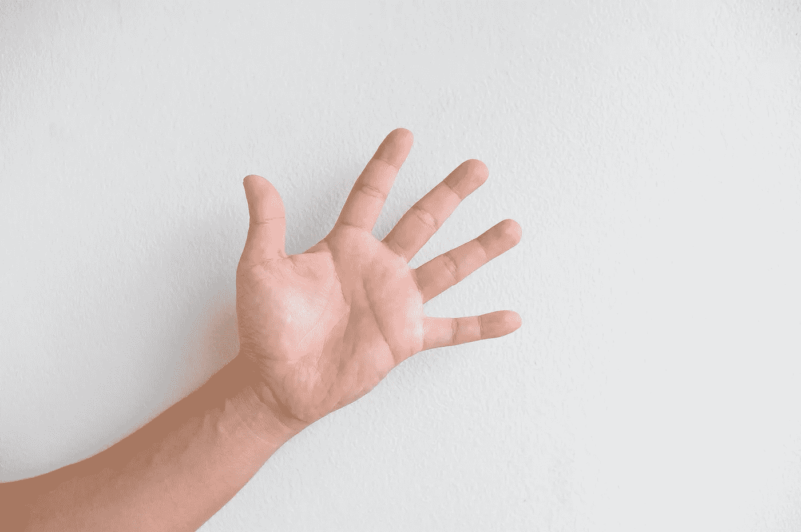
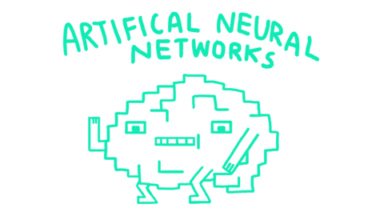
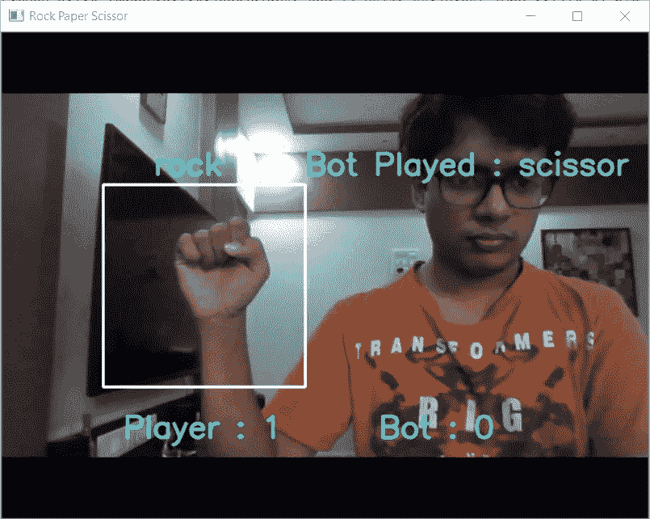

# 使用 Tensorflow 和 OpenCV 与 Python 构建石头剪刀布人工智能

> 原文：<https://towardsdatascience.com/building-a-rock-paper-scissors-ai-using-tensorflow-and-opencv-d5fc44fc8222?source=collection_archive---------18----------------------->

## 古老的游戏被重新想象和更新……


*图片由* [*EsquireME*](https://www.esquireme.com/content/20945-how-to-win-at-rock-paper-scissors)

> 该项目的代码可以在我的 [Github](https://github.com/HOD101s/RockPaperScissor-AI-) 找到

[](https://github.com/HOD101s/RockPaperScissor-AI-) [## HOD101s/RockPaperScissor-AI-

### 这个回购是针对初学者谁想要尝试和建立自己的机器人容易。所以让我们开始吧！任何…的基础

github.com](https://github.com/HOD101s/RockPaperScissor-AI-) 

# 简介:

这个项目的基础是实验深度学习和图像分类，目的是建立一个简单而有趣的臭名昭著的石头剪刀布游戏的迭代。首先，我想说这个项目是我在 5 月份的 COVID19 隔离期间无聊的产物，希望在你读到这封信的时候，一切都恢复正常了。通过这个解释的过程，我的目的是解释这个项目的基础，以简单的术语面向初学者。让我们开始吧...

在构建任何类型的深度学习应用时，都有三个主要步骤:

1.收集和处理数据

2.建立一个合适的人工智能模型

3.部署使用

整个项目涉及并与我的 [Github repo](https://github.com/HOD101s/RockPaperScissor-AI-) 齐头并进，所以请做好准备以供参考。

# 收集我们的数据:



图片由 [Sookyung An](https://pixabay.com/users/SookyungAn-6281801/?utm_source=link-attribution&amp;utm_medium=referral&amp;utm_campaign=image&amp;utm_content=2704015) 来自 [Pixabay](https://pixabay.com/?utm_source=link-attribution&amp;utm_medium=referral&amp;utm_campaign=image&amp;utm_content=2704015)

任何深度学习模型的基础都是**数据**。任何机器学习工程师都会同意，在 ML 中，**数据远比算法本身更重要。我们需要收集石头、布、剪刀这些符号的图像。我没有下载别人的数据并在上面进行训练，而是制作了自己的数据集，并鼓励大家也建立自己的数据集。稍后，尝试更改数据并重新训练模型，以查看数据对深度学习模型的严重影响。**

我已经使用 Python 的 OpenCV 库进行了所有与相机相关的操作。所以这里的*标签*也是指图片属于什么类 ie。RPS，根据标签，图像保存在适当的目录中。 *ct* 和 *maxCt* 是保存图像的起始和结束索引。剩下的是标准的 OpenCV 代码，以获取网络摄像头的饲料和保存图像到一个目录。一个**需要注意的关键点**是我所有的图片都是 **300 x 300 尺寸**。运行后，我的目录树看起来像这样。

```
C:.
├───paper
    │ paper0.jpg
    │ paper1.jpg
    │ paper2.jpg
│
├───rock
    │ rock0.jpg
    │ rock1.jpg
    │ rock2.jpg
│
└───scissor
     scissor0.jpg
     scissor1.jpg
     scissor2.jpg
```

如果你是指 [Github repo](https://github.com/HOD101s/RockPaperScissor-AI-) getData.py 为你做的工作！！

# 预处理我们的数据:

计算机理解数字，我们有图像供我们使用。因此，我们将把所有的图像转换成它们各自的矢量表示。此外，我们的标签尚未生成，因为已建立的标签不能是文本，所以我已经使用 *shape_to_label* 字典为每个类手动构建了 **One-Hot-Encoded** 表示。

由于我们已经根据类别将图像保存在目录中，因此目录名用作标签，并使用 *shape_to_label* 字典将其转换为一键显示。接下来，我们遍历系统中的文件来访问图像，[*cv2 . imread()*](https://www.geeksforgeeks.org/python-opencv-cv2-imread-method/)*函数返回图像的矢量表示。我们通过翻转图像和放大图像来手动增加数据。这增加了我们的数据集大小，而无需拍摄新照片。数据扩充是生成数据集的关键部分。最后，图像和标签存储在单独的 numpy 数组中。*

*更多关于数据扩充的信息请点击。*

# *用迁移学习构建我们的模型:*

*当涉及到处理图像数据时，有许多预先训练好的模型可用，这些模型已经在数据集上进行了训练，这些数据集有数千个标签可供我们使用，这要感谢 Tensorflow 和 Keras 通过它们的[应用程序 api](https://www.tensorflow.org/api_docs/python/tf/keras/applications) 分发了这些模型。这使得在我们的应用程序中包含这些预先训练好的模型变得轻而易举！*

**

*图片来自[洛伦佐·法米格里尼](https://mc.ai/transfer-learning-with-deep-learning-machine-learning-techniques/)*

*简言之，迁移学习采用预先训练的模型，不包括做出最终预测的最终层，从而留给我们模型的强大部分，该部分可以区分这种情况下图像中的特征，并将这些信息传递给我们自己的密集神经网络。*

*为什么不训练自己的模型？这完全取决于你！！然而，使用迁移学习可以在很多时候让你的进步更快，从某种意义上说，你可以避免*重新发明轮子*。*

*其他一些受欢迎的预培训模型:*

*   *InceptionV3*
*   *VGG16/19*
*   *雷斯内特*
*   *MobileNet*

*这里有一篇关于迁移学习的有趣的[文章](https://ruder.io/transfer-learning/)！*

*注意:每当我们处理图像数据时，数据卷积神经层的使用几乎是已知的。这里使用的迁移学习模型有这些层次。欲了解 CNN[的更多信息，请访问](https://medium.com/@RaghavPrabhu/understanding-of-convolutional-neural-network-cnn-deep-learning-99760835f148)。*

# ***实现:***

**

*gif by [Gifer](https://gifer.com/)*

*我已经使用 DenseNet121 模型进行特征提取，其输出最终将输入到我自己的密集神经网络中。*

***要点:***

*   *由于我们的图像是 300x300，指定的输入形状是相同的。额外的 3 代表 RGB 层，因此这一层有足够的神经元来处理整个图像。*
*   *我们使用 DenseNet 层作为我们的基础/第一层，然后是我们自己的密集神经网络。*
*   *我已经将可训练参数设置为真，这也将重新训练 DenseNet 的重量。这给了我更好的结果，虽然 twas 相当耗时。我建议在您自己的实现中，通过更改这些参数(也称为超参数)来尝试不同的迭代。*
*   *因为我们有 3 个类石头剪子布，最后一层是一个密集层，有 3 个神经元和 softmax 激活。*
*   *这最后一层返回图像属于 3 个类别中的特定类别的概率。*

*如果你指的是 [GitHub repo](https://github.com/HOD101s/RockPaperScissor-AI-) train.py 负责数据准备和模型训练！*

*至此，我们已经收集了数据，构建并训练了模型。剩下的唯一部分是使用 OpenCV 进行部署。*

# *OpenCV 实现:*

*这个实现的流程很简单:*

*   *启动网络摄像头并读取每一帧*
*   *将此帧传递给分类 ie 模型。预测类别*
*   *用电脑随机移动*
*   *计算分数*

*上面的代码片段包含了相当重要的代码块，剩下的部分只是让游戏更加用户友好，RPS 规则和得分。*

*所以我们从加载我们训练好的模型开始。接下来是石器时代的 for-loop 实现，在开始程序的预测部分之前显示倒计时。预测之后，分数会根据玩家的移动进行更新。*

**

*图片由[马纳斯·阿查里亚](https://medium.com/@manasbass.99)*

*我们使用 *cv2.rectangle()显式绘制一个目标区域。*在使用 *prepImg()* 函数进行预处理后，只有这部分帧被传递给模型进行预测。*

*完整的 play.py 代码可以在我的回购协议上的[这里](https://github.com/HOD101s/RockPaperScissor-AI-/blob/master/play.py)获得。*

# *结论:*

*我们已经成功地实施并理解了这个项目的运作。所以继续前进，分叉我的[实现](https://github.com/HOD101s/RockPaperScissor-AI-)并进行试验。一个主要的改进可能是增加手部检测，这样我们就不需要明确地绘制目标区域，模型将首先检测手部位置，然后做出预测。我尽量让我的语言对初学者友好，如果你还有任何问题，请发表评论。我鼓励你改进这个项目，并把你的建议发给我。精益求精！*

*[](https://www.linkedin.com/in/manas-acharya/) [## Manas Acharya -机器学习工程师- KubixSquare | LinkedIn

### 机器学习和数据科学爱好者，曾在前端 Web 领域担任全栈开发人员…

www.linkedin.com](https://www.linkedin.com/in/manas-acharya/) [](https://medium.com/@manasbass.99/facemask-detection-using-tensorflow-and-opencv-824b69cad837) [## 基于 Tensorflow 和 OpenCV 的人脸检测

### 有效的实时面具检测。

medium.com](https://medium.com/@manasbass.99/facemask-detection-using-tensorflow-and-opencv-824b69cad837)*