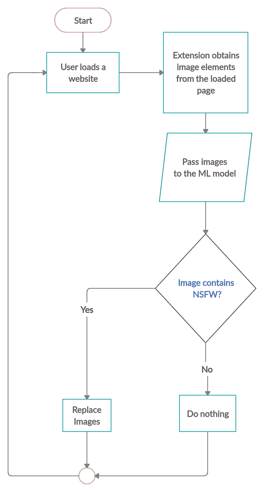

# 为每个使用人工智能的人建立一个更安全的互联网

> 原文：<https://towardsdatascience.com/building-a-safer-internet-for-everyone-using-ai-175df5e02cee?source=collection_archive---------39----------------------->

## 使用 TensorFlow JS 构建的 web 扩展过滤 NSFW 图像。

来自 [Pexels](https://www.pexels.com/photo/woman-in-white-long-sleeve-shirt-using-silver-laptop-computer-3784324/?utm_content=attributionCopyText&utm_medium=referral&utm_source=pexels) 的 Andrea Piacquadio 的照片

*本项目使用的所有源代码都可以在* [***这里***](https://github.com/navendu-pottekkat/nsfw-filter) *。*

互联网是一个未经过滤的地方。当你随意浏览你的订阅源时，没有人能保证你会偶然发现什么。

即使在互联网上不起眼的地方，你也可能偶然发现不合适的或“不适合工作”的图片。

这让我想到了一个可以从网上过滤掉这些内容的解决方案。有几点需要考虑:

*   所有的图像应该从用户加载的网站进行监控。
*   应该在不离开客户机的情况下处理图像。
*   它应该很快，应该在所有网站上工作。
*   它应该是开源的。

[**解？**](https://github.com/navendu-pottekkat/nsfw-filter) 一个 web 扩展，它会检查页面中加载的图像是否是 NSFW 的，并且只在发现它们是安全的情况下才显示它们。

# 输入 NSFW 滤波器

[**NSFW 过滤器**](https://github.com/navendu-pottekkat/nsfw-filter) 是一个 web 扩展，目前运行在 Chrome 和 Firefox 上，使用机器学习来过滤 NSFW 图像。

[nsfwjs](https://github.com/infinitered/nsfwjs) 模型用于检测加载图像的内容。该模型被训练用于检测 NSFW 图像的唯一目的。

使用这个已经优化为在浏览器上运行的模型，我们构建了一个扩展，它可以读取浏览器中加载的网页中的图像，并且只在发现它们是安全的情况下才使它们可见。

# 开源开发模式

NSFW 过滤器是完全开源的，它将永远是。

我们有一份来自世界各地的优秀贡献者名单，我们将继续改进它并添加更多功能。

因为这样的产品还不存在，所以可能会有更多的改进空间和功能，而这些肯定是当前团队完全忽略的。

因此，我们将它发布到野外，并开始接受来自世界各地具有广泛想法的开发人员的贡献。

现在，我们有了第一个版本。

# 它是如何在引擎盖下工作的

当一个网页被加载时，该扩展选择页面上加载的所有图像，并对用户隐藏这些图像。

这些图像然后由机器学习模型检查，该模型将检测 NSFW 内容。

如果图像被发现**而不是**具有 NSFW 内容，那么它们是可见的。**NSFW 的图像仍然隐藏着。**

NSFW 滤波的基本工作流程

# 用例

该扩展的用途很广泛。无论您是在工作电脑上使用它还是在孩子的电脑上使用它。

> **你不想在工作的时候偶然发现 NSFW 的内容吧？**
> 
> 你不希望你的孩子在做学校报告时偶然发现这些内容，对吗？

解决办法，用 [NSFW 滤波](https://github.com/navendu-pottekkat/nsfw-filter)！

这个项目的所有源代码都可以在我们的 [**GitHub repo**](https://github.com/navendu-pottekkat/nsfw-filter) 中获得。

 [## 纳文杜-波特卡特/nsfw-过滤器

### 从网站过滤 NSFW 图片的网络扩展。它使用 TensorFlow JS-一个机器学习框架-来…

github.com](https://github.com/navendu-pottekkat/nsfw-filter) 

有不同想法的人的贡献可以极大地改进这个项目。

任何形式的贡献都是受欢迎的！

**快乐编码！**