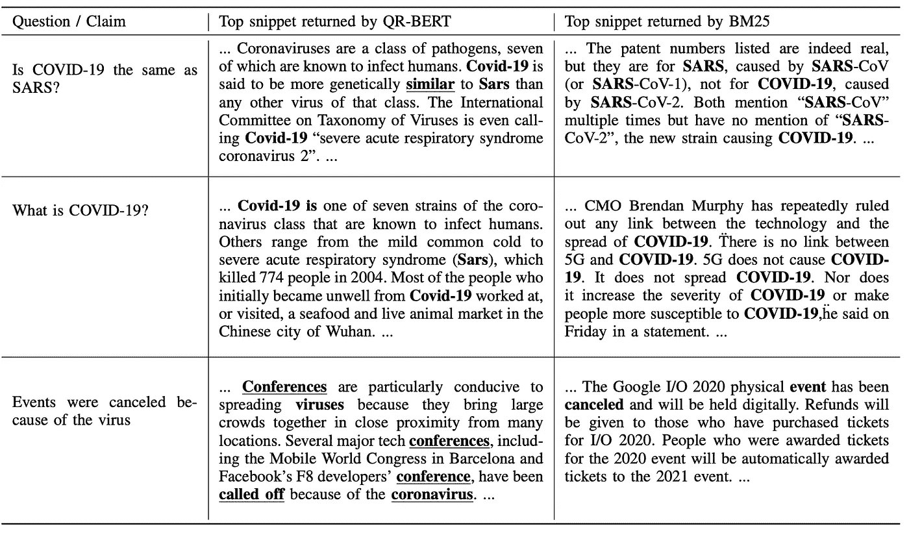

# 构建面向大规模事实核查和问题回答的语义搜索引擎

> 原文：<https://towardsdatascience.com/building-a-semantic-search-engine-for-large-scale-fact-checking-and-question-answering-9aa356632432?source=collection_archive---------20----------------------->

## 开发一个语义检索模型，并使用它来建立一个新冠肺炎语义搜索引擎。

段落检索是事实核查和问题回答系统的一个非常重要的部分。大多数系统通常只依赖稀疏检索，稀疏检索会对召回率产生重大影响，尤其是当相关段落与查询语句几乎没有重叠词时。在本文中，我们展示了我们如何开发一个优于稀疏段落检索的文本嵌入模型，以及我们如何利用它来构建 [Quin](https://quin.algoprog.com/) ，一个关于新冠肺炎疫情事实的语义搜索引擎。

# 段落检索

段落检索问题定义如下:给定一个段落语料库 D 和一个查询 q，我们希望使用带有两个参数 q 和 d ∈ D 的评分函数 f 返回与查询最相关的前 k 个段落，该评分函数计算相关性分数 f(q，d) ∈ R。

## 稀疏表示的局限性

TF-IDF 和 BM25 将文本表示为稀疏的高维向量，可以使用倒排索引数据结构对其进行有效搜索。这些稀疏表示可以有效地减少基于关键字的搜索空间。比如，当我们想回答一个类似*“电影《盗梦空间》是谁导演的？”*，我们显然想把重点放在包含单词*电影*和*盗梦空间*的段落上。然而，稀疏表示可能是限制性的，因为它们需要查询和段落之间的单词重叠，并且它们不能捕捉潜在的语义关系。例如，如果我们想要检索声明*“年轻人死于新冠肺炎”*的段落，包含类似于*“婴儿死于新冠肺炎”*或*“男孩死于新冠肺炎”*的句子的相关段落将被遗漏。

## 潜在密集检索

基于变压器和语言建模任务预训练的神经模型，如 BERT、GPT 和 T5，已经导致许多自然语言处理任务的显著改进，包括段落检索。在我们的系统中，我们使用了一个基于 BERT 的文本嵌入模型。更具体地说，我们使用φ(q)和φ(d)的点积作为我们的段落评分函数:

段落评分功能

其中φ(。)是一个嵌入函数，它将一个段落或查询映射到一个密集向量。函数 f 的选择允许我们利用 [FAISS](https://github.com/facebookresearch/faiss) 库进行有效的最大内积搜索，并轻松地将我们的系统扩展到数百万个文档。对于嵌入函数φ(。)，我们使用 BERT-base 的平均令牌嵌入，它已经在许多任务上进行了微调:

段落嵌入函数

其中 BERT(d，I)是段落 d 中第 I 个标记的嵌入，而|d|是 d 中标记的数量。下图显示了称为 QR-BERT 的密集检索模型，该模型确定段落是否与查询相关。我们的密集检索模型由一个编码器组成，该编码器将查询和段落嵌入到相同的 k 维空间中。查询和段落之间的相似性(段落的相关性)由它们的嵌入表示的余弦相似性给出。

暹罗密集检索模型

## 训练嵌入模型

QR-BERT 通过一组查询段落示例进行训练。设 D+是正查询段落对的集合。我们通过最大化对数似然来估计评分函数的模型参数θ:

等式 1:损失函数

条件概率 p(d|q)由 softmax 近似表示:

等式 2:给定 q，检索 d 的概率

注意，获得等式 2 中所有通道的分母在计算上是昂贵的。因此，我们将计算仅限于当前训练批次中的段落。最终损失函数由下式给出:

等式 3:最终损失函数

其中 D_B 是训练批次 B 中的段落集，D_B+是 B 中的正查询-段落对集。使用 Adam 优化器在 MSMARCO 数据集上训练该模型。我们的实验表明，QR-BERT 比 BM25 段落检索好得多。

## 使用 NLI 数据进行预训练

我们发现，在自然语言推理数据上预先训练嵌入模型实际上可以改进它。我们将两个流行的 NLI 数据集(SNLI 和 MultiNLI)合并为一个，称为 NLI，并且我们还从现有的问答数据集派生出一个新的 FactualNLI 数据集。在我们的[论文](https://www.researchgate.net/publication/342815574_Latent_Retrieval_for_Large-Scale_Fact-Checking_and_Question_Answering_with_NLI_training)中详细描述了推导新 NLI 数据集的方法。FactualNLI 数据集用于训练和评估用于事实检查的检索模型，也用于预训练用于答案检索的模型。使用 NLI 数据，我们使用分类目标对模型进行预训练:

等式 4:分类目标

其中 u 是前提句的嵌入，v 是假设句的嵌入，W_3×3k 是线性变换矩阵，其中 k = 768 是 BERT-base 的隐藏表示的维数，而[u；五；| u v |]是 u、v 及其绝对差| u v |的级联向量。我们使用交叉熵损失和 Adam 优化器对 QR-BERT 进行预训练。我们的实验表明，在 NLI 和 FactualNLI 上的预训练提高了检索召回率。

## 混合检索

在我们的实验中，当我们合并 BM25 检索器和 QR-BERT 的顶部结果，并使用二元相关性分类器对它们重新排序时，我们得到了最佳结果。我们使用 MSMARCO 数据集(如 Nogueira 等人的 monoBERT)训练了基于 BERT-large 的二元相关性分类器。

关于模型评估的更多细节可以在我们的[论文](https://www.researchgate.net/publication/342815574_Latent_Retrieval_for_Large-Scale_Fact-Checking_and_Question_Answering_with_NLI_training)中找到。

## 定性分析

下表显示了 QR-BERT 和 BM25 检索到的一些问题和主张的主要摘录:

QR-BERT 和 BM25 检索到的与新冠肺炎相关的查询片段

对于前两个查询，只有 QR-BERT 返回相关段落。这是因为基于关键字的检索不足以显示最相关的段落。对于第三个查询，两个模型都成功地检索到了相关的片段。对这个查询的一个有趣观察是，QR-BERT 检索到的片段只有单词*病毒*与查询相同。这表明该模型有能力捕捉文本的潜在含义，并识别同义词术语，如*取消*(对于*取消*)和语义相近的术语，如*会议*(接近*事件*)。

一般来说，当查询足够具体以允许通过关键字匹配容易地发现相关段落时，稀疏检索工作得很好。然而，这在实践中是不够的。我们的实验表明，密集检索模型可以给出更准确的结果，并且当在具有稀疏检索结合重新排序的架构中使用时，我们可以实现显著更高的召回率。

# 奎因系统

使用密集检索模型，我们开发了 Quin，这是一个可扩展的语义搜索引擎，可以返回最多五个句子的片段，包含与新冠肺炎疫情相关的问题或声明的答案。

Quin 语义搜索引擎

Quin 有一个模块用于抓取 RSS 提要，并存储新闻文章的 html 源代码。我们去掉样板文件，分离出新闻文章的主要内容。通过在每篇文章的句子序列上使用滑动窗口，我们从干净的文本中提取每篇文章的 5 个句子的片段。我们利用 [nltk](https://www.nltk.org/) 库将文档分割成句子。为了促进高效的大规模检索，我们在片段上构建了两个索引:(a)用于 BM25 检索的高效稀疏倒排索引(关键字索引)，以及(b)支持最大内积搜索的 FAISS 密集(语义)索引。

索引(左)和搜索(右)

该查询用于在片段的稀疏和密集(FAISS)索引上执行搜索。我们从每个索引中检索前 500 个结果，并计算每个结果的相关性分数。结果按照它们的相关性分数排序，我们输出最终排序的结果列表。当查询是一个语句时，我们有一个额外的步骤，使用 NLI 模型将检索到的段落分为三类，这样它们显示在三个选项卡下；*所有*、*支持*和*反驳*的证据。

除了新闻，Quin 还支持与新冠肺炎相关的研究论文的语义搜索。在撰写本文时，Quin 拥有超过 **20 万篇**与新冠肺炎相关的新闻文章和 **10 万篇**研究出版物的索引。我们希望这个系统将有助于对抗错误信息，并帮助一些研究人员寻找新冠肺炎的治疗方法。

[ [项目页面](https://github.com/algoprog/Quin)，[ [论文](https://www.researchgate.net/publication/342815574_Latent_Retrieval_for_Large-Scale_Fact-Checking_and_Question_Answering_with_NLI_training)，[ [演示](https://quin.algoprog.com/)