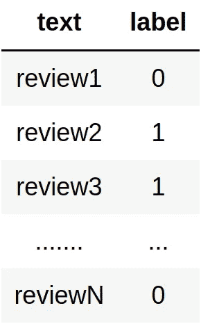
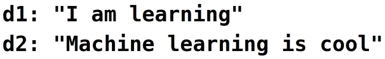
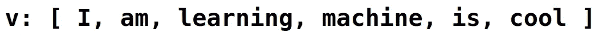
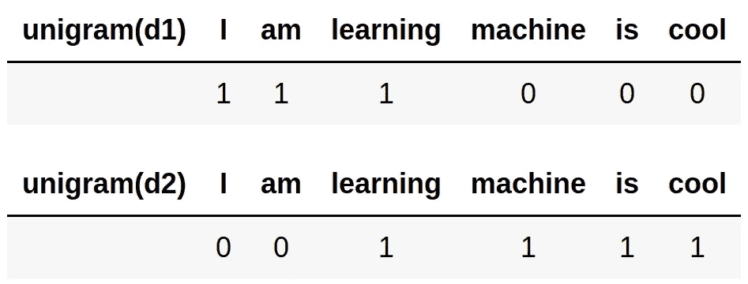
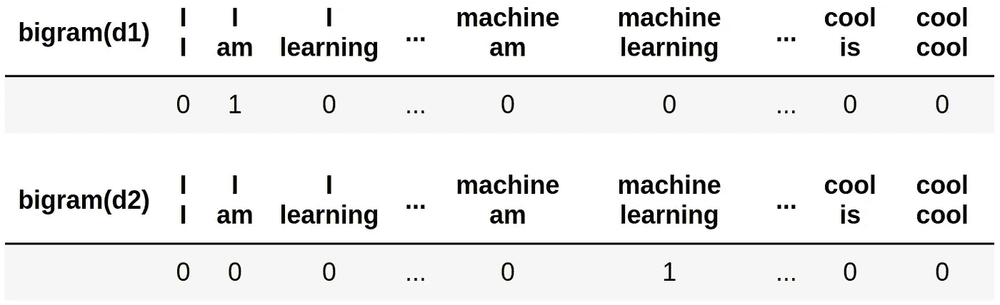
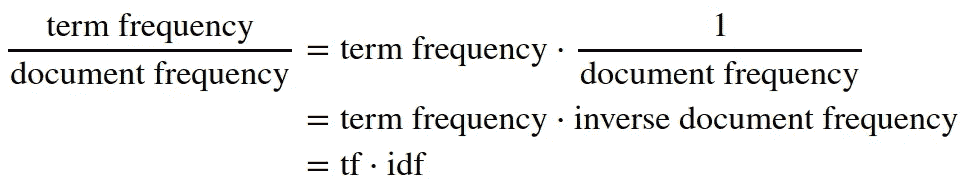
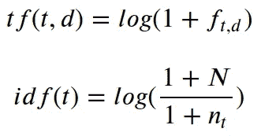
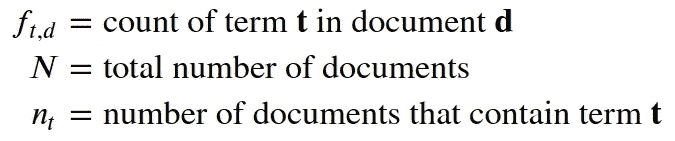

# 使用 Scikit-Learn 构建情感分类器

> 原文：<https://towardsdatascience.com/building-a-sentiment-classifier-using-scikit-learn-54c8e7c5d2f0?source=collection_archive---------6----------------------->

## 训练线性模型以将 IMDb 电影评论分类为正面或负面


*Image by absolute vision @*[](https://pixabay.com/ro/photos/smiley-emoticon-furie-sup%C4%83rat-2979107/)

> *情感分析是自然语言处理中的一个重要领域，是自动检测文本情感状态的过程。情感分析广泛应用于客户的声音材料，如亚马逊等在线购物网站的产品评论、电影评论或社交媒体。这可能只是一个将文本的极性分类为正/负的基本任务，或者它可以超越极性，查看情绪状态，如“快乐”、“愤怒”等。*

*在这里，我们将建立一个分类器，能够区分电影评论是正面还是负面的。为此，我们将使用 IMDB 电影评论的[大型电影评论数据集 v 1.0](http://ai.stanford.edu/~amaas/data/sentiment/aclImdb_v1.tar.gz)【2】。该数据集包含 50，000 条电影评论，平均分为 25k 训练和 25k 测试。标签在两个类别(阳性和阴性)之间保持平衡。分数为<= 4/10 的评论被标记为负面，分数为>= 7/10 的评论被标记为正面。中性评论不包括在标记的数据中。该数据集还包含用于无监督学习的未标记评论；我们不会在这里使用它们。对一部特定电影的评论不超过 30 条，因为同一部电影的评级往往是相关的。给定电影的所有评论或者在训练集中或者在测试集中，但是不在两者中，以避免通过记忆电影特定的术语来获得测试准确度。*

# *数据预处理*

*在数据集被下载并从档案中提取出来后，我们必须将其转换为更合适的形式，以便输入到机器学习模型中进行训练。我们首先将所有的审查数据组合成两个 pandas 数据帧，分别代表训练和测试数据集，然后将它们保存为 csv 文件: *imdb_train.csv* 和 *imdb_test.csv* 。*

*数据帧将具有以下形式:*

**

*其中:*

*   *评论 1，评论 2，… =电影评论的实际文本*
*   *0 =负面评价*
*   *1 =正面评价*

*但是机器学习算法只能处理数值。我们不能只是将文本本身输入到机器学习模型中，然后让它从中学习。我们必须，以某种方式，用数字或数字向量来表示文本。一种方法是使用**单词袋**模型[3]，其中一段文本(通常称为**文档**)由该文档词汇表中单词计数的向量表示。这个模型没有考虑语法规则或单词排序；它所考虑的只是单词的频率。如果我们独立地使用每个单词的计数，我们将这种表示命名为**单字**。一般来说，在一个 **n-gram** 中，我们考虑出现在给定文档中的词汇表中 n 个单词的每个组合的计数。*

*例如，考虑这两个文档:*

**

*这两个句子中遇到的所有单词的词汇是:*

**

*d1 和 d2 的单字表示:*

**

*d1 和 d2 的二元模型是:*

**

*通常，如果我们使用所谓的**术语频率乘以逆文档频率**(或 **tf-idf** )来代替字数，我们可以获得稍微好一点的结果。也许听起来很复杂，但事实并非如此。耐心听我说，我会解释的。这背后的直觉是这样的。那么，在文档中只使用术语的频率会有什么问题呢？尽管一些术语在文档中出现的频率很高，但它们可能与描述出现它们的给定文档不太相关。这是因为这些术语也可能在所有文档集合中出现频率很高。例如，电影评论的集合可能具有出现在几乎所有文档中的特定于电影/电影摄影的术语(它们具有高的**文档频率**)。因此，当我们在文档中遇到这些术语时，这并不能说明它是积极的还是消极的评论。我们需要一种方法将**术语频率**(一个术语在文档中出现的频率)与**文档频率**(一个术语在整个文档集合中出现的频率)联系起来。那就是:*

**

*现在，有更多的方法用来描述术语频率和逆文档频率。但最常见的方法是将它们放在对数标度上:*

**

*其中:*

**

*我们在第一个对数中添加了 1，以避免在计数为 0 时得到-∞。在第二个对数中，我们添加了一个假文档以避免被零除。*

*在我们将数据转换成计数或 tf-idf 值的向量之前，我们应该删除英文的**停用词[** 6][7]。停用词是在语言中非常常见的词，通常在自然文本相关任务(如情感分析或搜索)的预处理阶段被移除。*

*请注意，我们应该只基于训练集来构建我们的词汇表。当我们处理测试数据以进行预测时，我们应该只使用在训练阶段构建的词汇，其余的单词将被忽略。*

*现在，让我们创建数据框并将其保存为 csv 文件:*

# *文本矢量化*

*幸运的是，对于文本矢量化部分，所有困难的工作都已经在 Scikit-Learn 类`CountVectorizer`【8】和`TfidfTransformer`【5】中完成了。我们将使用这些类将 csv 文件转换成 unigram 和 bigram 矩阵(使用计数和 tf-idf 值)。(事实证明，如果我们只对大 n 使用 n 元语法，我们不会获得很好的准确性，我们通常使用所有 n 元语法，直到某个 n。因此，当我们在这里说二元语法时，我们实际上是指 uni+二元语法，当我们说 unigrams 时，它只是一元语法。)这些矩阵中的每一行将代表我们数据集中的一个文档(review ),每一列将代表与词汇表中的每个单词相关联的值(在单字的情况下)或与词汇表中最多两个单词的每个组合相关联的值(双字)。*

*`CountVectorizer`有一个参数`ngram_range`，它需要一个大小为 2 的元组来控制包含什么 n 元语法。在我们构造了一个`CountVectorizer`对象之后，我们应该调用`.fit()`方法，将实际的文本作为参数，以便让它学习我们收集的文档的统计数据。然后，通过对我们的文档集合调用`.transform()`方法，它返回指定的 n-gram 范围的矩阵。正如类名所示，这个矩阵将只包含计数。为了获得 tf-idf 值，应该使用类`TfidfTransformer`。它有`.fit()`和`.transform()`方法，使用方式与`CountVectorizer`类似，但它们将前一步获得的计数矩阵作为输入，而`.transform()`将返回一个带有 tf-idf 值的矩阵。我们应该只在训练数据上使用`.fit()`，然后存储这些对象。当我们想要评估测试分数或者每当我们想要做出预测时，我们应该在将数据输入到我们的分类器之前使用这些对象来转换数据。*

*请注意，为我们的训练或测试数据生成的矩阵将是巨大的，如果我们将它们存储为普通的 numpy 数组，它们甚至不适合 RAM。但是这些矩阵中的大部分元素都是零。因此，这些 Scikit-Learn 类使用 Scipy 稀疏矩阵[9] ( `csr_matrix` [10]更准确地说)，它只存储非零条目，节省了大量空间。*

*我们将使用具有随机梯度下降的线性分类器`sklearn.linear_model.SGDClassifier`【11】作为我们的模型。首先，我们将以 4 种形式生成和保存我们的数据:unigram 和 bigram 矩阵(每个都有计数和 tf-idf 值)。然后，我们将使用带有默认参数的`SGDClassifier`来训练和评估这 4 种数据表示的模型。之后，我们选择导致最佳分数的数据表示，并且我们将使用交叉验证调整具有该数据形式的模型的超参数，以便获得最佳结果。*

# *选择数据格式*

*现在，对于每个数据表单，我们将其分成训练和验证集，训练 a `SGDClassifier`并输出分数。*

*这是我们得到的结果:*

```
*Unigram Counts
Train score: 0.99 ; Validation score: 0.87

Unigram Tf-Idf
Train score: 0.95 ; Validation score: 0.89

Bigram Counts
Train score: 1.0 ; Validation score: 0.89

Bigram Tf-Idf
Train score: 0.98 ; Validation score: 0.9*
```

*最好的数据形式似乎是带有 tf-idf 的 **bigram，因为它获得了最高的验证精度:**0.9**；我们接下来将使用它进行超参数调整。***

# *使用交叉验证进行超参数调整*

*对于这一部分，我们将使用`RandomizedSearchCV` [12]，它从我们给出的列表中随机选择参数，或者根据我们从`scipy.stats`指定的分布(例如均匀)；然后，通过进行交叉验证来估计测试误差，在所有迭代之后，我们可以在变量`best_estimator_`、`best_params_`和`best_score_`中找到最佳估计值、最佳参数和最佳得分。*

*因为我们想要测试的参数的搜索空间非常大，并且在找到最佳组合之前可能需要大量的迭代，所以我们将参数集分成两部分，并分两个阶段进行超参数调整过程。首先我们会找到 loss、learning_rate 和 eta0(即初始学习率)的最优组合；然后是惩罚和α。*

*我们得到的输出是:*

```
*Best params: {'eta0': 0.008970361272584921, 'learning_rate': 'optimal', 'loss': 'squared_hinge'}
Best score: 0.90564*
```

*因为我们得到了“learning_rate = optimal”是最好的，那么我们将忽略 eta0(初始学习率)，因为当 learning_rate='optimal '时它没有被使用；我们得到这个值 eta0 仅仅是因为这个过程中的随机性。*

```
*Best params: {'alpha': 1.2101013664295101e-05, 'penalty': 'l2'}
Best score: 0.90852*
```

*所以，我得到的最佳参数是:*

```
*loss: squared_hinge
learning_rate: optimal
penalty: l2
alpha: 1.2101013664295101e-05*
```

## *保存最佳分类器*

# *测试模型*

*并且得到了 **90.18%** 的测试准确率。这对于我们简单的线性模型来说是不错的。有更先进的方法可以给出更好的结果。该数据集目前的最新水平是 **97.42%** [13]*

# *参考*

*[1] [情感分析—维基百科](https://en.wikipedia.org/wiki/Sentiment_analysis)
【2】[用于情感分析的学习词向量](http://ai.stanford.edu/~amaas/papers/wvSent_acl2011.pdf)
【3】[词袋模型—维基百科](https://en.wikipedia.org/wiki/Bag-of-words_model)
【4】[Tf-IDF—维基百科](https://en.wikipedia.org/wiki/Tf%E2%80%93idf)
【5】[TfidfTransformer—Scikit—学习文档](https://scikit-learn.org/stable/modules/generated/sklearn.feature_extraction.text.TfidfTransformer.html)
【6】[停用词—维基百科](https://en.wikipedia.org/wiki/Stop_words)
【7】[A](https://gist.github.com/sebleier/554280) [压缩稀疏行矩阵](https://docs.scipy.org/doc/scipy/reference/generated/scipy.sparse.csr_matrix.html#scipy.sparse.csr_matrix)
【11】[SGD classifier—sci kit—learn 文档](https://scikit-learn.org/stable/modules/generated/sklearn.linear_model.SGDClassifier.html)
【12】[RandomizedSearchCV—sci kit—learn 文档](https://scikit-learn.org/stable/modules/generated/sklearn.model_selection.RandomizedSearchCV.html)
【13】[使用余弦相似度训练的文档嵌入进行情感分类](https://www.aclweb.org/anthology/P19-2057.pdf)*

*朱庇特笔记本可以在[这里](https://github.com/lazuxd/simple-imdb-sentiment-analysis/blob/master/sentiment-analysis.ipynb)找到。*

*我希望这些信息对你有用，感谢你的阅读！*

*这篇文章也贴在我自己的网站[这里](https://www.nablasquared.com/building-a-sentiment-classifier-using-scikit-learn/)。随便看看吧！*