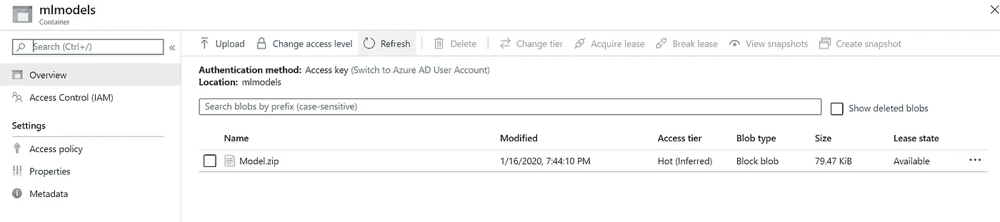

# 使用 ML.NET 和 Azure 函数构建无服务器机器学习 API

> 原文：<https://towardsdatascience.com/building-a-serverless-machine-learning-api-using-ml-net-and-azure-functions-ad3b24751106?source=collection_archive---------21----------------------->

## 构建无服务器 API 的回顾性学习，该 API 使用 ML 构建的回归模型。网


***更新:*** *你现在可以从 Azure Serverless 社区网站* [*下载这个项目的完整样本*](https://serverlesslibrary.net/sample/4acda76d-5d94-4910-9ed1-d0e14b233684) *！(如果你想进一步探索 Azure 函数，还有一些很棒的例子！)*

随着 ML.NET(API)的发布，C#开发人员可以用它来为他们的应用程序注入机器学习能力，我一直热衷于将我对 Azure 函数的知识与 API 结合起来，构建一些古怪的无服务器机器学习应用程序，这将允许我增强我的 GitHub 档案，并迎合所有的时髦爱好者！

[](https://docs.microsoft.com/en-us/dotnet/machine-learning/) [## ML。NET 文档-教程，API 参考

### 了解如何使用开源 ML.NET 来构建定制的机器学习模型，并将它们集成到应用程序中。教程…

docs.microsoft.com](https://docs.microsoft.com/en-us/dotnet/machine-learning/) 

(当然，也是为了提高自己的技能和学习新的东西😂)

这个帖子不会是教程。我写这篇文章更多的是回顾我在构建应用程序时所做的设计决策，以及我所学到的关于不同组件如何工作的东西。如果你读了这篇文章，并决定在你的现实世界中应用它，希望你能在你的项目中应用我学到的东西，或者更好的是，扩展我正在处理的想法和场景。

我将更多地关注我对 ML.NET API 本身的了解，而不是花太多时间在 Azure 函数如何工作上。如果你想得到这个代码，这里有 GitHub 上的[回购。](https://github.com/willvelida/serverless-price-predictor)

因为我做这个项目只是为了一点乐趣，我确实采取了一些在现实生活中不起作用的捷径，所以请对此表示同情(我相信你会的😊).

**应用概述。**

这个例子建立在 ML.NET 团队在其文档中提供的[出租车旅行回归](https://docs.microsoft.com/en-us/dotnet/machine-learning/tutorials/predict-prices)教程的基础上。但是对于这个示例，我已经针对下面的场景对该教程进行了一点扩展。

假设我们经营一家出租车公司，每天晚上我们都会收到一份全天出租车行程的文件。我们希望建立一个回归模型，让我们的客户可以用它来预测他们打车的费用。

为此，我构建了两个 Azure 函数:

1.  **ServerlessPricePredictor。ModelTrainer** 获取一个本地 CSV 文件，并在其基础上训练一个回归模型。如果模型非常适合(使用 R 平方值)，那么模型将被上传到 Azure Blob 存储中的容器。该函数使用定时器触发器来模拟定时批处理作业。
2.  **ServerlessPricePredictor。API** 然后在一个 HTTP 触发器中使用 Azure Blob 存储中训练好的模型来创建基于输入数据(JSON 有效负载)的预测，并将该预测插入 Azure Cosmos DB。

**模特训练器功能**

在 MLContext，创建我们的机器学习管道所需的所有操作都是通过 [MLContext 类](https://docs.microsoft.com/en-us/dotnet/api/microsoft.ml.mlcontext?view=ml-dotnet)提供的。这允许我们执行数据准备、特征工程、训练、预测和模型评估。

为了让我们加载数据来训练我们的回归模型，model 为我们提供了一个 [IDataView](https://docs.microsoft.com/en-us/dotnet/api/microsoft.ml.idataview?view=ml-dotnet) 类来描述数字或文本表格数据。IDataView 类为我们提供了一个加载数据文件的方法，我只是将数据文件放在项目的一个文件夹中。

然后，我们可以使用 MLContext 类来执行我们的机器学习任务。首先，我使用 LoadFromTextFile 方法将本地文件加载到 IDataView 对象中。然后，为了创建我们的管道，我已经确定我想使用我们的 FareAmount 列作为我们的标签，我们希望我们的回归模型预测，我已经对我们的 VendorId、RateCode 和 PaymentType 列应用了[一个热编码](https://hackernoon.com/what-is-one-hot-encoding-why-and-when-do-you-have-to-use-it-e3c6186d008f)(因为这是一个回归模型，我们对分类值应用了一个热编码，以将它们转换为数值)，然后我已经将我想使用的所有特性连接到一个特性列中。之后，我在我的管道上应用了一个回归任务。

我以前玩过一点 Spark MLlib 库，所以在 ML.NET 的过程非常相似，我认为这很酷！😎

最后，我创建了一个[it transformer](https://docs.microsoft.com/en-us/dotnet/api/microsoft.ml.itransformer?view=ml-dotnet)的模型对象，将我们的管道安装到 IDataView 对象上。

```
// Read flat file from local folder_logger.LogInformation("Loading the file into the pipeline");IDataView dataView = mlContext.Data.LoadFromTextFile<TaxiTrip>(trainFilePath, hasHeader: true, separatorChar: ',');// Create the pipeline_logger.LogInformation("Training pipeline");var pipeline = mlContext.Transforms.CopyColumns(outputColumnName: "Label", inputColumnName: "FareAmount").Append(mlContext.Transforms.Categorical.OneHotEncoding(outputColumnName: "VendorIdEncoded", inputColumnName: "VendorId")).Append(mlContext.Transforms.Categorical.OneHotEncoding(outputColumnName: "RateCodeEncoded", inputColumnName: "RateCode")).Append(mlContext.Transforms.Categorical.OneHotEncoding(outputColumnName: "PaymentTypeEncoded", inputColumnName: "PaymentType")).Append(mlContext.Transforms.Concatenate("Features", "VendorIdEncoded", "RateCodeEncoded", "PassengerCount", "TripDistance", "PaymentTypeEncoded")).Append(mlContext.Regression.Trainers.FastTree());// Fit the model_logger.LogInformation("Fitting model");var model = pipeline.Fit(dataView);
```

我用 [LoadColumnAttribute](https://docs.microsoft.com/en-us/dotnet/api/microsoft.ml.data.loadcolumnattribute?view=ml-dotnet) 修饰了我的类属性，它指定了数据集中列的索引:

```
public class TaxiTrip{[LoadColumn(0)]public string VendorId;[LoadColumn(1)]public string RateCode;[LoadColumn(2)]public float PassengerCount;[LoadColumn(3)]public float TripTime;[LoadColumn(4)]public float TripDistance;[LoadColumn(5)]public string PaymentType;[LoadColumn(6)]public float FareAmount;}
```

对于我们的预测，我创建了另一个使用 ColumnNameAttribute 装饰的类。这允许我们使用 FareAmount 属性(这是我们试图创建预测的属性)来生成我们的分数。

```
public class TaxiTripFarePrediction{[ColumnName("Score")]public float FareAmount;}
```

在现实世界的机器学习场景中，我们不会只部署我们不知道表现良好或非常适合我们的数据的模型。

ML.NET API 为我们提供了可以用来评估模型有效性的指标。我创建了下面的 Evaluate()方法，它接受 MLContext、我们的模型和测试数据文件:

```
private double Evaluate(MLContext mlContext, ITransformer model, string testFilePath){IDataView dataView = mlContext.Data.LoadFromTextFile<TaxiTrip>(testFilePath, hasHeader: true, separatorChar: ',');var predictions = model.Transform(dataView);var metrics = mlContext.Regression.Evaluate(predictions, "Label", "Score");double rSquaredValue = metrics.RSquared;return rSquaredValue;}
```

在这里，我将测试数据加载到 IDataView 对象中，然后使用我的模型对该数据进行转换。这里的 [Transform()](https://docs.microsoft.com/en-us/dotnet/api/microsoft.ml.itransformer.transform?view=ml-dotnet) 方法实际上并不做任何转换，它只是根据测试的模型来验证我的测试文件的模式。

对于这个例子，我只是使用 r 平方值来测试我的模型的有效性，但是 [RegressionMetrics](https://docs.microsoft.com/en-us/dotnet/api/microsoft.ml.data.regressionmetrics?view=ml-dotnet) 类允许我们为我们的回归模型检索 [LossFunction](https://docs.microsoft.com/en-us/dotnet/api/microsoft.ml.data.regressionmetrics.lossfunction?view=ml-dotnet#Microsoft_ML_Data_RegressionMetrics_LossFunction) ，[meansabsoluteerror](https://docs.microsoft.com/en-us/dotnet/api/microsoft.ml.data.regressionmetrics.meanabsoluteerror?view=ml-dotnet#Microsoft_ML_Data_RegressionMetrics_MeanAbsoluteError)，[meansquadererror](https://docs.microsoft.com/en-us/dotnet/api/microsoft.ml.data.regressionmetrics.meansquarederror?view=ml-dotnet#Microsoft_ML_Data_RegressionMetrics_MeanSquaredError)，[rootmeansquadererror](https://docs.microsoft.com/en-us/dotnet/api/microsoft.ml.data.regressionmetrics.rootmeansquarederror?view=ml-dotnet#Microsoft_ML_Data_RegressionMetrics_RootMeanSquaredError)和 [RSquared](https://docs.microsoft.com/en-us/dotnet/api/microsoft.ml.data.regressionmetrics.rsquared?view=ml-dotnet#Microsoft_ML_Data_RegressionMetrics_RSquared) 值。

一旦我们的模型产生了我们的 r 平方指标，并且提供了显示它非常适合的分数，我们就将模型的 zip 文件上传到 Azure Storage:

```
if (modelRSquaredValue >= 0.7){_logger.LogInformation("Good fit! Saving model");mlContext.Model.Save(model, dataView.Schema, modelPath);// Upload Model to Blob Storage_logger.LogInformation("Uploading model to Blob Storage");await _azureStorageHelpers.UploadBlobToStorage(cloudBlobContainer, modelPath);}
```

这里的重点是，我首先保存我的模型，然后将其作为文件上传到 Azure Storage。我们使用 MLContext 保存模型。Model.Save 行，它接受我们的模型、IDataView 对象的模式以及我们希望保存模型的路径。我已经创建了自己的助手类，将我保存的模型上传到 Azure Storage 中指定的 blob 容器。



(注意:我尝试过将模型上传为流而不是文件，但是当我试图将模型注入 HTTP 触发函数或 ASP.NET Web API 应用程序时，我总是会遇到问题。总有一天我会弄明白，或者，更有可能的是，某个比我聪明的人会告诉我哪里做错了😂)

**在 HTTP API 函数中使用我们的模型**

如果我们想在我们的 API 中进行预测，我们需要创建一个[预测引擎](https://docs.microsoft.com/en-us/dotnet/api/microsoft.ml.predictionengine-2?view=ml-dotnet)。本质上，这允许我们使用训练好的模型进行单一预测。然而，这并不是线程安全的，所以我使用了一个 PredictionEnginePool，并将它注入到我的[启动类](https://github.com/willvelida/serverless-price-predictor/blob/master/ServerlessPricePredictor/ServerlessPricePredictor.API/Helpers/Startup.cs)中，这样我们的应用程序中就有了一个它的单例实例。如果我们在 API 函数应用程序中跨几个函数进行预测，我们需要为每个预测创建 PredictionEnginePool 的实例，这将是一场管理噩梦。我是这样做的:

```
builder.Services.AddPredictionEnginePool<TaxiTrip, TaxiTripFarePrediction>().FromUri(modelName: "TaxiTripModel",uri: "https://velidastorage.blob.core.windows.net/mlmodels/Model.zip",period: TimeSpan.FromMinutes(1));
```

在这里，我们调用我们的模型，该模型远程存储在 Azure Blob 存储中。period 参数定义了我们轮询新模型的 uri 的频率。模型不应该是静态的，所以您可以使用这个参数来设置您希望应用程序轮询新模型的频率。

一旦我们将其注入到我们的应用程序中，我们就可以使用我们的预测引擎池来预测我们的请求:

```
string requestBody = await new StreamReader(req.Body).ReadToEndAsync();var input = JsonConvert.DeserializeObject<TaxiTrip>(requestBody);// Make PredictionTaxiTripFarePrediction prediction = _predictionEnginePool.Predict(modelName: "TaxiTripModel",example: input);
```

这里的 [Predict()](https://docs.microsoft.com/en-us/dotnet/api/microsoft.ml.predictionenginebase-2.predict?view=ml-dotnet) 方法允许我们对 JSON 输入进行一次预测。我们定义了我们希望使用的模型，使用的名称与我们将它注入到应用程序中时给它的名称相同。

在本例中，我基于输入数据创建新的预测，然后将新的预测值插入到一个 Cosmos DB 容器中:

```
[FunctionName(nameof(PredictTaxiFare))]public async Task<IActionResult> Run([HttpTrigger(AuthorizationLevel.Anonymous, "post", Route = "PredictTaxiFare")] HttpRequest req){IActionResult returnValue = null;string requestBody = await new StreamReader(req.Body).ReadToEndAsync();var input = JsonConvert.DeserializeObject<TaxiTrip>(requestBody);// Make PredictionTaxiTripFarePrediction prediction = _predictionEnginePool.Predict(modelName: "TaxiTripModel",example: input);var insertedPrediction = new TaxiTripInsertObject{Id = Guid.NewGuid().ToString(),VendorId = input.VendorId,RateCode = input.RateCode,PassengerCount = input.PassengerCount,TripTime = input.TripTime,TripDistance = input.TripDistance,PaymentType = input.PaymentType,FareAmount = input.FareAmount,PredictedFareAmount = prediction.FareAmount};try{ItemResponse<TaxiTripInsertObject> predictionResponse = await _container.CreateItemAsync(insertedPrediction,new PartitionKey(insertedPrediction.VendorId));returnValue = new OkObjectResult(predictionResponse);}catch (Exception ex){_logger.LogError($"Inserting prediction failed: Exception thrown: {ex.Message}");returnValue = new StatusCodeResult(StatusCodes.Status500InternalServerError);}return returnValue;}
```

**听起来很棒！我需要什么才能让这个样本自己工作？**

如果你想自己开发(或者扩展)这个应用，你可以创建一个 Azure 存储账户，里面有一个你可以上传模型的容器。查看[这篇文章](https://docs.microsoft.com/en-us/azure/storage/common/storage-account-create?tabs=azure-portal)，看看你如何做到这一点。您还需要创建一个使用 SQL API 的 Cosmos DB 帐户。查看[这篇文章](https://docs.microsoft.com/en-us/azure/cosmos-db/create-cosmosdb-resources-portal)来开始吧。

你可以使用 Visual Studio 在本地运行 Azure 函数，也可以使用 [Postman](https://www.getpostman.com/downloads/) 在你的机器上测试 API。

**结论**

我希望你已经了解了一些关于 ML.NET 图书馆的知识，以及如何使用它来构建基本但非常棒的无服务器机器学习解决方案。记住我说的是基础。为了这篇博文，我确实走了一些捷径，但是在生产场景中这样做要复杂得多。但是这是可行的，ML.NET 是一个很好的库，如果你已经在使用。NET 堆栈。

如果你想看完整的代码，[请到 GitHub](https://github.com/willvelida/serverless-price-predictor) 查看。如果你对我有任何问题，请在下面评论。😊