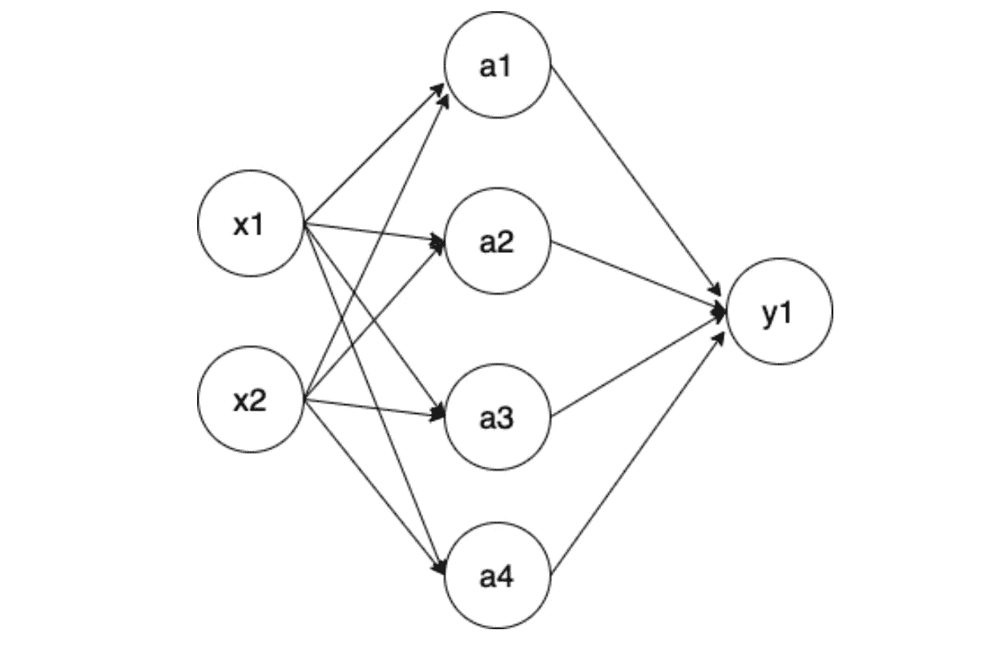
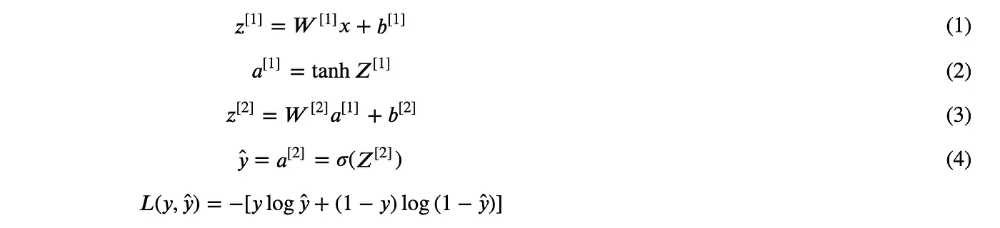
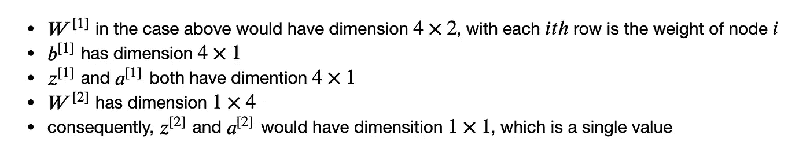
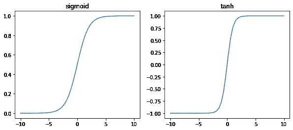
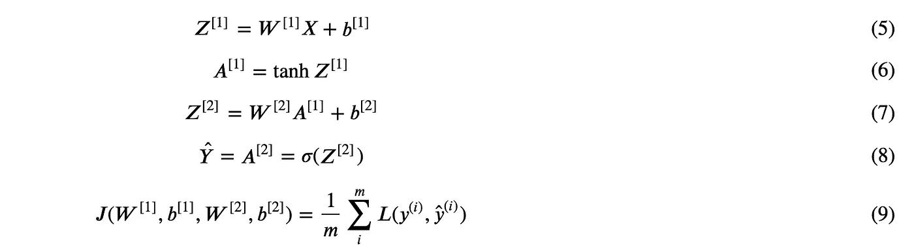
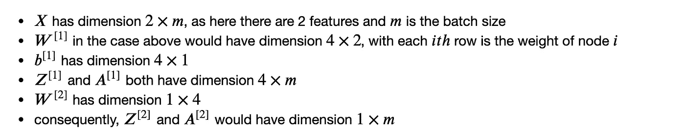
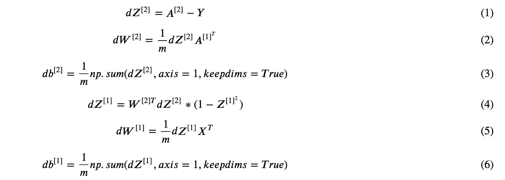
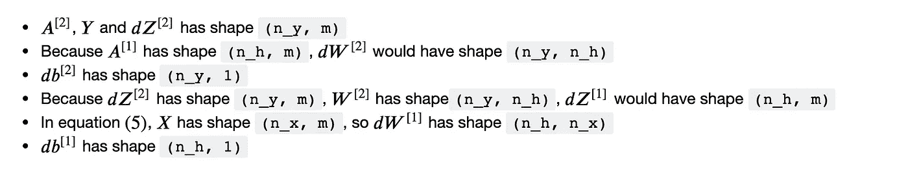
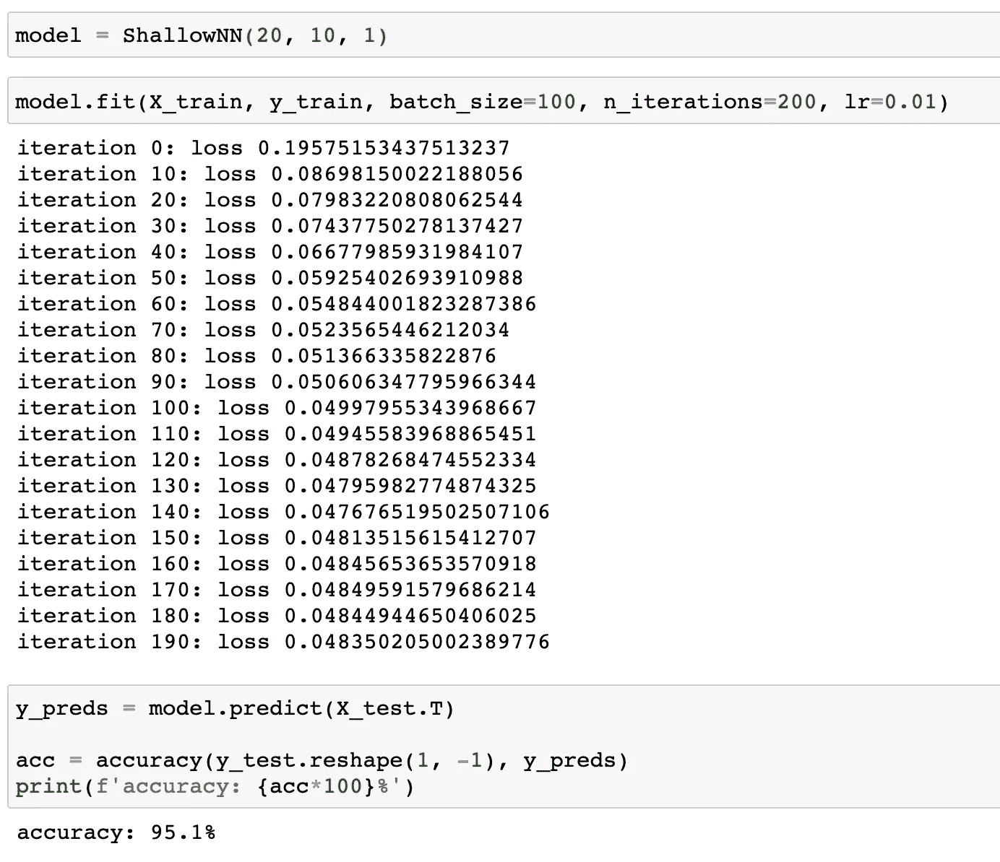

# 建立一个浅层神经网络

> 原文：<https://towardsdatascience.com/building-a-shallow-neural-network-a4e2728441e0?source=collection_archive---------13----------------------->

## 解释了理论和实现

# 一个隐藏层神经网络

我们将构建一个具有一个隐藏层的浅层密集神经网络，以下结构用于说明目的。

在试图理解这篇文章之前，我强烈建议你看一下我之前的逻辑回归的[实现，因为逻辑回归可以看作是一个 1 层神经网络，基本概念实际上是相同的。](https://meatba11.medium.com/logistic-regression-step-by-step-implementation-f032a89936ca)

其中在上图中，我们有一个输入向量 x = (x_1，x_2)，包含 2 个特征和 4 个隐藏单元 a1、a2、a3 和 a4，并在[0，1]中输出一个值 y_1。(考虑这是一个带有概率预测的二元分类任务)

在每个隐单元中，以 a_1 为例，进行一个线性运算，然后是一个激活函数。因此，给定输入 x = (x_1，x_2)，在节点 a_1 内，我们有:

这里 w_{11}表示节点 1 的权重 1，w_{12}表示节点 1 的权重 2。对于节点 a_2 也是如此，它应该有:

a3 和 a4 也是如此，以此类推…

# 一个输入的矢量化

现在让我们将权重放入矩阵并输入到向量中，以简化表达式。

这里我们假设第二激活函数为`tanh`，输出激活函数为`sigmoid`(注意上标[i]表示第 I 层)。

对于每个矩阵的维数，我们有:

单个值的损失函数 L 将与逻辑回归的损失函数相同(此处[详细介绍](https://meatba11.medium.com/logistic-regression-step-by-step-implementation-f032a89936ca))。

功能`tanh`和`sigmoid`如下图所示。

请注意，这些函数的唯一区别是 y 的比例。

# 批量训练公式

上面显示了单个输入向量的公式，但是在实际训练过程中，一次训练一批而不是一个。公式中应用的更改是微不足道的，我们只需用大小为`n x m`的矩阵 X 替换单个向量 X，其中 n 是特征数量，m 是批量大小——样本按列堆叠，同样应用以下结果矩阵。

对于本例中每个矩阵的维数，我们有:

与逻辑回归相同，对于批量训练，所有训练样本的平均损失。

这都是为了正向传播。为了激活我们的神经元进行学习，我们需要获得权重参数的导数，并使用梯度下降来更新它们。

但是现在我们先实现正向传播就足够了。

# 生成样本数据集

这里，我们生成一个简单的二元分类任务，包含 5000 个数据点和 20 个特征，用于以后的模型验证。

# 权重初始化

我们的神经网络有 1 个隐层，总共 2 层(隐层+输出层)，所以有 4 个权重矩阵要初始化(W^[1]，b^[1]和 W^[2]，b^[2]).注意，权重被初始化得相对较小，因此梯度会更高，从而在开始阶段学习得更快。

# 正向传播

让我们按照等式(5)至(8)实现正向过程。

# 损失函数

根据等式(9)，每批的损耗可计算如下。

# 反向传播

现在到了反向传播，这是我们的权重更新的关键。给定我们上面定义的损失函数 L，我们有如下梯度:

如果你不明白为什么 Z^[2 的导数如上，你可以在这里查看。事实上，我们网络的最后一层与逻辑回归相同，所以导数是从那里继承的。

方程(4)中是元素式乘法，tanh{x}的梯度是 1 — x，你可以试着自己推导上面的方程，不过我基本上是从网上拿来的。

让我们分解每个元素的形状，给定每层的数量等于`(n_x, n_h, n_y)`，批量等于`m`:

一旦我们理解了这个公式，实现起来就会很容易。

# 批量训练

我将每个部分都放在一个类中，这样它就可以像 python 的通用包一样训练。此外，还实施批量训练。为避免冗余，我没有放在这里，详细实现请查看我的 [git repo](https://github.com/MJeremy2017/deep-learning/tree/main/shallow-neural-network) 。

让我们看看我们实现的神经网络在数据集上的表现。

使用 10 个隐藏神经元，我们的模型能够在测试集上达到 95.1%的准确率，这是非常好的。

现在继续尝试实现你自己，这个过程将真正帮助你获得对一般密集神经网络的更深理解。