# 通过决策树构建一个简单的自动编码器

> 原文：<https://towardsdatascience.com/building-a-simple-auto-encoder-via-decision-trees-28ba9342a349?source=collection_archive---------10----------------------->

## [自动编码器](https://medium.com/tag/autoencoder)

## 如何使用随机决策树构建自动编码器


我可爱的妻子[蒂娜蒂·库伯勒](https://dribbble.com/tinati)

决策树是非常通用的结构。您可以使用它们进行分类和回归( *CART、随机森林、…* )，用于异常检测(*隔离森林、…* )，正如我们将看到的，还可以用于构建*自动编码器、*以及其他构造。

> 声明:我没有想出这个主意。这种新的基于树的自动编码器是由吉峰和周志华[1]提出的，被称为“*forest*”。他们在 AAAI 18 上展示了他们的作品。

然而，我认为这篇论文在如何从潜在空间中解压元素方面缺乏一些清晰度，我将在本文中解决这个问题。我还将简单介绍用于制作森林的所有材料。

所以，在我们开始之前，让我们快速回顾一下什么是决策树和自动编码器。

# 重要概念的高度概括

## 决策树

决策树是一种将来自一个 *n* 维特征空间的一组样本聚类到不同箱中的方法。这是通过检查样本的 *n* 特征上的某些约束来完成的。

以特征空间 *X = ℝ×ℝ×{0，1}×{A，b，C}，*以及生活在 *X* 内的样本 *(1.7，4.3，0，a)，(2.2，3.6，1，b)，(3.5，2.6，0，C)* 和 *(4.1，1.9，1，A)* 为例。我构建了一个示例决策树来将这些样本分类到四个箱中。也许下面这张图甚至是不言自明的，即使你以前从未听说过决策树:

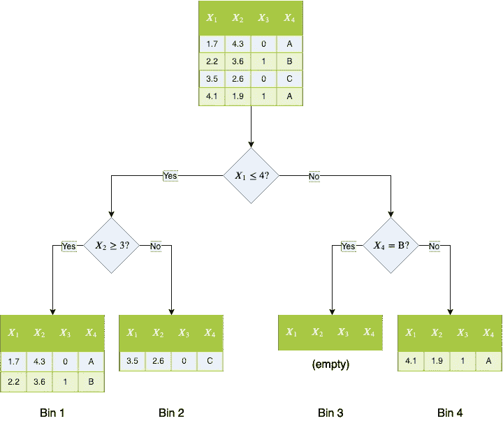

决策树。在每个节点(蓝色菱形)中，样本集被分成两个不相交的子集，这取决于某个特征是否满足特殊要求。例如，在 bin 4 中，我们可以找到第一个坐标严格大于 4，最后一个坐标为 A 或 C (=非 B)的所有样本。

最后，四个样本被分类到四个容器中。由于单个样本不能同时采用两个路径(一个特征不能小于或等于 4 **且**严格大于 4)，每个样本被准确分类到一个箱中。

## 自动编码器

自动编码器基本上是有损压缩算法。它们允许用更少的位来表示数据，从而节省了存储空间。它还使用这些压缩样本来加速(机器学习)算法，因为较短的输入大小通常会导致较短的运行时间。

自动编码器由两种算法组成:

*   **编码器:**通过去除冗余和噪声来压缩数据。
*   **解码器:**尝试从压缩形式恢复原始数据。

更准确地说，编码器将样本从 *n* 维特征空间投影到其在 *m* 维所谓的*潜在空间*、**中的压缩形式，其中 *m < n.***

解码器从第 *m* 维潜在空间中提取样本，并将其再次解压缩到第 *n* 维特征空间中。

一个**好的自动编码器**应该能够

1.  取样 *x*
2.  将其压缩为 *x' = e(x)*
3.  并将其再次解压缩到性质为*x≈x″= d(e(x))的*x″= d(x′)*。*

这意味着包装和打开样品 *x* 不会对其造成太大的改变。当然，这应该适用于特征空间的任何 *x* 。

通常，我们不能期望得到 *x.* 的完美重建，例如 *n=1* 和 *m=0* (即潜在空间仅由单个点*x’*组成)。两个不同的样品 *x₁* 和 *x₂* 将被任何编码器送到潜在空间的同一点*x’*。所以，在最好的情况下，任何解码器只能恢复*x’*到 *x₁* 或 *x₂* ，因此得到一个解码错误。如果*x’*被解压缩到某个其他的 *x* ，解码器甚至会将两个样本都弄错。

自动编码器的一个受欢迎的代表是*主成分分析* ( *PCA* )，它将数据从 *n* 线性映射到 *m* 维度，然后反向映射，尽管人们通常只使用编码器来降低数据的维度。

# 一个玩具例子:eTree

现在让我们看看如何用决策树构建一个自动编码器。我声称**我们已经在本文中看到了一个 eForest 映射**到一个 1 维的潜在空间！姑且称之为 *eTree* 。

## 编码

滚动回决策树示例图片，或者让我来帮你做:


上图的快捷方式。真的，又是同一个决策树。

我们看到四个样本中的每一个都被分类到四个箱中的一个。

> 核心思想是使用样本映射到的 bin 的编号作为编码。

所以 *(1.7，4.3，0，A)**(2.2，3.6，1，B)* 被编码为 1， *(3.5，2.6，0，C)* 被编码为 2， *(4.1，1.9，1，A)* 被编码为 4，或者简而言之:
*e((1*

很简单，对吧？

当我们想再次解码这个数字时，问题就出现了。

## 解码

在[1]中，作者引入了*规则*和所谓的 *MCRs* 来进行解码*。*概念不难，但一开始我发现从纸上很难理解。所以，我来换个角度解释一下。

让我们假设我们得到编码 1，即从特征空间有一个 *x* ，其中 e 是 eTree 编码器。沿着通向 bin 1 的唯一路径，我们获得关于输入 *x.* 的我称之为*的线索*

在 1 号仓着陆需要

1.  **线索 1:** *X₁* 小于等于 4 且
2.  **线索二:** *X₂* 要大于等于 3，

也就是说，我们知道 *x* 看起来像这样:

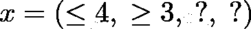

或者，更准确地说，我们可以推断

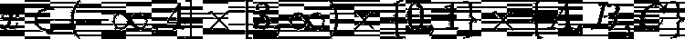

然后，我们必须从这个潜在候选集中挑选*任何*元素，并将其用作解码。我们可以用确定性或概率性的方法来做这件事，这并不重要。

[1]中也使用的一种方法是*最小选择*。只取每个集合的最小值，如果集合是没有最小值的区间，就取它的右界。使用这个确定性规则，我们将解码 1 到 *(4，3，0，A)* (假设 *A < B < C* )。其他简单的方法包括选择最大值或平均值，或者从集合中随机抽样。

在我们的例子中，解码 1 的潜在候选集合相当大，因此我们可以预期重构相当糟糕。解决这个问题的一个方法是让树变得更深，也就是使用更多的分裂。更多的分裂产生更多的线索，进而产生更小的候选集。让我们在玩具示例中再使用一个拆分:

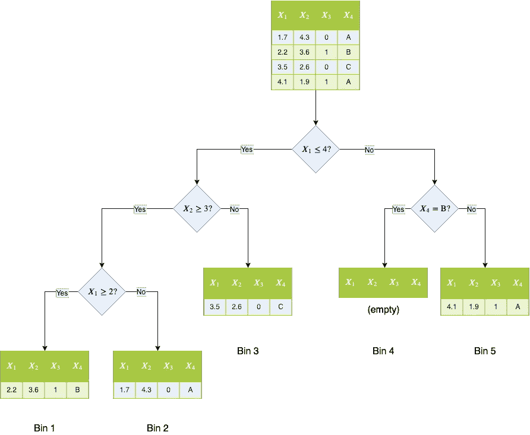

多一层的玩具树。编码现在可以采用从 1 到 5 的值。

这里，编码 1 将被解码成

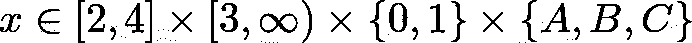

这为现在搞乱第一特征留下了更少的空间，给出了更低的重建误差。改善解码的其他方法是嵌入关于特征空间的知识，例如，有时特征总是大于零或小于一些界限，如 1 或 255(图片数据)，因此我们可以移除无限或负无限的界限。

但是让决策树越来越深不是可持续的解决方案，因为我们会遇到过度拟合的问题，就像在回归和分类任务中一样。然而，到目前为止，我们仍然只使用一维！那么，我们能做什么呢？

# 埃弗斯特

让我们并行连接更多的决策树进行编码！那么每一棵树给我们一个潜在空间的维度，每棵树的箱数就是特征值。考虑以下 3 棵树的例子:

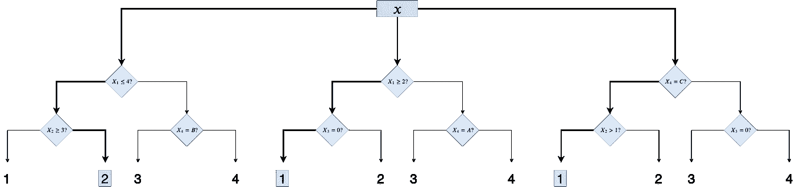

一个由三棵决策树组成的 Forest。加粗的箭头表示 x 选择的路径。

三个决策树中的每一个都给了我们一个潜在空间的坐标，在这个例子中是 3。在我们的例子中，潜在的每个特征可以是 1、2、3 或 4。但是一般来说，如果每个决策树有不同数量的箱也没问题。

所以，让我们想象我们的输入 *x* 在潜在空间中被编码为 *(2，1，1)* ，我们现在希望解码它。我们只需要再次收集所有的线索，并把它们放在一起，以创建一个潜在的候选人集。

线索是:

*   从树 1，bin 2:
    - *X₁* 小于或等于 4 *- X* ₂小于 3
*   从树 2，bin 1:
    - *X₁* 大于或等于 2*-
    x*₃等于 0
*   从树 3，bin 1:
    - *X₄* 等于 C
    - *X* ₂大于 1

把所有东西放在一起给了我们

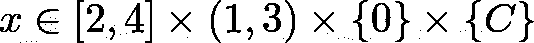

所以最小解码会给我们 *d(x)=(2，1，0，C)。*

这几乎是理解森林的全部内容！现在仍然缺少的是如何实际训练 eForest ，但这是一个简短的问题:

> 使用随机决策树，即使用随机特征和随机分界点(来自合理范围)进行分裂的树。

我也是这样编造例子的。没有复杂的算法。

现在，让我们转到一些实验，看看它们在性能方面是否有任何优势。

# 实验

[1]的作者进行了几项实验，其中包括 CNN 自动编码器大放异彩的图像编码。我将直接粘贴[1]中的结果、表格和图像。

> 你可以在 [GitHub](https://github.com/kingfengji/eForest) 上找到用于实验的代码。

数据集是具有 *28x28x1=784* 特征(1 个颜色通道)的经典 MNIST 和具有 *32x32x3=3072* 特征(3 个颜色通道)的 CIFAR-10。

## **关于实验中使用的自动编码器**

MLP 是使用几个线性层的“正常”自动编码器。确切的规格可以从[1]中得到，但是 MLP₁使用 500 维的潜在空间和 1000 维的 MLP₂。
CNN-AE 是一个*卷积自动编码器*，即它在内部使用卷积。它遵循[本规范](https://blog.keras.io/building-autoencoders-in-keras.html)。SWW AE 是一个更好的 CNN-AE。eForestˢ₅₀₀也是一家使用样品标签的林业公司，我们在这里没有涉及。它将输入数据压缩到 500 个特征(下标 1000 将其压缩到 1000 个维度)。最后，eForestᵘ₅₀₀是本文所讨论的森林。下标数字再次表示潜在空间的维度。

## 重建误差

结果看起来很有希望！MNISt 和 CIFAR-10 数据集的重建误差非常低。来自[1]:

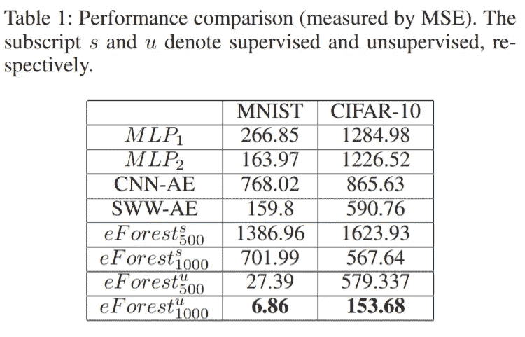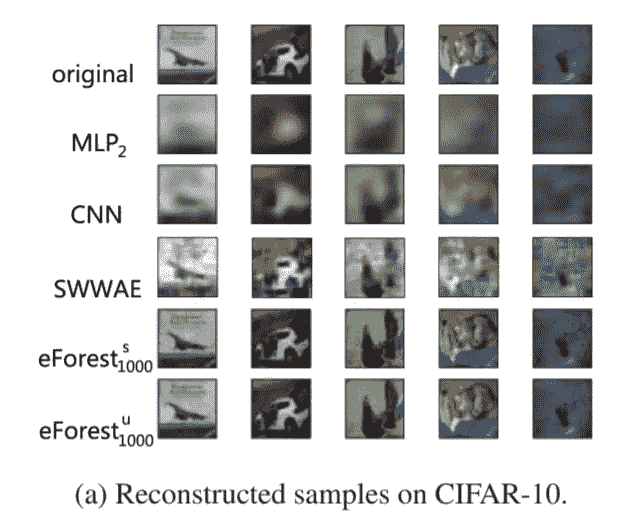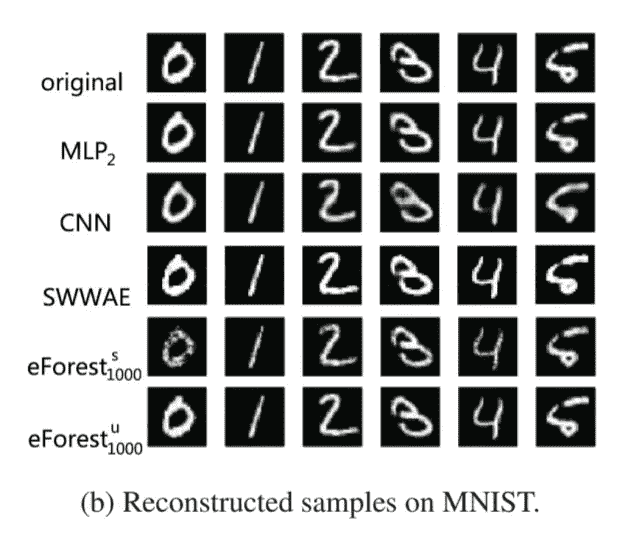

原始测试样本(第一行)和重构样本。

但是，人们必须进行进一步的实验，以检查 eForests 是否过度拟合。至少作者复用了的*模型，并最终得到了好的结果，这是一个很好的指标，表明 eForest 推广得很好，而不仅仅是用心学习训练样本。模型重用意味着在一个训练集上训练一个模型，并在**不同的训练集**上评估它。*

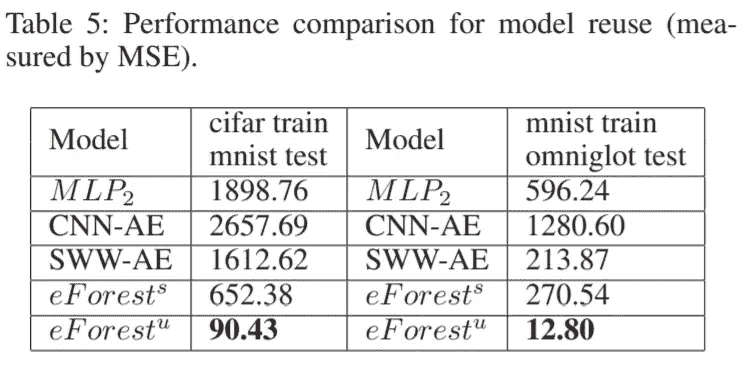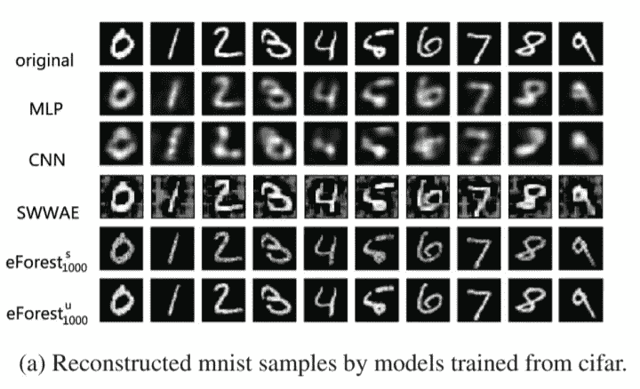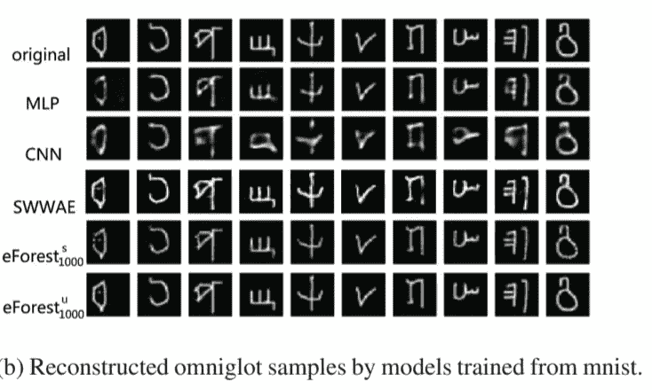

原始测试样本(第一行)和重构样本。所有模型都在一些训练集上进行了训练，并在不同的训练集上进行了测试！使用 eForests 时，结果看起来不错。

> 我只是不明白，当原始数据只有 28*28=784 维时，作者为什么要为 MNIST 数据集使用 1000 维的潜在空间。在我看来，使用 500 维会更有意义。但是，即使我们使用这种人为的设置:eForest 比其他方法执行得更好，neark 实现了无损压缩，这也是我所期望的。

## 计算效率

与其他方法相比，训练时间非常短。然而，根据作者的说法，编码和解码需要更多的时间，这仍然有优化的空间。来自[1]:

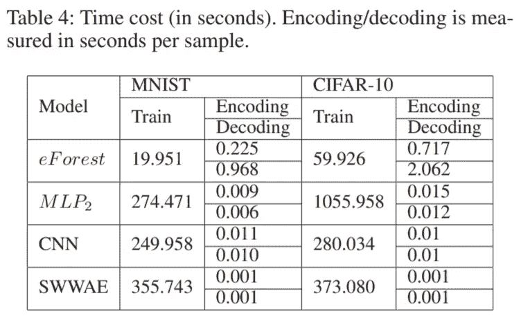

# 我的概念验证实施

由于算法相当简单，我尝试自己实现。我甚至不用从头开始，因为编码器已经自带了 [scikit-learn](https://scikit-learn.org/stable/) *类型的*！

类[randomtreesemleding](https://scikit-learn.org/stable/modules/generated/sklearn.ensemble.RandomTreesEmbedding.html)也创建了许多随机决策树，并根据输入的位置对它们进行编码 *x* 。然而，它们使用二进制编码，这增加了潜在的空间维度。使用我的具有三棵树和每棵树 4 个箱的例子，编码将是 *(0，1，0，0 | 1，0，0，0 | 1，0，0)* 而不是 *(2，1，1)*，即潜在空间将具有 12 的**维度，而不是只有 3 个**。但是一旦知道了每棵树的叶子数量，将二进制表示转换成每棵树的一个数字就很容易了。幸运的是，scikit-learn 为我们提供了一个方法。

因此，实现编码部分很简单！也可以从我代码中的短`encode`方法看出来。这仅仅是

```
output = self.random_trees_embedding.transform(X)
indices = []
start = 0
for estimator in self.random_trees_embedding.estimators_:
    n_leaves = estimator.get_n_leaves()
    indices.append(output[:, start:start + n_leaves].argmax(axis=1))
    start = start + n_leaves
return np.array(indices).transpose()
```

解码花了我更多的时间，这也是我效率低下的方式，请原谅我！:D，我只是需要一个快速的概念验证。

你可以在这里找到我的代码。请随意改进！

我的图形结果:

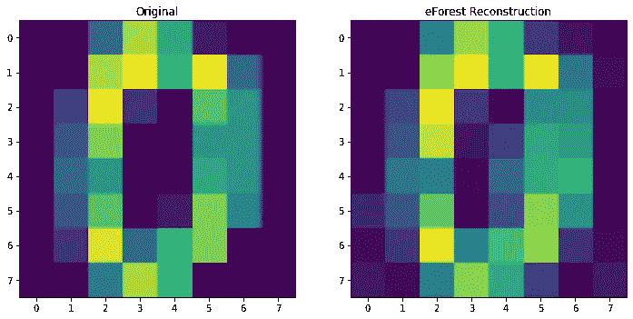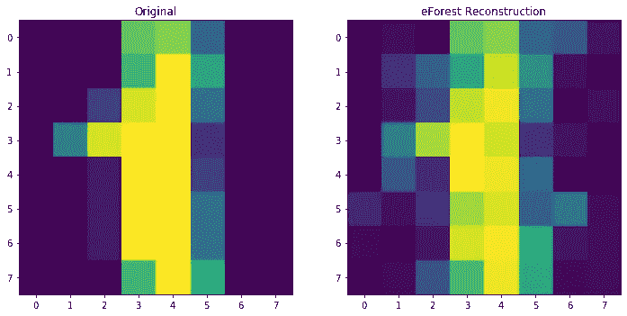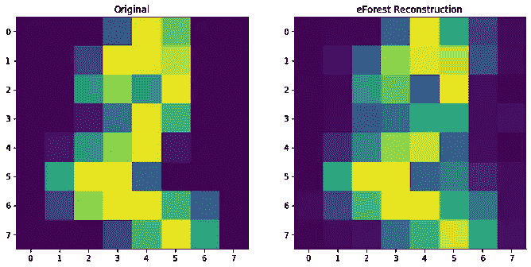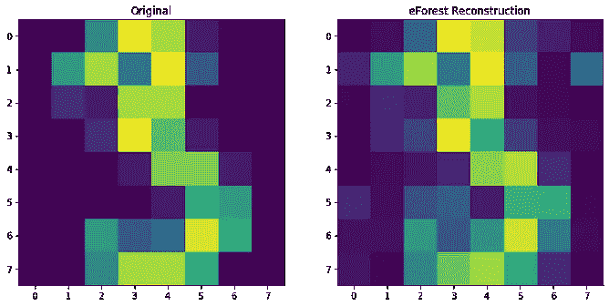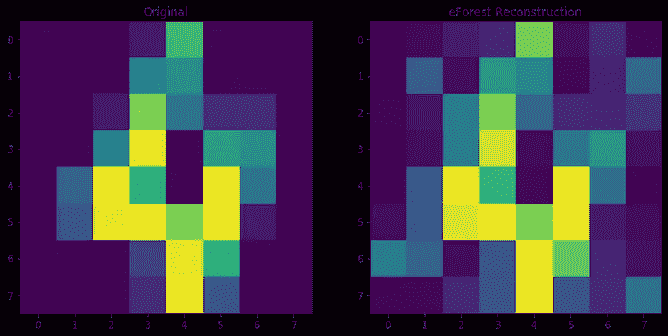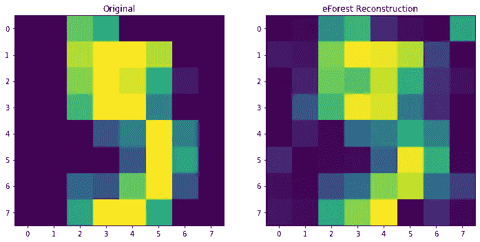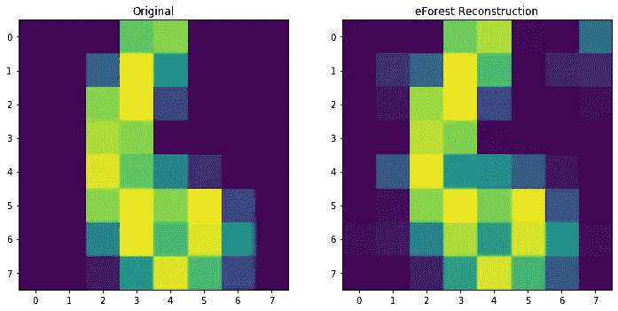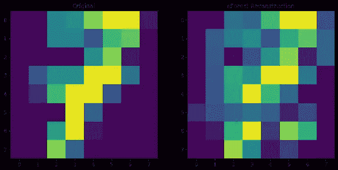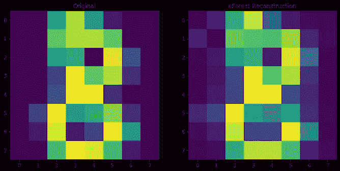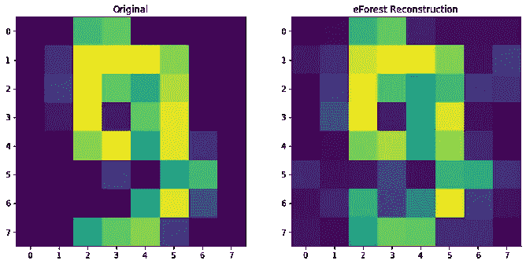

我认为重建看起来很好，所以可能我的解码工作。但是，请在使用这些代码进行任何有成效的工作之前，先检查一下这些代码。

如果你想要真正的交易，去官方克隆的 GitHub 上工作。但是要准备好创建一个虚拟环境并手动修补一些 scikit-learn 文件。

# 结论

我们已经看到了如何用决策树构建一个自动编码器。这是一个自动编码器，具有独特的，但易于理解的设计，可以训练得非常快。此外，重构精度可以与成熟的卷积自动编码器相媲美。

另一方面，编码和解码速度仍然很低，并且必须在野外的真实数据集上测试 eForest。也许你可以写一篇关于它的文章。:)

# 参考

[1]冯军，周志军，[森林自动编码器](https://arxiv.org/pdf/1709.09018.pdf) (2017)，第 32 届人工智能大会

我希望你今天学到了新的、有趣的、有用的东西。感谢阅读！

**作为最后一点，如果你**

1.  **想支持我多写点机器学习和**
2.  **无论如何，计划获得一个中等订阅，**

**为什么不通过此链接**[](https://dr-robert-kuebler.medium.com/membership)****？这将对我帮助很大！😊****

***说白了，给你的价格不变，但大约一半的订阅费直接归我。***

**非常感谢，如果你考虑支持我的话！**

> **如有任何问题，请在 [LinkedIn](https://www.linkedin.com/in/dr-robert-k%C3%BCbler-983859150/) 上给我写信！**