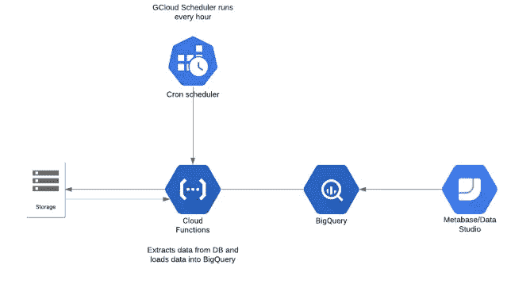
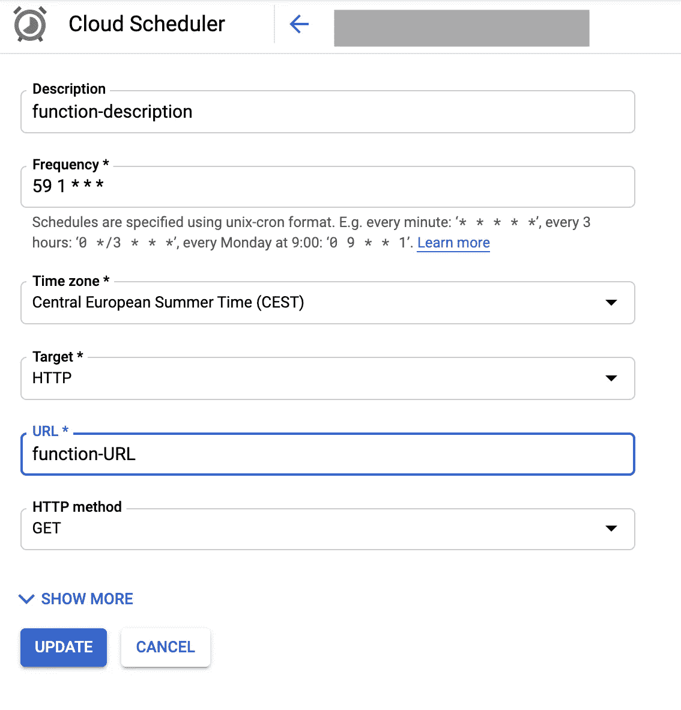

# 用 Python 和 Google 云平台构建简单的 ETL 管道

> 原文：<https://towardsdatascience.com/building-a-simple-etl-pipeline-with-python-and-google-cloud-platform-6fde1fc683d5?source=collection_archive---------6----------------------->

## 使用 Google Cloud 函数从 FTP 服务器提取数据并加载到 BigQuery

[GCP](https://cloud.google.com/blog/products/gcp)

有很多 ETL 工具，有时它们可能会让人不知所措，特别是当你只想将文件从 A 点复制到 b 点时。所以今天，我将向你展示如何使用 **python 3.6** 和谷歌云函数从 FTP 服务器提取 CSV 文件(提取)、修改(转换)并自动将其加载到谷歌 BigQuery 表(加载)。

在本文的最后，您将能够从 FTP 服务器提取一个文件，并在 Google Cloud 函数中使用 Python 将其加载到数据仓库中。

在本文中，我们将做以下工作:

*   设置云功能
*   提取数据
*   转换数据
*   加载数据
*   自动化我们的管道

# 首先，什么是 ETL？

> 提取、转换、加载(ETL)是将数据从一个或多个源复制到目标系统的一般过程，目标系统以不同于源的方式或在不同于源的上下文中表示数据。—维基百科

# **场景**

在我们开始之前，让我给你一些背景信息。一家第三方服务提供商有一台 FTP 服务器，其中存储了多个 CSV 文件，每个文件都包含一家物流公司的日常交易数据。我们需要数据仓库中的数据，这样我们就可以在内部与利益相关者共享这些数据，并监控性能。

这家物流公司的基础设施团队每天从他们的数据库中导出一个 CSV 文件，并将其上传到 FTP 服务器。

我们的工作是每天从服务器上复制这些文件，对其进行清理，然后将其加载到我们的数据仓库中，这样我们就可以将其连接到其他数据源并对其进行分析。

这是我们的 ETL 管道图最终的样子:

使用 [Lucidchart](https://www.lucidchart.com/pages/examples/uml_diagram_tool) 创建

**Google Cloud Functions**:[Cloud Functions](https://cloud.google.com/functions/)(CF)是 Google Cloud 的无服务器平台，用于执行响应特定事件的脚本，如 HTTP 请求或数据库更新。CF 的替代方案是 [AWS Lambda](https://aws.amazon.com/lambda/) 或 [Azure Functions](https://azure.microsoft.com/en-us/services/functions/) 。

**设置您的云功能**

*   [进入云功能概述页面](https://console.cloud.google.com/functions/list)。
    确保您启用了云功能的项目被选中。
*   单击创建函数。
*   说出你的函数。
*   在触发器字段中，选择 HTTP 触发器。
*   在源代码字段中，选择内联编辑器。在本练习中，您将使用我们将要一起处理的 [**代码**](https://github.com/togobingi/google_cloud_function/blob/master/mysqlToBQ.py) ，以便您可以在编辑器中删除默认代码。
*   使用运行时下拉列表选择运行时。

确保您的运行时设置为“Python 3.7”，并在“高级选项”下将区域更改为离您最近的区域。在撰写本文时，CF 并不是在每个谷歌数据中心区域都可用，所以请点击这里的[查看哪里启用了云功能。](https://cloud.google.com/functions/docs/locations)

完成这些步骤后，您的显示应该如下所示:

来自 [GCP 控制台](https://cloud.google.com/)的截图

## 我们的自定义代码

一个云函数有两个文件；一个 *main.py* 和一个 *requirements.txt* 文件。后者托管我们脚本工作所需的所有文件依赖项，因此单击 *requirements.txt* 选项卡，并确保编辑器中包含这些依赖项，如下所示:

所有依赖项的快速摘要:

*   google-cloud-bigquery:这个库允许我们访问 bigquery 并与之交互
*   python-csv:这个库用于用 python 操作 csv 文件
*   requests:是一个用于发送 HTTP 请求的 HTTP 库，我们将需要它来访问 FTP URL。
*   wget:用于从互联网下载文件
*   pytest-shutil:这用于 SSH 访问

# 提取

现在在 *main.py* 选项卡中，您可以开始包含下面的代码。看第 1 到 4 行。我们创建了一个名为“ftp_function”的函数，以后用 HTTP 请求访问云函数时会用到这个函数。然后，我们使用必要的凭证登录到 FTP 服务器，并导航到服务器上存储文件的适当目录。

请注意，我工作的 FTP 服务器有多个 CSV 代表不同日期的事务数据。所以为了获得目录中最新的文件，我使用了从第 7 行到第 9 行的代码。

其余的代码获取文件并下载它。

> 注意:要通过秘密管理器保护您的凭证，请遵循本[指南](https://medium.com/geekculture/secure-your-credentials-in-google-cloud-functions-with-secret-manager-22a4a1b3788a)。

# 改变

为了“转换”数据，我们将对刚刚下载的 CSV 文件做一个简单的更改。我们将简单地将 CSV 文件中每次出现的“FBA”更改为“AMAZON”。下面是代码。

> 这里也要注意，Google Cloud Function 有一个`*/tmp*`目录，可以临时存放文件。该目录中的文件存储在实例的 RAM 中，因此写入`/tmp`会占用系统内存。一旦实例停止运行，目录中的所有临时文件都将被删除。

# 负荷

现在，确保你[创建了你的大查询表](https://cloud.google.com/bigquery/docs/tables)。然后我们简单地使用下面的代码将转换后的 CSV 文件加载到您创建的 Bigquery 表中。因为我们启用了“[自动检测](https://cloud.google.com/bigquery/docs/schema-detect)”，所以 Bigquery 表在创建时不必有模式，因为它将基于 CSV 文件中的数据进行推断。

当您完成编写脚本时，您可以通过单击“创建”来部署云功能。当云功能部署成功时，您应该会看到一个绿色的复选标记，如下所示…

[来源](https://cloud.google.com/functions/docs/quickstart-console)

# 使自动化

现在剩下要做的就是创建一个 cron 作业(Cloud Scheduler ),它将在某个预定义的时间间隔自动调用 CF。好消息是，在谷歌云平台上创建 cron jobs 非常简单，也是最简单的部分。你可以按照 [**这里**](https://cloud.google.com/scheduler/docs/creating) 的指示或者复制下图。

[来源](https://cloud.google.com/functions/docs/quickstart-console)

截图自 GCP

这里的“频率”字段将在每天凌晨 1:59 运行我们的脚本。

> 您可以使用这个很酷的[站点编辑器](https://crontab.guru/)来处理简单的 cron 调度表达式。

既然我们的数据已经存放在数据仓库中，我们可以将它连接到任何可视化工具并对其进行分析。

就是这样。希望这对你有帮助。这是一种非常简单的开发 ETL 的方法，任何人都可以在其上进行构建。

> *你可以* [*成为中等会员*](https://medium.com/@tobisam/membership) *享受更多这样的故事。*

你可以在 [**Github**](https://github.com/togobingi/google_cloud_function) 上找到完整脚本的链接。