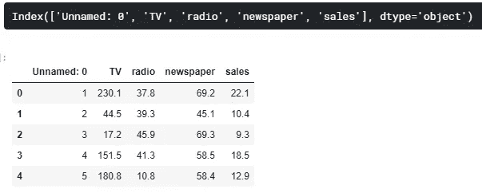
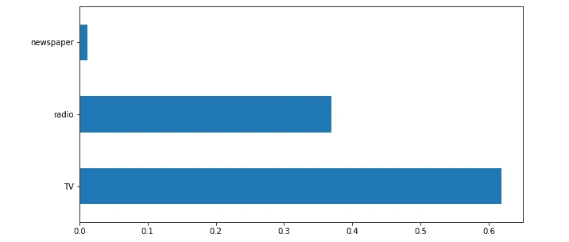
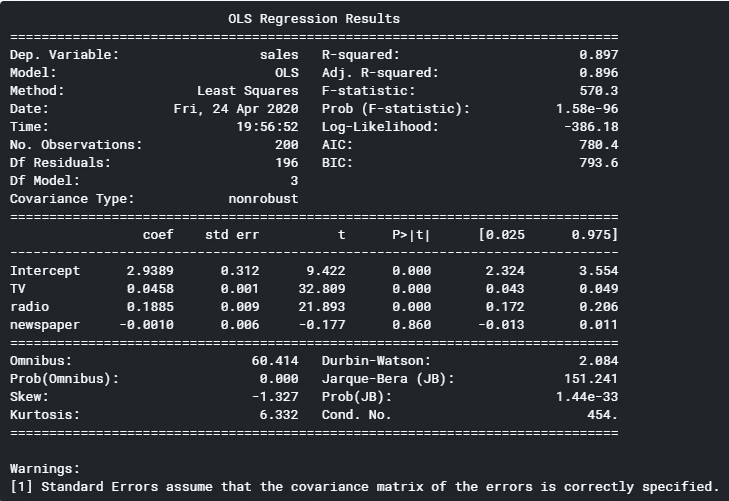
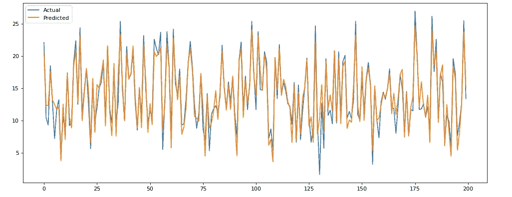

# 如何用 Python 构建一个简单的营销组合模型

> 原文：<https://towardsdatascience.com/building-a-simple-marketing-mix-model-with-ols-571ac3d5b64f?source=collection_archive---------5----------------------->

## 又一个使用 Python 代码的端到端数据科学项目！


亚伦·塞巴斯蒂安在 [Unsplash](https://unsplash.com/s/photos/advertising?utm_source=unsplash&utm_medium=referral&utm_content=creditCopyText) 上拍摄的照片

# 目录

1.  [简介](#4502)
2.  [你将学到什么](#5ec9)
3.  [什么是营销组合模式？](#2b25)
4.  [营销组合模型演练](#905e)

> ***如果你喜欢这篇文章，请务必*** [***订阅***](https://terenceshin.medium.com/subscribe) ***千万不要错过另一篇关于数据科学指南、技巧和提示、生活经验等的文章！***

# 介绍

由于高需求，我又带着另一个带 Python 代码的循序渐进的数据科学项目回来了！这个非常有趣，因为除了我将要介绍的内容之外，您还可以做更多的事情——然而，我相信这为任何对营销和数据科学感兴趣的人提供了一个良好的开端。

这个项目关系到许多企业面临的一个常见的现实问题— **营销归因**。这是确定每个营销渠道对销售/转化有多大贡献的科学。当你引入电视或广播等线下营销渠道时，困难通常会出现，因为没有直接的方法来衡量这些渠道的影响。

# 你会学到什么

*   您将了解什么是营销组合模型(MMM ),以及如何使用它来评估各种营销渠道
*   在探索数据时，您将学习基本的概念和技术
*   您将了解什么是普通最小二乘(OLS)回归，如何实现它，以及如何评估它

# 什么是营销组合模式？

**营销组合模型(MMM)** 是一种用于确定市场属性的技术。具体来说，它是一种对营销和销售数据进行统计的技术(通常是回归)，以估计各种营销渠道的影响。

不同于归因建模，另一种用于营销归因的技术，营销组合模型试图衡量不可估量的营销渠道的影响，如电视、广播和报纸。

一般来说，你的输出变量是销售额或转化率，但也可以是网站流量。您的输入变量通常包括按时段(日、周、月、季度等)划分的渠道营销支出，但也可以包括我们稍后将讨论的其他变量。

# 营销组合模型演练

在这个项目中，我们将使用一个虚构的数据集，该数据集包括电视、广播和报纸上的营销支出，以及各个时期相应的美元销售额。

*数据集是* [*这里是*](https://www.kaggle.com/sazid28/advertising.csv) *。*

## 设置

首先，我们将像往常一样导入库并读取数据。

```
import numpy as np
import pandas as pd
import seaborn as sns
import matplotlib.pyplot as pltdf = pd.read_csv("../input/advertising.csv/Advertising.csv")
```

## 理解我的变量

接下来，我们将查看数据集中的变量，并了解我们正在处理的内容。

```
print(df.columns)
df.describe()
```



很快，您可以看到这个未命名的变量:0 实际上是一个从 1 开始的索引——所以我们将删除它。

```
df = df.copy().drop(['Unnamed: 0'],axis=1)
```

因为这是一个虚构的简单数据集，所以有很多步骤我们不必担心，比如处理缺失值。但一般来说，您需要确保数据集是干净的，并为 EDA 做好了准备。

## 探索性数据分析

我总是喜欢做的第一件事是创建一个相关矩阵，因为它让我一眼就能更好地理解变量之间的关系。

```
corr = df.corr()
sns.heatmap(corr, xticklabels=corr.columns, yticklabels=corr.columns, annot=True, cmap=sns.diverging_palette(220, 20, as_cmap=True))
```


马上，我们可以看到电视和销售之间有很强的相关性(0.78)，广播和销售之间有中等的相关性(0.58)，报纸和销售之间的相关性很弱(0.23)。现在下结论还为时过早，但这有利于我们继续前进。

与相关矩阵类似，我想创建一个变量的配对图，这样我可以更好地理解变量之间的关系。

```
sns.pairplot(df)
```


这似乎与相关矩阵相一致，因为电视和销售之间似乎有很强的关系，广播和报纸之间的关系更弱。

## 特征重要性

要素重要性允许您确定每个输入变量对预测输出变量的“重要性”。如果打乱某个要素的值会增加模型误差，则该要素非常重要，因为这意味着模型依赖该要素进行预测。

我们将快速创建一个随机森林模型，以便我们可以确定每个功能的重要性。

```
# Setting X and y variables
X = df.loc[:, df.columns != 'sales']
y = df['sales']# Building Random Forest model
from sklearn.ensemble import RandomForestRegressor
from sklearn.model_selection import train_test_split
from sklearn.metrics import mean_absolute_error as maeX_train, X_test, y_train, y_test = train_test_split(X, y, test_size=.25, random_state=0)
model = RandomForestRegressor(random_state=1)
model.fit(X_train, y_train)
pred = model.predict(X_test)# Visualizing Feature Importance
feat_importances = pd.Series(model.feature_importances_, index=X.columns)
feat_importances.nlargest(25).plot(kind='barh',figsize=(10,10))
```



似乎有一种模式，电视是最重要的，其次是广播，最后才是报纸。让我们实际建立我们的 OLS 回归模型。

## OLS 模型

OLS 是普通最小二乘法的缩写，是一种用于估计线性回归模型中参数的方法。*查看我的文章，* [*线性回归 5 分钟讲解*](/linear-regression-explained-in-5-minutes-5d643ca0a662) *如果你不知道回归是什么！*

Python 如此神奇的地方在于它已经有了一个库，我们可以用它来创建 OLS 模型:

```
import statsmodels.formula.api as sm
model = sm.ols(formula="sales~TV+radio+newspaper", data=df).fit()
print(model.summary())
```



**。summary()** 为我们的模型提供了丰富的见解。我要指出两件对我们最有用的事情:

1.  调整的 R 平方是 0.896，这意味着我们的数据中几乎 90%的变化可以用我们的模型来解释，这非常好！*如果你想了解更多关于 r 平方和其他用于评估机器学习模型的指标，请查看我的文章* [*这里*](/how-to-evaluate-your-machine-learning-models-with-python-code-5f8d2d8d945b) *。*
2.  电视和广播的 p 值小于 0.000，但报纸的 p 值为 0.86，这表明报纸支出对销售没有显著影响。

接下来，让我们用实际销售值绘制预测销售值的图表，直观地了解我们的模型的表现:

```
# Defining Actual and Predicted values
y_pred = model.predict()
labels = df['sales']
df_temp = pd.DataFrame({'Actual': labels, 'Predicted':y_pred})
df_temp.head()# Creating Line Graph
from matplotlib.pyplot import figure
figure(num=None, figsize=(15, 6), dpi=80, facecolor='w', edgecolor='k')y1 = df_temp['Actual']
y2 = df_temp['Predicted']plt.plot(y1, label = 'Actual')
plt.plot(y2, label = 'Predicted')
plt.legend()
plt.show()
```



实际值与预测值

还不错！在给定电视、广播和报纸支出的情况下，这个模型似乎在预测销售方面做得很好。

## 更进一步

在现实中，数据可能不会像这样干净，结果可能不会看起来很漂亮。实际上，您可能需要考虑更多影响销售的变量，包括但不限于:

*   季节性:公司的销售几乎总是季节性的。例如，一家滑雪板公司的销售额在冬季会比夏季高得多。在实践中，您可能希望包含一个变量来说明季节性。
*   **延续效应**:营销的影响通常不会立竿见影。在许多情况下，消费者在看到广告后需要时间来考虑他们的购买决定。延续效应解释了消费者接触广告和对广告做出反应之间的时间差。
*   **基础销售与增量销售:**并非每笔销售都归功于营销。如果一家公司在营销上完全没有花费，但仍然有销售额，这将被称为其基础销售额。因此，为了更进一步，你可以试着在**增量销售**而不是总销售额上模拟广告支出。

我希望你喜欢这个项目——让我知道你还想看什么样的项目！

# 感谢阅读！

如果你喜欢我的工作，想支持我…

1.  支持我的最好方式就是在**媒体**上关注我[这里](https://medium.com/@terenceshin)。
2.  在 **Twitter** [这里](https://twitter.com/terence_shin)成为第一批关注我的人之一。我会在这里发布很多更新和有趣的东西！
3.  此外，成为第一批订阅我的新 **YouTube 频道** [这里](https://www.youtube.com/channel/UCmy1ox7bo7zsLlDo8pOEEhA?view_as=subscriber)！*目前还没有视频，但即将到来！*
4.  在 **LinkedIn** [这里](https://www.linkedin.com/in/terenceshin/)关注我。
5.  在我的**邮箱列表** [这里](https://forms.gle/UGdTom9G6aFGHzPD9)注册。
6.  查看我的网站，[**terenceshin.com**](https://terenceshin.com/)。