# 从头开始构建一个简单的神经网络

> 原文：<https://towardsdatascience.com/building-a-simple-neural-network-from-scratch-a5c6b2eb0c34?source=collection_archive---------38----------------------->

## 你有没有想过神经网络是如何工作的？它如何学习，如何扩展到我们输入的海量数据？

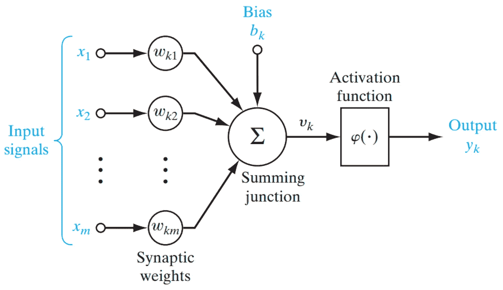

([来源](https://res.mdpi.com/information/information-10-00113/article_deploy/html/images/information-10-00113-g003.png))

在本文中，我们将研究只有一个神经元的简单神经网络的工作原理，并了解它在我们的“Cat v/s Non Cat 数据集”上的表现。

在本文结束时，您将能够-

1.  从头开始编写你自己的神经网络
2.  理解神经网络如何工作
3.  如何转换输入数据以输入神经网络

# 目标

我们将对我们的神经网络进行编码，然后使用经过训练的网络来确定一幅图像中是否包含一只猫。这类问题被称为“二元分类问题”。它包括将输入分为两类，在我们的例子中是“Cat”或“Not cat”。

# 神经网络的基础

## 线性回归方程

神经网络中的单个神经元作为直线工作，其具有以下等式:

这是神经网络的整个概念所基于的基本方程。让我们打破这个等式:

**y** :因变量(神经网络的输出)

**m** :直线的斜率

**x** :独立变量(输入特征)

**b** : y 轴截距

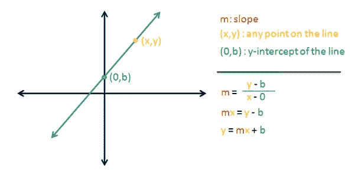

绘制在图表上的线性方程([来源](https://research.aimultiple.com/how-neural-networks-work/)

就神经网络而言，我们将斜率指定为权重，截距指定为偏差，输出(y)指定为 z，因此等式变为:

在这里，我们只有一个特征，我们给模型。要输入多个特征，我们必须放大等式。

## 扩展到多种功能

上述等式可以扩展到“n”个特征，可以写成:

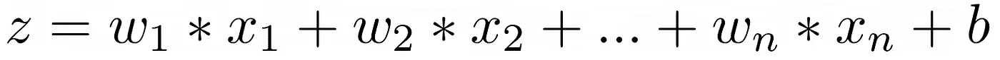

在这里，我们有“n”个输入特征提供给我们的模型。对应于每个输入特征，我们有一个权重，指定该特征对我们的模型预测输出有多重要。偏差项有助于在轴上移动我们的线，以更好地适应训练数据，否则线将始终穿过原点(0，0)。

## 同时做这件事

我们可以利用矩阵将所有权重与输入相乘，并向它们添加偏差。这可以通过以下方式完成:

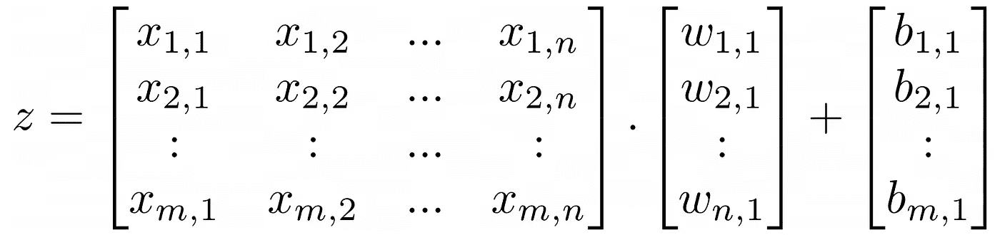

这里，每一行代表一个训练示例(在我们的例子中是图像)，每一列代表一个像素数组。

在 python 中，我们将使用[矢量化](https://www.geeksforgeeks.org/vectorization-in-python/)来实现上述概念。

> 注意:在上面的等式中，我们使用“X.w+b ”,因为我们的输入矩阵是(mXn)的形状，其中“m”是样本的数量,“n”是特征的数量。

训练神经网络的目标是更新权重和偏差，以获得尽可能准确的预测。

## 神经元

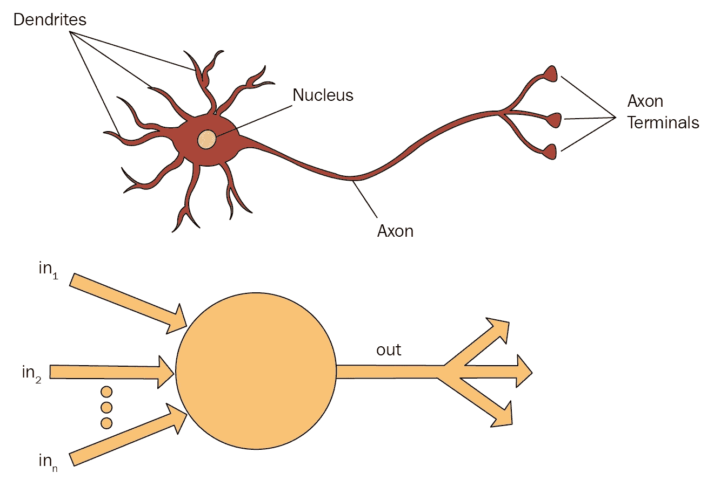

([来源](https://subscription.packtpub.com/book/big_data_and_business_intelligence/9781789344073/1/ch01lvl1sec12/the-mechanics-behind-anns)

神经元是神经网络中的一个单元。它模拟了我们大脑中的神经元，将“树突”作为输入，“核”作为身体，“轴突”作为输出。每个神经元接受一些输入，对其进行处理，然后根据激活函数给出一个输出。

如果你不能理解这些概念中的任何一个，请耐心听我说，一旦我们开始把事情放在一起，一切都会变得有意义。

# 编码我们的神经网络

从创建阶段到获得预测，整个过程分为以下几个部分:

1.  准备输入到我们的网络
2.  初始化权重和偏差
3.  正向传播
4.  计算损失
5.  反向传播
6.  更新权重和偏差
7.  多次重复上述过程(时期)
8.  获得预测

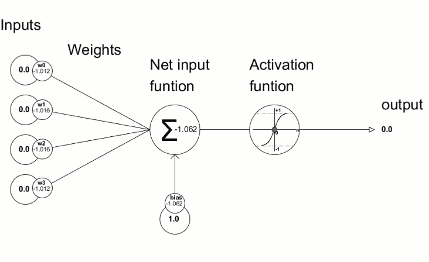

([来源](https://www.mql5.com/en/blogs/post/724245))

## 准备输入

我们的输入是“猫”和“不是猫”的图像集合。每个输入图像都是 64x64 像素大小的彩色图像。我们在训练数据集中总共有 209 幅图像，在测试数据集中有 50 幅图像。为了将这些图像输入到我们的神经网络中，这些图像必须被改造成像素向量。因此，每个图像将按行的顺序排列成一维向量。

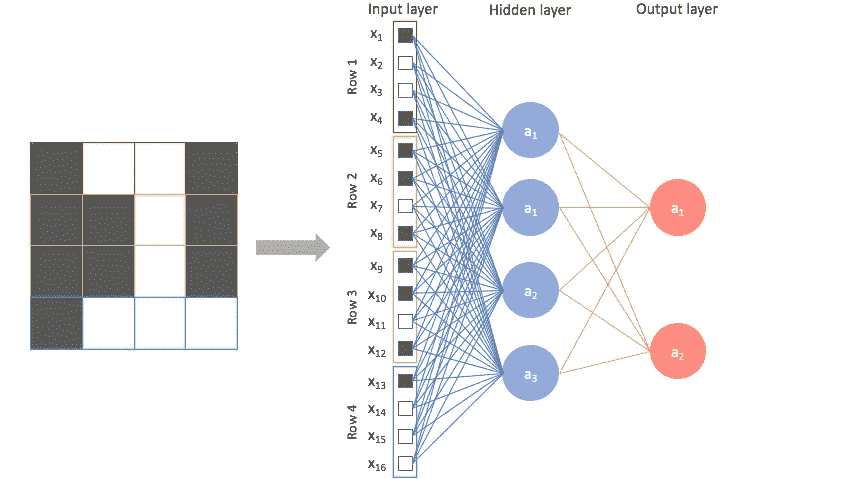

([来源](https://www.jeremyjordan.me/convolutional-neural-networks/))

最初，我们输入的形状是(209，64，64，3)，但现在转换后，它将变成(209，64x64x3)，即(209，12288)。现在这个“12288”是我们神经网络的输入数量，“209”是训练样本的数量。

我们的图像是 8 位的，所以图像中的每个像素都有一个在[0，255]范围内的值，即总共 256 个值的范围(2⁸=256).因此，我们必须通过将每个像素除以最大值(即 255)来标准化我们的图像。

> 神经网络对输入尺度非常敏感。我们不希望我们的输入变化太大，否则较大的输入可能会支配较小的输入。因此，如果输入的范围很大，对其进行归一化总是一个好的做法。

## 初始化权重和偏差

我们必须将权重和偏差初始化为某个小值，以便能够开始训练过程。

在这里，我们将权重乘以 0.01，使其在整个训练过程中不会爆炸(变得非常大)。

注意:在代码中，‘b’只是一个‘浮点’数，因为 python 中的[广播](https://www.geeksforgeeks.org/python-broadcasting-with-numpy-arrays/)。它会自动将这个“浮点数”转换成所需的矢量形状。

现在我们已经初始化了权重和偏差，让我们进入下一步。

## 正向传播

这里，我们将使用上面建立的等式计算输出“z ”,然后在输出上使用激活函数。

在二元分类的情况下，我们将使用 sigmoid 激活函数，因为 sigmoid 函数通过将输入变换到[0，1]区间来给出输出。因此，我们可以通过将值设置为大于 0.5 比 1 和小于 0.5 比 0 来轻松找到目标类。

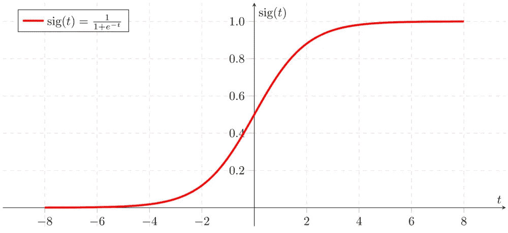

乙状结肠的公式是:

在哪里，

让我们看看实现这两个步骤的代码:

现在我们已经得到了神经元的输出，我们可以计算损失，看看我们的模型表现得有多好/差。

## 计算损失

在二元分类中，使用的损失函数是**二元交叉熵/对数损失。**它由公式给出:

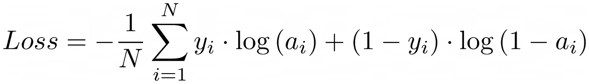

在哪里，

**m** :数据集中的样本总数

**yᵢ**:iᵗʰ样品的真实标签

**aᵢ**:iᵗʰ样本的预测值

这可以在 python 中实现为:

这个损失将告诉我们离预测正确的产量还有多远。如果损失为 0，那么我们就有了一个完美的模型。但实际上，如果损失为 0，那么我们的模型可能会过度拟合数据。

## 反向传播

这是奇迹发生的地方。在每次迭代中，基于模型输出和预期输出，我们计算梯度。梯度是我们需要改变多少权重和偏差来减少损失。

为了计算梯度，我们使用以下公式:

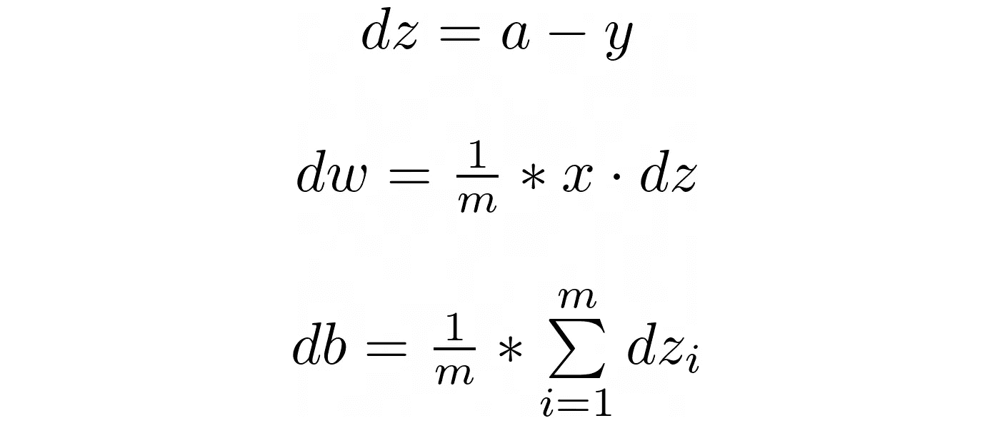

在 python 中，上述等式可以实现为:

现在，“dw”和“db”包含我们需要分别调整权重和偏差的梯度。

## 更新权重和偏差

我们现在需要用刚刚计算的梯度来调整权重和偏差。为此，使用以下等式:

其中' **α' (alpha)** 是学习率，它定义了我们的更新应该有多大/多小。

更新参数的代码是:

现在我们只需多次重复这些步骤来训练神经网络。

## 训练神经网络

为了训练神经网络，我们必须运行上述步骤一些时期(重复这些过程的次数)。

现在我们的神经网络已经训练好了，我们可以预测新输入的输出。

## 获得预测

为了从我们的神经网络获得预测，我们必须转换神经网络的输出‘a ’,使得小于 0.5 的输出值变成 0，否则变成 1。

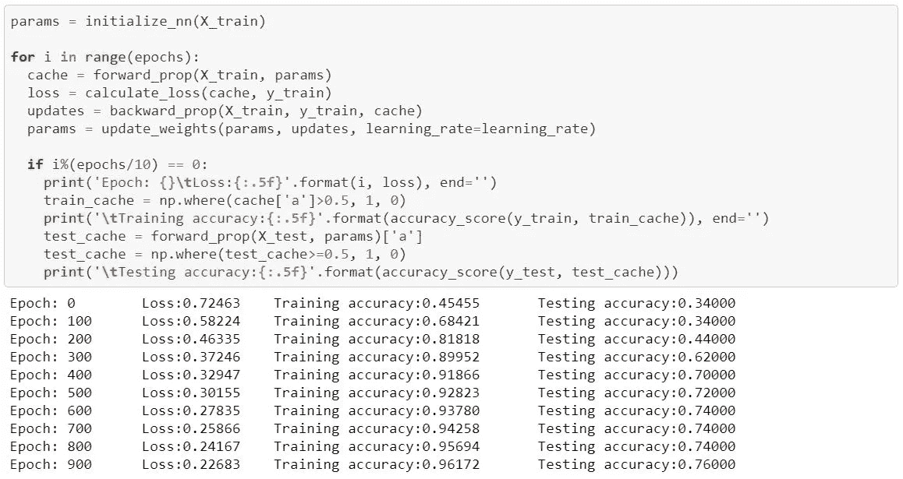

虽然我们只有一个神经元，但我们仍然在训练数据上获得了 96%的准确率，在测试数据上获得了 76%的准确率，这还不错。

恭喜你！我们刚刚从零开始制作了第一个神经网络。在下一篇文章中，我将告诉你如何开发一个浅层神经网络，它将有一个包含多个神经元的隐藏层。

**你可以在 Github 上找到完整的代码:**

 [## akarsh-sa xena/从头开始的神经网络

### 此时您不能执行该操作。您已使用另一个标签页或窗口登录。您已在另一个选项卡中注销，或者…

github.com](https://github.com/akarsh-saxena/Neural-Network-From-Scratch/tree/master/Artificial%20Neural%20Network/Simple%20Neural%20Network) 

这就是从头开始创建和训练神经网络的整个过程。我希望你明白一切。不过，如果你还有什么不明白的，请在这里留言，我会尽力解答你的疑问。

关注我在 [Github](https://bit.ly/AkarshSaxena) 和 [LinkedIn](https://bit.ly/AkarshLinkedIn) 了解更多信息。