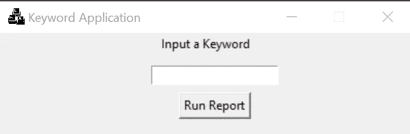
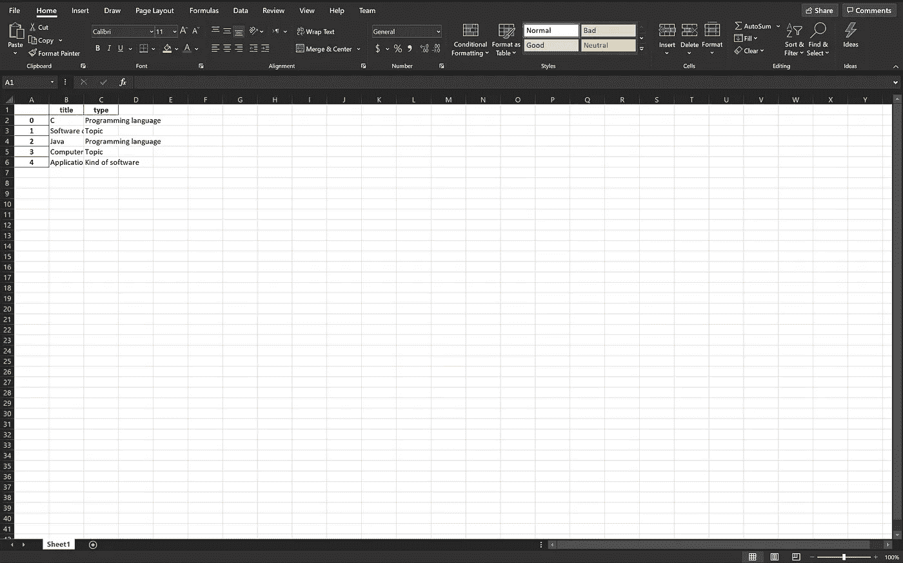

# 用 Google Trends 构建简单的 Python 应用程序

> 原文：<https://towardsdatascience.com/building-a-simple-python-application-with-google-trends-9ece746cbd2f?source=collection_archive---------12----------------------->


由[米利安·耶西耶](https://unsplash.com/@mjessier?utm_source=medium&utm_medium=referral)在 [Unsplash](https://unsplash.com?utm_source=medium&utm_medium=referral) 上拍摄的照片

## 我将演示如何用 Python 编程语言处理 Google trends 数据和 Excel 文件。

xcel 是微软的一款产品，在专业环境、教育和个人工作流程中非常常用。如果您作为 Python 程序员遇到这个应用程序，应该不会感到惊讶。根据您正在编程的内容，了解更多关于如何在 Python 中与 excel 文件交互的信息可能会很方便。

谷歌趋势跟踪谷歌搜索引擎的搜索分析。我们将使用一个名为`pytrends`的非官方 API 来获取这个项目所需的数据。

我将从 Google Trends 获取关键字数据，然后在 Microsoft Excel 中显示这些数据。我将使用`tkinter`模块给用户一个漂亮的 GUI(图形用户界面)来输入搜索词。我将在这个项目中使用 PyCharm Professional。

[](https://www.jetbrains.com/pycharm/) [## py charm:JetBrains 为专业开发人员提供的 Python IDE

### 在 PyCharm 处理日常事务时节省时间。专注于更大的事情，拥抱以键盘为中心的方法…

www.jetbrains.com](https://www.jetbrains.com/pycharm/) [](https://www.microsoft.com/en-us/microsoft-365/excel) [## Microsoft Excel Online，电子表格软件，免费试用

### 订阅了 Microsoft 365 的 Microsoft Excel 是 Excel 的最新版本。之前的版本包括 Excel 2016…

www.microsoft.com](https://www.microsoft.com/en-us/microsoft-365/excel) [](https://pypi.org/project/pytrends/) [## pytrends

### 谷歌趋势的非官方 API 允许从谷歌趋势自动下载报告的简单界面。只有…

pypi.org](https://pypi.org/project/pytrends/)  [## Tcl/Tk - Python 3.8.6 文档的 tkinter - Python 接口

### 源代码:Lib/tkinter/__init__。py 包(“Tk 接口”)是 Tk GUI 的标准 Python 接口…

docs.python.org](https://docs.python.org/3/library/tkinter.html) [](https://pandas.pydata.org/) [## 熊猫

### pandas 是一个快速、强大、灵活且易于使用的开源数据分析和操作工具，构建于…

pandas.pydata.org](https://pandas.pydata.org/) 

如果您是 Python 新手，我建议您阅读我写的一些其他文章，以获得本教程所需的基础知识。

[](https://medium.com/python-in-plain-english/a-brief-history-of-the-python-programming-language-4661fcd48a04) [## Python 编程语言的简史

### Python 编程语言是一种通用的编程语言，它已经在主流编程语言中占有一席之地

medium.com](https://medium.com/python-in-plain-english/a-brief-history-of-the-python-programming-language-4661fcd48a04) [](https://medium.com/python-in-plain-english/python-basic-overview-76907771db60) [## Python 基本概述

### Python 有许多独特的特性，这些特性帮助它成为现在的样子。这些功能包括:

medium.com](https://medium.com/python-in-plain-english/python-basic-overview-76907771db60) [](https://medium.com/python-in-plain-english/python-beginners-reference-guide-3c5349b87b2) [## Python 初学者完全参考指南

### Python 是一种很好的初学者语言，但也适合高级用户。我将深入核心…

medium.com](https://medium.com/python-in-plain-english/python-beginners-reference-guide-3c5349b87b2) [](https://medium.com/analytics-vidhya/the-best-ides-and-text-editors-for-python-872ff1176c92) [## Python 的最佳 ide 和文本编辑器

### 我无法告诉你正确的 IDE(集成开发环境)对任何编程项目有多重要。只是…

medium.com](https://medium.com/analytics-vidhya/the-best-ides-and-text-editors-for-python-872ff1176c92) 

此外，我将在这里包含我的 GitHub 资源库。

因此，我们将构建一个 Python 应用程序，它将用户输入的一个单词作为输入，并以 excel 文件的报告格式输出相关的 Google 关键字建议，为了用户的方便，该文件会自动弹出。

好的，首先我要在 PyCharm 开始一个新项目。我还将使用文件`keywords.xlsx`和`logo_image.png`。这些文件可以在我的 GitHub Repo 中找到。我将使用标准的 Python 虚拟环境。如前所述，我将使用`pytrends`非官方 API。记住现在安装项目的所有包依赖项。

首先，我会做我的进口。

```
from pytrends.request import TrendReq
import pandas as pd
from tkinter import *
import os
```

接下来，我将想要建立一个类。

```
# create class
class MyKeywordApp():
    def __init__(self):
```

然后我来定义`newWindow()`方法。

```
def newWindow(self):
    # define your window
    root = Tk()
    root.geometry("400x100")
    root.resizable(False, False)
    root.title("Keyword Application")

    # add logo image
    p1 = PhotoImage(file='logo_image.png')
    root.iconphoto(False, p1)

    # add labels
    label1 = Label(text='Input a Keyword')
    label1.pack()
    canvas1 = Canvas(root)
    canvas1.pack()
    entry1 = Entry(root)
    canvas1.create_window(200, 20, window=entry1)
```

现在我将定义嵌套在`newWindow()`方法中的`excelWriter()`方法。

```
def excelWriter():
    # get the user-input variable
    x1 = entry1.get()
    canvas1.create_window(200, 210)

    # get our Google Trends data
    pytrend = TrendReq()
    kws = pytrend.suggestions(keyword=x1)
    df = pd.DataFrame(kws)
    df = df.drop(columns='mid')

    # create excel writer object
    writer = pd.ExcelWriter('keywords.xlsx')
    df.to_excel(writer)
    writer.save()

    # open your excel file
    os.system("keywords.xlsx")
    print(df)
```

之后，当在嵌套的`excelWriter()`方法之后调用`Button()`时，我定义了按钮并通过`command=`参数将其链接到`excelWriter()`方法，但仍然在`newWindow()`方法内。

```
# add button and run loop
button1 = Button(canvas1, text='Run Report', command=excelWriter)
canvas1.create_window(200, 50, window=button1)
root.mainloop()
```

现在我们回到类代码开头的`__init__()`函数中，调用`newWindow()`方法。记住使用关键字 self 来正确引用方法。

```
self.newWindow()
```

要完成程序，在全局范围内的代码末尾(不属于任何代码块)调用`MyKeywordApp()`类。

```
# call class
MyKeywordApp()
```

就是这样。如果您运行该应用程序，它会弹出一个如下所示的窗口:



关键词程序窗口

只需输入一个单词，点击*运行报告*按钮提交即可。将打开一个 excel 文件，其中包含 Google 以报告格式为该搜索词建议的关键字。



Excel 关键字报表(keywords.xlsx)

# 结论

这是一个介绍性的演练，目的是开始使用 Python 项目，包括 *Microsoft Excel* 、 *Google Trends* 和 *tkinter* 。感谢您的阅读，我希望这有助于任何人开始这样的项目。如果您有任何意见、问题或更正，我鼓励您在下面的回复部分发表。感谢您的阅读和快乐编码！

## 应用程序图像源

作者:openclippart-Vectors

[https://pixabay.com/vectors/chat-key-keyboard-1294339/](https://pixabay.com/vectors/chat-key-keyboard-1294339/)