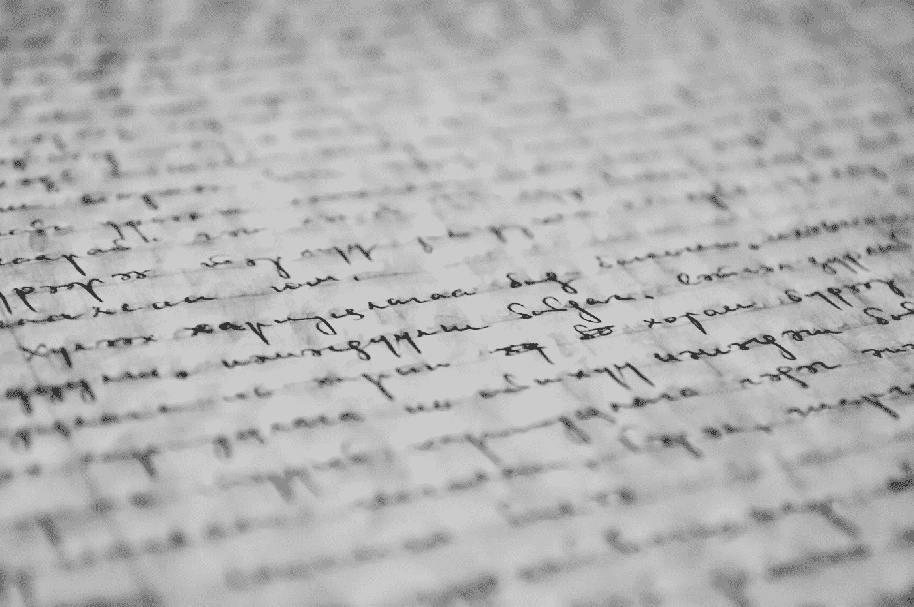
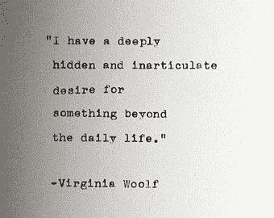
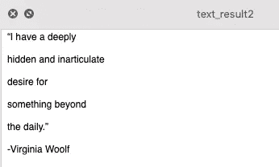

# 用 Python 构建一个简单的文本识别器

> 原文：<https://towardsdatascience.com/building-a-simple-text-recognizer-in-python-93e453ddb759?source=collection_archive---------12----------------------->

## 如何使用文本识别器改进笔记记录过程



照片由[像素](https://www.pexels.com/photo/abstract-black-and-white-blur-book-261763/?utm_content=attributionCopyText&utm_medium=referral&utm_source=pexels)的[皮克斯拜](https://www.pexels.com/@pixabay?utm_content=attributionCopyText&utm_medium=referral&utm_source=pexels)拍摄

在这篇文章中，我将向您展示如何使用 Python 从图像中提取文本。这个过程简称为“文本识别”或“文本检测”。所以基本上你可以从标题中理解，我们将构建一个简单的 python 程序来为我们提取文本。提取之后，程序还会将结果导出到一个文本文档中。这样，我们可以记录我们的结果。

如果你以前没有听说过计算机视觉，这是了解它的最好时机。大多数机器学习和人工智能领域都与计算机视觉密切相关。随着我们的成长和探索，看到外面的世界对我们的发展有很大的影响。这对机器来说也是一样的，它们使用图像来观察外部世界，这些图像基本上被转化为计算机可以理解的数据。计算机视觉是一个非常深的海洋，我只是试图给出一些想法。如果你想了解更多关于计算机视觉的知识，这里有一个谷歌云平台的不错的视频:

在接下来的几周里，我想给你们展示许多不错的项目，让你们开始学习计算机视觉。你会惊讶于使用计算机视觉可以做多么强大的事情。文本识别只是大海中的一滴水。如果你准备好了，让我们开始吧！

# 步骤 1 —库

首先，让我们安装我们将在这个程序中使用的模块包。我们将安装 PIL，宇宙魔方软件包。PIL 代表 Python 图像库，它为你的程序增加了图像处理能力。该模块支持多种图像格式。PyTesseract 是我们将使用的另一个模块，它主要完成文本识别部分。这将有助于我们识别和阅读文本。

下面是 pip 同时安装多个模块的代码:

```
pip install Pillow pytesseract
```

如果您想了解关于这些产品包的更多信息:

*   [PIL](https://pillow.readthedocs.io/en/3.0.x/handbook/tutorial.html)
*   [宇宙魔方](https://pypi.org/project/pytesseract/)

现在让我们将库导入到我们的程序中:

```
# adds image processing capabilities
from PIL import Image# will convert the image to text string
import pytesseract
```

# 步骤 2 —文本识别

在这一步，我们将选择一个我们想要处理的图像。你可以从谷歌上下载图片，或者用手机拍照。两种方式都应该可以。选择你的图像后，在同一个目录下创建一个新的文件夹，你可以把它命名为“image_test ”,并把图像文件复制到那个文件夹中。



我将使用的图像

我下载了一张图片，上面引用了弗吉尼亚·伍尔夫的话。有趣的事实:我真的很喜欢读她的书:)

无论如何，在我们的 image_test 文件夹中粘贴图像之后，让我们回到编码。在下面的代码中，我们创建一个图像变量来存储图像文件，然后使用 image_to_string 方法识别文本。

```
# assigning an image from the source path
img = Image.open(‘image_test/virginia-quote.jpg’)# converts the image to result and saves it into result variable
result = pytesseract.image_to_string(img)
```

# 第 3 步—导出

在这一步中，我们将把前面代码的结果导出到一个文本文档中。这样，我们将同时拥有原始图像文件和我们从该图像中识别的文本。

```
with open(‘text_result.txt’, mode =’w’) as file:
 file.write(result)
 print(“ready!”)
```

干得好！您刚刚使用 Python 创建了自己的文本识别器。如果你想做得更好，检查下一个额外的步骤。这里还有一个你可能感兴趣的项目。

[](/building-a-speech-recognizer-in-python-2dad733949b4) [## 用 Python 构建语音识别器

### 使用谷歌云语音 API 将您的音频文件转换为文本

towardsdatascience.com](/building-a-speech-recognizer-in-python-2dad733949b4) 

# 额外—图像增强

PIL 是一个巨大的包裹，有许多功能。在这个额外的步骤中，我们将对图像做一些小的改动，以便我们的文本识别器可以更容易地识别或“读取”文本。在图像上做一些小小的改动在计算机视觉中占据了很大的位置。计算机需要我们的帮助来更好地处理图像。

没有图像处理，就像把菜谱食材放在孩子面前，让他/她吃。有了正确的图像处理，就像把煮好的食物放在孩子面前。差别是巨大的，我强烈推荐通过图像处理文档来了解更多。

这是添加了一些小改动的完整代码，换句话说，这是一段新鲜出炉的代码:)

```
# adds more image processing capabilities
from PIL import Image, ImageEnhance# assigning an image from the source path
img = Image.open(‘image_test/virginia-quote.jpg’)# adding some sharpness and contrast to the image 
enhancer1 = ImageEnhance.Sharpness(img)
enhancer2 = ImageEnhance.Contrast(img)img_edit = enhancer1.enhance(20.0)
img_edit = enhancer2.enhance(1.5)# save the new image
img_edit.save("edited_image.png")# converts the image to result and saves it into result variable
result = pytesseract.image_to_string(img_edit)with open(‘text_result2.txt’, mode =’w’) as file:
 file.write(result)
 print(“ready!”)
```

# 视频演示

# 结果呢



## 如何在日常生活中使用文本识别器？

就我个人而言，我正在使用我们刚刚创建的工具将我的书页转换成文本文档，它使记笔记的过程变得更加容易和快速。现在，我不再每次都写下我最喜欢的几行，而是给那一页拍张照，然后用文本识别器进行转换。这难道不是编码最酷的地方吗？创造一些能解决你生活中一个问题的东西。

*我是贝希克·居文，我喜欢分享关于创造力、编程、动力和生活的故事。跟随我* [*中型*](https://medium.com/@lifexplorer) *留下来受启发。*