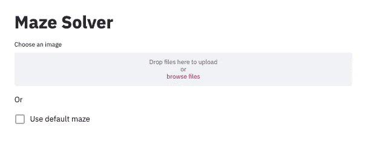
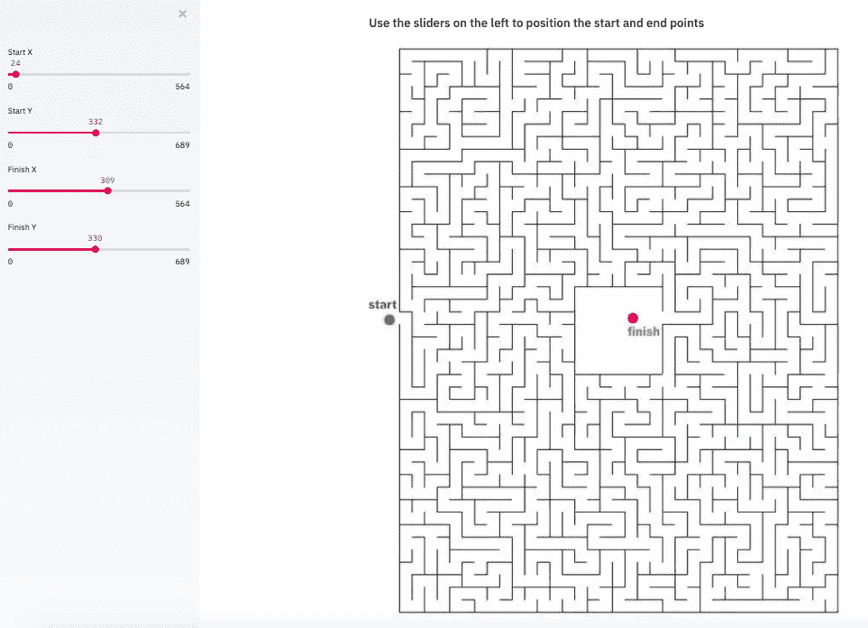
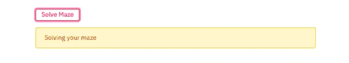
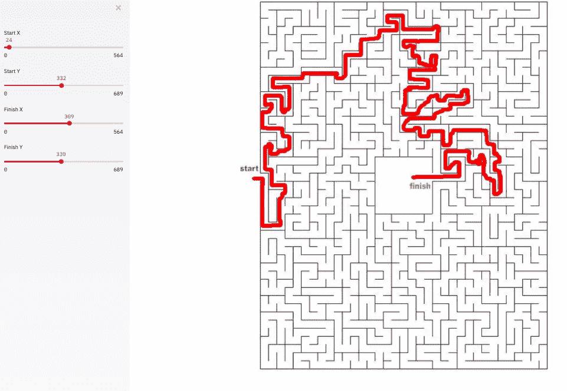

# 用 Python 构建简单的用户界面

> 原文：<https://towardsdatascience.com/building-a-simple-ui-for-python-fd0e5f2a2d8b?source=collection_archive---------4----------------------->

用用户界面展示 Python 项目从未如此简单。使用 [Streamlit](https://www.streamlit.io/) 框架，您可以仅使用 Python 代码构建基于浏览器的 UI。在这个演示中，我们将为一个迷宫求解程序构建用户界面，这个程序在之前的文章中有详细描述。

[](/solving-mazes-with-python-f7a412f2493f) [## 用 Python 解迷宫

### 使用 Dijkstra 的算法和 OpenCV

towardsdatascience.com](/solving-mazes-with-python-f7a412f2493f) 

## 细流

Streamlit 是一个 web 框架，旨在让数据科学家使用 Python 轻松部署模型和可视化。它速度快，简约，但也漂亮和用户友好。有用于用户输入的内置小部件，如图像上传、滑块、文本输入和其他熟悉的 HTML 元素，如复选框和单选按钮。每当用户与 streamlit 应用程序进行交互时，python 脚本都会从头到尾重新运行一次，这是考虑应用程序的不同状态时需要记住的一个重要概念。

您可以使用 pip 安装 Streamlit:

```
pip install streamlit
```

并在 python 脚本上运行 streamlit:

```
streamlit run app.py
```

## 用例

在前面的演示中，我们构建了一个 Python 程序，它将在给定图像文件和开始/结束位置的情况下解决一个迷宫。我们想把这个程序变成一个单页的 web 应用程序，用户可以上传一个迷宫图像(或使用默认的迷宫图像)，调整迷宫的开始和结束位置，并看到最终解决的迷宫。

首先，让我们为图像上传程序创建 UI，并创建使用默认图像的选项。我们可以使用像 *st.write()* 或 *st.title()* 这样的函数来添加文本输出。我们使用 streamlit 的 *st.file_uploader()* 函数存储动态上传的文件。最后， *st.checkbox()* 将根据用户是否选择了复选框返回一个布尔值。

结果是:



然后，我们可以将默认或上传的图像读取为可用的 OpenCV 图像格式。

一旦图像上传，我们希望显示标有起点和终点的图像。我们将使用滑块来允许用户重新定位这些点。 *st.sidebar()* 函数向页面添加一个侧边栏，而 *st.slider()* 在定义的最小值和最大值范围内接受数字输入。我们可以根据迷宫图像的大小动态定义滑块的最小值和最大值。



每当用户调整滑块时，图像会快速重新呈现，并且点会改变位置。

一旦用户确定了开始和结束的位置，我们需要一个按钮来解决迷宫并显示解决方案。 *st.spinner()* 元素仅在其子流程运行时显示，而 *st.image()* 调用用于显示图像。



流线型按钮和微调按钮



显示已解决的迷宫


迷宫求解器在运行

## 摘要

在不到 40 行代码中，我们为 Python 图像处理应用程序创建了一个简单的 UI。我们不需要编写任何传统的前端代码。除了 Streamlit 能够消化简单的 Python 代码之外，每当用户与页面交互或脚本发生变化时，Streamlit 都会智能地从头到尾 **重新运行脚本的必要部分**。这允许直接的数据流和快速开发。****

你可以在 [Github](https://github.com/maxwellreynolds/Maze/blob/master/ui.py) 上找到完整的代码，在这里你可以找到解释迷宫求解器[背后的算法的第一部分。包含重要概念和附加小部件的 Streamlit 文档位于](/solving-mazes-with-python-f7a412f2493f)[这里](https://docs.streamlit.io/en/stable/)。

[](/deploying-a-simple-ui-for-python-88e8e7cbbf61) [## 为 Python 部署简单的 UI

### Streamlit 共享:Python 项目的游戏规则改变者

towardsdatascience.com](/deploying-a-simple-ui-for-python-88e8e7cbbf61)