# 利用图论从新闻中构建社会网络

> 原文：<https://towardsdatascience.com/building-a-social-network-from-the-news-using-graph-theory-by-marcell-ferencz-9155d314e77f?source=collection_archive---------20----------------------->

## 理解报纸中的社会关系

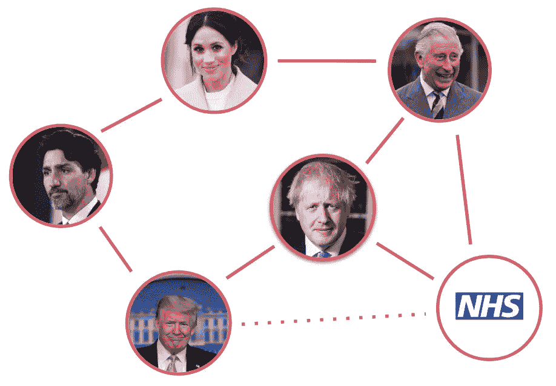

来源:我

# 序文

谁是对新闻最有影响力的人？政客、公司和名人的庞大网络到底是什么样子的？梅根汗·马克尔和阿尔戈斯有什么关系？

如果你曾经发现自己躺在床上睡不着，想知道以上任何一个问题，你就点击了正确的文章。因为我们将探索一种新颖的方式来呈现每天每时每刻通过新闻频道和观点文章反馈给我们的大量信息:我们将建立一个新闻人的社交网络。

# 为什么

我们生活在一个媒体和信息的时代，理解错综复杂的新闻的重要性不能被夸大。在[之前的一篇文章](/covid-19-with-a-flair-2802a9f4c90f)中，我概述了利用社交媒体为任何组织造福的价值，并展示了一种使用 Twitter 数据的方法。如果 Twitter 是消费者的喉舌，那么它的耳机就是在听新闻。事实上，如今许多推特用户只是简单地分享新闻文章，以此来表达他们的赞同(或愤怒)。

知道你的组织、产品或老板是否出现在新闻中并不困难，但是知道他们出现在新闻中时在谁的*公司*会给你宝贵的洞察力，让你知道他们正被那些讨厌的记者们团结在什么样的人群中。

从更技术性的角度来看，构建数据的图形表示(即社交网络)为数据科学应用开辟了一系列可能性，例如找到最中心的节点(有影响力的人)或根据节点的边缘(连接)识别节点群(人的集团)。

简单来说，网络图看起来很酷。

# 什么

构建我们的社交网络的基本前提有两个，而且非常简单:

1.  如果在同一篇文章中提到两个人，他们就是*朋友*。
2.  文章提到同样的两个人越多，他们作为朋友就越亲密。

让我们举个例子:如果一篇文章提到了*唐纳德*和*鲍里斯*，另外两篇独立的文章提到了*唐纳德*和*迈克*，我们会说唐纳德是鲍里斯的朋友，唐纳德也是迈克的朋友，只是多了一倍。因此，我们将构建一个如下所示的社交网络:

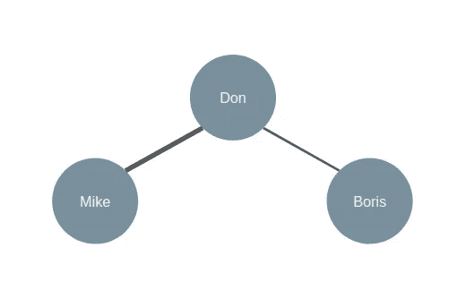

示例图形表示

我们不仅得到了友谊组的图像表示，我们还可以开始看到隐藏的关系:虽然鲍里斯和迈克没有在同一篇文章中提到，但我们可以肯定地猜测这两者是有关系的(并且他们通过他们共同的朋友唐纳德有关系)。我们还可以看出，唐纳德是团队中的老大，对迈克和鲍里斯都有影响力。

这只是三篇(非常短的)新闻报道的一个简单例子。你可以想象我们可以从数百份关于数千人的文件中获得什么样的见解。为了实现这一点，我们将使用两种技术，现在我将简单介绍一下。

## 命名实体识别

我们的首要任务是在文章中识别感兴趣的个人，如果我们事先不知道要找的是谁，这就不那么容易了(否则我们可以使用简单的字符串搜索)。幸运的是，[命名实体识别](https://en.m.wikipedia.org/wiki/Named-entity_recognition)存在。

命名实体识别是从文本中提取信息的自然语言处理任务；顾名思义，它识别实体，比如非结构化数据中的专有名词。它使用在大型文档集上训练的统计模型来实现这一点；该模型学习根据实体作为单词出现的上下文来识别和分类实体。我们将使用这些模型中的一个来为每篇文章列出被模型标记为*人物*和*组织*的单词。

## 图论

一旦我们有了每篇文章的实体列表，我们将把它们组织成一个图形结构。根据定义，图是一组顶点和边:

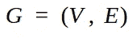

其中 *G* 是我们的图，由一组顶点 *V* (或节点)和一组边 *E* (或链接)组成。

本文并不打算作为图论的入门，但我确实想强调图的几个重要属性，我们会发现这些属性在以后的练习中很有用:

1.  **图可以是有向的，也可以是无向的**——有向图的节点是用一个方向链接起来的(令人惊讶)，而链接的方向与无向图无关。在我们的例子中，我们将把我们的网络设置为一个无向图，因为在同一篇文章中单独提到 Mike 和 Don 并不能给出这两个实体之间信息方向的任何指示。
2.  **图可以是连通的，也可以是不连通的** — 一个图是连通的，如果你能描绘出一条从任一节点到任一其他节点的路径。我们上面的图是连通的，因为所有节点都以某种方式与所有其他节点相连；如果我引入第四个节点，*杰瑞米*，他没有在任何文章中与唐、迈克或鲍里斯一起被提及，他将与任何现有的节点都没有联系，我们的图将变得没有联系。
3.  **节点具有中心性度量** —这些度量描述了节点在网络中的重要性。其中一个度量标准(我们将在接下来的分析中使用)是*特征向量中心性*，它根据每个节点连接的其他重要节点的数量为每个节点分配一个分数。特征向量中心性的一个著名用例是谷歌的 [PageRank 算法](https://en.wikipedia.org/wiki/PageRank)。
4.  **图可以有集团** —集团是图(或子图)的子集，其中所有节点对都是相连的。这些是你学生时代友谊小组的数学表示。在我们的例子中，如果迈克也和鲍里斯有联系，他们就会形成一个小团体。

# 怎么做

关于实体和图形，我已经漫谈得够久了——现在让我们进入实质。

## 数据收集

到目前为止，我还没有触及我实际上打算从哪里得到我吹嘘的所有这些文章。当然，有许多新闻 API 可以用来从新闻中提取信息。我使用的资源来自于 GDELT 项目，这是一个免费的、开放的平台，可以实时监控世界各地的事件。

> 在 Google Jigsaw 的支持下，GDELT 项目用 100 多种语言监控世界上几乎每个国家每个角落的广播、印刷和网络新闻…

他们进行了许多非常有趣的活动和分析(说真的，检查一下)，但我们会对他们的原始数据感兴趣，他们也完全免费提供这些数据(谢谢 GDELT)。他们每天发布包含当天发生的数千个事件的 CSV，但更重要的是，他们包括报道该事件的新闻来源的 URL。

我使用了包含 3 月 26 日发生的事件的文件，并过滤了英国一些最受欢迎的新闻提供商发布的新闻。我以这样一种方式限制了我的搜索，在某种程度上缩小了我们将要处理的实体的数量，并且也集中于对英国主流读者来说重要的东西。这样做仍然让我从以下来源获得了 805 篇文章:

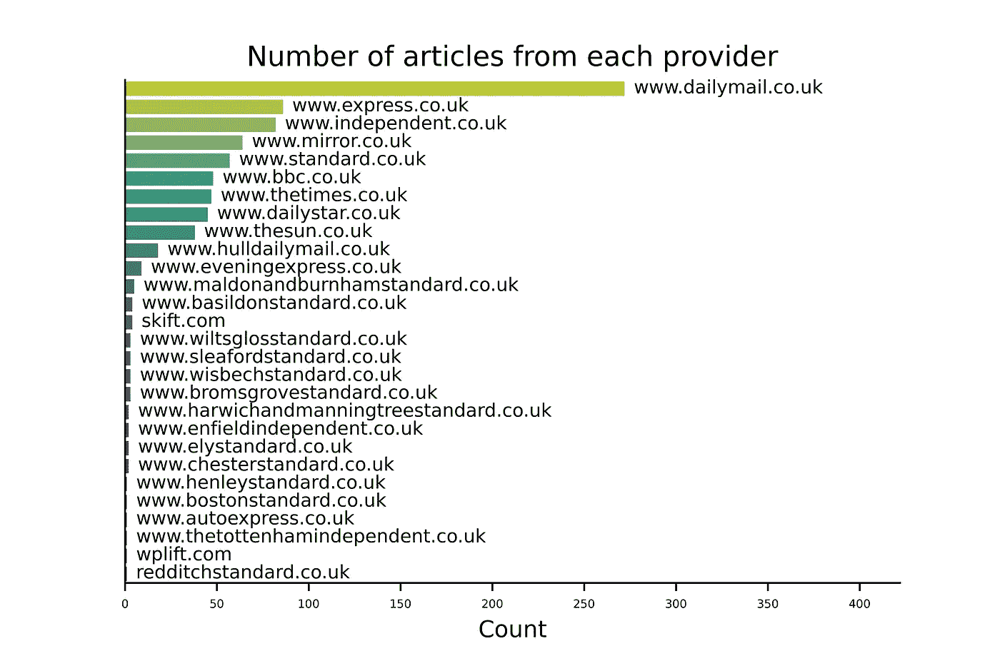

一旦我有了 805 个 URL，我就使用 [Goose](https://goose3.readthedocs.io/en/latest/quickstart.html) 从每个网页中提取内容。同样，这不是本文的重点，所以我不赘述。如果您有兴趣跟随，有无数的资源会告诉您如何去做(包括 Goose 文档)。

提取每篇文章的标题和内容使我能够将我的数据组织成一个漂亮的熊猫数据框架:

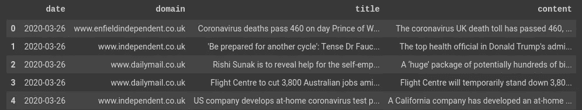

一个漂亮的熊猫数据框

## 识别实体

如果你读过我以前的文章(我之前已经无耻地链接过了)，你就会知道我对 [Flair](https://github.com/flairNLP/flair) 库的喜爱，它用几行代码提供了最先进的 NLP 解决方案。Flair 使用神经语言模型( [Akbik 等人，2018](http://alanakbik.github.io/papers/coling2018.pdf) )为文本数据分配标签，在这个过程中击败了大多数以前的模型的准确性。天赋对我们来说已经足够好了。天赋是一种福气。让我们兜一圈。

我们将告诉 Flair 的句子标记器预测句子中的实体:

> 鲍里斯和唐纳德去西雅图见微软。

```
!pip install flairimport torch
from flair.data import Sentence
from flair.models import SequenceTaggertagger = SequenceTagger.load('ner')sentence = Sentence('Boris went to Seattle with Donald to meet Microsoft')tagger.predict(sentence)for entity in sentence.get_spans('ner'):
  print(entity)
```

这产生了四个实体(如预期的那样):

```
PER-span [1]: “Boris”
LOC-span [4]: “Seattle”
PER-span [6]: “Donald”
ORG-span [10]: “Microsoft”
```

它成功地识别了所有四个实体，并且能够识别两个人(PER)、一个位置(LOC)和一个组织(ORG)。

Flair 的句子对象有一个有用的。to_dict()方法，它允许我们以更健壮的方式提取实体:

```
sentence.to_dict(tag_type='ner')
```

给我们一个字典，里面有句子中每个实体的所有有趣的属性:

```
{'entities': [{'confidence': 0.999889612197876,
  'end_pos': 5,
  'start_pos': 0,
  'text': 'Boris',
  'type': 'PER'},
 {'confidence': 0.9988295435905457,
  'end_pos': 21,
  'start_pos': 14,
  'text': 'Seattle',
  'type': 'LOC'},
 {'confidence': 0.9999843835830688,
  'end_pos': 33,
  'start_pos': 27,
  'text': 'Donald',
  'type': 'PER'},
 {'confidence': 0.8911125063896179,
  'end_pos': 56,
  'start_pos': 47,
  'text': 'Microsoft',
  'type': 'ORG'}],
 'labels': [],
 'text': 'Boris went to Seattle with Donald to meet with Microsoft'}
```

我们在上面说过，我们只关心人和组织，所以我们将把字典组织成一个*漂亮的*数据框架，并过滤掉这两个:

```
sent_dict = sentence.to_dict(tag_type='ner')df_ner = pd.DataFrame(data={
  'entity': [entity['text'] for entity in sent_dict['entities']],
  'type': [entity['type'] for entity in sent_dict['entities']]
 }
)df_ner[df_ner['type'].isin(['PER', 'ORG'])]
```

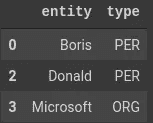

另一个漂亮的数据框

## 构建图表

为了构建实际的社交网络，我们将使用久经考验且值得信赖的 [NetworkX](https://networkx.github.io/documentation/stable/) 包。它的 [Graph()](https://networkx.github.io/documentation/stable/reference/classes/graph.html) 类需要(至少)一个图的边列表，所以我们将把实体列表合并成一个成对连接列表。

我们将使用 itertools 的组合功能，在给定一个项目列表的情况下，找到所有可能的组合。首先，我们将按字母顺序对我们的实体进行排序——这是为了确保在我们找到的每一对中(现在和以后),按字母顺序排列的上级实体出现在左侧，并且我们不会重复成对的 **A-B** 和 **B-A** ，例如:

```
from itertools import combinationsdf_ner = df_ner.sort_values('entity')combs = list(combinations(df_ner['entity'], 2))df_links = pd.DataFrame(data=combs, columns=['from', 'to'])df_links
```

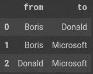

另一个漂亮的熊猫数据框

我们已经准备好创建图表并绘制它了！

```
import networkx as nxG = nx.Graph()for link in df_links.index:
  G.add_edge(df_links.iloc[link]['from'],
             df_links.iloc[link]['to'])nx.draw(G, with_labels=True)
```

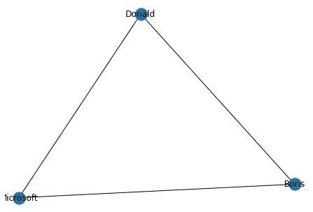

我们的第一张图表

## 好，现在用真实数据做

以上所有内容都可以封装在一个很好的函数中，应用到我们的每一篇文章中。你会注意到几处增加——首先，我在这个过程中做了一些基本的清理，删除了换行符之类的，我还删除了代词，它有时会被识别为命名实体。这里的另一个关键步骤是，给定一个实体(比如说 Boris Johnson)，我只取他们的姓，因为个人通常只被称为他们的姓。这一步骤确保鲍里斯·约翰逊和约翰逊不会被算作两个不同的实体。

```
def get_ner_data(paragraph): # remove newlines and odd characters
  paragraph = re.sub('\r', '', paragraph)
  paragraph = re.sub('\n', ' ', paragraph)
  paragraph = re.sub("’s", '', paragraph)
  paragraph = re.sub("“", '', paragraph)
  paragraph = re.sub("”", '', paragraph) # tokenise sentences
  sentences = tokenize.sent_tokenize(paragraph)
  sentences = [Sentence(sent) for sent in sentences] # predict named entities
  for sent in sentences:
    tagger.predict(sent) # collect sentence NER's to list of dictionaries
  sent_dicts = [sentence.to_dict(tag_type='ner') for sentence in sentences] # collect entities and types
  entities = []
  types = [] for sent_dict in sent_dicts:
    entities.extend([entity['text'] for entity in sent_dict['entities']])
    types.extend([entity['type'] for entity in sent_dict['entities']]) # create dataframe of entities (nodes)
  df_ner = pd.DataFrame(data={'entity': entities, 'type': types})
  df_ner = df_ner[df_ner['type'].isin(['PER', 'ORG'])]
  df_ner = df_ner[df_ner['entity'].map(lambda x: isinstance(x, str))]
  df_ner = df_ner[~df_ner['entity'].isin(df_contraptions['contraption'].values)]
  df_ner['entity'] = df_ner['entity'].map(lambda x: x.translate(str.maketrans('', '', string.punctuation))) df_ner['entity'] = df_ner.apply(lambda x: x['entity'].split(' ')[len(x['entity'].split(' '))-1] if x['type']=='PER' else x['entity'], axis=1) df_ner = df_ner.drop_duplicates().sort_values('entity') # get entity combinations
  combs = list(combinations(df_ner['entity'], 2)) # create dataframe of relationships (edges)
  df_links = pd.DataFrame(data=combs, columns=['from', 'to']) return df_ner, df_links
```

我们准备将我们的函数应用于每篇文章的内容。请注意，我花了大约 40-50 分钟在 Google Colab 上运行我的 800 篇文章:

```
df_ner = pd.DataFrame()
df_links = pd.DataFrame()for content in tqdm(df_day['content']):
  try:
    df_ner_temp, df_links_temp = get_ner_data(content)
    df_ner = df_ner.append(df_ner_temp)
    df_links = df_links.append(df_links_temp) except:
    continue
```

我把 try-catch 放在那里，以防文章中没有实体被识别，DataFrame.append()方法失败。我知道这不是好的做法。我还是做了。

有了我们庞大的实体链接列表，我们就可以开始构建图表了。为了让事情更容易管理，我将只保留至少在两篇独立文章中出现过的链接:

```
df_links = df_links.groupby(['from', 'to']).size().reset_index()df_links.rename(columns={0: 'weight'}, inplace=True)df_links = df_links[df_links['weight'] > 1]df_links.reset_index(drop=True, inplace=True)df_links.sort_values('weight', ascending=False).head(10)
```

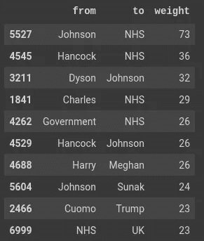

3 月 26 日的头条新闻链接(和一个漂亮的数据框)

到目前为止，发现最多的联系是鲍里斯·约翰逊和国民保健服务之间的联系，其次是马特·汉考克和国民保健服务。哈里王子、梅根、安德鲁·科莫和唐纳德·特朗普也获得了荣誉提名。

不过，让我们建立一个更全面的图景。我们将选取出现在 6 篇文章中的链接(相信我，这是你仍然可以从一个情节中做出一些东西的最低数量)，并像以前一样绘制图表:

```
df_plot = df_links[df_links['weight']>6]df_plot.reset_index(inplace=True, drop=True)G_plot = nx.Graph()for link in tqdm(df_plot.index):
  G_plot.add_edge(df_plot.iloc[link]['from'],
                  df_plot.iloc[link]['to'],
                  weight=df_plot.iloc[link]['weight'])pos = nx.kamada_kawai_layout(G_plot)
nodes = G_plot.nodes()fig, axs = plt.subplots(1, 1, figsize=(15,20))el = nx.draw_networkx_edges(G_plot, pos, alpha=0.1, ax=axs)nl = nx.draw_networkx_nodes(G_plot, pos, nodelist=nodes, node_color='#FAA6FF', with_labels=True, node_size=50, ax=axs)ll = nx.draw_networkx_labels(G_plot, pos, font_size=10, font_family=’sans-serif’)
```

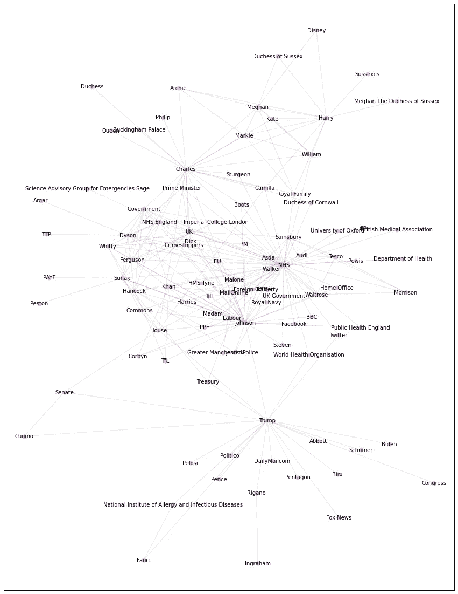

3 月 26 日新闻中的关系网

每个点代表一个实体——一个人或一个组织——两个点之间的链接意味着它们一起出现在至少两篇独立的文章中。

我们可以立即看到一些利益集团 NHS 和约翰逊确实处于事情的中心，但我们可以在地图的右上角看到王室成员，在下半部分看到美国政治家。

现在你知道了——我们已经从真实的新闻数据中建立了一个社交网络。让我们从中提取一些真知灼见吧！

# 洞察力

既然我们已经完成了繁重的工作，有趣的部分可以开始了。我们会问我们的图表一些问题。

## 我们的网络中有多少人和关系？

让我们从简单的开始——我们将使用 nodes()和 edges()方法来查找我们的社交网络中实体和联系的数量:

```
n_nodes = len(G.nodes())n_edges = len(G.edges())print(f'There were {n_nodes} entities and {n_edges} connections found in the network.')
```

这告诉我们**在网络**中发现了 2287 个实体和 8276 个连接。

## 网络里大家都认识吗？

换句话说，我们的图是连通的吗？如果不是，每个子图有多大？

```
nx.is_connected(G)
```

这个命令返回 *False* ，告诉我们图中并不是所有的节点都相互连接。

```
subgraphs = [G.subgraph(c) for c in nx.connected_components(G)]subgraph_nodes = [sg.number_of_nodes() for sg in subgraphs]df_subgraphs = pd.DataFrame(data={
  'id': range(len(subgraph_nodes)),
  'nodes': subgraph_nodes
})df_subgraphs['percentage'] = df_subgraphs['nodes'].map(lambda x: 100*x/sum(df_subgraphs['nodes']))df_subgraphs = df_subgraphs.sort_values('nodes', ascending=False).reset_index(drop=True)df_subgraphs
```

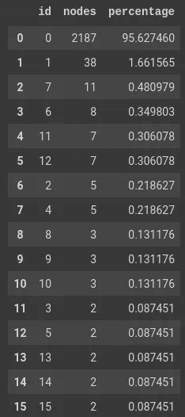

每个连接组件中节点的百分比

我们超过 95%的节点属于一个大型连接集群。有趣的是，在我们的网络中似乎没有独立的、同样大的图；绝大多数实体都以某种方式相互联系。

## 但是这些人是怎么认识的呢？

我们将使用最短路径算法来找出这一点，但首先我们需要做一些内务。我们将只使用属于 95%的彼此都认识的节点来重新创建我们的图(我们希望确保我们的图是*连接的*)，我们还将向我们的边添加一个新属性 *inverse_weight* 。这将是我们原始权重(即提到这两个实体的文章数量)的倒数，这将有助于我们的最短路径算法将高权重(更常见的连接)优先于低权重。

```
sg = subgraphs[np.argmax(np.array(subgraph_nodes))]df_links_sg = nx.to_pandas_edgelist(sg)df_links_sg['inverse_weight'] = df_links_sg['weight'].map(lambda x: 1/x)G = nx.Graph()for link in tqdm(df_links_sg.index):
  G.add_edge(df_links_sg.iloc[link]['source'], 
  df_links_sg.iloc[link]['target'],
  weight = df_links_sg.iloc[link]['weight'],
  inverse_weight = df_links_sg.iloc[link]['inverse_weight'])
```

我们现在可以计算任意两个实体之间的最短路径，最终— *最终—* 给了我们期待已久的答案，即梅根汗·马克尔与零售商店 Argos 有什么关系。

```
source='Markle'
target='Argos'path = nx.shortest_path(G,
  source=source,
  target=target,
  weight='inverse_weight')path
```

这给了我们从 *Markle* 到 *Argos* 的实体链:**‘Markle’，‘Charles’，‘Johnson’，‘Sainsbury’，‘Argos’。**

于是梅根汗·马克尔和查尔斯王子出现在一篇文章中，查尔斯王子和鲍里斯·约翰逊出现在另一篇文章中，以此类推…

让我们来看看这些是哪些文章:

```
df_path = pd.DataFrame([(path[i-1], path[i]) for i in range(1, len(path))], columns=['ent1', 'ent2'])def get_common_title(ent1, ent2):
  df_art_path = df_articles[(df_articles['content'].str.contains(ent1)) & (df_articles['content'].str.contains(ent2))] df_art_path.sort_values('date', ascending=False).head(1) return df_art_path.iloc[0]['title']df_path['titles'] = df_path.apply(lambda x: get_common_title(x['ent1'], x['ent2']), axis=1)for title in df_path['titles']:
  print(title)
```

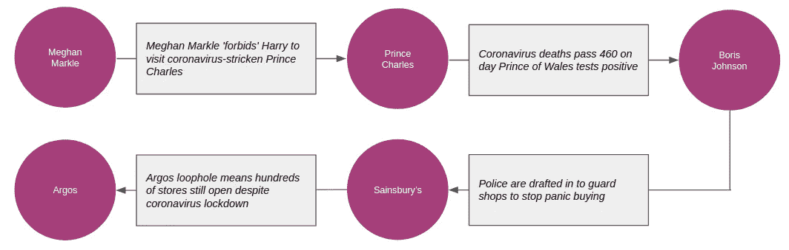

从梅根到阿尔戈斯的物品路线

上图展示了我们从梅根一直到阿尔戈斯的路线，一次一条:

1.  梅根与查尔斯王子在一篇文章中谈到她禁止哈里王子去看望后者。
2.  查尔斯王子与鲍里斯·约翰逊一起出现在一篇关于冠状病毒检测呈阳性的文章中。
3.  鲍里斯在《塞恩斯伯里》杂志的一篇文章中谈到了商店里的抢购现象。
4.  塞恩斯伯里出现在一篇文章中，Argos 的商店在封锁期间仍然开放。

## 谁是新闻上最有影响力的实体？

去更严肃的水域。我们可以找到每个节点的中心性度量，以了解它们对网络的影响程度。换句话说，我们将根据每个人或组织与多少其他有影响力的人或组织一起出现来给他们打分。我们在前面的段落中回忆过，这可以通过使用*特征向量中心性*度量来实现:

```
nodes = []
eigenvector_cents = []
ec_dict = nx.eigenvector_centrality(G, max_iter=1000, weight='weight')for node in tqdm(G.nodes()):
  nodes.append(node)
  eigenvector_cents.append(ec_dict[node])df_centralities = pd.DataFrame(data={
  'entity': nodes,
  'centrality': eigenvector_cents
})
```

将网络中最有影响力的 20 个实体形象化可以得出:

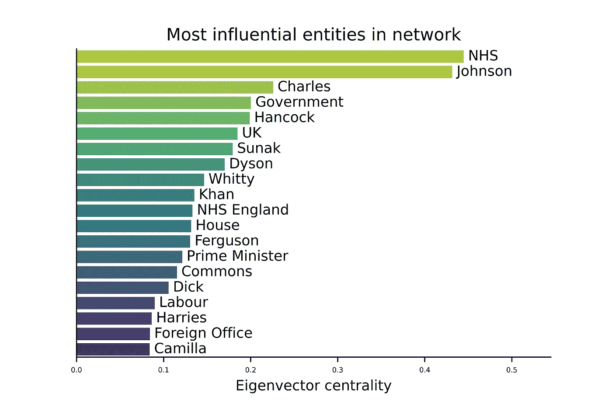

一个实体的酒吧越长(越绿)，他们在新闻中的影响力就越大。

NHS 和 Boris Johnson 在对英国新闻的影响力方面领先，考虑到我们在新冠肺炎的处境，这并不奇怪。

## 有没有一群人经常一起出现在新闻中？

换句话说，我们能识别我们网络中的派系吗？记住，集团是图中的一组节点，其中每对节点都是相连的。我们将使用的算法称为*k-团社区* ( [帕拉等人，2005](https://www.nature.com/articles/nature03607) )，它允许我们通过定义 *k* ，或形成团所需的最少节点数，在网络中找到紧密连接的集群。值得注意的是，一个节点可能*非常*受欢迎，并且属于多个派系。

设置 *k = 12* 给我们 9 个好的和可管理的小团体:

```
from networkx.algorithms.community.kclique import k_clique_communitiescliques = list(k_clique_communities(G, 12))
```

如前所述，我们还将计算由集团形成的每个子图中的特征向量中心性(这也将基于边权重),并可视化结果:

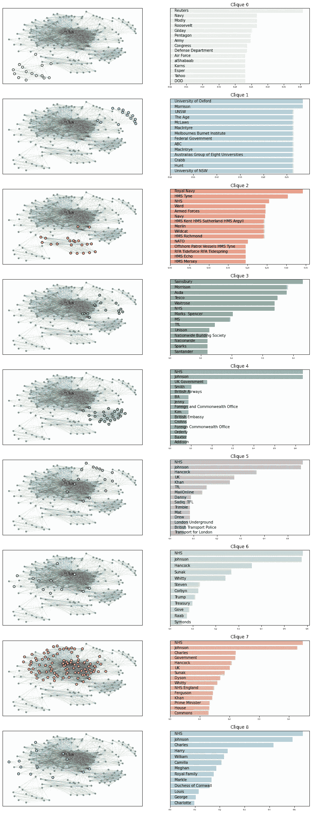

派系阴谋

每对图代表一个集团。在左边的图中，我们看到了节点在网络中的位置，在右边，我们看到了集团中最有影响力的节点。

这使我们能够通过经常一起出现的人群来识别新闻中的核心话题:

*   **小团体 0:** 美国政治和商业实体
*   **派系 1:** 澳大利亚学术机构
*   **派系 2:** 英国军事实体
*   **派系 3:** 英国零售商
*   派系 4: 英国政治组织
*   小团体 5: 伦敦运输公司
*   **小团体 6:** 英国政治家
*   小团体 7: 更多的英国政治家
*   小团体 8: 英国王室

# 外卖食品

*   我们收集了一些最受欢迎的英国报纸在 3 月 26 日发表的 800 多篇文章
*   我们使用最先进的**命名实体识别**算法来提取文章中同时出现的人和组织
*   我们以图表的形式组织数据，产生了**一个超过 2000 个实体和超过 8000 个连接的社交网络**
*   我们发现我们网络中超过 95%的实体都是相互连接的
*   **我们发现梅根汗·马克尔*和*能联系到阿尔戈斯吗**
*   **我们发现 NHS、鲍里斯·约翰逊和查尔斯王子是当天新闻中最有影响力的实体**
*   **我们发现了 9 个不同的实体群体，主要是经常一起出现在新闻中的政客和政府机构**

**这花了一些时间和文字，所以如果你已经做到这一步，我推荐你——我希望这是值得的。这个练习仅仅触及了图形数据结构的皮毛。我打算在后续文章中进一步讨论这些数据，但是现在，我将把它留在这里。**

# **事后思考**

**我做错什么了吗？我能做得更好吗？我做得好吗？**

**请随时在 [LinkedIn](https://www.linkedin.com/in/marcell-ferencz-9892a3a6) 上联系我；如果你对我的工作感兴趣，我总是很乐意接受挑战或者只是聊聊天。**

**如果你想自己玩代码，请点击链接到我的 Google Colab 笔记本:**

**[](https://colab.research.google.com/drive/1V28-kAtF8rW-Tb3QAYWQ3p6SU4jI7Rv9) [## 谷歌联合实验室

### 编辑描述

colab.research.google.com](https://colab.research.google.com/drive/1V28-kAtF8rW-Tb3QAYWQ3p6SU4jI7Rv9) [](https://colab.research.google.com/drive/13DlDmZyQvLt8F-HrDU5dqiMg3_RuXNYx) [## 谷歌联合实验室

### 编辑描述

colab.research.google.com](https://colab.research.google.com/drive/13DlDmZyQvLt8F-HrDU5dqiMg3_RuXNYx)**