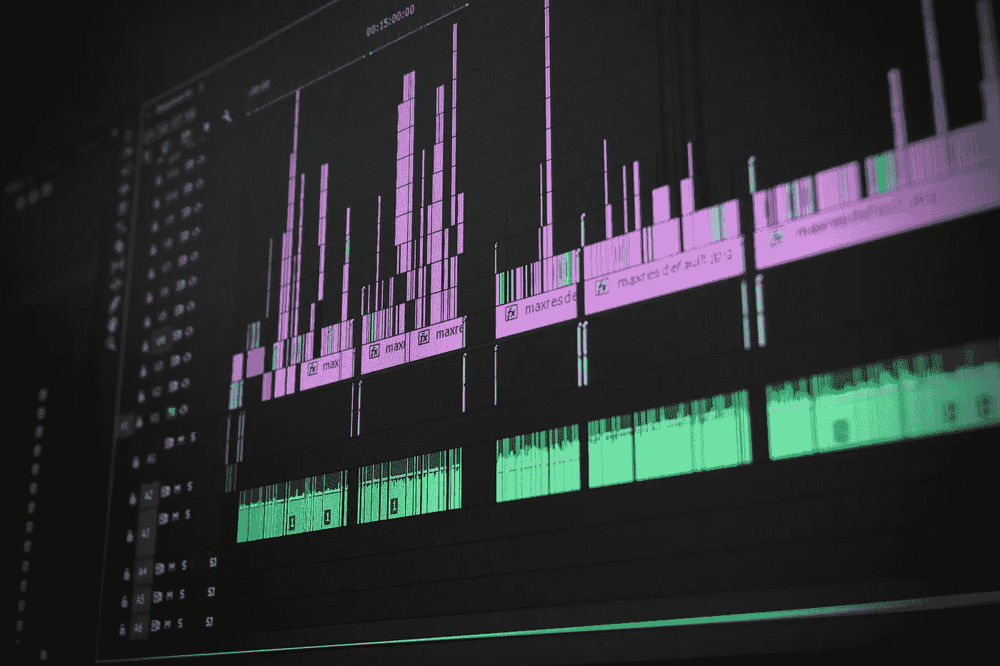

# 用 Python 构建语音识别器

> 原文：<https://towardsdatascience.com/building-a-speech-recognizer-in-python-2dad733949b4?source=collection_archive---------17----------------------->

## 使用谷歌云语音 API 将您的音频文件转换为文本



照片由[像素](https://www.pexels.com/photo/low-angle-view-of-lighting-equipment-on-shelf-257904/?utm_content=attributionCopyText&utm_medium=referral&utm_source=pexels)的[皮克斯拜](https://www.pexels.com/@pixabay?utm_content=attributionCopyText&utm_medium=referral&utm_source=pexels)拍摄

在这篇文章中，我将向您展示如何使用 Python 将音频文件转换成文本文档。语音识别就是这种转换的过程。它在现实世界中很常用。比如谷歌的 Home Mini、亚马逊的 Alexa、苹果的 Siri 等个人语音助手，只是我们所知道的比较流行的一些。

语音识别通过说话代替打字来帮助您节省时间。它帮助我们不用写一行代码就能和我们的设备交流。这使得技术设备更容易接近和使用。语音识别是在现实世界中使用人工智能的一个很好的例子。

这里有一个来自 Google I/O 2019 活动的场景。谷歌助手在行动！

在这篇文章中，我们将创建一个简单的语音识别模型，可以从音频文件中检测句子，然后我们将这些句子导出到文本文档中。在以后的文章中，我将向您展示另一个很好的语音识别示例，您可以将您的语音实时转换为文本格式。

# 你准备好了吗？让我们开始编码吧！

## 导入库

首先，让我们安装模块，以便我们可以在程序中导入和使用它。SpeechRecognition 模块支持多种识别 API，Google Speech API 就是其中之一。你可以从[这里](https://pypi.org/project/SpeechRecognition/)了解更多关于这个模块的信息。

```
pip install SpeechRecognition
```

现在我们可以导入库了

```
import speech_recognition as sr
```

## 创建识别器

在这一步中，我们将创建识别器实例。

```
r = sr.Recognizer()
```

## 导入音频文件

将音频文件导入我们的程序时，文件扩展名很重要。我已经用其他几种格式测试了我的代码，但是“wav”格式的效果更好。您可以使用在线文件转换器网站将您的音频文件格式转换为 wav。

例如，如果您正在使用 Macbook 的语音备忘录进行录制，音频文件将保存为 m4a 格式。在谷歌上搜索:“在线转换 m4a 文件为 wav 文件格式”。你会发现很多好网站。

*音频文件*是导入文件的功能。 *Sr* 是语音识别模块。

```
audio_file = sr.AudioFile('test.wav')
```

## 识别语音

我们使用的是 *recognize_google* 方法，这是来自 google 的云语音 API 的语音识别，如介绍中所述。

```
with audio_file as source: 
   r.adjust_for_ambient_noise(source) 
   audio = r.record(source)result = r.recognize_google(audio)
```

# 将结果导出到文本文档中

在下面的代码中，我们创建并打开一个文本文件。然后导出我们在前面代码中得到的结果。你会看到“准备好了！”在您的终端中。

```
with open('test.txt',mode ='w') as file: 
   file.write("Recognized text:") 
   file.write("\n") 
   file.write(result) 
   print("ready!")
```

## 密码

```
# importing the module
import speech_recognition as sr# define the recognizer
r = sr.Recognizer()# define the audio file
audio_file = sr.AudioFile('test.wav')# speech recognition
with audio_file as source: 
   r.adjust_for_ambient_noise(source) 
   audio = r.record(source)result = r.recognize_google(audio)# exporting the result 
with open('test.txt',mode ='w') as file: 
   file.write("Recognized text:") 
   file.write("\n") 
   file.write(result) 
   print("ready!")
```

## 使用 Python 的机器学习项目

建立人脸检测比你想象的要容易得多。

[](/simple-face-detection-in-python-1fcda0ea648e) [## Python 中的简单人脸检测

### 如何使用 OpenCV 库检测图像中的人脸

towardsdatascience.com](/simple-face-detection-in-python-1fcda0ea648e) 

语音到文本，开始音频识别的伟大项目。

[](/convert-your-speech-to-text-using-python-1cf3eccfa922) [## 使用 Python 将您的语音转换为文本

### 使用麦克风将您的语音实时转换为文本

towardsdatascience.com](/convert-your-speech-to-text-using-python-1cf3eccfa922) 

恭喜你。您已经用 Python 创建了自己的语音识别程序。希望你喜欢这篇教程，并在今天学到一些新东西。练习编码技能的最好方法是制作有趣的项目。在未来的帖子中，我想分享另一种语音识别技术，它可以实时检测您的声音并将其转换为文本。关注我的[博客](https://medium.com/@lifexplorer)保持联系。

*原载于 2020 年 5 月 17 日*[*https://sonsuzdesign . blog*](https://sonsuzdesign.blog/2020/05/17/building-a-speech-recognizer-in-python/)*。*