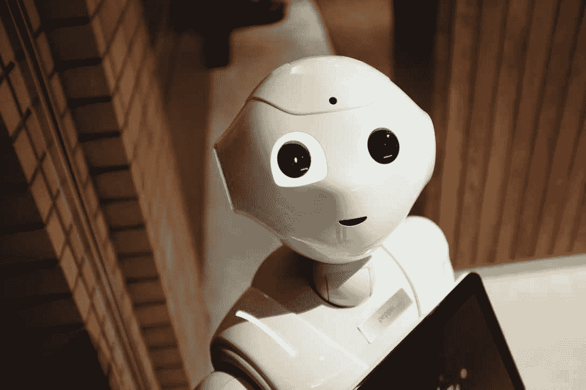
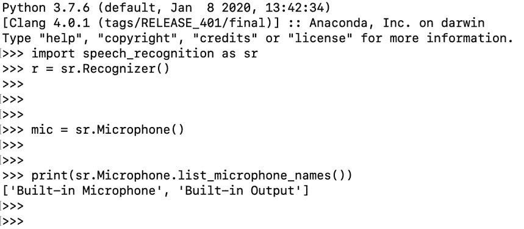
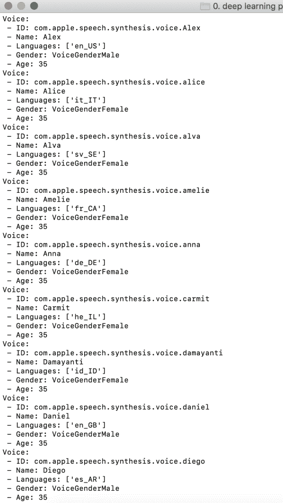

# 用 Python 构建语音翻译器

> 原文：<https://towardsdatascience.com/building-a-speech-translator-in-python-8ff190212b49?source=collection_archive---------14----------------------->

## 使用谷歌翻译 API 将你的演讲翻译成多种语言



照片由[亚历山大·奈特](https://www.pexels.com/@agk42?utm_content=attributionCopyText&utm_medium=referral&utm_source=pexels)从[派克斯](https://www.pexels.com/photo/high-angle-photo-of-robot-2599244/?utm_content=attributionCopyText&utm_medium=referral&utm_source=pexels)拍摄

在这篇文章中，我将向你展示如何使用 Python 将你的演讲翻译成不同的语言。语音翻译将记录你的讲话，然后理解你在说什么，并翻译成你喜欢的语言。翻译过程完成后，您可以自定义您的代码，使其显示翻译后的文本。这是一个伟大的项目，你会喜欢工作，甚至可能给你的朋友和家人留下深刻印象。

想象一下，当你想和一个来自不同国家的人交流时，你必须雇佣一个会说两种语言的人来做所有的翻译工作。以前是这样，但是随着互联网和技术的发展，交流变得越来越容易了。现在，我们可以使用谷歌翻译在几秒钟内翻译我们想要的任何东西，这难道不令人兴奋吗？YouTube 也在为一些视频这样做。他们利用人工智能将视频中的演讲实时转换成不同的语言。这个很神奇，值得分享。所以我想展示如何使用 Python 来实现这一点。这样你就有了会说多种语言的私人翻译。🙂

# 我们开始吧！

我想提一下，在这个项目中，我们将同时练习多个主题。这是一个结合你的技能，创造更好的东西的好方法。首先，我们将使用语音识别器来教我们的程序理解我们的语音，然后我们将它转换成文本。其次，我们将定义一个翻译器，将文本转换成我们喜欢的语言。最后，我们将使用一个文本到语音的模型，这样我们的程序就可以大声说话。

## **导入库**

首先，让我们安装我们将在这个程序中使用的模块。我们将安装 SpeechRecognition、Pyttsx3 和 Googletrans 模块。SpeechRecognition 和 Googletrans 模块是由我们在 Google 的朋友创建的。所有这些模块都可以免费安装和使用，这是编程行业发展如此迅速的一个重要原因。下面是 pip 同时安装多个模块的代码:

```
pip install speechrecognition pyttsx3 googletrans
```

是的，就是它。使用 pip 安装模块非常容易。如果您想了解这些模块的更多信息，这里有它们的文档页面的链接。

# 1.语音识别

## **定义识别器**

```
r = sr.Recognizer()
```

## **定义您的话筒**

在定义麦克风实例之前，我们将选择输入设备。可能有多个输入设备插入您的计算机，我们需要选择我们打算使用哪一个。你知道机器是假人，你必须准确地告诉他们该做什么！使用下面的代码，你将能够看到你的输入设备。

```
print(sr.Microphone.list_microphone_names())
```



这里你可以看到我检查输入设备的结果。我建议您在定义麦克风之前运行这个脚本，因为您可能会得到不同的结果。该脚本返回一个带有输入名称的数组列表，对我来说我想使用“内置麦克风”，所以数组列表的第一个元素。定义麦克风代码将如下所示:

```
mic = sr.Microphone(device_index=0)
```

## **识别语音**

如前所述，我们将使用*识别 _ 谷歌*方法，这是一个由我们在谷歌的朋友创建的语音识别模型。多亏了他们！

```
with mic as source: 
   r.adjust_for_ambient_noise(source) 
   audio = r.listen(source) result = r.recognize_google(audio)
```

如果想在翻译之前检查结果，可以在代码中添加下面一行。

```
print(result)
```

[](/building-a-speech-recognizer-in-python-2dad733949b4) [## 用 Python 构建语音识别器

### 使用谷歌云语音 API 将您的音频文件转换为文本

towardsdatascience.com](/building-a-speech-recognizer-in-python-2dad733949b4) 

# 2.构建翻译器

## **定义翻译器**

这是这个项目有趣的部分。你会有很多选择。如果你愿意，你可以像我一样，闭上眼睛，想象一个你希望能去的国家，看看那里的人说什么语言。是的，这是从一堆不同的语言中选择的一种方法。🙂

现在，您可以将该语言放入 destination 属性中，如下所示。

```
p = Translator() 
k = p.translate(result, dest='french')
```

在下面的代码中，我们将把翻译的结果转换成文本格式，这将有助于我们的文本到语音模块正常工作。因为在以前的代码中，结果是作为对象存储的。

```
translated = str(k.text)
print(translated)
```

# 3.文本到语音引擎

## **定义文本到语音引擎**

```
engine = pyttsx3.init()
```

我们刚刚将模块定义为一个引擎。现在是告诉我们的程序朗读翻译文本的时候了，但在此之前，我们必须定义语言。下面是查看语言列表及其 id 的代码，我们在定义翻译器时将需要这些代码。我建议在进入下一步之前，在您的终端中运行这段代码。

```
engine = pyttsx3.init() 
voices = engine.getProperty('voices') 
for voice in voices: 
  print("Voice:") 
  print(" - ID: %s" % voice.id) 
  print(" - Name: %s" % voice.name) 
  print(" - Languages: %s" % voice.languages) 
  print(" - Gender: %s" % voice.gender) 
  print(" - Age: %s" % voice.age)
```



声音

## **定义演讲者语言**

复制您想要使用的语言的 ID，并将其粘贴到我们的程序中。我们使用 setProperty 方法来定义说话者语言。

```
fr_voice_id = "com.apple.speech.synthesis.voice.thomas" engine.setProperty('voice', fr_voice_id)
```

## **最后一步:让奇迹发生**

```
engine.say(translated)engine.runAndWait()
```

恭喜你。您已经使用 Python 创建了自己的语音翻译器。希望你喜欢这篇教程，并在今天学到一些新东西。练习编码技能的最好方法是制作有趣的项目。

本文已由专业翻译 Chema 翻译成西班牙语。你可以在这里找到文章。知识是普遍的。

> 关注我的[博客](https://medium.com/@lifexplorer)和[走向数据科学](https://towardsdatascience.com/)以获得灵感。

*原载于 2020 年 6 月 8 日*[*https://sonsuzdesign . blog*](https://sonsuzdesign.blog/2020/06/07/building-a-speech-translator-in-python/)*。*