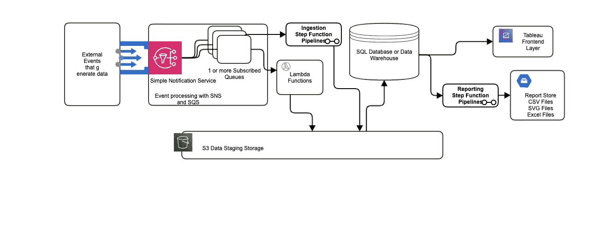
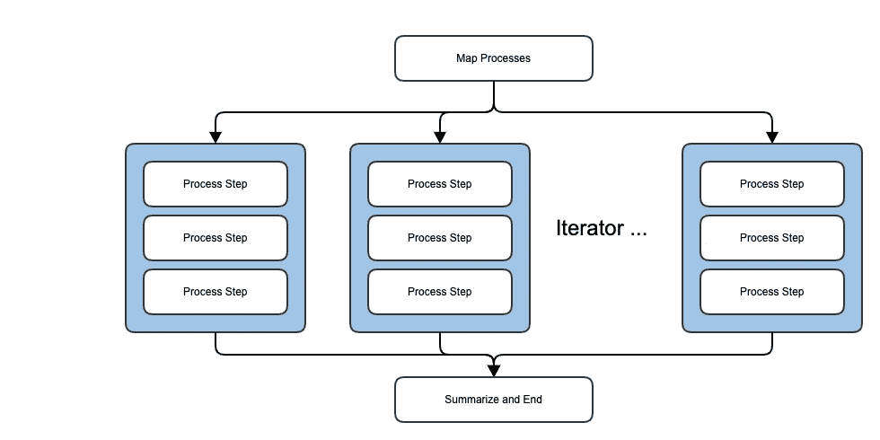

# 构建成功的数据计划

> 原文：<https://towardsdatascience.com/building-a-succesful-data-initiative-c04725b3a70?source=collection_archive---------37----------------------->

## 成功的数据计划使用可扩展的简单架构。大多数大型数据项目都会失败。为什么数据计划会失败？


由 [Serghei Trofimov](https://unsplash.com/@sergeytrofimov) 在 [Unsplash](https://unsplash.com/) 上拍摄

*   **团队在没有明确业务目标的情况下开始构建**
*   **团队试图使用它更不了解的应用程序来解决它不完全了解的问题**
*   **团队追逐过于复杂和不必要的大数据“闪亮物体”技术**

如何在 AWS 上构建大规模数据才能成功？

*   使用数据管道分离执行和业务流
*   通过成熟的事件系统(如社交网络和 SQS)推动摄入
*   对于需要大数据吞吐量的问题，只使用“大数据”系统

# 从明确的业务目标开始

数据计划通常始于分散在孤岛和系统中的大量数据。

如果您的业务目标是使数据的某个方面对决策者有用，那么决策者(一个人)必须理解该数据的价值。一个常见的数据点是，短期记忆可以保存[七个正负两个项目](https://www.verywellmind.com/what-is-short-term-memory-2795348#:~:text=It%20is%20commonly%20suggested%20that,plus%20or%20minus%20two%20items)。

因此，从大数据的角度来看，挑战在于分解数百万、数十亿、甚至数万亿行数据，这些数据甚至超过了人类思维所能理解的七个加或减两个项目的可操作数据点。

你可能有许多这样的数据点，但是知道它们是什么——那是你的领域分析。

一旦分析完成，您就可以专注于技术目标了。

# 选择许多工程师理解的通用技术。

AWS 上的服务列表是字母汤。许多大数据副总裁的愿望通常相当于字母汤。成功的项目始于可靠、简单的技术和清晰的关注点分离，这样，如果一项简单的技术需要复杂的替换，它就可以被替换。

**将数据接收到数据仓库需要什么？**

1.  数据暂存库
2.  活动基础设施
3.  数据管道技术
4.  一个或多个数据库

**将数据转化为行动数据点需要什么？**

1.  一种无处不在的编程语言— [Python](https://www.python.org/)
2.  汇总和交付数据的报告系统
3.  允许业务用户对聚合进行切片和切块的自助式 BI 系统
4.  分析数据的数据科学软件

**成熟、经济高效的数据堆栈**

数据堆栈是必不可少的，它会根据现有的技术和平台而变化。堆栈上的预算应该反映组件的性质。

把钱花在

1.  一个好的数据库— [雪花](https://www.snowflake.com/)
2.  一个不错的自助 BI 前端— [Tableau](https://www.tableau.com/)

为什么要在这两个技术上花钱呢？一个好的数据库将为您的数据提供一个 SQL 接口，您的团队将能够利用他们现有的 SQL 知识从数据中获取价值。一个好的 BI 环境将向业务用户开放数据，使他们在访问数据时能够自助服务。

在…上省钱

1.  数据集成工具— [AWS 阶跃函数](https://aws.amazon.com/step-functions/)和 [AWS Lambda 函数](https://aws.amazon.com/lambda/)
2.  事件技术— [将社交网站扇出到 SQS 的 SQS](https://docs.aws.amazon.com/sns/latest/dg/sns-sqs-as-subscriber.html)
3.  数据科学和分析— [熊猫](/a-quick-introduction-to-the-pandas-python-library-f1b678f34673)

为什么 AWS Step 函数和 Lambda 函数优于成熟的数据集成工具？因为它将推进一个可扩展的架构，不会将你的团队束缚在与 Pentaho、Informatica、Talend、SSIS 等工具相关的不良实践中。这些工具基于昂贵的服务器、[供应商锁定](https://www.bmc.com/blogs/vendor-lock-in/)和专有集成接口。

现代集成通常使用 REST，在不使用 REST 的地方，集成点被很好地记录和发布。

例如:

*   AWS—[https://aws.amazon.com/sdk-for-python/](https://aws.amazon.com/sdk-for-python/)
*   蔚蓝—[https://docs.microsoft.com/.../azure-sdk-overview](https://docs.microsoft.com/en-us/azure/developer/python/azure-sdk-overview)
*   谷歌云—[https://cloud.google.com/python/docs/reference](https://cloud.google.com/python/docs/reference)
*   销售力量—[https://pypi.org/project/simple-salesforce/](https://pypi.org/project/simple-salesforce/)
*   雪花—[https://docs . snow flake . com/en/user-guide/python-connector . html](https://docs.snowflake.com/en/user-guide/python-connector.html)

本质上，任何数据集成平台的数据连接器都是公共的、免费的，并且通常比数据集成提供商提供的连接器质量更好。

# 选择具有成熟技术的简单架构。

AWS 有几项核心技术应该构成您的数据计划架构的基础

**数据暂存库**——【https://aws.amazon.com/s3/】T4

数据暂存存储库不仅仅是一个简单的文件夹结构，需要仔细考虑。该存储是私有的，支持 SQL 数据库和数据仓库。它也可以被认为是“数据湖”



端到端数据产品(图片由作者提供)

**事件基础设施** — [SNS 和 SQS](https://aws.amazon.com/blogs/aws/queues-and-notifications-now-best-friends/) ，应用事件， [CloudWatch 事件](https://docs.aws.amazon.com/AmazonCloudWatch/latest/events/WhatIsCloudWatchEvents.html)

许多来源发布的事件。外部应用程序可以写入事件存储库，API 可以写入外部应用程序。在内部，AWS Cloudwatch 事件可以按计划运行，甚至可以从 SQS 的帖子中触发。

使用简单通知服务允许单个事件点服务一个或多个事件队列。

在构建应用程序时，CloudFormation 模板允许您为预定事件安排事件规则。

```
ScheduledEventRule:
  Type: "AWS::Events::Rule"
  Properties:
    Description: "Scheduled event to trigger Step Functions state machine"
    ScheduleExpression: cron(30 10 ? * MON-SUN *)
    State: "ENABLED"
    Targets:
      -
        Arn: !Ref BusinessAnalyticsPipeline
        Id: !GetAtt BusinessAnalyticsPipeline.Name
        RoleArn: !GetAtt ScheduledEventIAMRole.Arn
```

**数据管道技术** — [Step 函数](https://aws.amazon.com/step-functions)和 [AWS Lambda with Python](https://docs.aws.amazon.com/lambda/latest/dg/welcome.html)

数据管道技术本质上将加载过程映射到并行管道的映射列表中。取代传统的数据集成工具需要一个状态机来描述数据流，并允许您将数据流与处理分开。

数据可伸缩性应该在管道中构建并行性，映射的负载应该通过在加载数据时并行运行多个管道来利用自然的无服务器可伸缩性。



使用迭代器和步进函数构建映射管道(图片由作者提供)

**一个可扩展的数据库**——[关系数据的 Postgres】或者](https://medium.com/on-data-architecture/postgres-is-not-a-dinosaur-at-least-not-with-aws-60ebc4145522)[数据仓库的雪花](https://www.snowflake.com/workloads/data-warehouse-modernization/)

雪花可能很昂贵，但它的优势是将计算模型与数据模型分离开来，以扩展到[多个 TB/小时的数据加载吞吐量](https://www.snowflake.com/blog/how-to-load-terabytes-into-snowflake-speeds-feeds-and-techniques/)。

雪花将通过 AWS 从 S3 源登台，并在 Azure 或谷歌云中有等效的舞台商店。

它将运行大规模分布式查询，并且是面向列的，并将使用标准 SQL 支持任何 Tableau 或分析查询。

# 让您的数据更有价值

有价值的数据需求

1.  性能—您需要速度快
2.  质量—您需要在发布前清理数据
3.  文档—您需要一个数据字典

在让数据变得有价值的每一步，用户需求都是第一位的。领域模型应该抓住用户的需求。

**性能:理解领域模型如何映射到物理数据存储**

事件数据将非常庞大，而且不会干净。清洁的第一步是

1.  了解数据的分布键

分布键将成为数据上大型并行操作的自然键。如果您的域模型集中了一个人，那么对于您的分布密钥来说，这是一个很好的选择。你怎么认出这把钥匙的？它几乎会出现在 SQL 中的每个连接中。

在雪花中，这将是你的聚类键:[https://docs . snow flake . com/en/user-guide/tables-clustering-keys . html](https://docs.snowflake.com/en/user-guide/tables-clustering-keys.html)。

雪花会自动对你的表进行聚类:[https://docs . snow flake . com/en/user-guide/tables-auto-re clustering . html](https://docs.snowflake.com/en/user-guide/tables-auto-reclustering.html)。

**质量:发布前清理数据**

在专门用于清理数据的 Step 函数中开发管道。

为编写 SQL 测试

1.  填补缺失数据
2.  删除重复项
3.  删除陈旧和错误的数据

清理数据内容

1.  使用开放标准验证地址数据，如[谷歌地理编码](https://developers.google.com/maps/documentation/geocoding/overview)
2.  使用您了解的 [Python 工具清理数据](/data-cleaning-in-python-the-ultimate-guide-2020-c63b88bf0a0d)

# 为客户构建自助数据访问

当组织急需数据时，数据的消费者需要自助访问。在构建自助式数据访问端点时，数据项目早期阶段的域模型至关重要。

**把你的领域模型变成一个数据字典**

领域模型是构建合适的数据字典的指南。我建议在一个简单的 React 组件中利用 JSON 对象定义来为我们提供的数据生成数据字典。

**在自助 BI 工具中发布模型**

许多 BI 工具允许用户自助使用您的数据。我通常使用 Tableau，因为它是 BI 工具事实上的标准。它非常灵活和强大，即使价格过高。

如果价格太高， [React Google Charts API](https://react-google-charts.com/) 在 React 应用程序中直接嵌入了许多优秀的可视化组件。

# 最后

对于任何组织来说，数据仓库都是一个昂贵且有风险的步骤，但是如果您有条不紊地遵循清晰的步骤，您就可以成功。

*   从清晰、可实现的业务目标开始
*   通过领域建模来为您的仓库建模
*   选择开发社区和您的团队充分理解的技术
*   使用 SQL 数据库作为您的报告基础
*   通过 BI 工具为您的用户提供自助访问