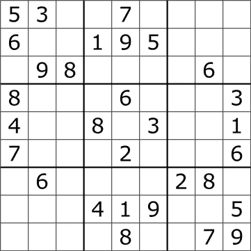
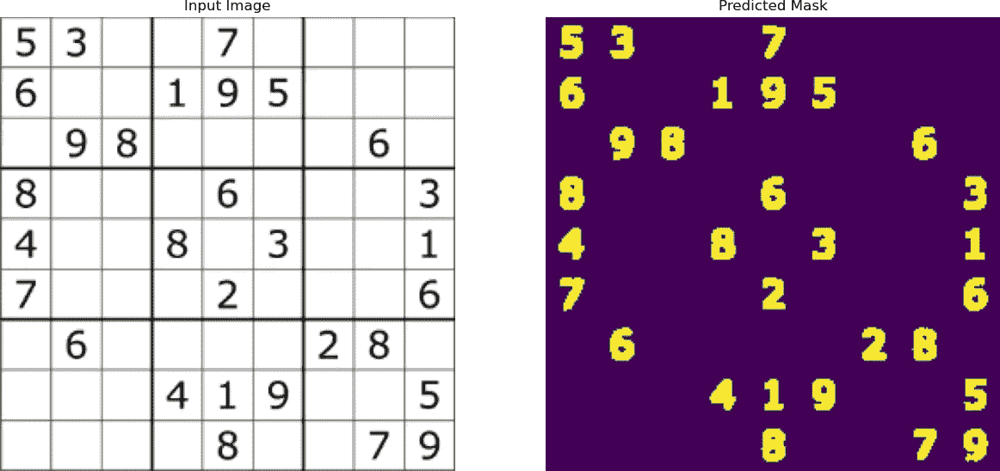
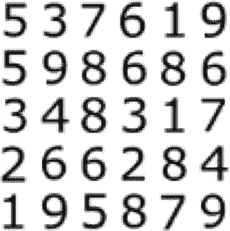
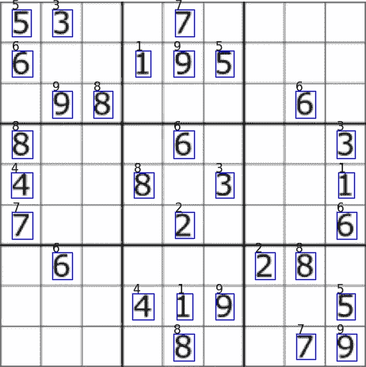
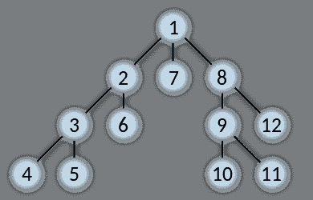
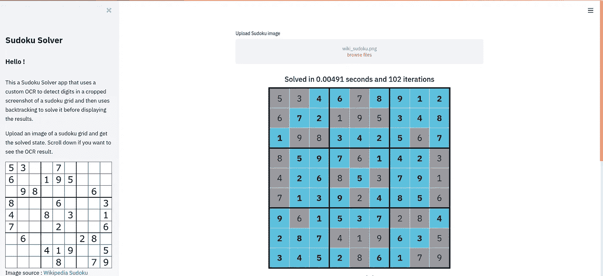

# 用计算机视觉和回溯构建一个数独求解应用程序

> 原文：<https://towardsdatascience.com/building-a-sudoku-solving-application-with-computer-vision-and-backtracking-19668d0a1e2?source=collection_archive---------20----------------------->

## 使用在合成数据上训练的自定义 OCR 从截图中解决数独，然后回溯。


[贾森·汤普森](https://unsplash.com/@jasonlthompson?utm_source=unsplash&utm_medium=referral&utm_content=creditCopyText)在 [Unsplash](https://unsplash.com/?utm_source=unsplash&utm_medium=referral&utm_content=creditCopyText) 上拍照

数独是一种基于逻辑的谜题，通常以 9x9 网格和 1 到 9 位数的 3x3 子网格的形式出现。这个难题的有效解决方案的条件是，在任何行、列或 3×3 子网格中，没有数字被使用两次。

可能的 9x9 网格的数量是 6.67×10^21，所以根据最初的拼图，找到一个解决方案有时是具有挑战性的。在这个项目中，我们将构建一个 Streamlit 应用程序，它可以在给定一个屏幕截图的情况下自动解决数独难题。

我们将首先构建一个对象字符识别模型，它可以从数独网格图像中提取数字，然后使用回溯方法来解决这个问题。最终的应用程序将通过一个易于使用的 Streamlit 应用程序进行访问。

数独 python 表示和求解器的第一个版本大部分都是从这个 Repo:【https://github.com/RutledgePaulV/sudoku-generator中获取和修改的

# 目标字符识别



图片来源:[https://en.wikipedia.org/wiki/Sudoku](https://en.wikipedia.org/wiki/Sudoku)

一旦我们有了拼图的图像，我们需要提取所有写在那里的数字，以及它们的位置。

为此，我们将训练一个数字检测器模型，然后训练一个数字识别器模型。第一个会告诉我们一个数字出现在图像的什么地方，第二个会告诉我们是哪个数字。我们还将获得这两项任务的数据集。

## 探测器模型

我们将使用的检测器模型基于具有跳跃连接的全卷积神经网络，与我们在以前的项目中使用的非常相似，例如:

*   [使用 Python 和 Keras 进行血管分割](/vessel-segmentation-with-python-and-keras-722f9fb71b21)
*   [使用全卷积网络的指纹去噪和修复](/fingerprint-denoising-and-inpainting-using-fully-convolutional-networks-e24714c3233)

如果你想了解更多关于图像分割的知识，你可以阅读这两篇文章。

这个模型的目标是输出一个二进制掩码，告诉我们，对于输入图像的每个像素，它是否是数字的一部分。



## 识别器模型



从上面的网格中提取的字符

识别器模型的作用是接受单个数字作为输入，并预测它是集合{1，2，3，4，5，6，7，8，9}中的哪一个。它主要是一个卷积网络，但输出是一个具有 softmax 激活的全连接层。

## 数据集

为了训练上述两个网络，我们需要带注释的数据。我们可以生成一个合成的数据集，而不是手动注释一堆数独网格，因为它花费不多，并且希望它能起作用😉。

为了有一个真实的数据集，我们使用多种类型的字体、大小、背景颜色、网格元素…


生成图像的示例

因为我们从头开始生成这些例子，所以我们可以获得图像中每个数字的位置和类别的所有细节。



最终 OCR 结果

# 追踪

我们将使用回溯来解决数独。这种方法允许我们一步一步地构建树状的候选解，然后如果我们发现子树不能产生可行的解，就修剪这棵树。

我们在数独游戏中的做法如下:

*   对于每个单元格，我们计算可以用来填充给定网格状态的单元格的可能值。我们可以通过消去法很容易地做到这一点。
*   我们按照可能值的数量对单元格进行排序，从最低到最高。
*   我们遍历第一个未填充的单元格，给它分配一个可能的值，然后分配给下一个，依此类推…
*   如果我们最终得到了一个可行的解，我们就返回它，否则我们就回到上一个被赋值的单元格，把它的状态改成另一个可能的值。有点像深度优先树搜索。



数字定义了遍历的顺序。来源:[https://commons . wikimedia . org/wiki/File:Depth-first-tree . SVG](https://commons.wikimedia.org/wiki/File:Depth-first-tree.svg)

如果在探索了这棵树所有可能的叶子之后，我们找不到解决方案，那么这个数独就是无解的。

回溯的好处是保证找到一个解或者证明一个不存在。问题是，虽然它在 9x9 数独网格中通常很快，但它在一般情况下的时间复杂度是惊人的。

实现(有些操作，如排序，是在“Board”类中执行的):

```
def backtracking_solve(board):
    # Modified from [https://github.com/RutledgePaulV/sudoku-generator/blob/master/Sudoku/Solver.py](https://github.com/RutledgePaulV/sudoku-generator/blob/master/Sudoku/Solver.py)
    set_initially_available(board.cells)
    to_be_filled = board.get_unused_cells()
    index = 0
    n_iter = 0
    while -1 < index < len(to_be_filled):
        current = to_be_filled[index]
        flag = False
        possible_values = board.get_possibles(current)
        my_range = range(current.value + 1, 10)
        for x in my_range:
            if x in possible_values:
                n_iter += 1
                current.value = x
                flag = True
                break
        if not flag:
            current.value = 0
            index -= 1
        else:
            index += 1
    if len(to_be_filled) == 0:
        return n_iter, False
    else:
        return n_iter, index == len(to_be_filled)
```

# 该应用程序

我们使用 Streamlit 构建应用程序。该应用程序需要允许我们上传图像，解决数独，并显示结果。

## 文件上传:

Streamlit 提供了一种使用 st.file_uploader 创建文件上传小部件的简单方法。

```
file = st.file_uploader("Upload Sudoku image", type=["jpg", "png"])
```

## OCR:

我们应用检测器和识别器模型来创建网格。

```
grid = img_to_grid(img, detector_model, recognizer_model, plot_path=None, print_result=False)
```

## 求解:

我们使用回溯来解决数独。

```
n_iter, _ = backtracking_solve(to_solve_board)
```

## 显示结果:

我们通过指定 unsafe_allow_html=True 在一个漂亮的 Html/Css 表中显示结果。

```
html_board.markdown("<center>" + to_solve_board.html() + "</center>", unsafe_allow_html=True)
```

## 最终结果:



# 结论:

在这个小项目中，我们在 Streamlit 中构建了一个数独求解应用程序。我们在这个过程中训练了一个定制的 OCR 模型，并使用回溯来解决实际的数独网格。

代号:[https://github.com/CVxTz/sudoku_solver/](https://github.com/CVxTz/sudoku_solver/)