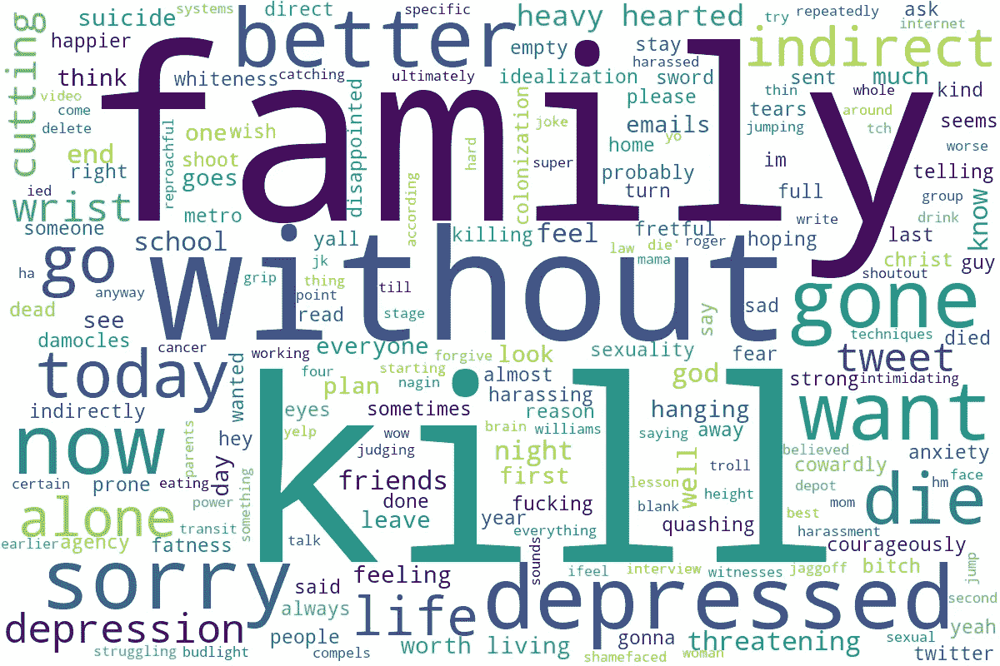

# 使用自然语言处理构建自杀推特分类器

> 原文：<https://towardsdatascience.com/building-a-suicidal-tweet-classifier-using-nlp-ff6ccd77e971?source=collection_archive---------32----------------------->

## 使用自然语言处理来预测推特上的自杀意念。

多年来，自杀一直是全球范围内的主要死亡原因之一，根据[维基百科](https://en.wikipedia.org/wiki/Suicide#:~:text=Suicides%20resulted%20in%20828%2C000%20global,of%20people%20die%20by%20suicide.)的数据，2015 年，自杀导致全球 82.8 万人死亡，比 1990 年的 71.2 万人有所增加。这使得自杀成为全球第十大死亡原因。越来越多的证据表明，互联网和社交媒体能够影响与自杀相关的行为。使用自然语言处理，机器学习的一个领域，我建立了一个非常简单的自杀意念分类器，它可以预测一个文本是否有自杀倾向。



分析了 Tweet 的 WordCloud

# 数据

我使用了一个我在 Github 上找到的 Twitter 爬虫，通过删除标签、链接、URL 和符号对代码做了一些修改。每当它从 Twitter 上抓取数据时，数据都是基于包含如下单词的查询参数抓取的:

> 沮丧，绝望，答应照顾，我不属于这里，没有人值得我，我想死等等。

虽然有些文本与自杀毫无关系，但我不得不手动标注了大约 8200 行推文的数据。我还获取了更多的 Twitter 数据，并且能够将我以前拥有的足够我训练的数据连接起来。

# 构建模型

## 数据预处理

我导入了以下库:

```
import pickle
import re
import numpy as np
import pandas as pd
from tqdm import tqdm
import nltk
nltk.download('stopwords')
```

然后，我编写了一个函数来清理文本数据，删除任何形式的 HTML 标记，保留表情字符，删除非单词字符，最后转换为小写。

```
def preprocess_tweet(text):
    text = re.sub('<[^>]*>', '', text)
    emoticons = re.findall('(?::|;|=)(?:-)?(?:\)|\(|D|P)', text)
    lowercase_text = re.sub('[\W]+', ' ', text.lower())
    text = lowercase_text+' '.join(emoticons).replace('-', '') 
    return text
```

之后，我对 tweet 数据集应用了 preprocess_tweet 函数来清理数据。

```
tqdm.pandas()df = pd.read_csv('data.csv')
df['tweet'] = df['tweet'].progress_apply(preprocess_tweet)
```

然后，我使用。split()方法，并使用词干将文本转换为它们的根形式。

```
**from** **nltk.stem.porter** **import** PorterStemmer
porter = PorterStemmer()
**def** tokenizer_porter(text):
    **return** [porter.stem(word) **for** word **in** text.split()]
```

然后我导入了停用词库来删除文本中的停用词。

```
**from** **nltk.corpus** **import** stopwords
stop = stopwords.words('english')
```

在单个文本上测试函数。

```
[w for w in tokenizer_porter('a runner likes running and runs a lot') if w not in stop]
```

输出:

```
['runner', 'like', 'run', 'run', 'lot']
```

## 矢量器

对于这个项目，我使用了**哈希矢量器**，因为它与数据无关，这意味着它的内存非常低，可扩展到大型数据集，并且它不在内存中存储词汇字典。然后，我为哈希矢量器创建了一个记号赋予器函数

```
def tokenizer(text):
    text = re.sub('<[^>]*>', '', text)
    emoticons = re.findall('(?::|;|=)(?:-)?(?:\(|D|P)',text.lower())
    text = re.sub('[\W]+', ' ', text.lower())
    text += ' '.join(emoticons).replace('-', '')
    tokenized = [w for w in tokenizer_porter(text) if w not in stop]
    return tokenized
```

然后我创建了散列矢量器对象。

```
from sklearn.feature_extraction.text import HashingVectorizervect = HashingVectorizer(decode_error='ignore', n_features=2**21, 
                         preprocessor=None,tokenizer=**tokenizer**)
```

## 模型

对于该模型，我使用了随机梯度下降分类器算法。

```
**from** **sklearn.linear_model** **import** SGDClassifier
clf = SGDClassifier(loss='log', random_state=1)
```

## 培训和验证

```
X = df["tweet"].to_list()
y = df['label']
```

对于模型，我用了 80%用于训练，20%用于测试。

```
from sklearn.model_selection import train_test_split
X_train,X_test,y_train,y_test = train_test_split(X,
                                                 y,
                                                 test_size=0.20,
                                                 random_state=0)
```

然后，我用我们之前创建的哈希矢量器将文本数据转换成矢量:

```
X_train = vect.transform(X_train)
X_test = vect.transform(X_test)
```

最后，我将数据与算法相匹配

```
classes = np.array([0, 1])
clf.partial_fit(X_train, y_train,classes=classes)
```

让我们测试一下测试数据的准确性:

```
print('Accuracy: %.3f' % clf.score(X_test, y_test))
```

输出:

```
Accuracy: 0.912
```

我有 91%的准确率，这很公平，之后，我用预测更新了模型

```
clf = clf.partial_fit(X_test, y_test)
```

# 测试和预测

我在模型中添加了文本“我要自杀，我厌倦了沮丧和孤独的生活”。

```
label = {0:'negative', 1:'positive'}
example = ["I'll kill myself am tired of living depressed and alone"]
X = vect.transform(example)
print('Prediction: %s\nProbability: %.2f%%'
      %(label[clf.predict(X)[0]],np.max(clf.predict_proba(X))*100))
```

我得到了输出:

```
Prediction: positive
Probability: 93.76%
```

而当我用下面的文字“这么热的天，我想吃冰淇淋，逛公园”时，我得到了下面的预测:

```
Prediction: negative
Probability: 97.91%
```

该模型能够准确预测这两种情况。这就是如何建立一个简单的自杀推特分类器。

你可以在这里找到我写这篇文章用的笔记本

感谢阅读😊