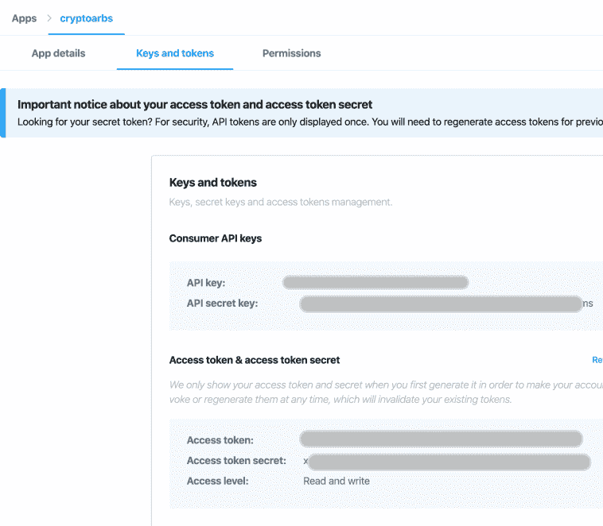

# 用 Python 构建一个 Twitter 机器人

> 原文：<https://towardsdatascience.com/building-a-twitter-bot-with-python-89959ef2607f?source=collection_archive---------12----------------------->

## 了解如何一步一步地构建机器人

你能想象拥有一个根据一周中的不同日子发布不同推文的推特机器人吗？这在 Python 和 [Tweepy](http://docs.tweepy.org/en/latest/index.html) 中是可能的。继续阅读这个故事，你会发现如何用 Python 构建一个 **Twitter 机器人。**


照片由[莎拉·库菲](https://unsplash.com/@stereophototyp?utm_source=unsplash&utm_medium=referral&utm_content=creditCopyText)在 [Unsplash](https://unsplash.com/s/photos/twitter?utm_source=unsplash&utm_medium=referral&utm_content=creditCopyText) 拍摄

# 建立一个 Twitter 开发账户和 Tweepy

首先，我们需要安装 *tweepy* 。我们可以使用 pip 命令轻松地在终端中安装它:

```
pip install tweepy
```

太好了，现在我们已经安装了 *Python* 库 *Tweepy* 。接下来，我们需要创建一个 [Twitter 开发者账户](https://developer.twitter.com/en.html)。

Twitter 提供了一个开发者平台，该平台提供了一个 API 来管理和执行我们的 Twitter 帐户中的某些活动。可以看一下 [Twitter API 文档](https://developer.twitter.com/en/docs)。我们可以通过这个 API 执行多项任务。请看下面其中的一些:

*   **发布**和**检索**的推文
*   **关注**和**不关注**用户
*   发布**直接消息**

然而，在我们能够使用 Twitter API 端点之前，我们需要创建一个开发人员帐户并生成我们的 API 密钥。可以在这里直接[申请开发者账号。在回答了几个关于您计划如何使用 API 和接受 *Twitter 开发者协议*的问题后，您将被授予访问开发者仪表板的权限。](https://developer.twitter.com/en/application/use-case)

一旦您被授权访问仪表板，登录[开发人员网站](https://developer.twitter.com/)并创建您的第一个应用程序。这一步将自动生成您的消费者 API 密钥和您应该保密的访问令牌:



Twitter API 键

从 Twitter 开发平台，我们能够编辑应用程序权限。我已经授予我的应用程序读取、写入和发送直接消息的权限。

请注意，开发者帐户应该链接到您想要激活 bot 的 Twitter 帐户。例如，我使用我的 [Crypto News](https://twitter.com/cryptonewsandp1) Twitter 账户，在那里我创建了我在本文中描述的 Twitter bot。

# 用 Python 和 Tweepy 构建一个 Twitter 机器人

好了，让我们开始构建我们的 Twitter 机器人。如前所述，我们将使用 [Tweepy 库](http://docs.tweepy.org/en/latest/install.html)，这将使我们的工作更加容易。

首先，我们进口 *tweepy* 。Tweepy 将通过我们的秘密密钥为我们管理 API 的认证。

如下面的代码摘录所示，我们通过创建一个 ***OAuthHandler*** 实例来处理我们的登录 ***，通过传递消费者密钥和消费者秘密作为参数。***

接下来，为了能够向 API 发出请求，我们应该发回一个访问令牌。出于这个原因，我们使用 *auth.set_access_token* 方法在会话期间存储访问请求令牌。

最后，**我们准备好通过 Python** 管理我们的 Twitter 账户。请注意，我已经包含了 *XXX* 而不是我真正的密钥。用你的秘密密钥替换掉 *XXX* ，你可以从你的 *Twitter 开发者仪表板*中获得。

```
import tweepy 
import datetime consumer_key = 'XXXX' 
consumer_secret = 'XXXX' 
access_token = 'XXX' 
access_token_secret = 'XXXX' auth = tweepy.OAuthHandler(consumer_key, consumer_secret) auth.set_access_token(access_token, access_token_secret)api = tweepy.API(auth)
```

我们的变量 *api* 是我们存储认证设置的地方。我们将使用它向 Twitter API 发出所有请求。

我们已经完成了工作的一半。接下来，我们可以使用****update _ status 方法*来发布推文。***

*这个 twitter 机器人的想法是根据一周中的日期发布不同的推文。这可以通过使用 *if 语句*来存储 tweet 以根据当天发布来轻松完成。让我们在代码中构建逻辑。*

```
*import datetimedef publictweet():
    if datetime.date.today().weekday() == 0:
        tweettopublish = 'Hi everyone, today is Monday.   #Monday '
    if datetime.date.today().weekday() == 1:
        tweettopublish = 'Enjoy your Tuesday.  #Tuesday'
    if datetime.date.today().weekday() == 2:
        tweettopublish = 'Third week of the Week. #Wednesday'
    if datetime.date.today().weekday() == 3:
        tweettopublish = 'Thursday. I cannot wait for the Weekend'
    if datetime.date.today().weekday() == 4:
        tweettopublish = 'Friday...Finally'
    if datetime.date.today().weekday() == 5:
        tweettopublish = 'Great it is Saturday #weekend #Saturday'
    if datetime.date.today().weekday() == 6:
        tweettopublish = 'Sunday morning...#Weekend #enjoy ' api.update_status(tweettopublish)
   print(tweettopublish)*
```

*我们使用*datetime*library 和 *weekday* 方法来知道今天是星期几。例如，如果今天是*星期日*，我们运行下面的代码，我们将得到 *6* 作为结果:*

```
*print(datetime.date.today().weekday())# above code will print 6 if today was Sunday, 0 if today was Monday, 1 if today was Tuesday and so on.*
```

*因此， *if 语句中只有一个*将为真。因此，这将是我们将保存在变量 *tweettoppublish* 中的 Tweet。*

*最后，通过方法*update _ status(tweettopublish)*，我们能够在我们的 Twitter 时间轴中发布推文。正如你在下面看到的，今天是星期天，因此，通过运行 *publictweet* 函数，API 正在定位星期天的 tweet。*

```
*publictweet()*
```

**

*用 Python 构建一个 Twitter 机器人*

# *Python Twitter Bot 中包含的其他功能*

*除了发布推文，我们还可以使用 Python Twitter Bot 执行一些其他很酷的任务。例如，我们可以:*

*   *使用[用户方法](http://docs.tweepy.org/en/latest/api.html#user-methods)检索特定 Twitter 用户的信息*
*   *通过[直邮方式](http://docs.tweepy.org/en/latest/api.html#direct-message-methods)向用户发送直邮信息*
*   *使用[交友方式](http://docs.tweepy.org/en/latest/api.html#friendship-methods)关注和取消关注用户*
*   *使用[封锁方法](http://docs.tweepy.org/en/latest/api.html#block-methods)封锁和解除封锁用户*

# *包扎*

*只用了几行代码，我们就成功地构建了一个令人惊叹的 Twitter 机器人，并且现在已经在我们的 Twitter 账户上运行了！*

*享受你的新机器人，并随时扩展它的新功能！感谢您的阅读！*

**原载于 2020 年 2 月 2 日 https://codingandfun.com**的* [*。*](https://codingandfun.com/building-a-twitter-bot-with-python/)*