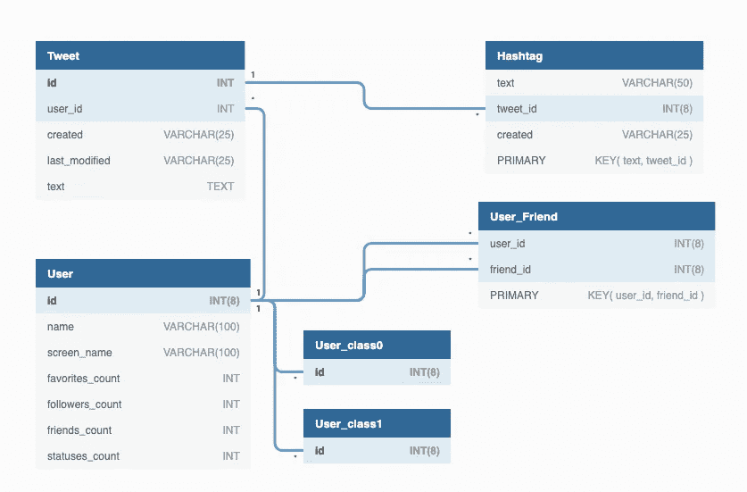

# 使用 Twitter 数据构建用户分类器

> 原文：<https://towardsdatascience.com/building-a-user-classifier-using-twitter-data-283dfd0c0e59?source=collection_archive---------31----------------------->

## [实践教程](https://towardsdatascience.com/tagged/hands-on-tutorials)

## 使用随机森林学习方法构建分类器。用 Twitter 数据训练它。

德国巴伐利亚的森林。我拍的照片。

Twitter 平台提供了大量的数据。一个机器学习算法需要大量的数据来建立一个好的模型。因此，我们通过使用 Twitter 数据进行训练来构建 ML 预测器是一个好主意。

无论用户是否有特定的政治观点，我们都将建立一个分类器。我们使用 Twitter 推文、用户和朋友数据来构建分类器。此外，我们将使用随机森林作为我们的学习算法，使用 Python 作为我们的开发平台。

# 步骤:

1.  识别和收集 Twitter 数据。
2.  给数据贴标签。
3.  做特色工程。
4.  转换数据。
5.  训练模型。
6.  评估模型。

# 识别和收集 Twitter 数据

我们需要收集推文、用户和用户的朋友。我们以前的文章已经讨论了如何实现这一点。结果在关系数据库中。下图显示了数据库模式。

收集 Twitter 数据库模式。由 dbdiagram.io 构建和生成

这里我们有 **Tweet** 表存储所有的 Tweet(和 retweets)。**标签**表保存了推文中发现的标签。**用户**表包含所有发 tweet 或 retweet 的用户。 **User_Friend** 表存储每个用户和他们的朋友(他或她关注的用户)之间的关系。有 **Hashtag** 和 **Tweet** 表和 **Tweet** 和 **User** 表等表关系。我们将使用这些关系编写一个 SQL 查询来将三个表连接在一起。

稍后，我们将在下一节讨论 **User_class0** 和 **User_class1** 。

# 给数据贴标签

我们把用户分成两类，保守的和非保守的。我们需要一种给用户贴标签的方式。我们是这样做的:

*   首先，我们列出流行的标签。
*   然后，我们识别这些词中哪些可能与我们感兴趣的用户类别相关，保守。
*   接下来，我们可以在数据库中查询包含这些单词的推文。发布推文的用户会很保守。
*   其余的用户可能是非保守的。

我们将保守派放入 **User_class1** ，将非保守派放入 **User_class0** 。

我们收集了 2020 年 10 月 22 日的 Twitter 推文、标签和用户，地点是泰国。我们收到了 240 万条推文。通过使用该标准，我们发现了 3463 名保守用户和 47775 名非保守用户。在我们的数据集中，我们从班级 1 中随机选择 3000 人，从另一个班级中随机选择 5000 人。将它们混洗并分成训练和测试数据集。训练得到了 70%，测试得到了所有数据的 30%。

# 做特征工程

我们有一个基本的想法，即观点相似的用户可能会追随或倾听同一组影响者。对于每个用户，我们使用用户的朋友作为特征。因为一些用户可能有大量的用户(在 Twitter 上被称为朋友)，我们会将功能中的朋友数量限制在某个特定的数量，如 500。

我们根据训练数据集中的追随者数量选择前 500 位朋友作为我们的特征。

# 转换数据

我们需要做一些工作来将数据转换成特征向量。我们从 Twitter 收到的朋友数据如下:

假设我们的数据包括 A、B 和 c。此外，最好的朋友是 W、X、Y 和 z。要转换这一点，我们需要执行以下操作:

*   只保留我们数据集上的用户。例如，删除包含用户 D 和 e 的行。
*   只保留朋友向量中的朋友(顶级朋友)。例如，删除包含朋友 U 和 v 的行，输出应该如下所示:

*   做交叉列表。输出将是我们需要的特征向量。例如，如果用户 A 跟随 W、X 和 Y。用户 B 跟随 W 和 Y。用户 C 跟随 Y 和 z。特征向量应该是这样的:

# 训练模型

一旦我们得到了用于训练和标签输出的特征向量，训练分类器就简单了。以下是部分 Python 代码:

**X_train** 表示训练数据的特征向量。 **y_train** 是已知输出

*   我们实例化了随机森林分类器。
*   我们传递训练数据和已知输出来拟合模型。

就是这样。分类器准备好了。

# 评估模型

下一步是使用测试数据运行模型，获得预测，并将结果与已知输出进行比较。 **X_test** 代表测试数据的特征向量。 **y_test** 为已知输出。最后， **y_pred** 是模型预测。从结果来看:

*   **ROC AUC** 得分为 0.93。这很好。
*   一级精度为 92%。这意味着在所有的模型中，92%的模型显示它们是 1 类。
*   一级召回率为 79%。这意味着该模型可以识别 79%的第一类。
*   准确率相当不错，达到了 89%。但这意义不大，因为数据不平衡。

## 特征重要性

随机森林算法也可以识别特征的相对重要性。每个值的范围从 0 到 1。所有重要度之和为 1。以下 Python 代码显示了如何从学习模型中检索要素重要性，并绘制最高值图表。

因为在我们的模型中，特征是用户的朋友，所以这张图显示了影响者的重要性。正如我们所看到的，前几个特性的值明显高于其余的，然后逐渐降低，最后接近零。

此外，只要再多一点代码，我们应该能够列出顶级用户的屏幕名称。因此，我们可以看到这些影响者的相对重要性。

## 特征数量

我们将功能(朋友)的数量设置为 500。我们可以使用更少或更多吗？最佳值是多少？我们有一些代码来获得下面不同数量特征的 ROC AUC 得分:

从图中可以看出， **ROC AUC** 分数在特征数超过 500 后没有太大的提高。所以，500 应该没问题。

# 结论

我们从 Twitter 上收集推文、标签、用户和用户的朋友。使用标签将用户分为两类。我们使用用户的朋友作为我们的特征。将收集的数据转换成适当的特征向量。我们使用随机森林分类器作为学习算法，并用我们的数据训练它。
测试成绩看起来不错。 **ROC AUC** ，精度，召回率高。这意味着我们的方法运行良好，应该能够自信地预测结果。

本文完整 python 代码[此处](https://gist.github.com/mananai/03e446675b2729e52e3bce5e90a40c47)。