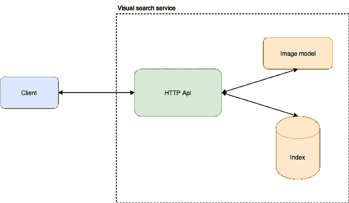

# 构建可视化搜索引擎

> 原文：<https://towardsdatascience.com/building-a-visual-search-engine-9451580afcf7?source=collection_archive---------38----------------------->

视觉搜索作为谷歌图片或 Pinterest Lens 的一部分已经存在了一段时间。随着它在电子商务中越来越受欢迎，通过允许客户简单地上传他们正在寻找的东西，而不是通过大量的属性过滤器，帮助商家提高他们的销售额，我决定看看如何从头开始构建这样的可视化搜索引擎，然后使用 [AnnDB](https://anndb.com/) 。

# 架构概述

让我们简单看一下，为了提供最基本的视觉搜索服务，我们需要什么。

架构图

我们的服务公开了客户端可以查询的 HTTP API。在幕后，我们需要一个模型来获得图像的矢量表示，然后可以存储在索引中，供以后查询。对于索引，我们可以采用一种简单的方法，按原样存储向量，然后对每个查询进行强力搜索。这非常简单，但是效率相当低(O(n))并且很慢，因为我们是用查询向量来计算索引中所有(潜在的高维)向量的距离。一种更好的方法是使用一种索引结构，这种索引结构将对向量空间进行划分，并且不需要比较整个索引。

## 模型

正如我上面提到的，我们需要一些方法将图像转换成它们的矢量表示。这些矢量表示应该具有这样的性质，即视觉上相似的图像应该最小化它们的矢量(潜在)表示相对于某个度量(欧几里得)的距离，反之亦然，视觉上不相似的图像应该最大化该度量。一种简单的方法是使用来自预训练图像分类模型的隐藏层的特征。然后，我们可以使用例如三重损失对自己的数据进行微调，或者使用自动编码器设置从头开始训练模型。
出于本文的目的，我将使用 [ResNet50](https://arxiv.org/pdf/1512.03385.pdf) 模型的最后一个隐藏层的特性。

## 索引

强力方法不是一个好主意，因为它不能扩展到超过几千项的数据集，所以我们将使用索引。有许多指数可以选择(看看[这个基准](https://github.com/erikbern/ann-benchmarks))，但我们将使用[骚扰](https://github.com/spotify/annoy)，因为它有一个很好的 Python API。Annoy 是由 Erik Bernhardsson 开发的，根据回购协议，它被 Spotify 用于音乐推荐。它使用[位置敏感散列法](https://en.wikipedia.org/wiki/Locality-sensitive_hashing)，该散列法基本上通过在每个节点处随机采样(n+1)维空间中的超平面来递归构建搜索树，然后基于向量与该超平面的(带符号)距离的符号将项目分配给左/右子节点。

## HTTP API

API 是视觉搜索服务中最不令人兴奋但却非常必要的部分。我们将使用 [Flask](https://flask.palletsprojects.com/en/1.1.x/) 来公开一个`/search`端点，该端点接受图像作为查询并返回 JSON 编码的结果集。

# 把所有的放在一起

第一部分是从我们的图像中建立索引。我们将加载每个图像，获取它的向量表示，并将其存储在索引中。添加完所有图片后，我们需要建立索引并保存到磁盘上。

第二部分是搜索 HTTP API 本身。如上所述，它公开了一个接受图像作为查询的端点，调用模型来获取它的向量表示，然后查询我们在第一部分中构建和保存的索引来获取潜在空间中的最近邻居。

*如需完整示例，请查看此回购:*[*https://github . com/marekgalovic/articles/tree/master/visual-search*](https://github.com/marekgalovic/articles/tree/master/visual-search)

# 结论

正如我们在上面描述的例子中看到的，构建一个概念验证的可视化搜索解决方案非常容易。然而，对于生产就绪的解决方案，我们需要构建更多。

*   需要复制搜索服务，以改善负载下的延迟并确保高可用性。
*   复制搜索服务提出了一个问题:是用它复制整个索引，还是将索引本身分成多个部分，并实现一个定制的 map-reduce 式搜索过程。
*   使用许多开源近似最近邻库的另一个大缺点是，一旦建立了索引，就不能修改，并且任何添加、更新或删除都需要重建索引，这可能是计算密集型的并且成本高。
*   临时操作几乎是不可能的，或者需要在选择的库和期刊索引重建的基础上进行粗略的扩展。

# AnnDB 近似最近邻数据库

[AnnDB](https://anndb.com/) 是一个分布式近似最近邻数据库，支持即席数据修改，无需重建索引。通过对数据进行内部分区，它可以扩展到多台服务器，使用 [Raft 共识算法](https://raft.github.io/)来实现复制和一致性，并使用 map-reduce like search 来实现低延迟和高吞吐量。

使用 [AnnDB Cloud](https://anndb.com) ，只需几行代码就可以实现生产就绪的可视化搜索解决方案。更多信息见[https://anndb.com](https://anndb.com)和[https://docs.anndb.com](https://docs.anndb.com)。

如果你喜欢这篇文章，请把它推荐给其他人，展示一些❤。此外，如果您有任何问题，请在下面留下评论或在社交媒体上联系。
[https://twitter.com/@marek_galovic](https://twitter.com/marek_galovic)
[https://github.com/marekgalovic](https://github.com/marekgalovic)
https://marekgalovic.com

*免责声明:我是 AnnDB* 的作者