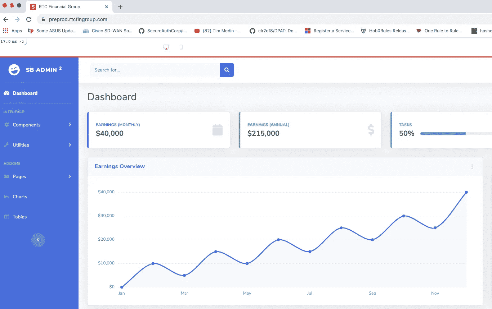
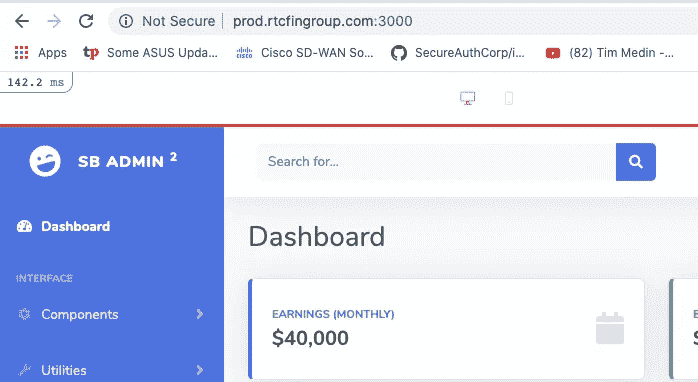
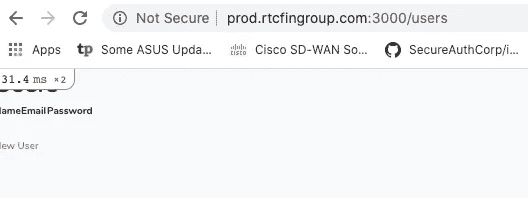
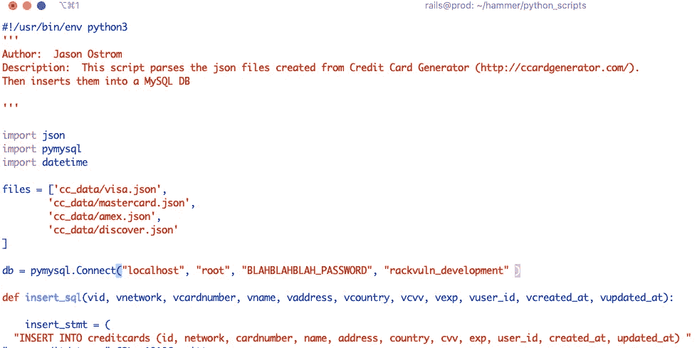
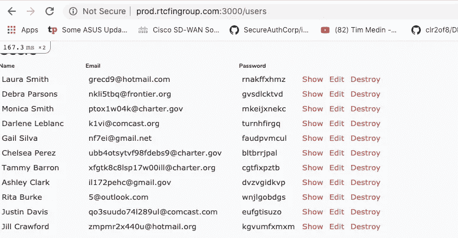
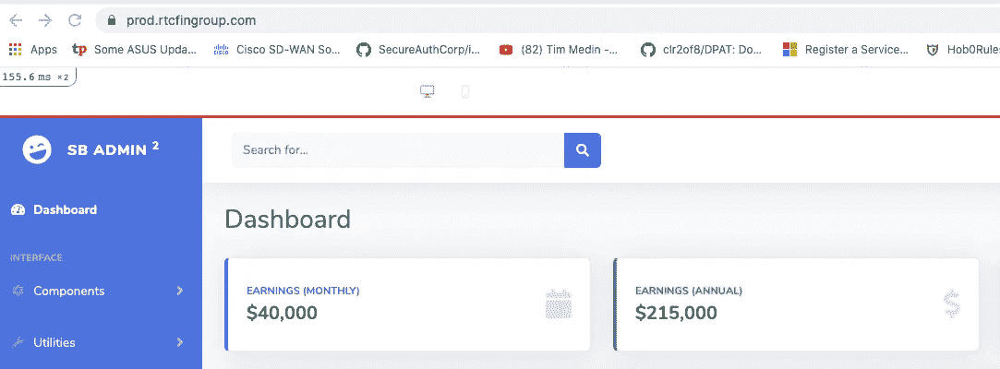

# 为学习构建易受攻击的 Rails 应用程序

> 原文：<https://towardsdatascience.com/building-a-vulnerable-rails-application-for-learning-2a1de8cf98d5?source=collection_archive---------61----------------------->

## 了解损坏的 DevSecOps 进程中的安全缺陷

## 介绍“Hammer”:一个易受攻击的 Ruby on Rails 应用程序的开源示例


一个黑客的公寓——胡安·卡西尼的艺术作品

答任何人都可以学习做技术“黑客”，这篇文章将带你看一个你可以自己实现的开源例子。

当你想到“黑客”这个词时，它会唤起什么形象？你会想到一个技术高超、意志坚定的计算机安全对手躲在他(或她)的地下室里，试图穿透你的防御并窃取你的数据吗？在 2020 年，这个词传达了一种更加邪恶的恶意语气。现在这个术语有一系列的分类，包括“黑帽子”、“白帽子”和“灰帽子”。它们通过意图和许可来区分。然而，情况并非总是如此。黑客攻击曾经是所有美好事物的信号。有趣的是，这个术语起源于 1961 年麻省理工学院的模型铁路俱乐部。成员们黑进了他们的列车组以修改它们的功能。通过这一点，我们可以把它的意思扩展到理解黑客是如何在幕后工作的。它正在调整技术，以新的和创造性的方式使用它。我喜欢追溯这个词的原意。黑客是最纯粹最高尚的形式。本着下面这个指南的精神，你可以享受一个关于技术黑客的教程。至少，探索一个可以反映生产系统中有缺陷的安全方法的应用程序是很有趣的。请随意复制这个回购协议，并根据您自己的想法进行扩展。

我最近偶然发现了一个有一些安全缺陷的迷人的网络应用程序。每隔一段时间，你就会发现一些让你兴奋不已的事情，去学习新的东西。我不得不回去，把我所看到的分解开来，然后按照我自己的理解重新创造。现在我不是专业的软件工程师。但是我绝对喜欢学习和理解事物。这是开发人员如何通过代码或部署环境引入风险的一个很好的例子。这个项目的精神是为所有人共享一个学习应用程序。介绍[Hammer](https://github.com/iknowjason/hammer)——用 Ruby on Rails 编写的 web 应用程序的一个易受攻击的例子。在这篇文章中，我将带你创建锤子。你准备好了吗？让我们开始吧。但首先，概述一下什么是 [***锤子***](https://github.com/iknowjason/hammer) 其实是:


Ruby on Rails

*   用 Ruby on Rails 编写的易受攻击的 web 应用程序。
*   100% FOSS InfoSec 社区贡献，可在此下载。
*   使用 Rails 搭建技术模拟 MySQL 数据库后端的生产 web 应用程序部署。
*   docker——编写自动化部署或手动构建指令。Docker 容器使用 MariaDB 数据库后端。
*   自举管理仪表板好看的用户界面。
*   包含使用信用卡和用户凭证部署模拟生产用户数据的 python 脚本。
*   包含一个错误配置的 Ruby on Rails gem。
*   隐藏在申请中的复活节彩蛋。
*   生产配置的配置步骤，包括加密 TLS 证书
*   在 https://preprod.rtcfingroup.com[演示锤子应用](https://preprod.rtcfingroup.com)(请善待我的应用)



它既好看又脆弱！

F 或自动 Docker 构建部署，请跳至“ ***Docker 部署*** ”部分。否则，您可以按照下面指定的这些*手动构建步骤。注意，这是在 Ubuntu Linux 18.04 上构建和测试的。*

# *手动构建步骤(Ubuntu Linux 18.04)*

*Sstep 1:安装 MySQL。这些步骤在 Ubuntu Linux 18.04 上得到了验证。*

```
*$sudo apt update$sudo apt install mysql-server mysql-client libmysqlclient-dev -y*
```

*运行***MySQL _ secure _ installation***脚本。*

```
*$sudo mysql_secure_installation*
```

*下面是一个指南，展示了我在创建这个应用程序时的脚本选择。请随意选择您认为最适合自己的安全要求。因为这是一个故意不安全的应用程序，所以应该仔细考虑需要更好安全性的其他部署类型:*

1.  *验证密码插件？**否***
2.  *新密码？ **<输入密码>***
3.  *删除匿名用户？**是***
4.  *不允许远程 root 登录？**是***
5.  *远程测试数据库？**是***
6.  *重新加载权限表？**是***

*安装 Ruby 版本管理器*

```
*$sudo apt-get install software-properties-common -y$sudo apt-add-repository -y ppa:rael-gc/rvm$sudo apt-get update$sudo apt-get install rvm -y*
```

*创建一个新用户，并将他们添加到 rvm 组。*

```
*$useradd -m -s /bin/bash -G rvm <username>*
```

*通过/etc/sudoers 委派权限。编辑/etc/sudoers 中的行，为该用户添加权限。为了便于更改，您可以简单地镜像与 root 用户相同的权限。*

```
*# User privilege specificationroot ALL=(ALL:ALL) ALL<username> ALL=(ALL:ALL) ALL*
```

*更改用户密码(duh)*

```
*sudo passwd <username>*
```

*以该用户身份登录，并在以该用户身份登录时执行剩余的步骤。*

*使用 rvm 安装 Ruby 2.6.3(以新用户身份登录)*

```
*$rvm install 2.6.3*
```

*S **步骤 4:** 克隆 hammer repo 并运行“捆绑安装”*

```
*$git clone [https://github.com/iknowjason/hammer](https://github.com/iknowjason/hammer)
$cd hammer
$bundle install*
```

*S **第五步:**编辑***config/database . yml***中的数据库配置文件。*

*更改***<DB _ PASSWORD>***的密码字段中的密码，以匹配您在步骤 1 中为 root 密码指定的密码。*

***运行 mysql 客户端连接 MySQL，更改权限。**在<密码>中指定您在上面和步骤 1 中输入的相同密码。*

```
*$sudo mysqlmysql> ALTER USER ‘root’@’localhost’ IDENTIFIED WITH mysql_native_password BY ‘<PASSWORD>’;mysql> exit*
```

***验证您现在可以作为 root 用户进行身份验证。在提示符下输入您的 root 密码:***

```
*$mysql -u root -pmysql> exit*
```

*用 rails 应用程序数据填充 MySQL 数据库。*

```
*$cd /home/<username>/hammer$rake db:create$rake db:migrate*
```

*安装最新的节点。*

```
*$curl -sL [https://deb.nodesource.com/setup](https://deb.nodesource.com/setup)_10.x -o nodesource_setup.sh$sudo bash nodesource_setup.sh$sudo apt install nodejs -y*
```

*安装最新的 yarn，然后为这个应用程序实例重新构建页面。*

***安装最新纱线:***

```
*$curl -sS [https://dl.yarnpkg.com/debian/pubkey.gpg](https://dl.yarnpkg.com/debian/pubkey.gpg) | sudo apt-key add -$echo 'deb [https://dl.yarnpkg.com/debian/](https://dl.yarnpkg.com/debian/) stable main' | sudo tee /etc/apt/sources.list.d/yarn.list$sudo apt update && sudo apt install yarn -y*
```

***运行 rake 命令编译页面:***

```
*$bundle exec rake assets:precompile$bundle exec rake webpacker:compile*
```

*S步骤 9: 在默认端口 3000 上启动应用程序*

```
*$rails s -b 0.0.0.0*
```

*通过使用浏览器检查默认页面来验证它是否正常工作— URL 为***http://<IP>:3000***。*

***确认页面没有任何错误。**(表格将不显示数据)*

*http://<ip>:3000/用户</ip>*

*http://<ip>:3000/信用卡</ip>*

*您应该会在默认页面上看到:*

**

*默认页面*

*您应该会在用户页面上看到:*

**

*用户页面*

*S **步骤 10:** 用提供的 Python 脚本添加模拟用户和敏感信用卡数据。首先，通过输入< CTRL-C >来中断应用。*

****安装 python 模块:****

```
*$sudo apt-get install python3-pip -y$sudo python3 -m pip install Faker$sudo pip3 install pymysql*
```

*在应用程序的工作目录中，切换到 python_scripts 目录。*

```
*$cd /home/<username>/hammer/python_scripts*
```

*编辑 ***gen_users.py*** 和***gen _ credit data . py***脚本。更改以下变量以匹配您在步骤 5 中指定的 MySQL DB 实例:*

*数据库用户名*

*数据库密码*

*数据库名称*

***注意:**如果使用了***config/database . yml***中的默认值，那么 DB_NAME 应该是***rack vuln _ development***。*

**

*修改 gen_creditdata.py 脚本的示例*

***运行两个脚本:***

```
*$./gen_users.py$./gen_creditdata.py*
```

*变回 rails 应用程序的工作目录。再次启动应用程序。*

```
*$cd /home/<username>/hammer$rails s -b 0.0.0.0*
```

*用你的浏览器验证你可以访问***/用户*** 和***/信用卡*** 的网址，这次他们渲染了一些数据！*

*http://<ip>:3000/用户</ip>*

*http://<ip>:3000/信用卡</ip>*

**

*用户页面现在的样子。*

*S 为了获得更好的产品体验，您可以使用一个根 CA 颁发的 TLS 证书来提供应用程序，该证书托管在使用 Nginx 反向代理的域中。只有当您有域名和 DNS 记录解析到您的站点时，才能继续前进。为此，您可以使用 cloud Linux VPS 提供商(如 Digital Ocean 或 Linode)轻松创建一个新主机。*

*S**step 12:**安装 Nginx 用于反向代理和 TLS 隧道终止。*

```
*$sudo apt install nginx -y*
```

*安装让我们加密证书机器人*

```
*$sudo add-apt-repository universe$sudo add-apt-repository ppa:certbot/certbot$sudo apt-get update$sudo apt-get install certbot python-certbot-nginx -y*
```

*SS**步骤 14** :运行 certbot 创建 TLS 证书*

```
*$sudo certbot --nginx*
```

***回答问题:***

*您的电子邮件地址:*

*同意服务条款:*

*愿意分享您的电子邮件:*

*输入域名:<host.domain.com></host.domain.com>*

***注意:**上面这个步骤很重要。确保 certbot 能够自动部署 TLS 证书。*

*重定向:(我总是选择“2”来启用重定向)*

*重新启动并验证 nginx*

```
*$sudo service nginx restart$sudo service nginx status*
```

*S **步骤 16:** 编辑 nginx 配置，配置 Nginx 反向代理。这将配置 Nginx 将 TLS 终止的流量转发到运行在本地主机上的 Rails Puma 应用服务器。下面的配置应该与您的特定环境相匹配。*

*编辑***/etc/nginx/sites-可用/默认****

*替换 ***server_name*** 和 ***root*** 指令，以匹配您的 FQDN 和您的 rails 应用程序的目录。更换**主机**和**返回 301** 参数，以匹配您的 FQDN。下面的例子可以作为一个模板，但需要根据您的环境进行修改。*

```
*upstream app { server 127.0.0.1:3000;}server { server_name prod.rtcfingroup.com; root /home/rails/hammer/public; try_files $uri [@app](http://twitter.com/app); location [@app](http://twitter.com/app) { proxy_pass [http://app](http://app);
        proxy_set_header X-Forwarded-For $proxy_add_x_forwarded_for;
        proxy_set_header Host $http_host;
        proxy_redirect off;
    } error_page 500 502 503 504 /500.html;
    client_max_body_size 4G;
    keepalive_timeout 10; listen 443 ssl; if ($scheme != "https") {
        return 301 [https://$host$request_uri](/$host$request_uri);
    } ssl_certificate <PATH>
    ssl_certificate_key <PATH>
    include <PATH>
    ssl_dhparam <PATH>}server {
    if ($host = prod.rtcfingroup.com) {
        return 301 [https://$host$request_uri](/$host$request_uri);
    }     listen 80;
    server_name prod.rtcfingroup.com return 404; }*
```

*保存文件，重新启动 nginx 服务，并验证它正在运行*

```
*$sudo service nginx restart$sudo service nginx status*
```

*S **tep 18:** 启动 rails app 监听本地主机，端口 3000。*

```
*$cd /home/<username>/hammer$rails s*
```

*S **tep 19:** 浏览你的新 FQDN(即 [https://host.domain.com)验证一切正常。](https://host.domain.com.) Nginx 应该终止 TLS 连接，并重定向到监听端口 3000 的 Rails Puma 应用服务器！*

**

*现在，您的 Rails 应用程序使用了 Nginx 反向代理！*

# ***Docker 部署步骤***

*获取 docker-compose*

```
*$sudo apt-get update
$sudo apt-get install docker-compose -y*
```

*S **步骤 2:** 使用 git 获取回购*

```
*$git clone [https://github.com/iknowjason/hammer.git](https://github.com/iknowjason/hammer.git)*
```

*S **步骤 3:** 运行 docker-compose 命令来构建并启动容器*

```
*$cd hammer$sudo docker-compose build$sudo docker-compose up*
```

*如果第一次尝试出现数据库错误，再次运行 docker-compose up。*

```
*$sudo docker-compose up*
```

*使用浏览器导航到您主机上的端口 3000。*

*http:// <ip>:3000</ip>*

*我希望您喜欢构建这个脆弱的演示应用程序。在这个易受攻击的应用程序中，有许多有价值的经验教训可以借鉴。我欢迎任何评论、建议和合作。如果您有改进它的想法，或者是有想法的 Rails 开发人员，请联系我。今后还会有更多的经验教训。*