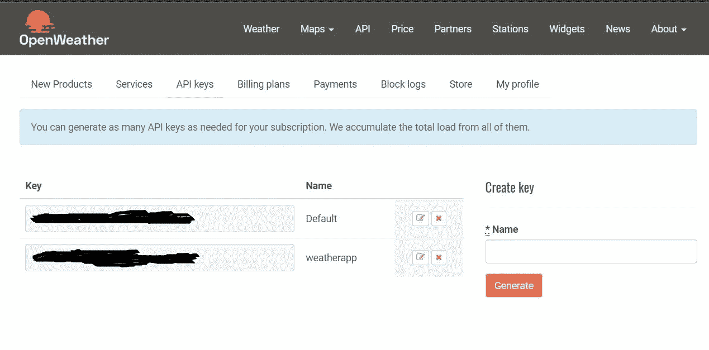
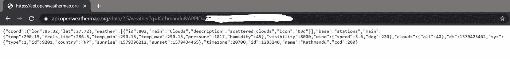
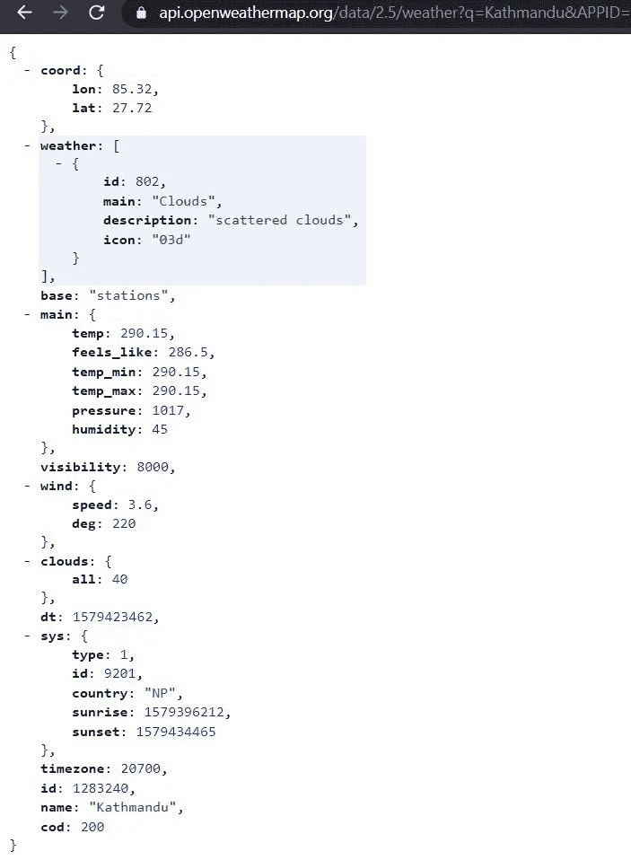

# 使用 Openweathermap 和 Flask 构建天气应用程序

> 原文：<https://towardsdatascience.com/building-a-weather-app-using-openweathermap-and-flask-ed7402239d83?source=collection_archive---------10----------------------->

## 了解如何使用 API，并使用 Python 和 Flask 构建一个简单的应用程序


jaros aw kwoczaa 在 [Unsplash](https://unsplash.com?utm_source=medium&utm_medium=referral) 上拍摄的照片

在本文中，我们将学习使用 web API 的基础知识。我们将使用 Python 和 Flask 创建一个简单的后端，调用 [Openweathermap API](https://openweathermap.org/api) ，并在网页中呈现结果。

如果你想跳过这篇文章并访问代码，请前往 [GitHub repo](https://github.com/sagunsh/weather-app) 。

# 获取 API 密钥

去 https://home.openweathermap.org/users/sign_up 注册一个免费计划，如果你还没有的话。然后访问 API 密钥部分[https://home.openweathermap.org/api_keys](https://home.openweathermap.org/api_keys)获取您的密钥。您可以使用默认密钥，也可以根据需要生成一个新密钥。您可能需要等待一段时间来验证您的密钥。



Openweather 仪表板

# 安装要求

我在这个项目中使用 Python 3.6，所以要确保你已经安装了 3.6 或更高版本。除此之外，我们将只需要用于 web 的 **Flask** 和用于进行 API 调用的 **requests** 。创建一个名为 **requirements.txt** 的新文件，并添加依赖项。您的文件应该如下所示:

```
Flask==1.1.1
requests==2.22.0
```

现在使用下面的命令来安装需求:

```
pip install -r requirements.txt
```

或者如果你只是想安装 Flask 和请求

```
pip install Flask requests
```

如果 pip 被 Python 2.7 占用，linux 和 mac 可能需要使用 pip3 而不是 pip 和 sudo。

# 进行 API 调用

浏览[文档](https://openweathermap.org/current)，最简单的请求方式是使用城市名。发出请求的 url 将如下所示

```
[http://api.openweathermap.org/data/2.5/weather?q=city_name&APPID=](http://api.openweathermap.org/data/2.5/weather?q={city}&APPID={API_KEY)your_api_key
```

您可以复制粘贴 url 并用适当的值替换 **city_name** 和 **your_api_key** 来查看结果。



来自 Openweather API 的示例响应

如果你想看到一个格式化的 JSON 响应，你可以使用一个叫做 [JSONView](https://chrome.google.com/webstore/detail/jsonview/chklaanhfefbnpoihckbnefhakgolnmc) 的 chrome 扩展。在浏览器中，您的响应将如下所示。



使用 JSONView 格式化 JSON 响应

所有显示的数据都非常直观。温度显示在**主**键内。**名称**和 **id** 都可以用来查询 API。

# 创建烧瓶应用程序

Flask 是一个简单、轻量级的 web 框架。它可以用来创建最小的 web 应用程序和 API。创建一个名为 **weather_app.py** 的文件并初始化我们的 Flask 应用程序。

在上面的代码片段中，我们导入了 Flask 并创建了它的一个实例。 **@app.route()** 用于创建路线。这里我们为主页创建一个，主要是在浏览器的 **h1** 标签中呈现“欢迎使用天气应用程序”。我们稍后将添加更多路线。在 if 块中，我们使用 **debug=True** 运行应用程序，这告诉 Flask 应用程序正在调试模式下运行。在调试模式下运行的好处是，如果我们在应用程序中进行更改，Flask 会自动检测这些更改，并为我们重新加载服务器。进入生产时，确保将此设置为**假**。

通过在终端/cmd 中键入以下命令来运行服务器

```
python weather_app.py
```

如果你同时安装了 python 2 和 3(通常在 linux 和 mac 上)，你将不得不使用 python3 而不是 python

```
python3 weather_app.py
```

你会看到类似这样的东西

```
* Debug mode: on
* Running on [http://127.0.0.1:5000/](http://127.0.0.1:5000/) (Press CTRL+C to quit)
* Restarting with stat
* Debugger is active!
* Debugger PIN: 123-456-789
```

访问 [http://127.0.0.1:5000/](http://127.0.0.1:5000/) 你会在 h1 看到“欢迎使用天气 app”。要退出服务器，按下 **CTRL + C** 。

# 添加搜索路线

现在，我们需要一种方法来输入一个城市名称并获取该城市的当前天气。为此，我们将不得不创建另一条路由，让我们称之为 **/city** ，它将城市的名称作为参数，并返回温度。

现在要测试 API，请访问 url

[http://127 . 0 . 0 . 1:5000/城市？q =加德满都](http://127.0.0.1:5000/city?q=kathmandu)

您将在浏览器中看到类似这样的响应:

```
Current temperature of Kathmandu is 15.0 ℃
```

我们在 url 中作为查询传递的任何内容都将作为字典存储在 request.args 中。这里， **q=kathmandu** 是查询字符串，因此 **request.args** 将保存 **{"q": "kathmandu"}** 。然后我们使用 **get** 方法通过键访问字典。你可以在[这篇教程](https://realpython.com/python-dicts/#dgetltkeygt-ltdefaultgt)中了解更多关于字典的知识。获取当前温度时也是如此。

```
current_temperature = response.get('main', {}).get('temp')
```

你可以把**加德满都**换成你想要的城市。城市列表和 id 可以从[这个链接](http://bulk.openweathermap.org/sample/city.list.json.gz)下载。

最终的 weather_app.py 文件应该如下所示。

至此，我们已经创建了一个简单的应用程序，它可以获取某个城市的当前温度。这篇文章应该让你了解 Flask 是如何工作的，以及如何在 Python 中使用 API。你可以从我的 [GitHub repo](https://github.com/sagunsh/weather-app) 获取代码。

# 接下来呢？

从这里开始，您可以扩展功能并向应用程序添加更多功能，例如

1.  添加搜索按钮
2.  使用模板和一个好看的界面
3.  显示城市列表和各自的 id
4.  按 id 和名称查询
5.  显示其他数据，如最高、最低温度、湿度、风力等

如果您在学习本教程时有任何问题，或者需要帮助添加更多功能，请告诉我。