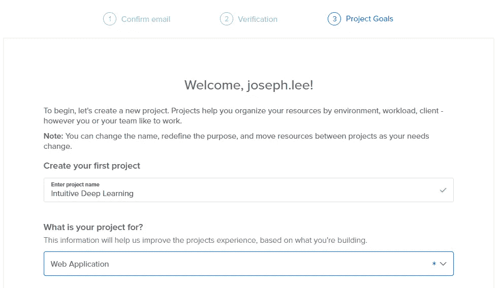
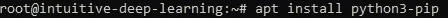
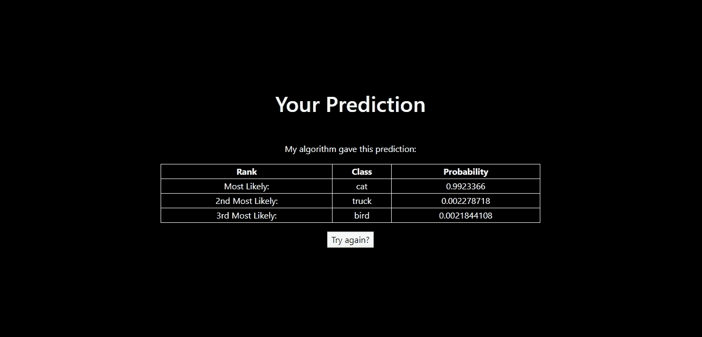

# 构建 Web 应用程序来部署机器学习模型

> 原文：<https://towardsdatascience.com/building-a-web-application-to-deploy-machine-learning-models-e224269c1331?source=collection_archive---------0----------------------->

## 所以我们已经建立了我们的 ML 模型——现在呢？如何使用 Flask 离开 Jupyter 笔记本并进入 Web 应用程序！

如果你已经学习深度学习有一段时间了，你可能已经用你的 Jupyter 笔记本做了一些非常酷的模型，从图像识别到语言翻译。你可能想让你的朋友试用你的模型(或者甚至可能以此成立一家公司)，但是送他们一台 Jupyter 笔记本并不是你真正想要的。你如何构建一个 Web 应用来部署你的机器学习模型？

这篇文章的重点是围绕我们的机器学习模型构建一个 web 应用程序，供其他人尝试。我们将学习一些 Web 编程技术，如 HTML 和 Flask，以及在 DigitalOcean 的 Ubuntu 服务器上部署它。

本教程结束时，其他人(来自世界各地)将能够尝试您的简单图像识别软件。您的 web 应用程序将类似于我构建的这个页面:

 [## 给自己的形象分类！

157.230.156.140](http://157.230.156.140/) 

这是网络应用的首页:


一旦你选择了一个文件(请选择一个小于 500kb 的文件)，你可以点击“上传”。假设我选择了之前在笔记本中使用的猫图像，我将被重定向到包含我的预测的页面:


预测图像中的内容

为了快速上手，我们将跳过一些最佳实践；但是希望，我们会在后面的帖子中回到这个话题！

**先决条件:**

这篇文章假设你熟悉构建自己的图像识别模型；您可以参考此处的指南来加快速度:

[](https://medium.com/intuitive-deep-learning/build-your-first-convolutional-neural-network-to-recognize-images-84b9c78fe0ce) [## 建立你的第一个卷积神经网络来识别图像

### 一步一步的指南，建立自己的图像识别软件与卷积神经网络使用 Keras 上…

medium.com](https://medium.com/intuitive-deep-learning/build-your-first-convolutional-neural-network-to-recognize-images-84b9c78fe0ce) 

一旦你完成了上面的教程，你应该有一个. h5 文件和一个模型来将图像分为 10 个不同的类别(飞机、汽车、鸟、猫、鹿、狗、青蛙、马、船和卡车)。如果你有模型文件，我们可以开始围绕它创建一个 Web 应用程序！

如果你想在任何时候看到我们在这篇文章中将要做的事情的完整代码，请点击这里查看 GitHub。

# 在数字海洋上设置您的 Web 服务器

*【注意:由于本部分依赖于第三方服务 DigitalOcean，说明可能会随着时间的推移而变化】*

这篇文章的目的是教你如何在 Web 上部署一个简单的 Web 应用程序供他人尝试。为此，我们需要一个 Web 服务器，它就像一台计算机，可以向其他请求信息的计算机发送信息(网页)。我们将在 DigitalOcean 上建立一个 Web 服务器，您可以在这里使用我的推荐链接(或者直接访问网站):

[](https://m.do.co/c/e2093d3a5967) [## 数字海洋—云计算，大规模简化

### 为开发者和企业提供一个可靠、易用的虚拟服务器云计算平台…

m.do.co](https://m.do.co/c/e2093d3a5967) 

在该链接中，在右侧面板上创建一个帐户:


键入您的电子邮件地址和密码，然后点击绿色的“创建您的帐户”按钮

然后，DigitalOcean 将引导您完成创建帐户的步骤:


如果您使用了推荐链接，输入电子邮件地址和密码后，欢迎页面

点击确认邮件中的链接后，您需要输入您的账单信息。输入您的账单信息后，您将进入此页面创建您的第一个项目:



键入项目名称和项目用途后，您可以向下滚动到底部，忽略其他问题。单击底部漂亮的蓝色开始横幅:


然后，您应该会到达这个登录页面:


数字海洋的登录页面

我们需要的网络服务器在数字海洋中被称为“水滴”。将鼠标悬停在标题“创建一个液滴”下方的“加号”上，您会看到:


现在点击蓝色的“创建水滴”按钮。您应该会看到这个页面:


默认的(上面突出显示的)是 Ubuntu，这也是本教程的基础。

如果你向下滚动选择一个计划，你可以选择你希望你的网络服务器有多强大。您选择的方案越昂贵，您就可以处理更大的图像，并且处理速度更快。我建议选择 10 美元/月的，因为我们需要一些内存来处理图像。然而，5 美元/月的价格应该足够试用本教程了:


如果您继续向下滚动，还可以选择您希望服务器位于哪个物理数据中心。我选择了 SF(2):


您可以暂时忽略此页面上的其他选项。向下滚动到最底部，给你的 droplet 命名，然后点击绿色的“创建”按钮。


你的 droplet 需要一点时间来初始化，但是一旦你下了，你应该看到这是你的首页:


请注意，有四个数字(157.230.156.140)将是我们的 droplet 的 IP 地址。一个 IP 地址就像任何网址一样(比如[www.intuitivedeeplearning.com)](http://www.intuitivedeeplearning.com))，所以你可以把它输入到地址栏中。如果你想给它一个域名，这样其他人就可以在地址栏中输入英文单词，而不是一系列的四个数字，你必须购买它并单独设置。

此时，您会收到一封类似这样的电子邮件:


来自数字海洋的电子邮件

复制您的密码，然后返回数字海洋控制台。如果你点击水滴边上的三个点，会出现一个弹出窗口。


当你点击水滴边上的三个点时弹出

点击“访问控制台”。这将打开一个窗口，允许您与您的 Web 服务器通信。


控制台屏幕

现在，输入你电子邮件中的用户名和密码。用户名应该是“root”。密码不会显示，但是如果您单击 Cntrl-V 并输入，您应该能够访问。系统会提示您更改密码。输入您当前的密码(Cntrl-V，Enter ),然后键入新密码两次。


键入您的 droplet 的新密码

完成后，您应该会看到这样的屏幕:


现在不要被控制台吓倒。控制台看起来很吓人，但它确实是一种通过键入非常具体的命令来与计算机对话的方式。例如，通过键入以下命令，尝试询问您的服务器使用的是哪个 Python 3 版本

```
python3 --version
```

然后点击回车。您应该会看到类似这样的内容:


然后计算机会告诉你你的服务器使用的 Python 版本，对我来说现在是 Python 3.6.7。

现在，是时候创建你的第一个 HTML 文件了。HTML 是一种网络浏览器能理解的语言，它会把 HTML 代码变成你现在正在看的网页。为了创建我们的文件，我们将需要使用类似文本编辑器的东西，如记事本，但在您的服务器上。在本教程中，我们将使用一个名为 *nano* 的编辑器。

我们的第一个网页将被称为 index.html*，这是你网站的首页。现在，向您的服务器键入以下命令:*

```
*nano index.html*
```

*在控制台中，它看起来像这样:*

**

*这个命令意味着用编辑器 *nano* 打开文件【index.html*。由于*index.html*不存在，它会为你创建文件。现在，您应该会在屏幕上看到类似这样的内容:**

****

**正如底部所示，这是一个新文件，你可以在里面输入东西。你可以在这个类似记事本的应用程序中键入任何句子，例如:**

```
**This is my first Webpage!**
```

**您的控制台将如下所示:**

****

**现在，我们将通过单击 Cntrl-X 退出该记事本。在底部，他们将询问您是否希望保存您的文件:**

****

**您必须保存您的更改，因此请键入“Y”。现在，他们会问你你的文件名是什么:**

****

**只需点击键盘上的回车键，就大功告成了！现在，这可能看起来比你的标准记事本不太用户友好，但请耐心等待一段时间。**

**现在你已经在你的网络服务器上有了一个 HTML 文件，你需要做的就是“打开”你的网络服务器。为此，请键入以下内容:**

```
**python3 -m http.server 80**
```

**“80”是服务 HTTP 文件的标准端口。您的控制台现在应该看起来像这样:**

****

**现在，你的网站上线了！转到您的 droplet 的 IP 地址，这是您在 DigitalOcean 中看到的 droplet 旁边的四个数字。你应该可以看到你的第一个网页，这是你刚才通过 *nano* 编辑器在*index.html*中写的内容。**

****

**祝贺您，您已经在 DigitalOcean 上安装了您的第一台 Web 服务器！要停止网页并返回输入命令，只需按 Cntrl-C。现在，我们准备在我们的 Web 服务器上构建我们的第一个机器学习 Web 应用程序！**

# **使用 Flask 创建 Web 应用后端**

**您的 Web 应用程序可以被视为两个部分——后端和前端。将“后端”应用程序视为操作背后的大脑——您可能看不到它，但计算都在这里完成。在这里，我们定义了用户如何与您的 web 应用程序交互的逻辑，以及用户的输入会发生什么。这也是我们运行机器学习模型的地方。另一方面,“前端”定义了用户看到、触摸和体验的内容。这就像是你的 Web 应用程序的外观，也是你的用户直接与之交互的部分。**

**在这一节中，我们将定义后端——我们将首先创建“大脑”,然后我们将看到如何适应“脸”。特别是，我们将:**

1.  **加载我们的机器学习模型；**
2.  **定义当他在主主页上传照片时会发生什么；和**
3.  **将我们的机器学习模型应用于图像，并在单独的“预测”页面中向用户显示结果。**

**在下一节中，我们将定义用户如何查看两个网页——主页和“预测”页面。但是现在，让我们关注后端，我们将使用 Flask 作为构建它的框架。**

**Flask 是一个简单的 web 应用程序框架，我们可以用它来构建 web 应用程序的后端并快速入门。在本教程中，我将充分解释如何围绕您的机器学习模型创建 web 应用程序。不幸的是，我不会解释 Flask 代码和结构的每一行；你可以在这里了解更多关于烧瓶[的信息。](http://flask.palletsprojects.com/en/1.1.x/)**

**首先，让我们安装烧瓶。为此，我们首先必须安装 pip3，这有助于我们在服务器上安装其他 Python 包，如 Flask。在您的控制台中，键入**

```
**apt install python3-pip**
```

**您的控制台应该如下所示:**

****

**一旦你点击回车，它会告诉你将要安装的软件包。键入“Y”继续。现在已经安装了 pip3，在控制台中输入命令:**

```
**pip3 install Flask**
```

**您的控制台应该如下所示:**

****

**安装烧瓶的命令**

****

**成功的安装是什么样子的**

**当我们安装 Flask 时，请确保安装我们之前在服务器上安装的所有 Python 包:**

```
**pip3 install keras
pip3 install tensorflow
pip3 install scikit-image**
```

**现在，我们将在服务器中组织我们的文件。我们将为我们的 web 后端创建一个 Python 文件，我们称之为`imgrec_webapp.py`(像前面一样使用`nano`)。然后我们会有两个文件夹，一个存储上传的图片(我们称之为`uploads`)，另一个存储你的前端的 HTML 文件(称为`templates`)。要创建一个文件夹，输入`mkdir folder_name`到控制台，在那里“文件夹名”可以被你想要的名字代替。因此，需要键入的两个命令是:**

```
**mkdir uploads
mkdir templates**
```

**现在，我们需要将我们的模型`my_cifar10_model.h5`上传到服务器。由于模型在我的本地计算机中，不幸的是，我们不能使用控制台从我的桌面上传模型。相反，我们将使用 Windows PowerShell。如果您使用的是 Windows，您可能已经安装了这个应用程序:**

****

**打开 Windows Powershell 后，键入以下命令以上传您的模型，并确保替换三角括号中的说明:**

```
**scp <where your model is stored>\my_cifar10_model.h5 <Droplet IP address>:~**
```

**在我的例子中，我会键入:**

```
**scp C:\Users\user\Desktop\my_cifar10_model.h5 root@157.230.156.140:~**
```

**如果是第一次从 Powershell 连接，会出现这样的提示。只需点击“是”。**

****

**键入您的密码，一旦完成，它应该看起来像这样:**

****

**现在你的模型在水滴上了！现在，回到你之前访问服务器的数字海洋控制台。或者，如果您喜欢 PowerShell 界面，您可以使用 PowerShell 连接到您的服务器，如下所示:**

```
**ssh root@<your Droplet IP>**
```

**对我来说，应该是:**

```
**ssh root@157.230.156.140**
```

**瞧啊。您不再需要去 DigitalOcean 获取您的服务器控制台。一旦你进入你的控制台，输入`ls`(代表列表)以确保你已经得到了所有的文件和文件夹:**

****

**如果您使用 Powershell，应该看到什么**

****

**如果使用 DigitalOcean 控制台，您应该看到什么**

**现在我们已经设置好了一切，我们可以(最终)开始编写我们的后端应用程序了。打开你创建的 Python 文件，`imgrec_webapp.py`。像往常一样，我们将导入一些您稍后需要的必要函数:**

```
**import os
from flask import Flask, request, redirect, url_for, render_template
from werkzeug.utils import secure_filename**
```

**然后，我们创建一个 Flask 应用程序的实例，它只有一行代码:**

```
**app = Flask(__name__)**
```

**我们稍后将在 Flask 应用程序中添加更多内容。现在，让我们加载我们已经保存在[先决教程](https://medium.com/intuitive-deep-learning/build-your-first-convolutional-neural-network-to-recognize-images-84b9c78fe0ce) `my_cifar10_model.h5`中的机器学习模型。我们调用以下函数，并像这样加载模型:**

```
**from keras.models import load_model
from keras.backend import set_session
from skimage.transform import resize
import matplotlib.pyplot as plt
import tensorflow as tf
import numpy as npprint("Loading model")global sess
sess = tf.Session()
set_session(sess)
global model
model = load_model('my_cifar10_model.h5')
global graph
graph = tf.get_default_graph()**
```

**现在我们已经运行了模型，让我们添加到 Flask web 应用程序中。我们要做的第一件事是声明当 web 应用程序到达某个 URL 时会做什么。为了定义它，我们使用了`@app.route()`函数。对于我的主页，我将使用默认的 URL(即我的 URL 不会有任何附加的“后缀”)，所以我的第一个参数将是`'/'`。用户将以两种方式与我的主页进行交互:**

1.  **将网页从服务器加载到他的浏览器中**
2.  **上传他的图像并发送到服务器**

**这需要两种不同的与页面交互的方法:交互#1 将使用“GET”(一种主要供用户从资源请求数据的方法)，而交互#2 将使用“POST”(一种主要供用户向服务器发送数据以创建或更新资源的方法)。因此，下面的代码块表示，如果我在交互#2，将文件保存在我的“uploads”文件夹中，并转到“prediction”页面(并传入参数 filename)。如果没有，我在交互#1，只是渲染网页“index.html”。**

```
**[@app](http://twitter.com/app).route('/', methods=['GET', 'POST'])
def main_page():
    if request.method == 'POST':
        file = request.files['file']
        filename = secure_filename(file.filename)
        file.save(os.path.join('uploads', filename))
        return redirect(url_for('prediction', filename=filename))
    return render_template('index.html')**
```

**现在，我们必须创建一个“预测”页面，并定义当用户在该页面时 Web 应用程序应该做什么。我们再次使用`@app.route()`函数，假设用户位于`/prediction/<filename>`子目录，将`<filename>`传递给我为该页面定义的 Python 函数。**

**在此预测页面中，我将:**

1.  **根据文件名读取图像，并存储为`my_image`**
2.  **将图像大小调整为 32x32x3，这是我的模型读取它的格式，并将其存储为`my_image_re`**
3.  **使用该模型，预测图像落入不同类别的概率，并将其放入变量`probabilities`**
4.  **找到前三个最可能类的标签和概率，并将其放在`predictions`下**
5.  **加载我的网页`predict.html`的模板，给他们第四步的预测。**

**这五个步骤反映如下:**

```
**[@app](http://twitter.com/app).route('/prediction/<filename>')
def prediction(filename):
    #Step 1
    my_image = plt.imread(os.path.join('uploads', filename))
    #Step 2
    my_image_re = resize(my_image, (32,32,3))

    #Step 3
    with graph.as_default():
      set_session(sess)
      probabilities = model.predict(np.array( [my_image_re,] ))[0,:]
      print(probabilities)#Step 4
      number_to_class = ['airplane', 'automobile', 'bird', 'cat', 'deer', 'dog', 'frog', 'horse', 'ship', 'truck']
      index = np.argsort(probabilities)
      predictions = {
        "class1":number_to_class[index[9]],
        "class2":number_to_class[index[8]],
        "class3":number_to_class[index[7]],
        "prob1":probabilities[index[9]],
        "prob2":probabilities[index[8]],
        "prob3":probabilities[index[7]],
      }#Step 5
    return render_template('predict.html', predictions=predictions)**
```

**所有这些应该都很熟悉，如果您需要复习，请访问教程:**

**[](https://medium.com/intuitive-deep-learning/build-your-first-convolutional-neural-network-to-recognize-images-84b9c78fe0ce) [## 建立你的第一个卷积神经网络来识别图像

### 一步一步的指南，建立自己的图像识别软件与卷积神经网络使用 Keras 上…

medium.com](https://medium.com/intuitive-deep-learning/build-your-first-convolutional-neural-network-to-recognize-images-84b9c78fe0ce) 

最后，我们使用端口 80 运行应用程序，这是访问网页的标准端口。在 Python 文件的末尾键入以下内容:

```
app.run(host='0.0.0.0', port=80)
```

现在我们有了 Web 应用程序的主干。你可能已经注意到我们仍然缺少一些不同的部分。特别是，我们已经调用了 HTML 网页，比如`index.html`和`predict.html`，但是我们还没有构建它们！我们将在下一节中这样做。

还要注意，在这个基本教程中，我们跳过了许多好的实践。如果你知道怎么做(或者谷歌一下),你可能想尝试结合这些实践。):

*   在 Anaconda 环境中创建我们的 Web 应用程序(就像我们之前在 Anaconda Navigator 中所做的那样)
*   捕捉错误，比如有人没有上传任何文件，或者文件名为空
*   正在检查人们正在上载的链接扩展。jpg '文件** 

# **使用 HTML 创建 Web 应用程序前端**

**当用户与您的 web 应用程序进行交互时，他们是通过 web 页面进行交互的，这也是我们将在本节中构建的内容。在控制台中键入以下命令，进入`templates`文件夹:**

```
**cd templates**
```

**创建我们需要的两个模板文件，`index.html`和`predict.html`。如果您键入`ls`，您应该会在`templates`下看到这两个文件:**

****

**我们使用一种叫做超文本标记语言(HTML)的语言，它只是告诉浏览器如何呈现你所拥有的内容。概括一点来说，我们用“标题”或“段落”这样的标签来标记内容，然后告诉浏览器如何显示带有这些类型标签的内容。例如，如果我想将单词“Hello”标记为“header 1”类型，我将编写:**

```
**<h1>Hello</h1>**
```

**通常，当您开始标记(即`<h1>`)时，您也必须关闭标记以显示其结束位置(即`</h1>`)。我们边走边学，那就从`index.html`开始吧。为了提醒您该页面的外观，我们尝试构建如下内容:**

****

**我们从这一行开始`index.html`:**

```
**<!doctype html>**
```

**这告诉浏览器预期的文档类型(即 HTML)。然后我们用一个`<html>`标签开始文档，我们将在最后关闭它。现在，我们还定义了文档头，它包含了文档的“元数据”。在这里，我定义了标题并链接了一个引导样式表，其他人已经为各种标签定义了样式。因此，我可以把大量的样式留给别人为我们编码的东西，除非有一些方面我需要定制。**

```
**<html>
<head>
    <title>Classify your Image!</title>
    <link rel="stylesheet" href="[https://maxcdn.bootstrapcdn.com/bootstrap/4.0.0/css/bootstrap.min.css](https://maxcdn.bootstrapcdn.com/bootstrap/4.0.0/css/bootstrap.min.css)" integrity="sha384-Gn5384xqQ1aoWXA+058RXPxPg6fy4IWvTNh0E263XmFcJlSAwiGgFAW/dAiS6JXm" crossorigin="anonymous">
</head>**
```

**现在，我们定义身体:**

```
**<body style="background-color:black"><div id="maintext" style="position:absolute; margin:auto; width:700px; height:200px; text-align:center; top:0; bottom: 0; left: 0; right: 0;">  
  <h1 class="text-light mb-2"> Upload your image to be classified! </h1>
  <h4 class="text-light mb-5">(Please upload images less than 500kb in size)</h4>
  <form method=post enctype=multipart/form-data>
     <p class="text-light">
        <input type=file name=file>
        <input type=submit value=Upload>
     </p>
  </form>
</div></body>
</html>**
```

**首先，我告诉 HTML 我想要黑色的背景颜色。然后，我有一个`div`容器，这样我就可以一起包含下面的内容。我希望容器位于页面的中间，具有一定的高度、宽度和边距，所以我在样式中定义了这一点。在我的`div`容器中，我有三个主要的内容块:**

1.  **大标题(h1)写着“上传你的图片进行分类！”(注意:`mb-2`在样式里只是说在底部加一个“中等大小”的页边距)**
2.  **小标题(h4)写着“(请上传小于 500kb 的图片)”**
3.  **一个“表单”，允许我上传文件，然后提交该表单。我们使用 POST 方法提交表单(还记得我们是如何定义后端的吗？)**

**一旦我在我的`div`容器中定义了这三个内容片段，我就关闭了 body 和 html 标签，我就完成了！请注意，将您的代码重新组织成 CSS 文件和 HTML 文件是一个很好的做法，这样我们就可以将样式与内容分开——出于本教程的目的，我们采用了一些快捷方式！**

**现在，我们转到`predict.html`页面。记住页面应该是什么样子的:**

****

**对于 HTML 代码，头部仍然与`index.html`相同，但是在主体中引入了一些新元素:**

```
**<!doctype html>
<html>
<head>
    <title>Your Prediction!</title>
    <link rel="stylesheet" href="[https://maxcdn.bootstrapcdn.com/bootstrap/4.0.0/css/bootstrap.min.css](https://maxcdn.bootstrapcdn.com/bootstrap/4.0.0/css/bootstrap.min.css)" integrity="sha384-Gn5384xqQ1aoWXA+058RXPxPg6fy4IWvTNh0E263XmFcJlSAwiGgFAW/dAiS6JXm" crossorigin="anonymous">
</head><body style="background-color:black"><div id="maintext" style="position:absolute; margin:auto; width:700px; height:300px; text-align:center; top:0; bottom: 0; left: 0; right: 0;">
  <h1 class="text-light mb-5"> Your Prediction </h1>
  <p class="text-light"> My algorithm gave this prediction: </p>
  <table class="table-bordered text-light" style="width:100%">
  <tr>
    <th>Rank</th>
    <th>Class</th>
    <th>Probability</th>
  </tr>
  <tr>
    <td>Most Likely:</td>
    <td>{{ predictions.class1 }}</td>
    <td>{{ predictions.prob1 }}</td>
  </tr>
  <tr>
    <td>2nd Most Likely:</td>
    <td>{{ predictions.class2 }}</td>                                                                                                                                       <td>{{ predictions.prob2 }}</td>                                                                                                                                      </tr>                                                                                                                                                                   <tr>
    <td>3rd Most Likely:</td>
    <td>{{ predictions.class3 }}</td>
    <td>{{ predictions.prob3 }}</td>
  </tr>
  </table><a href="{{ url_for('main_page') }}"><button class="button mt-3">Try again?</button></a></div>
</body>
</html>**
```

**在我的 div 容器(与`index.html`中相同)中，我现在有以下内容:**

1.  **标题(h1)写着“你的预测”**
2.  **一段(p)说“我的算法给出了这个预测:”**
3.  **三列四行的表格。表格中的每一行都标有`<tr>`。对于每一行，标题用`<th>`标记，每一列的文本用`<td>`标记。请注意，我的预测内容不是固定的——它取决于我的模型给我什么，这取决于用户上传了什么。这是我需要与后端交互的地方。如果你还记得，在我的预测后端，函数的最后一行是`return render_template(‘predict.html’, predictions=predictions)`。这意味着当我渲染“predict.html”时，我将变量`predictions`传递给我的前端，这些变量将出现在我的前端，无论我在哪里使用双花括号`{{ ... }}`调用它们。因此，`{{ predictions.class1 }}`将自动填充模型预测为最可能的类别。**
4.  **一个将我链接回主页的按钮。我使用`{{ url_for(‘main_page’) }}`是因为`main_page`是我的后端中定义主页的函数的名称。因此，无论 URL 是什么，都会在这里自动填充。**

**我们做到了！同样，把你的代码重新组织成 CSS 文件和 HTML 文件是一个好的做法，这样我们就可以把风格和内容分开。这样，例如，如果我们想要一致地改变 div 的样式，我们不需要同时使用`index.html`和`predict.html`来改变它。**

# **运行您的 Web 应用程序！**

**现在，剩下要做的就是运行 Web 应用程序。回到控制台，键入以下内容:**

```
**python3 imgrec_webapp.py**
```

**你会看到一大堆警告信息，但是你可以忽略它们。最重要的是，在最后，你会看到这个屏幕:**

****

**现在，您可以在浏览器中输入 droplet 的 IP 地址，然后点按“回车”。**

****

**将此替换为您的 droplet 的 IP 地址**

**您应该看到您的应用程序启动并运行，您应该能够上传一个小图像并获得一个预测！请注意，第一张图片总是需要很长时间，所以请耐心等待！之后会更快！**

****综合摘要**:在这篇文章中，我们通过以下方式围绕我们的图像识别模型编写了一个 web 应用程序:**

*   **在云上设置(数字海洋)**
*   **使用 Flask 创建 Web 应用后端**
*   **使用 HTML 创建 Web 应用程序前端**

**恭喜你！您已经构建了您的第一个 web 应用程序。我们离构建一个生产级的 web 应用程序还很远，如果我们要扩大规模，我们还没有加入许多必要的实践。但至少我们有一些 Web 应用程序运行的外观，我们可以将这些实践合并到我们的基础框架中。**

****下一步**:在我们的下一个编码伴侣第 3 部分(即将发布的链接)，我们将探索如何编写我们自己的递归神经网络(RNNs)来处理自然语言！请务必在此处对 RNNs 有一个直观的了解:**

**[直观深度学习第三部分:用于自然语言处理的 RNNs】](https://medium.com/intuitive-deep-learning/intuitive-deep-learning-part-3-rnns-for-natural-language-processing-4f4b0bcbee80)**

**注:这个故事最早出现在《直觉深度学习》中:**

**[](https://medium.com/intuitive-deep-learning) [## 直觉深度学习

### 我们用直观的方式解释前沿的深度学习概念！非技术初学者，深度学习的学生…

medium.com](https://medium.com/intuitive-deep-learning)**