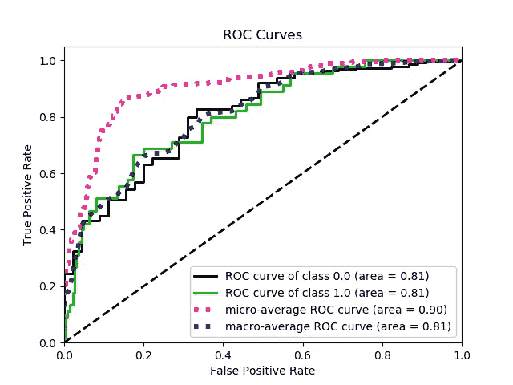
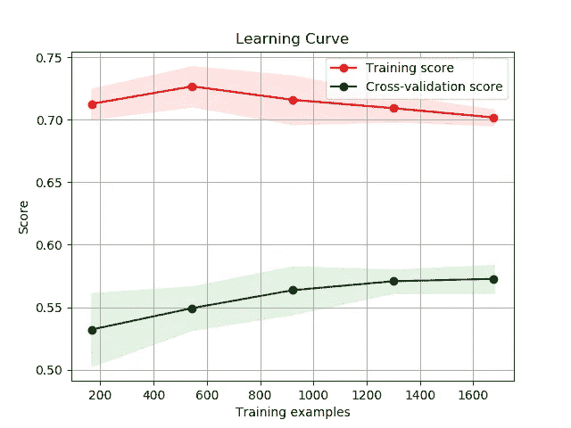
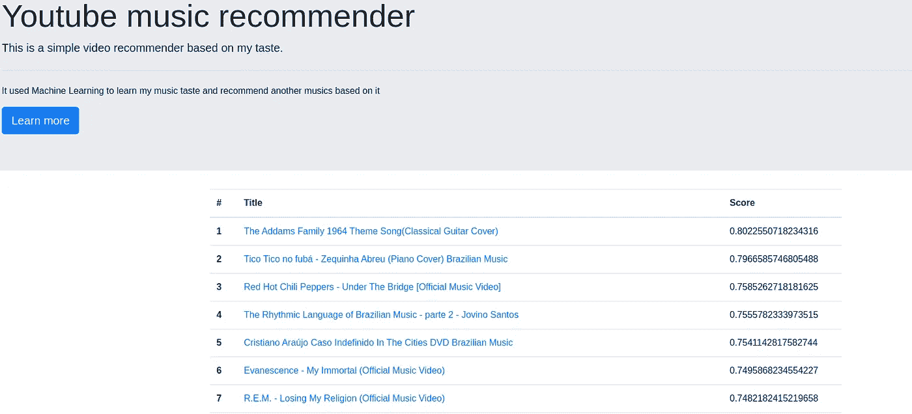

# 构建 Youtube 音乐推荐器

> 原文：<https://towardsdatascience.com/building-a-youtube-music-recommender-bbd1b3431da4?source=collection_archive---------31----------------------->

## 从无到有:向你推荐 youtube 音乐视频

# 概观

在这篇文章中，我将对一个简单的向自己推荐 Youtube 音乐视频的解决方案的一些细节进行评论。你可以通过 [Youtube 音乐推荐](https://thawing-shore-99052.herokuapp.com/)查看 Heroku 上部署的解决方案。我知道，这不美。也许有一天我会发展我的前端技能。

然后，这里的主要思想是从零开始到部署。这个过程主要包括以下所有步骤:

1.  删除 Youtube 页面上的视频数据；
2.  从每个页面中提取视频信息；
3.  将来自每个视频的数据预处理成单个数据集；
4.  手动标记一些样本，主动学习其余的样本；
5.  从数据集中提取要素；
6.  训练一个随机森林和一个 LightGBM 模型并集成它们；
7.  通过 Heroku 建立一个简单的应用程序来服务模型。

此外，如果你想查看[代码](https://github.com/lmeazzini/youtube-recommender)，我会引用每个步骤中使用的脚本。

 [## lmeazzini/YouTube-推荐者

### 这是一个简单的 youtube 视频推荐器。解决方案可以在 Heroku 上看到，网址是…

github.com](https://github.com/lmeazzini/youtube-recommender) 

> **我们开始吧！**

# 删除 Youtube 页面上的视频数据

首先，我们需要数据！为了获得一些数据，我通过在 youtube 搜索上查询来废弃 Youtube 页面。因为我正在寻找推荐给自己的音乐，所以我使用了六个查询:

> 民谣摇滚、古典吉他、原声摇滚、管弦乐摇滚、大提琴歌曲和巴西摇滚

然后，我保存了每个查询的前 100 页。这在“search_data_collection.py”脚本中完成。

# 从每个页面中提取视频信息

现在我们有了来自 Youtube 搜索页面的数据，我们需要从这些页面上的视频中提取信息。为此，我用 [BeautifulSoup](https://www.crummy.com/software/BeautifulSoup/bs4/doc/) 制作了一个解析器。

这个解析器只保存 600 页中每个视频的链接、标题和查询。此外，由于有可能的视频被复制，我放弃了重复。这在“search_data_parsing.py”脚本中完成。

# 将来自每个视频的数据预处理成单个数据集

从解析的数据中，我们能够对每个视频进行网络剪辑。这里有很多信息，我们能得到的大部分特征都来自这一步。因为这是一个简单的解决方案，而且我没有花太多时间来设计特性，所以我只使用了几种可能性。

总共有 2277 个视频，那么这个脚本需要相当长的鳄龙时间来运行，大约 2 小时。脚本名为“video_data_processing.py”

# 可能通过主动学习手动标记一些样本

这项工作中最单调乏味的部分。我必须得到标签。因此，我在 sheets 上打开了上一步生成的 raw_data 文件，添加了一个“y”列，并用 0 或 1 手动填充了 1000 行。

使用标记的数据，可以训练随机森林模型和下一步提取的特征，并使用该模型来识别哪些样本最难分类(~0.5 输出)，然后我手动标记了 200 个通过主动学习识别的样本。

主动学习有助于降低标记成本。然而，我期望花费的标注时间比我想象的要少，所以我结束了手动标注。

# 从视频数据中提取特征

现在，我们数据集的每一行都是一个视频及其数据，如标题、浏览量、作者、描述、视频高度、视频宽度和其他信息。从这些字段中，我做了特征工程，提取出一些可以对后面有帮助的特征。

这样，我提取了浏览量、日均浏览量、视频分辨率，用标题串做了一袋字(BoW)。当然，还有更多的特征可以提取，尤其是从视频描述和视频标签中。但是，我把更深层次的特征工程留给了以后的作品。

# 训练一个随机的森林和一个 LightGBM 模型，并使它们变得安全

利用提取的特征和标签，我们可以在训练和验证中分割数据集。我选择不做测试集，把最终的验证留给生产数据。

首先，我训练了一个 LightGBM 模型，用贝叶斯优化优化了它的参数以及一些数据预处理参数(比如 BoW 的 n_gram 范围)。然后，用基于贝叶斯搜索的相同预处理参数训练随机森林模型。更多细节，可以查看实现。我寻找这两个模型的集合，给每个模型一个权重。

为了衡量模型的表现，我选择不使用精度、召回率和 F1 值。由于问题涉及到一个建议，最终的输出应该是最相关的建议的排序(输出更接近 1)。然后我用了 average_precision_score，roc_auc，log_loss 来更好的评估模型。

此外，我做了一个学习曲线分析(LCA ),以检查所使用的数据是否足以进行一致的预测。ROC 曲线和 LCA 可以在下图中看到。特征提取和建模在“final_model.py”上进行

# 通过 Heroku 构建一个简单的应用程序来服务模型

现在我们有了模型，我们可以创建一个应用程序来预测生产数据。由于我们的数据来自 youtube 搜索，如果我们使用用于生成数据集的相同查询，我们可能会获得用于训练/验证模型的相同或几乎相同的视频。然后，我修改了大多数查询，以便在应用程序中获得不同的视频。

这个过程包括一个用 Flask 构建的应用程序(app.py)。这个脚本负责调用函数来丢弃新数据，处理新数据，并使用保存的模型来预测输出，最后生成。html 文件来显示最终输出。废弃的数据被预处理并存储在 SQLite 数据库中，然后被查询以进行预测，这样以后我可以向数据库中插入新数据，并轻松地重新运行应用程序。

为了部署它，我使用了 Docker 和 Gunicorn。部署文件夹中有一个包含该配置的 docker 文件。您可以轻松地在本地运行 docker，甚至通过 Heroku 部署它，我已经按照 Heroku 文档上的[指南](https://devcenter.heroku.com/articles/container-registry-and-runtime)完成了。

您可以在下面看到部署的应用程序截图:

然而，如果你现在打开它，音乐列表可能会与截图相同或非常相似。这可能是由于音乐不会随着时间的推移而发生很大变化，模型只是在我需要时进行重新分类；没有重新训练计划。

# 最后

看看生产中的模型预测，有明显的偏差。很多推荐的视频标题上都有“官方音乐视频”这一串。大概这是一个没有太大意义的重功能。可以进行许多改进来提高模型性能并更好地理解预测。

希望这篇文章能给人以启发，并能帮助到任何阅读它的人。同样，这篇文章并没有描述每一步，但是，代码可以在 [GitHub](https://github.com/lmeazzini/youtube-recommender) 获得。

 [## lmeazzini/YouTube-推荐者

### 这是一个简单的 youtube 音乐/视频推荐器。您可以在 Heroku 上检查已部署的解决方案…

github.com](https://github.com/lmeazzini/youtube-recommender)