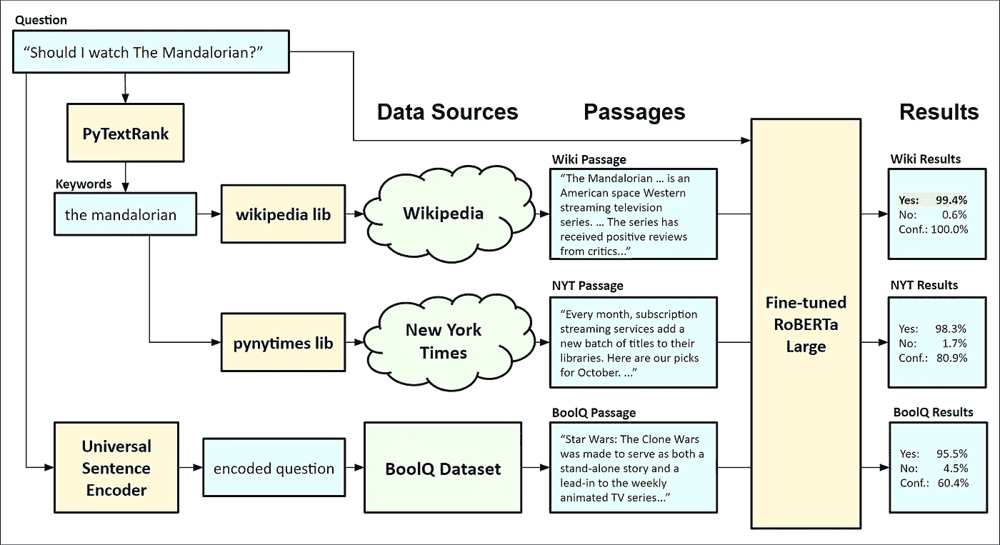
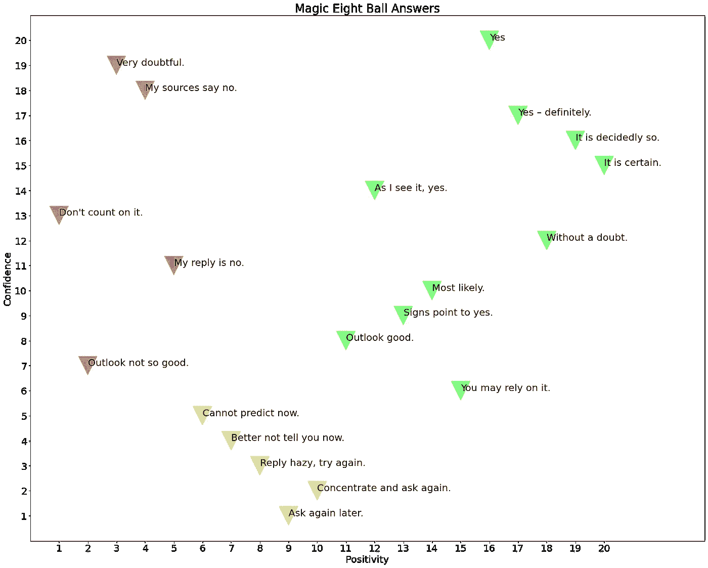
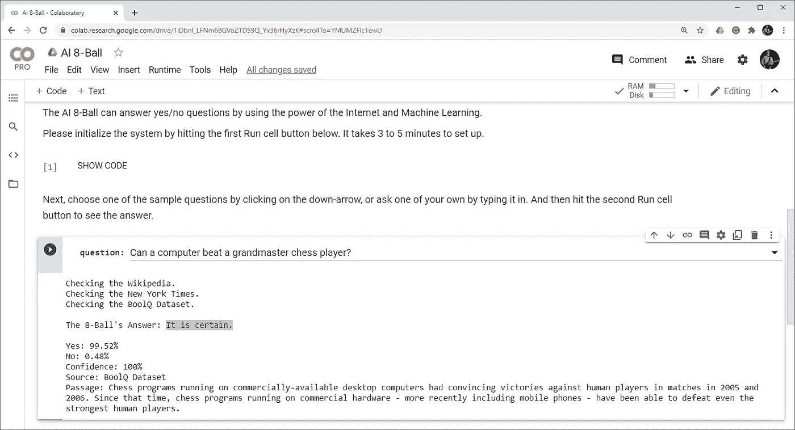

# 与罗伯塔一起建造人工智能 8 号球

> 原文：<https://towardsdatascience.com/building-an-ai-8-ball-with-roberta-2bfbf6f5519b?source=collection_archive---------39----------------------->

## 人工神经网络能回答是/否问题吗？迹象表明是的。


ai8ball 装置及作者照片

# 概观

在这篇文章中，我将向你展示我如何利用互联网的力量和当前的机器学习技术构建一个可以回答是/否问题的人工智能 8 球。我将从系统的高级描述开始，然后进入组件的细节以及 Python 代码的摘录。我将展示如何获得否定回答的百分比和置信度的百分比作为输出。最后，我会给出如何运行 AI 8 球的说明，来回答大家自己的问题。

# 背景

你用过神奇的 8 号球吗？这是美泰公司在 50 年代推出的玩具，至今仍在销售。这很简单。这是一个超大的 8 号球，回答是/不是问题。它有一个漂浮在黑暗液体中的 20 面骰子，使用随机选择的“魔法”来回答问题。在二十个可能的答案中，有五个表示没有，像“很值得怀疑”，五个表示可能，像“回复朦胧，再试一次”，十个表示有，像“是一定的”。

早在 2007 年，我就制作了一个 AI 8 球的早期原型，如上图，并在麻省理工学院 Stata 中心展示了它，作为名为 COLLISIONcollective C11 的群展的一部分。我的第一个版本使用了一个人工神经网络(ANN ),以今天的标准来看，它非常小，只有 1056 个神经连接。我的新版本使用了一个叫做大型罗伯塔模型的人工神经网络，它有 3.55 亿个神经连接。

# 人工智能 8 球

AI 8-Ball 是使用自然语言处理(NLP)的几个现有组件构建的。该系统的核心是大型的 RoBERTa 模型，我使用 Google AI 的 BoolQ 数据集对其进行了微调，以回答是/否问题[2]。

用户可以键入任何问题，系统从维基百科、纽约时报和 BoolQ 数据集收集支持文本段落。我使用了一个叫做 PyTextRank 的系统来从问题中提取关键词，这些关键词被用来查找维基百科和 NYT 的文章。我还使用 Google 的通用句子编码器[3]在 BoolQ 数据集中检查类似的问题。如果有非常接近的匹配，我使用相关的文本作为第三段。

所有的段落和问题都被发送到罗伯塔模型中进行推理。每个推断返回三个百分比:是、否和置信度。将具有最高置信度的推断作为答案报告给用户。下图显示了包含一个示例问题和结果的组件。



AI 8 球元件图

# AI 8 球组件和细节

## 伯特和罗伯塔

BERT 是由 Google 构建和训练的 NLP 模型的名称。该名称代表变压器的双向编码器表示。该系统设计用于执行常见的 NLP 任务，如机器翻译、文档摘要和文本生成。更多关于伯特的信息可以在 Rani Horev 的帖子[这里](/bert-explained-state-of-the-art-language-model-for-nlp-f8b21a9b6270)找到。

对于这个项目，我使用的是 RoBERTa 模型，这是对原始 BERT 的改进。它是由华盛顿大学和脸书大学的研究人员设计和训练的。RoBERTa 的增强包括用更大的批次训练更长的模型，用更长的序列使用更多的数据，以及其他提高准确性的变化[4]。

## BoolQ 数据集

BoolQ 是一个来自 Google AI 的数据集，包含大约 16K 个带有相应是/否问题的文本示例[3]。每个条目包含一个问题、标题、答案和一段文字。该数据集可用于训练和测试回答是/否问题的 NLP 系统。例如，下面是其中一个条目。

```
{"**question**": "did the cincinnati bengals ever win a superbowl", "**title**": "Cincinnati Bengals", "**answer**": false, "**passage**": "The Bengals are one of the 12 NFL teams to not have won a Super Bowl as of the 2017 season; however, they are also one of 8 NFL teams that have been to at least one Super Bowl, but have not won the game."}
```


照片由[阿米莉娅·斯平克](https://unsplash.com/@ameliaspink?utm_source=medium&utm_medium=referral)在 [Unsplash](https://unsplash.com?utm_source=medium&utm_medium=referral) 上拍摄

## 微调人工智能 8 球

我使用 BoolQ 数据集对 RoBERTa 模型进行了微调，从 Michael Vincent 的帖子[中的代码开始。我修改了他的代码，使用了一个更大的模型，并设置了超参数，如批量大小和时期数，以允许它在 Google Colab 中进行训练。我更新的训练代码是](https://medium.com/illuin/deep-learning-has-almost-all-the-answers-yes-no-question-answering-with-transformers-223bebb70189)[这里](https://colab.research.google.com/github/robgon-art/ai8ball/blob/main/AI_8_Ball_Training.ipynb)。

## 运行推理

下面的 Python 代码展示了如何使用 RoBERTa 来回答是/否问题。例如，Wikipedia 文章中关于神奇 8 球的第一段与六个是/否问题一起被传递到模型中。

运行推理的代码

文本和问题都被标记化并传递到模型中。它返回一个包含是和否部分的向量。使用 PyTorch 中的 softmax 函数可以得出答案为是或否的概率。置信水平可以从向量的长度中导出。以下是六个问题的结果:

推理的结果

它似乎正确地回答了所有问题。请注意置信度是如何变化的，但并不总是与是/否的百分比一致。例如，文章的第一句话清楚地说明了神奇的 8 号球是一个球体，因此第一个问题的答案在是和置信度方面都得到了高分。然而，文章中关于库存的句子用代词“它”指代神奇的 8 号球，这就是为什么关于库存的问题的答案有点不确定。我们将在以后映射到经典魔术 8 球答案时使用此功能。

## PyTextRank

该系统使用一种称为 TextRank 的算法从用户的问题中提取关键词和短语[5]。它基于著名的 PageRank 算法。为网络搜索而发明的。你传入一个文本块，它返回按相关性排序的关键短语。下面是一些示例代码，展示了如何从一个问题中提取关键词。

提取关键字的代码

```
Question: **Can a computer beat a grandmaster chess player?**
Keywords: **a grandmaster, chess player, a computer**
```

你可以看到它在提取关键短语方面做得很好。


蒂莫西·埃伯利在 [Unsplash](https://unsplash.com?utm_source=medium&utm_medium=referral) 上的照片

## 获取文本段落

现在我们有了关键词，我们可以使用它们来查询维基百科和纽约时报，看看是否有任何相关的文章可以用作该问题的文本段落。此外，我们将使用一种搜索算法，使用一种 *k* -d 树，简称为 *k-* 维树，一种用于快速搜索多维数据的数据结构，在 BoolQ 数据集中找到最近的问题[6]。如果匹配接近，我们将使用相应的文本作为第三段。下面是执行所有三个搜索并将它们传递给 RoBERTa 模型以获得结果的 python 代码。

收集段落的代码

现在我们有了三个结果，我们将使用这段代码来看看哪一个具有最高的置信度。

代码以找到最有把握的结果


作者根据[麦克·李希特](https://www.flickr.com/photos/9106303@N05)的[“无视频魔术 8 号球”](https://www.flickr.com/photos/9106303@N05/2403514661)在 2.0 的 [CC 下授权的照片插图](https://creativecommons.org/licenses/by/2.0/?ref=ccsearch&atype=rich)

# 经典魔术 8 球答案

上面的算法给了我们两个输出参数:百分比 yes 和百分比 confidence。为了将这两个参数映射到最接近的经典魔术 8 球答案，我首先使用通用序列编码器将这 20 个答案映射到多维空间中。然后，我将维度减少到两个，并旋转这些点，使其与一个否定到肯定的水平轴和一个低到高置信度的垂直轴对齐。进行映射的代码是这里的[和](https://colab.research.google.com/github/robgon-art/ai8ball/blob/main/AI_8_Ball_Answers.ipynb)。下图显示了结果。



神奇 8 球答案图表

使用此代码将最终答案的两个参数映射到经典的 Magic 8-Ball。

将结果映射到经典 8 球答案的代码

下面是 AI 8-Ball 对样题的输出。

```
Question: **Can a computer beat a grandmaster chess player?**Checking the Wikipedia.
Checking the New York Times.
Checking the BoolQ Dataset.The AI 8-Ball's Answer: **It is certain.**Yes: 99.52%
No: 0.48%
Confidence: 100%
Source: BoolQ Dataset
Passage: Chess programs running on commercially-available desktop computers had convincing victories against human players in matches in 2005 and 2006\. Since that time, chess programs running on commercial hardware - more recently including mobile phones - have been able to defeat even the strongest human players.
```

以 99.52%的肯定率和 100%的置信度，映射到最接近的答案“肯定”。

# 运行人工智能 8 球

你可以在 Google Colab 上运行 AI 8-Ball。请注意，你需要一个谷歌帐户来运行它。

1.  点击[链接，此处](https://colab.research.google.com/github/robgon-art/ai8ball/blob/main/AI_8_Ball.ipynb)。
2.  登录您的**谷歌账户，如果您尚未登录，请点击**。
3.  单击第一个**运行单元格**按钮(悬停在[ ]图标上并单击播放按钮)。将出现一条警告，指出此笔记本不是由 Google 创建的。
4.  点击**无论如何都要运行**初始化系统。下载数据集和配置微调的 RoBERTa 模型大约需要 3 到 5 分钟。
5.  选择一个问题或键入您自己的问题，然后点击第二个 **Run cell** 按钮，查看 AI 8-Ball 如何回答。
6.  重复步骤 5，询问其他问题。



AI 8-Ball 在 Google Colab 上运行

# 未来的工作

对 AI 8-Ball 的可能改进包括使用语音到文本来提问，并添加动画来揭示答案。这些添加可能会给这个项目带来更多“神奇”的感觉。

# 感谢

我要感谢詹尼弗·林、奥利弗·斯特林佩尔、瓦伊德·呼罗珊·加萨布和马赫萨·梅斯加兰对这个项目的帮助。

# 源代码

这个项目的所有源代码都可以在 [GitHub](https://github.com/robgon-art/ai8ball) 上获得。源在 [CC BY-SA 许可](https://creativecommons.org/licenses/by-sa/4.0/)下发布。


归属共享相似

# 参考

[1]刘，迈勒奥特，纳曼戈亚尔，杜，曼达尔乔希，陈，奥梅尔利维，，卢克泽特勒莫耶，韦塞林斯托扬诺夫，“罗伯塔:稳健优化的贝特瑞训练方法”，2019，[，](https://arxiv.org/pdf/1907.11692.pdf)

[2] Christopher Clark，Kenton Lee，张明蔚，汤姆·科维亚特科夫斯基，迈克尔·科林斯，克里斯蒂娜·图坦诺娃，《BoolQ:探索自然是非问题的惊人难度》，2019 年，【https://arxiv.org/pdf/1905.10044.pdf 

[3]丹尼尔·瑟尔、·杨、孔胜义、南华、尼科尔·利姆蒂亚科、罗慕尼·圣约翰、诺亚·康斯坦、马里奥·瓜哈尔多-塞斯佩德斯、史蒂夫·袁、克里斯·塔尔、宋云轩、布赖恩·斯特罗普、雷·库兹韦尔，《通用句子编码器》，2018 年，

[4]雅各布·德夫林(Jacob Devlin)，张明蔚(Ming-Wei Chang)，肯顿·李(Kenton Lee)，克里斯蒂娜·图坦诺娃(Kristina Toutanova)，《伯特:用于语言理解的深度双向变形金刚的预训练》，2018 年，[https://arxiv.org/pdf/1810.04805.pdf](https://arxiv.org/pdf/1810.04805.pdf)

[5] Rada Mihalcea，Paul Tarau，《文本等级:将秩序带入文本》，2004 年，[https://web . eecs . umich . edu/~ Mihalcea/papers/Mihalcea . em NLP 04 . pdf](https://web.eecs.umich.edu/~mihalcea/papers/mihalcea.emnlp04.pdf)

[6] Songrit Maneewongvatana，David M. Mount，“聚类点集的近似最近邻搜索分析”，1999 年，[https://arxiv.org/pdf/cs/9901013.pdf](https://arxiv.org/pdf/cs/9901013.pdf)

为了无限制地访问 Medium 上的所有文章，[成为会员](https://robgon.medium.com/membership)，每月支付 5 美元。非会员每月只能看三个锁定的故事。