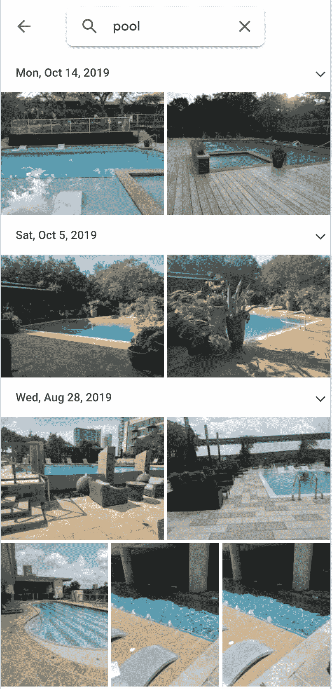
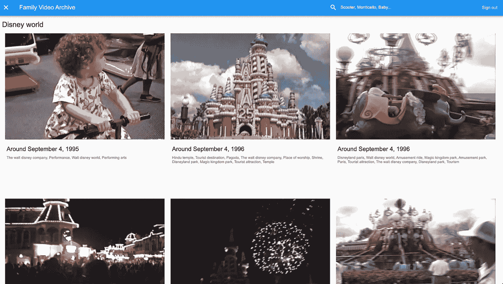
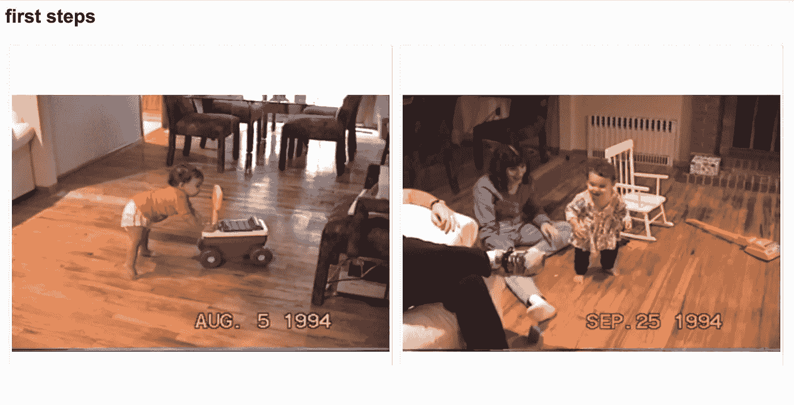
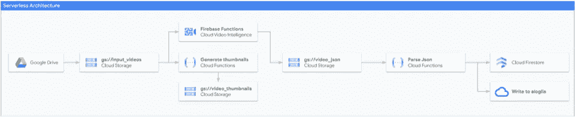
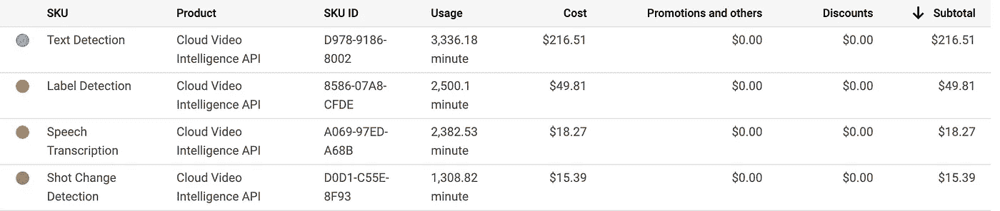
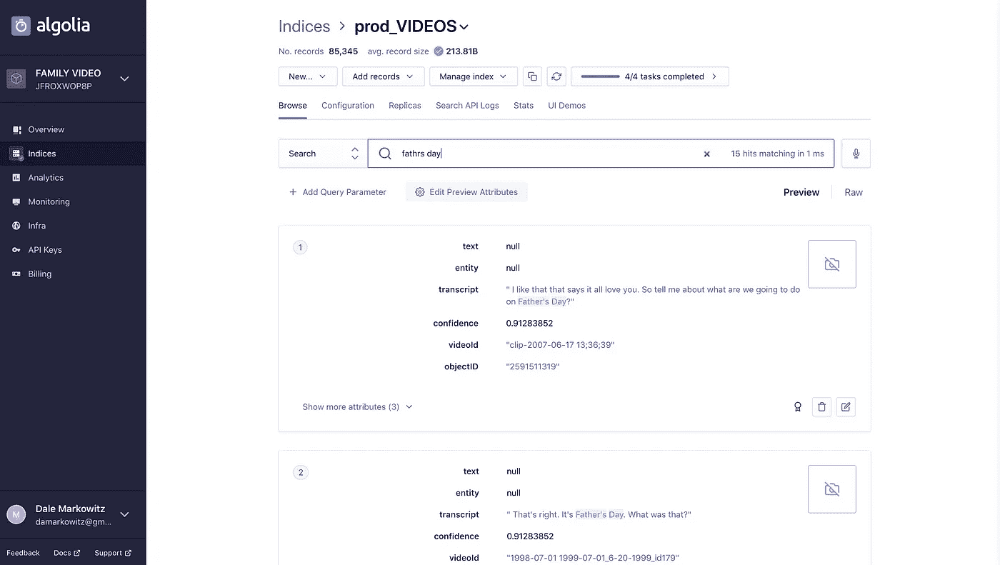
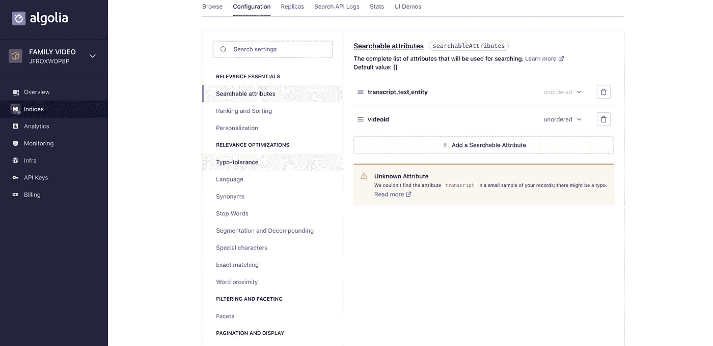
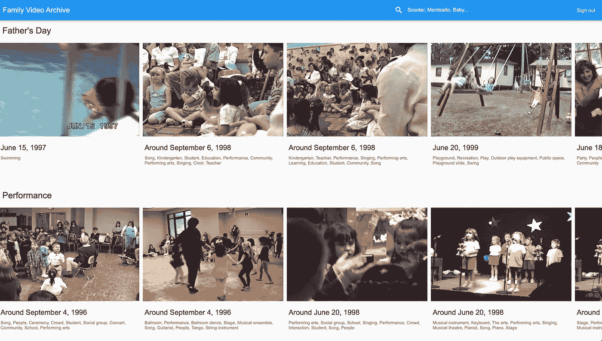

# 构建人工智能驱动的可搜索视频档案

> 原文：<https://towardsdatascience.com/building-an-ai-powered-searchable-video-archive-a4721a72e126?source=collection_archive---------45----------------------->


在这篇文章中，我将向你展示如何使用机器学习和谷歌云来构建一个人工智能驱动的、可搜索的视频档案——不需要任何经验。

想看这个故事吗？看看这个视频。

我最喜欢的应用之一绝对是谷歌照片。除了将我珍贵的照片备份到云端，它还让我所有的照片和视频都可以使用机器学习进行搜索。因此，如果我在照片应用程序中键入“游泳池”，它会返回所有它认为是游泳池的东西:



如果你只是想使用*人家的*软件，这一切都很好，但那有什么乐趣呢？今天，我们将为视频构建我们自己版本的 Google 相册。

不是没有理由的，有很多很好的理由来建立你自己的视频档案。首先，这很有趣。第二，你可以添加 Google 相册目前不支持的功能，尤其是视频。就像通过人们所说的话(文字记录)进行搜索一样，如果你需要找到有人说“现在我们有了它”或“哦，sh*t”的所有剪辑，第三，构建自己的应用程序可以让你更容易地与其他软件集成，并控制如何存储和处理你的数据。例如，我在谷歌云上构建了我的存档后端，这让我可以利用谷歌云的[隐私、安全和合规保证](https://cloud.google.com/security)。

我的可搜索视频存档看起来像这样:


它存储并索引了我所有的家庭视频(大约 126 GB)。使用机器学习，特别是[视频智能 API](https://cloud.google.com/video-intelligence) ，我能够进行各种分析，包括自动分割长视频，识别对象和场景，转录音频，以及提取屏幕上的文本。

该应用程序最终非常擅长搜索可爱的瞬间。使用计算机视觉，它识别场景和物体，如“婚礼”、“烟火”、“表演”、“婴儿笑”、“家庭装修”、“过山车”，甚至“迪士尼世界”:



它也可以搜索抄本。这就是我如何找到我的第一步的片段，因为在这些片段中，我的父母说了类似这样的话，“看，戴尔正在迈出她的第一步！”：



最后，该工具能够搜索任何屏幕上的文本，如这些球员衬衫上的“Mets”和“New York”字样或背景中的“Bud”海报:


这个视频档案最终成为了一份相当不错的父亲节礼物，尤其是因为今年我没能亲眼见到我的父亲。

在这篇文章中，我将向你展示如何建立你自己的档案，就像这样。但是如果你想直接跳到代码，可以看看 ML [Github repo](https://github.com/google/making_with_ml/tree/master/video_archive) 的制作过程。

# 用于视频处理的机器学习架构

这个应用程序分为两部分，前端和后端。后端是结合使用谷歌云、T2、Firebase 和一个叫做 T4 的工具来构建的。前端是用 [Flutter](https://daleonai.com/flutter.dev) 构建的，这是一个用于构建网络和移动应用的框架，但也可以很容易地成为 React 或 Angular 或 iOS 或 Android 应用。

后端架构看起来像这样:



当我构建用机器学习标记或索引数据的应用程序时，我一直在使用这种架构或管道。它是这样工作的:

1.  首先，数据(在这种情况下，是一个单独的视频)被上传到一个[谷歌云存储](https://cloud.google.com/storage)桶。
2.  上传启动了[云功能](https://cloud.google.com/functions)(这就像 AWS lambda，即运行在云中的一小块代码)
3.  云函数调用[视频智能 API](https://cloud.google.com/video-intelligence) 开始视频分析
4.  视频智能 API 将其结果作为 JSON 写入第二个存储桶
5.  *这些*写入的数据又会启动第二个云函数，解析 JSON 并将其写入一个更方便的数据存储——在本例中是 [Firestore](https://firebase.google.com/docs/firestore) 和 [Algolia](https://daleonai.com/algolia.com) 。

从这里，我的前端 Flutter 应用程序可以与后端对话，并搜索用户查询。如果您对这些技术不熟悉，不要担心——我稍后会深入介绍。

还有几个步骤我无法放入图表中。例如，我用 Video Intelligence API 对一些很长的视频文件做了一些预处理，将它们分成较小的片段，并识别屏幕上显示的时间戳。此外，我还编写了一个云函数，专门用于拍摄上传的视频并为其生成缩略图(查看[该函数](https://daleonai.com/building-an-ai-powered-searchable-video-archive))。

# 将视频从硬盘快速传输到云存储

但首先，在我们进入杂草之前，让我们谈谈从 Google Drive 到云存储的数据传输。理论上，将数据从硬盘转移到存储器应该很快，因为所有数据都可以留在谷歌的网络内。但令人沮丧的是，在实践中，没有巧妙的方法来完成转移。幸运的是，我在菲利普的这篇文章中发现了一个巧妙的漏洞。诀窍是使用一个[的 Colab 笔记本](https://daleonai.com/colab.research.google.com)——一个免费的、教育性的谷歌工具，用于在云中运行 Python 代码——来完成转移。它快速，简单，非常有效！

# 视频智能 API

让这个项目成为可能的关键工具是由谷歌云构建的[视频智能 API](https://daleonai.com/cloud.google.com/video-intelligence) 。它获取云存储中的视频路径，并吐出其他内容:

*   音频转录(即“自动字幕”)
*   已知物体(如飞机、海滩、雪、自行车、蛋糕、婚礼)
*   屏幕文字(即街道标志、t 恤、横幅和海报上的文字)
*   镜头变化
*   显式内容检测

这些数据可以用作索引，我们可以用它来搜索特定的视频。

# 价格

如果你是我，你的第一个想法是，*当然，但我打赌它超级贵。*我分析了 126 GB 的视频或大约 36 个小时，我使用这个 API 的总成本是 300 美元，这*有点贵。以下是每种分析的成本明细:*



我惊讶地得知，大部分成本来自一种单一类型的分析——检测屏幕上的文本。其他所有东西总计只有大约 80 美元，这很有趣，因为屏幕上的文本是我提取的最不有趣的属性！所以给你一个建议:如果你预算有限，也许可以不考虑这个功能。

现在澄清一下，我为我收藏的每个视频运行了一次视频智能 API*。对于我的归档使用案例，这只是前期成本，而不是经常性成本。*

# *使用 API*

*一旦你将数据上传到一个[云存储桶](https://cloud.google.com/storage)，使用视频智能 API 就变得非常简单。(没听说过储物桶？它基本上只是一个存储在谷歌云中的文件夹。)对于这个项目，调用 API 的代码位于[video _ archive/functions/index . js](https://github.com/google/making_with_ml/blob/a68f61280898c53806bc412bbb3e517d979bd52f/video_archive/functions/index.js#L79)中，如下所示:*

```
*const videoContext = {
    speechTranscriptionConfig: {
      languageCode: 'en-US',
      enableAutomaticPunctuation: true,
    },
  };

  const request = {
    inputUri: `gs://VIDEO_BUCKET/my_sick_video.mp4`,
    outputUri: `gs://JSON_BUCKET/my_sick_video.json`,
    features: [
      'LABEL_DETECTION',
      'SHOT_CHANGE_DETECTION',
      'TEXT_DETECTION',
      'SPEECH_TRANSCRIPTION',
    ],
    videoContext: videoContext,
  };

  const client = new video.v1.VideoIntelligenceServiceClient();

  // Detects labels in a video
  console.log(`Kicking off client annotation`);
  const [operation] = await client.annotateVideo(request);
  console.log('operation', operation);*
```

1.  *第 1 行，我们创建了一个`videoContext`,其中包含 API 的一些配置设置。这里我们告诉工具音轨将会是英文的(`en-US`)。*
2.  *第 8 行，我们创建了一个请求对象，将视频文件的路径作为`inputUri`传递，将我们希望结果写入的位置作为`outputUri`。请注意，视频智能 API 会将数据作为`json`写入您指定的任何路径，只要它在您有权写入的存储桶中。*
3.  *在第 12 行，我们指定希望 API 运行什么类型的分析。*
4.  *在第 24 行，我们开始一个视频注释请求。有两种方法可以做到这一点，一种是同步运行函数并等待代码中的结果，另一种是启动后台作业并将结果写入 json 文件。视频智能 API 几乎实时分析视频，因此 2 分钟的视频需要大约 2 分钟来分析。因为时间有点长，所以我决定在这里使用异步函数调用。*

*如果你想在自己的电脑上快速使用这个 API，可以从官方的 Google Cloud Node.js sample repo 中试用[这个示例](https://github.com/googleapis/nodejs-video-intelligence/blob/master/samples/analyze.js)。*

# *回应*

*当 API 处理完一个视频后，它将结果写成 json，如下所示:*

```
*{
  "annotation_results": [ {
    "input_uri": "/family_videos/myuserid/multi_shot_test.mp4",
    "segment": {
      "start_time_offset": {

      },
      "end_time_offset": {
        "seconds": 70,
        "nanos": 983000000
      }
    },
    "segment_label_annotations": [ {
      "entity": {
        "entity_id": "/m/06npx",
        "description": "sea",
        "language_code": "en-US"
      },
      "segments": [ {
        "segment": {
          "start_time_offset": {

          },
          "end_time_offset": {
            "seconds": 70,
            "nanos": 983000000
          }
        },
        "confidence": 0.34786162
      } ]
    }, {
      "entity": {
        "entity_id": "/m/07bsy",
        "description": "transport",
        "language_code": "en-US"
      },
      "segments": [ {
        "segment": {
          "start_time_offset": {

          },
          "end_time_offset": {
            "seconds": 70,
            "nanos": 983000000
          }
        },
        "confidence": 0.57152408
      } ]
    }, {
      "entity": {
        "entity_id": "/m/06gfj",
        "description": "road",
        "language_code": "en-US"
      },
      "segments": [ {
        "segment": {
          "start_time_offset": {

          },
          "end_time_offset": {
            "seconds": 70,
            "nanos": 983000000
          }
        },
        "confidence": 0.48243082
      } ]
    }, {
      "entity": {
        "entity_id": "/m/015s2f",
        "description": "water resources",
        "language_code": "en-US"
      },
      "category_entities": [ {
        "entity_id": "/m/0838f",
        "description": "water",
        "language_code": "en-US"
      } ],
      "segments": [ {
        "segment": {
          "start_time_offset": {

          },
          "end_time_offset": {
            "seconds": 70,
            "nanos": 983000000
          }
        },
        "confidence": 0.34592748
      } ]
    },*
```

*响应还包含文本注释和转录，但它真的很大，所以我没有全部粘贴到这里！要使用这个文件，您需要一些代码来解析它，并可能将结果写入数据库。你可以借用[我的代码](https://github.com/google/making_with_ml/blob/a68f61280898c53806bc412bbb3e517d979bd52f/video_archive/functions/utils.js#L191)来获得这方面的帮助。下面是我解析 json 的一个函数的样子:*

```
*/* Grab image labels (i.e. snow, baby laughing, bridal shower) from json */
function parseShotLabelAnnotations(jsonBlob) {
  return jsonBlob.annotation_results
      .filter((annotation) => {
      // Ignore annotations without shot label annotations
        return annotation.shot_label_annotations;
      })
      .flatMap((annotation) => {
        return annotation.shot_label_annotations.flatMap((annotation) => {
          return annotation.segments.flatMap((segment) => {
            return {
              text: null,
              transcript: null,
              entity: annotation.entity.description,
              confidence: segment.confidence,
              start_time: segment.segment.start_time_offset.seconds || 0,
              end_time: segment.segment.end_time_offset.seconds,
            };
          });
        });
      });
}*
```

# *用 Firebase 构建无服务器后端*

*为了真正让视频智能 API 成为一个有用的视频档案，我必须围绕它建立一个完整的应用程序。这需要某种后端来运行代码、存储数据、托管数据库、处理用户和认证、托管网站——所有典型的 web 应用程序的东西。*

*为此，我求助于我最喜欢的开发工具套件之一， [Firebase](https://daleonai.com/building-an-ai-powered-searchable-video-archive) 。Firebase 是一种构建应用程序的“无服务器”方法。它为常见的应用程序功能(数据库、文件存储、性能监控、托管、身份验证、分析、消息传递等)提供支持，因此开发人员无需为整个服务器或虚拟机付费。*

*如果你想自己运行我的项目，你必须创建自己的 Firebase 帐户和项目才能开始(这是免费的)。*

*我使用 Firebase 运行我所有的代码，使用 Firebase 的云函数。您可以上传一个或一组函数(使用 Python 或 Go 或 Node.js 或 Java ),这些函数运行以响应事件——一个 HTTP 请求、一个 Pub/Sub 事件，或者(在本例中)当一个文件上传到云存储时。*

*你可以看看我在[这个文件](https://daleonai.com/building-an-ai-powered-searchable-video-archive)里的云函数。下面是一个例子，展示了每次文件上传到`YOUR INPUT VIDEO BUCKET`时，如何运行一个 Javascript 函数(在本例中是`analyzeVideo`)。*

```
*const functions = require('firebase-functions');

exports.analyzeVideo = functions.storage
    .bucket(YOUR_INPUT_VIDEO_BUCKET)
    .object()
    .onFinalize(async (object) => {
      await analyzeVideo(object);
    });*
```

*一旦你安装了 [Firebase 命令行工具](https://firebase.google.com/docs/cli#install_the_firebase_cli)，你就可以通过命令行将你的函数部署到云端，这些函数应该写在一个名为`index.js`的文件中，运行:*

*`firebase deploy --only functions`*

*我还使用 Firebase 函数构建了一个搜索 HTTP 端点:*

```
*/* Does what it says--takes a userid and a query and returns
relevant video data */
exports.search = functions.https.onCall(async (data, context) => {
  if (!context.auth || !context.auth.token.email) {
    // Throwing an HttpsError so that the client gets the error details.
    throw new functions.https.HttpsError(
        'failed-precondition',
        'The function must be called while authenticated.',
    );
  }

  const hits = await utils.search(data.text, context.auth.uid);
  return {'hits': hits};
});*
```

1.  *在第 3 行，我使用`functions.https.onCall`注册了一个新的 Firebase 函数，当发出一个 HTTPS GET 请求时就会触发这个函数。*
2.  *在第 4 行，我检查调用我的 HTTPS 端点的用户是否已经过身份验证，并且已经注册了一个电子邮件地址。[认证](https://daleonai.com/building-an-ai-powered-searchable-video-archive)很容易用 Firebase 设置，在我的项目中，我已经用 Google 登录启用了它。*
3.  *在第 12 行，我调用我的搜索函数，传递新用户注册时 Firebase 生成的 userid `context.auth.uid`,当他们到达我的端点时传递这个 userid。*
4.  *在第 13 行，我返回搜索结果。*

# *快速简易搜索*

*接下来，我需要一种方法让用户搜索我的视频档案。因为他们不知道确切地搜索什么术语或使用什么短语，所以我需要我的搜索实现是智能的。它应该容忍错别字，并根据用户的查询准确猜测用户想要什么(就像谷歌搜索一样)。*

*我被自己实现搜索功能的想法吓坏了(讽刺的是，因为我在谷歌工作！)，直到我偶然发现一个[搜索 API](https://www.algolia.com/doc/api-client/methods/search/) 建了一个叫 [Algolia](https://daleonai.com/algolia.com) 的公司。Aloglia 允许你上传 json 格式的数据(这是我曾经用过的数据格式！)，然后从您的应用程序(或者从他们的控制台，如果您正在调试)查询这些数据。以下是 Algolia 控制台的外观:*

**

*它自动处理错别字，正如你在上面看到的，我把“父亲节”这个词拼错了。*

*该工具还有许多不同配置选项的*。您可以调整哪些 json 字段是可搜索的，搜索结果应该如何排序，允许多少输入错误，等等:**

****

**如果你想看一些代码样本，可以看看[video _ archive/functions/algolia . js](https://github.com/google/making_with_ml/blob/master/video_archive/functions/algolia.js)。下面是用 Javascript 进行搜索查询的代码:**

```
**exports.search = async function(query, userid) {
  const client = algoliasearch(
      process.env.ALGOLIA_APPID,
      process.env.ALGOLIA_ADMIN_APIKEY,
  );
  const index = client.initIndex(process.env.ALOGLIA_INDEX);
  const res = await index.search(query, {
    tagFilters: [userid],
    attributesToRetrieve: ['videoId', 'transcript', 'text', 'entity', '_tags'],
  });

  if (!res.nbHits) return [];
  return res.hits
      .filter((hit, index) => {
        return res.hits.findIndex((h) => h.videoId == hit.videoId) == index;
      })
      .map((hit) => {
        return {videoId: hit['videoId']};
      });
};**
```

1.  **在第 2 行，我提供了我的凭证并创建了一个搜索客户机。**
2.  **在第 6 行，我指定了我想要搜索的数据集或“索引”。**
3.  **在第 7 行，我开始了一个搜索查询，指定了查询文本(例如“生日”)、过滤依据的“标签”(我使用标签将数据与用户相关联)，以及我想要接收的 json 字段。**
4.  **第 14 行看起来有点复杂，但是我只是过滤重复的电影 id 并格式化一个 json 响应。**

# **颤动的前端**

**因为我不是一个非常好的前端开发人员，所以我决定以这个项目为借口学习 Flutter，这是谷歌的一个新平台，用于编写可以在任何地方(web，Android，iOS)运行的代码。总的来说，我玩得很开心，觉得设计 Flutter 应用程序比 CSS 简单多了。以下是最终结果:**

****

**我只是搭建了一个 web app，这次不是 iOS 或者 Android。**

**你可以在 repo 的 [Flutter 文件夹](https://github.com/google/making_with_ml/tree/master/video_archive/flutter)中查看所有的前端代码，但是因为我是新手，所以不能保证它是“正确的”；).**

**这就是你如何建立一个人工智能驱动的视频档案！有问题或意见吗？在推特[上 Ping 我](https://twitter.com/dalequark)！**

***原载于 2020 年 6 月 12 日 https://daleonai.com*[](https://daleonai.com/building-an-ai-powered-searchable-video-archive)**。****