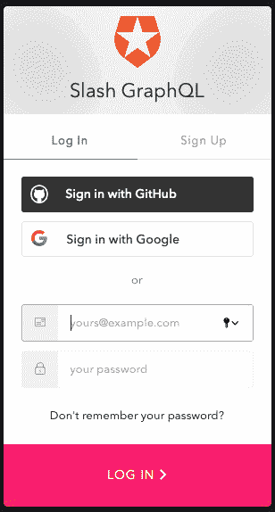
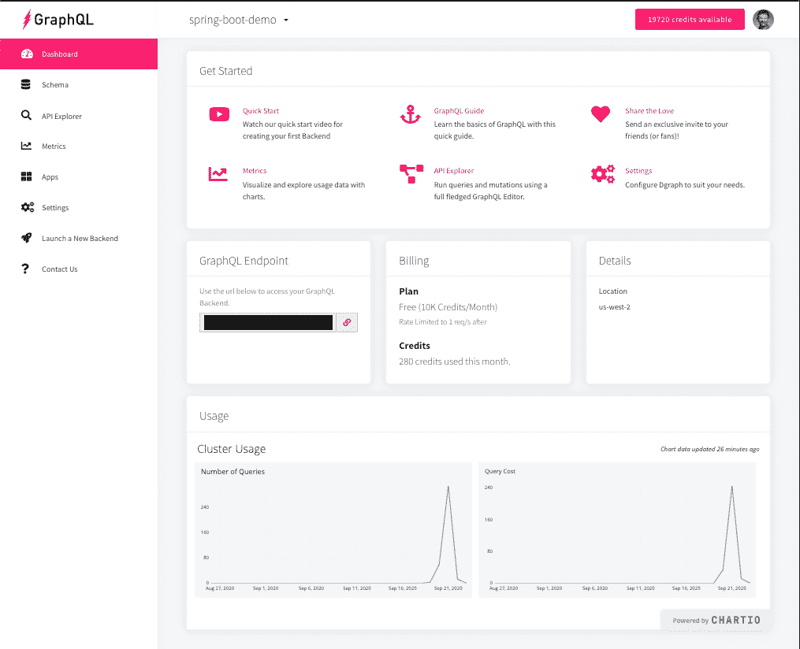
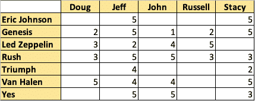

# 使用 Slash GraphQL 构建类似亚马逊的推荐引擎

> 原文：<https://towardsdatascience.com/building-an-amazon-like-recommendation-engine-using-slash-graphql-9635f0ce49b1?source=collection_archive---------31----------------------->

【TL；DR；开始使用 Dgraph 的 Slash GraphQL 产品，并连接到一个 Spring Boot 应用程序，它将充当一个简单的 RESTful 推荐服务。]

早在 2000 年代初，我就在做一个项目，实施一个由 [Art Technology Group](https://en.wikipedia.org/wiki/Art_Technology_Group) (ATG)开发的电子商务解决方案，该公司现在归甲骨文公司所有。ATG 迪纳摩产品是一个令人印象深刻的解决方案，因为它包括持久层和[场景模块](https://docs.oracle.com/cd/E24152_01/Platform.10-1/ATGPersBusinessGuide/html/s0102scenariosmodule01.html)。当时，像 Target 和 Best Buy 这样的公司使用 Dynamo 解决方案，利用场景模块向客户提供建议。

例如，Dynamo 电子商务解决方案足够智能，可以记住客户何时将产品添加到购物车中，然后又将其删除。作为一种激励，场景服务器可以被设计为在未来的访问中向相同的客户提供适度的折扣，如果他们将产品重新添加到他们的购物车中并在接下来的 24 小时内购买它。

从那时起，我就一直想创建一个简单的推荐引擎，这也是我撰写这份出版物的目标。

# 关于建议示例

我想保持简单，为推荐引擎创建一些基本的领域对象。在本例中，解决方案将为音乐艺术家提供推荐，底层艺术家对象非常简单:

```
@AllArgsConstructor@NoArgsConstructor@Datapublic class Artist { private String name;}
```

在一个真实的系统中，会有更多的属性需要跟踪。然而，在这个例子中，艺术家的名字就足够了。

正如人们所预料的，客户将对艺术家进行 1 到 5 分的评分，其中 5 分代表可能的最高分。当然，有可能(也在意料之中)客户不会给每个艺人打分。客户将(再次)由一个非常简单的客户对象表示:

```
@AllArgsConstructor@NoArgsConstructor@Datapublic class Customer { private String username;}
```

客户对艺术家进行评级的概念将在以下评级对象中得到体现:

```
@AllArgsConstructor@NoArgsConstructor@Datapublic class Rating { private String id; private double score; private Customer by; private Artist about;}
```

在我正常的 Java 编程工作中，我可能会对我的对象使用私人客户客户和私人艺术家艺术家，但是我想遵循图形数据库所使用的模式，在图形数据库中，我使用像‘by’和‘about’这样的变量..随着文章的继续，这一点会变得更加清楚。

# 图斜线图

随着图形数据库的流行，我觉得我创建推荐引擎的探索应该使用图形数据库。毕竟，GraphQL 已经成为与服务讨论图形的流行语言。虽然我对图形数据库只有一些了解，但我的分析似乎得出结论，图形数据库是这个项目的正确选择，并且通常是现实世界中提供建议的服务的来源。当数据(节点)之间的关系(边)和数据本身一样重要时，图数据库是一个很好的解决方案，推荐引擎就是一个很好的例子。

然而，由于我刚刚开始使用图形数据库，我当然不想担心启动容器或在本地运行 GraphQL 数据库。相反，我想找到一个 SaaS 供应商。我决定使用 Dgraph 的完全托管后端服务，名为 [Slash GraphQL](https://dgraph.io/slash-graphql) 。这是一个托管的本地 GraphQL 解决方案。Slash GraphQL 服务于 2020 年 9 月 10 日刚刚发布，可以使用以下链接启用。该平台提供了一个适用于本文的免费试用版(然后移动到 9.99 美元/月的固定费用，最高 5GB 的数据)。

https://slash.dgraph.io/

启动此 URL 后，可以使用常规授权服务创建新帐户:



在我的例子中，我创建了一个名为“spring-boot-demo”的后端，最终产生了下面的仪表板:



*斜线*graph QL 仪表盘

开始的过程是快速和免费的，使得配置 Slash GraphQL 服务毫不费力。

# 配置斜杠图表 QL

与任何数据库解决方案一样，我们必须编写一个模式并将其部署到数据库中。使用 Slash GraphQL，这既快速又简单:

```
type Artist { name: String! @id @search(by: [hash, regexp]) ratings: [Rating] @hasInverse(field: about)}type Customer { username: String! @id @search(by: [hash, regexp]) ratings: [Rating] @hasInverse(field: by)}type Rating { id: ID! about: Artist! by: Customer! score: Int @search}
```

事实上，我最初的设计比它需要的要复杂得多，而且修改背后的工作量也比我想象的要容易得多。我很快开始意识到作为一名开发人员不需要太多努力就能改变模式的价值。

有了这个模式，我能够快速填充一些基本的艺术家信息:

```
mutation { addArtist(input: [ {name: “Eric Johnson”}, {name: “Genesis”}, {name: “Led Zeppelin”}, {name: “Rush”}, {name: “Triumph”}, {name: “Van Halen”}, {name: “Yes”}]) { artist { name } }}
```

同时，我添加了一些虚构的客户记录:

```
mutation { addCustomer(input: [ {username: “Doug”}, {username: “Jeff”}, {username: “John”}, {username: “Russell”}, {username: “Stacy”}]) { customer { username } }}
```

因此，这五个客户将使用下表为七位艺术家提供评级:



评级流程的示例如下所示:

```
mutation { addRating(input: [{ by: {username: “Jeff”}, about: { name: “Triumph”}, score: 4}]) { rating { score by { username } about { name } } }}
```

配置并运行斜杠 GraphQL 数据后，我现在可以切换到 Spring Boot 服务了。

# 斜率一评级算法

2005 年，丹尼尔·雷米尔和安娜·麦克拉钦的一篇研究论文介绍了 Slope One 系列的协同过滤算法。这种简单的基于项目的协作过滤看起来非常适合推荐服务，因为它考虑了其他客户的评级，以便对给定客户未评级的项目进行评分。

在伪代码中，推荐服务将实现以下目标:

*   检索所有艺术家的可用评级(由所有客户提供)
*   从数据中创建一个地图<customer map="" double="">，这是一个客户地图，包含所有艺术家和他们的评级</customer>
*   1 到 5 的评分将被转换为介于 0.2(最差评分为 1)和 1.0(最佳评分为 5)之间的简单范围。

创建客户地图后，SlopeOne 评级处理的核心将通过调用 Slope One 类来执行:

*   填充用于跟踪不同客户评分差异的地图
*   填充地图<artist map="" integer="">>用于跟踪相似评级的频率</artist>
*   使用现有地图创建一个地图<customer hashmap="" double="">>，其中包含未对给定客户评级的项目的预计评级</customer>

在本例中，随机选择了一个客户，并对 Map <customer hashmap="" double="">> projectedData map 中的相应对象进行分析，以返回以下结果:</customer>

```
{ “matchedCustomer”: { “username”: “Russell” }, “recommendationsMap”: { “Artist(name=Eric Johnson)”: 0.7765842245950264, “Artist(name=Yes)”: 0.7661904474477843, “Artist(name=Triumph)”: 0.7518039724158979, “Artist(name=Van Halen)”: 0.7635436007978691 }, “ratingsMap”: { “Artist(name=Genesis)”: 0.4, “Artist(name=Led Zeppelin)”: 1.0, “Artist(name=Rush)”: 0.6 }, “resultsMap”: { “Artist(name=Eric Johnson)”: 0.7765842245950264, “Artist(name=Genesis)”: 0.4, “Artist(name=Yes)”: 0.7661904474477843, “Artist(name=Led Zeppelin)”: 1.0, “Artist(name=Rush)”: 0.6, “Artist(name=Triumph)”: 0.7518039724158979, “Artist(name=Van Halen)”: 0.7635436007978691 }}
```

在上面的例子中，“Russell”用户是随机选择的。在查看原始表格时，罗素只提供了《创世纪》、《齐柏林飞船》和《拉什》的评分。他唯一真正钦佩的艺术家是齐柏林飞船。该信息包含在 ratingsMap 对象和 resultsMap 对象中。

resultsMap 对象包括其他四位艺术家的预计评分:埃里克·约翰逊、是的、黛安芬和范·海伦。为了使事情变得更简单，有效负载中包含了一个 recommendationsMap，其中仅包含未被 Russell 评级的艺术家。

根据其他评论，推荐服务将略微倾向于埃里克·约翰逊，得分为 0.78，接近五分制中的四分。

# 推荐服务

为了使用推荐服务，Spring Boot 服务器只需要运行并配置为连接到 Slash GraphQL 基于云的实例。Slash GraphQL 仪表板上的 GraphQL 端点可以在 application.yml 中指定为 slash-graph-ql.hostname，或者通过＄{ Slash _ GRAPH _ QL _ HOSTNAME }环境变量传入值来指定。

可以使用以下 RESTful URI 调用基本建议引擎:

```
GET — {spring-boot-service-host-name}/recommend
```

该操作由推荐控制器配置，如下所示:

```
@GetMapping(value = “/recommend”)public ResponseEntity<Recommendation> recommend() { try { return new ResponseEntity<>(recommendationService.recommend(), HttpStatus.OK); } catch (Exception e) { return new ResponseEntity<>(HttpStatus.BAD_REQUEST); }}
```

它调用推荐服务:

```
@Slf4j@RequiredArgsConstructor@Servicepublic class RecommendationService { private final ArtistService artistService; private final CustomerService customerService; private final SlashGraphQlProperties slashGraphQlProperties; private static final String RATING_QUERY = “query RatingQuery { queryRating { id, score, by { username }, about { name } } }”; public Recommendation recommend() throws Exception { ResponseEntity<String> responseEntity = RestTemplateUtils.query(slashGraphQlProperties.getHostname(), RATING_QUERY); try { ObjectMapper objectMapper = new ObjectMapper(); SlashGraphQlResultRating slashGraphQlResult = objectMapper.readValue(responseEntity.getBody(), SlashGraphQlResultRating.class); log.debug(“slashGraphQlResult={}”, slashGraphQlResult); return makeRecommendation(slashGraphQlResult.getData()); } catch (JsonProcessingException e) { throw new Exception(“An error was encountered processing responseEntity=” + responseEntity.getBody(), e); } }…}
```

请注意——快速浏览一下这段代码可能会忽略的一点是，能够拉出一个子图来执行推荐的功能和简易性。在上面的示例中,“slashGraphQlResult.getData()”行将子图提供给“makeRecommendation()”方法。

RATING_QUERY 是检索评级对象所需的斜杠 GraphQL 格式。RestTemplateUtils.query()方法是静态实用程序类的一部分，目的是保持干爽(不要重复):

```
public final class RestTemplateUtils { private RestTemplateUtils() { } private static final String MEDIA_TYPE_GRAPH_QL = “application/graphql”; private static final String GRAPH_QL_URI = “/graphql”; public static ResponseEntity<String> query(String hostname, String query) { RestTemplate restTemplate = new RestTemplate(); HttpHeaders headers = new HttpHeaders(); headers.setContentType(MediaType.valueOf(MEDIA_TYPE_GRAPH_QL)); HttpEntity<String> httpEntity = new HttpEntity<>(query,   headers); return restTemplate.exchange(hostname + GRAPH_QL_URI, HttpMethod.POST, httpEntity, String.class); }}
```

一旦检索到 slashGraphQlResult 对象，就会调用 makeRecommendation()私有方法，该方法返回以下推荐对象。(上面以 JSON 格式显示了这一点):

```
@AllArgsConstructor@NoArgsConstructor@Datapublic class Recommendation { private Customer matchedCustomer; private HashMap<Artist, Double> recommendationsMap; private HashMap<Artist, Double> ratingsMap; private HashMap<Artist, Double> resultsMap;}
```

# 结论

在本文中，使用新的模式创建了一个 Dgraph Slash GraphQL 实例，并加载了示例数据。然后，Spring boot 服务利用这些数据作为基本的推荐引擎。对于那些对完整源代码感兴趣的人，请查看 [GitLab 资源库](https://gitlab.com/johnjvester/slash-graph-ql):

从成本角度来看，我对 Slash GraphQL 提供的结构印象颇深。新账户屏幕显示我每月有 10，000 信用点数可以免费使用。在我使用 Slash GraphQL 为本文构建原型和创建一切的整个过程中，我只使用了 292 个学分。对于那些需要超过 10，000 信用点的用户，每月 45 美元可获得 100，000 信用点，每月 99 美元可获得 250，000 信用点。

第一次使用图形数据库确实呈现了一个小的学习曲线，我确信通过继续这个练习，我可以学到更多的东西。当我更多地了解我的需求时，我觉得 Slash GraphQL 改变模式的能力超出了我的预期。作为特性开发人员，这是应该认识到的一个非常重要的方面，尤其是与传统数据库的相同场景相比。

在我的下一篇文章中，我将在这个过程中引入一个 Angular(或 React)客户端，它将直接与 GraphQL 和运行在 Spring Boot 的推荐服务接口。

(经原作者许可发表，[约翰·维斯特](https://www.linkedin.com/in/johnjvester/)