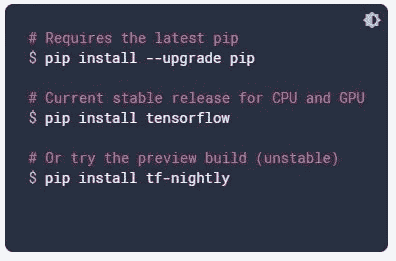
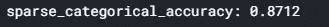

# 用 Tensorflow 构建神经网络

> 原文：<https://towardsdatascience.com/building-an-ann-with-tensorflow-ec9652a7ddd4?source=collection_archive---------8----------------------->

## 如何使用 TensorFlow 构建神经网络的分步教程

在 [Unsplash](https://unsplash.com/s/photos/science?utm_source=unsplash&utm_medium=referral&utm_content=creditCopyText) 上由[halance](https://unsplash.com/@halacious?utm_source=unsplash&utm_medium=referral&utm_content=creditCopyText)拍摄的照片

如果你是人工神经网络的新手，你可以在下面的链接中查看我的关于人工神经网络介绍的博客

 [## 人工神经网络导论

### 你深度学习的第一步

towardsdatascience.com](/introduction-to-artificial-neural-networks-ac338f4154e5) 

在本教程中，我们将在时尚 MNIST 数据集上构建一个人工神经网络，该数据集由 70，000 幅图像组成，其中 60，000 幅图像属于训练集，10，000 幅图像属于测试集。每幅图像高 28 像素，宽 28 像素，总共 784 像素，有 10 个标签与之相关联。像素值是 0 到 255 之间的整数。每行是一个单独的图像，我们有 785 个列标签，包括一个类标签。在该数据集中，每个图像都与下面提到的一个标签相关联。

*   0 → T 恤/上衣
*   1 →裤子
*   2 →套头衫
*   3 →着装
*   4 →外套
*   5 →凉鞋
*   6 →衬衫
*   7 →运动鞋
*   8 →包
*   9 →踝靴

# 安装 Tensorflow

如果你的 PC 或笔记本电脑没有 GPU，你可以使用 Google Colab，或者使用 Jupyter Notebook。如果您使用您的系统，请升级 pip，然后安装 TensorFlow，如下所示

tensorflow.org

# 导入依赖项

在上面几行代码中，我只是导入了这个过程中需要的所有库

# 数据再处理

## 加载数据集

这里我们将使用 **load_data()** 方法加载时尚 mnist 数据集。

## 正常化

这里，我们将每个图像除以最大像素数(255)，这样图像范围将在 0 和 1 之间。我们将图像标准化，以便我们的人工神经网络模型训练得更快。

## 重塑

我们将得到一个 2d 数组作为输出，其中第一维对应于图像的索引，第二维是包含图像所有像素的向量

在二维数组中，我们将使用整形将二维数组转换为一维向量。这里我们传递两个参数

*   -1 →我们需要重塑所有的形象
*   28*28 →合成矢量的大小(784 像素→ 1D)

照片由 [NASA](https://unsplash.com/@nasa?utm_source=unsplash&utm_medium=referral&utm_content=creditCopyText) 在 [Unsplash](https://unsplash.com/s/photos/science?utm_source=unsplash&utm_medium=referral&utm_content=creditCopyText) 上拍摄

# 建筑安

在建立模型之前，我们需要做的第一件事是创建一个模型对象本身，这个对象将是一个名为 Sequential 的类的实例。

## 添加第一个完全连接的层

如果你不知道层的类型和它们的功能，我建议你看看我的博客《人工神经网络导论》,它让你知道你应该知道的大部分概念。

超参数:

*   神经元数量:128
*   激活功能:ReLU
*   输入 _ 形状:(784，)

这意味着该操作的输出应该具有 128 个神经元，其中我们应用 ReLU 激活函数来打破线性，并且 input_shape 是(784，)。我们使用 **model.add()** 方法添加所有这些超参数。

## 添加辍学层

这是一种正则化技术，我们将一层中的神经元随机设置为零。这样，某些百分比的神经元将不会被更新，整个训练过程是漫长的，我们有更少的机会过度拟合。

## 添加输出图层

*   单位=课程数量(MNIST 时装公司为 10)
*   activation = softmax(返回类的概率)

## 编译模型

这意味着我们必须将整个网络连接到一个优化器，并选择一个损失。优化器是一种工具，它将在随机梯度下降过程中更新权重，即将您的损失反向传播到神经网络中。

## 训练模型

我们使用 model.fit()方法来训练模型，我们在方法内部传递三个参数，它们是

输入→ x_train 是馈入网络的输入

输出→这包含 x_train(即 y_train)的正确答案

次数→表示您要用数据集训练网络的次数。

## 评估模型

我们将通过将模型应用于测试集来评估模型的性能。这里，evaluate 方法返回两个参数，一个是预测在测试集中引起的损失，另一个是准确性。

我们的数据达到了 87.2%的准确率。目前就这些，希望你实现了你的第一个深度学习模型。在我的下一篇博客中，我们将一起使用卷积神经网络实现 MNIST 模型。如果你想知道卷积神经网络的概念，可以看看我下面的博客

 [## 卷积神经网络简介

### 关于卷积神经网络如何工作的直觉

medium.com](https://medium.com/dataseries/introduction-to-convolutional-neural-networks-5a227f61dd50)