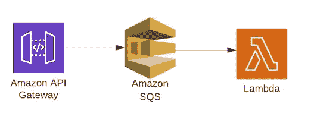

# 使用 Terraform 构建 ApiGateway-SQS-Lambda 集成

> 原文：<https://towardsdatascience.com/building-an-apigateway-sqs-lambda-integration-using-terraform-5617cc0408ad?source=collection_archive---------11----------------------->


在 [Unsplash](https://unsplash.com?utm_source=medium&utm_medium=referral) 上 [Max Duzij](https://unsplash.com/@max_duz?utm_source=medium&utm_medium=referral) 拍摄的照片

Terraform 是一个非常棒的基础设施建设工具。该工具用于安全有效地构建、更改和版本控制基础设施。Terraform 是 HashiCorp 提供的基础设施代码。

在使用 Terraform 构建我正在使用 Amazon Web Services (AWS)设计的项目时，我遇到了设置 API 网关端点的需求，该端点获取记录，并将它们放入触发 Lambda 函数的事件源的 SQS 队列中。

在本帖中，我将与您分享构建这一基础设施所需的每个步骤。这篇文章假设你熟悉 Terraform 代码和 AWS 服务。



使用 LucidChart 工作空间制作的图表:[https://www.lucidchart.com/pages/?noHomepageRedirect=true](https://www.lucidchart.com/pages/?noHomepageRedirect=true)

# 变量

首先，让我们看看项目中使用的输入变量。变量存储在文件 *varibles.tf.* 中

这些变量的使用使得在不同的环境中部署服务变得非常容易。将*环境*变量更改为 *prd(又名*生产*)，*将创建所有具有相应环境名称的服务。

# 简单队列服务(SQS)

首先创建 SQS 资源。

# ApiGateway

在创建 ApiGateway 资源之前，让我们首先定义权限，以便 API Gateway 拥有向 SQS 队列发送消息的必要权限。我通常会创建一个名为 *policies* 的文件夹，其中包含我将在项目中使用的所有策略，我建议你也这样做，这将保持你的代码整洁有序。

```
├── iam.tf
├── policies: // all policies created
│   ├── api-gateway-permission.json
│   └── lambda-permission.json
```

这些权限将赋予 API Gateway 创建和写入 CloudWatch 日志的能力，以及从 SQS 队列中放置、读取和列出数据的能力。

创建了 ApiGateway-SQS 交互所需的所有权限后，我们就可以开始创建端点了。

我们的端点将有一个连接到根的路径:`/form_score`，带有一个 API Gateway POST 方法。我们还需要一个名为*`query_string_parameter`*，*的 unity，*通过 HTTP 请求*传递。*为了验证请求参数中是否存在`query_string_parameter`，创建了一个验证器。

现在，我们可以定义将记录转发到 SQS 队列的 API 网关集成。为了将方法、主体、查询参数和路径参数从端点转发到 SQS 消息，添加了一个`request_template`。

对于与 SQS 的集成，请求的 HTTP 头必须与`Content-Type: application/x-www-form-urlencoded`在一起。

还应该为成功的响应绘制 SQS 响应。在这个项目中，SQS 响应按原样返回给 apiGateway，但是您也可以对其进行更改，以便返回一个自定义消息，例如:`'Message Added to SQS successfully'`。这里，我们为成功的请求定义了一个 200 处理程序。

最后，我们可以添加 API Gateway REST 部署来部署我们的端点。添加了重新部署触发器。此配置计算 API 的 Terraform 资源的散列，以确定应触发新部署的更改。

# 希腊字母的第 11 个

当用 terraform 构建 lambda 时，我喜欢将 lambda 代码从基础代码中分离出来，这样可以使代码更干净、更有条理。

```
├── lambda: folder for lambda code
│   ├── handler.py
│   └── sqs-integration-dev-lambda.zip
├── lambda.tf
```

在构建我们的 lambda 之前，我们必须创建必要的权限，以便它可以读取来自 SQS 的消息并写入 CloudWatch 日志。

然后，我们可以建立我们的 lambda。

最后，我们需要添加一个权限，以便 SQS 可以调用 lambda。我们还需要添加一个事件源，以便当新消息到达队列时，SQS 可以触发 lambda。

# 结论

设置好一切后，我们准备将所有更改应用到我们的 AWS 帐户。部署后，我们将拥有一个公共端点，它将使用 Lambda 函数向 SQS 写入数据，并从中消费。

这是一个强大的管道，可以用在不同的场景中。你可以在[这里的](https://github.com/DanielDaCosta/apiGateway-sqs-lambda)查看完整的代码和额外的分析！

# 参考

[](https://gist.github.com/afloesch) [## 阿弗洛施的要点

### 我很难找到一个像样的例子，说明如何使用 lua nginx 模块来获取环境变量并传递…

gist.github.com](https://gist.github.com/afloesch) [](https://www.terraform.io) [## 哈希公司的 Terraform

### 使用 Terraform 以代码形式交付基础架构协作和共享配置发展和版本化您的…

www.terraform.io](https://www.terraform.io) [](https://medium.com/appetite-for-cloud-formation/setup-lambda-to-event-source-from-sqs-in-terraform-6187c5ac2df1) [## 在 Terraform 中将 Lambda 设置为来自 SQS 的事件源

### 本指南将向您展示如何设置 AWS Lambda，以使用 SQS 作为 Terraform 的事件源。

medium.com](https://medium.com/appetite-for-cloud-formation/setup-lambda-to-event-source-from-sqs-in-terraform-6187c5ac2df1)