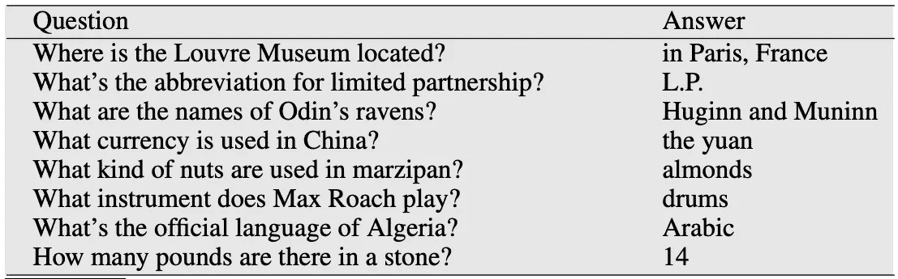
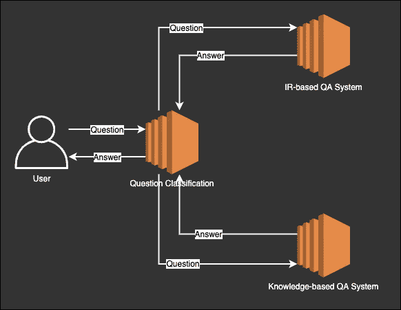
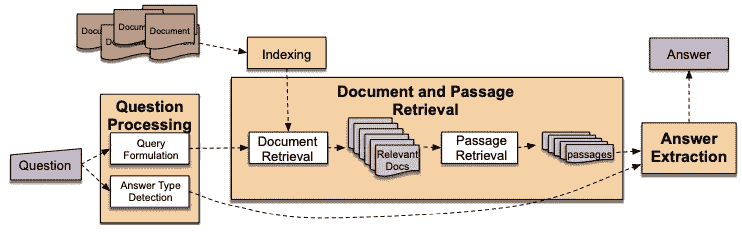
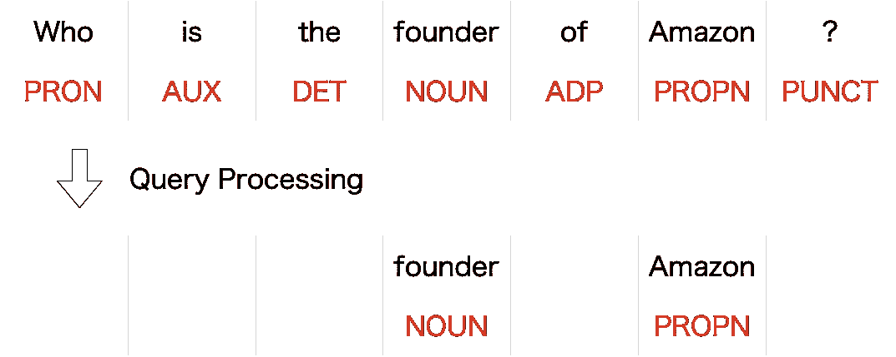
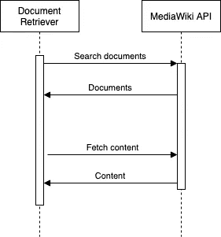
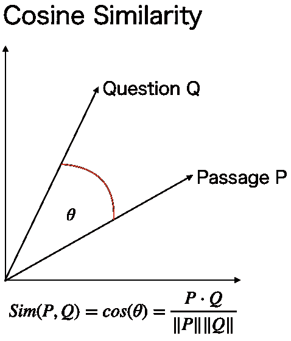
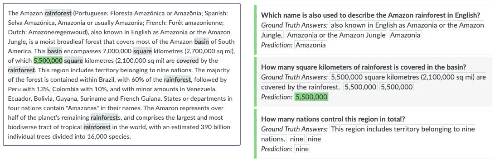
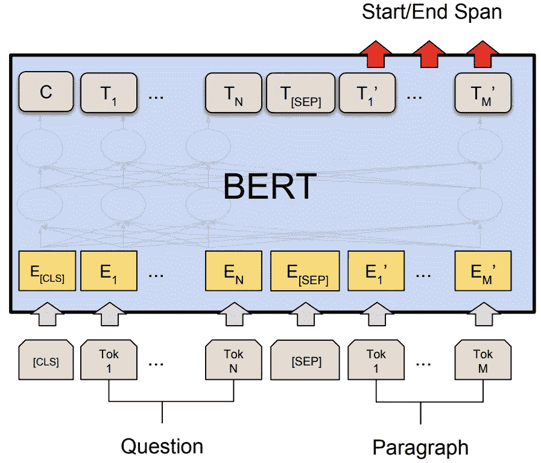
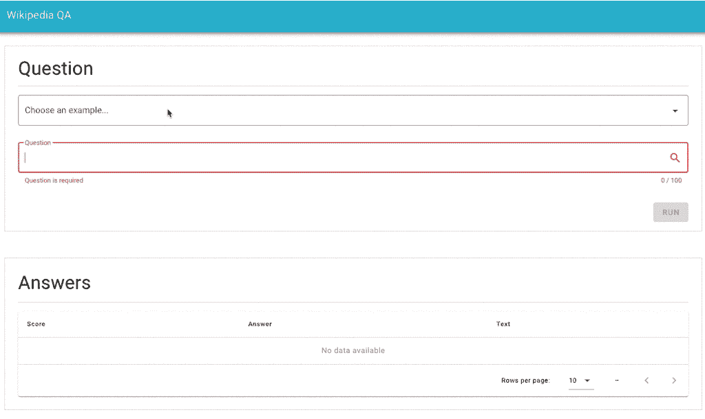

# 从零开始构建问答系统的应用程序

> 原文：<https://towardsdatascience.com/building-an-application-of-question-answering-system-from-scratch-2dfc53f760aa?source=collection_archive---------8----------------------->

## 初学者的循序渐进指南

阿尔弗莱德·西斯莱/公共领域来自[维基媒体](https://commons.wikimedia.org/wiki/File:Allee_de_chataigniers_-_Alfred_Sisley.jpg)

**问答(QA)** 系统是对用英语、汉语等自然语言表达的问题给出适当答案的系统。例如，假设一个用户问“亚伯拉罕·林肯什么时候被暗杀的？”在这种情况下，问答系统预计返回“1865 年 4 月 15 日”。下面是一个问答配对的例子。

来自[演讲和语言处理](https://web.stanford.edu/~jurafsky/slp3/)第 25 章的问答配对示例。

一个问题回答系统将帮助你有效地找到信息。一般来说，当我们在网上寻找一些信息时，我们会使用搜索引擎来搜索相关的文档。但是，因为它们向您显示文档，所以您必须阅读文档并确定它们是否包含您需要的信息。真麻烦。因此，商业搜索引擎有一个问题回答功能，让你可以有效地找到信息。

必应搜索问答。

问答系统有多种模式，但主要使用两种模式:基于知识的和基于信息检索的问答系统。人类在回答一个问题时，首先尝试用自己的知识来回答问题。如果他们不能回答这个问题，他们就在网上或书中寻找答案。问答系统类似于人类。前者对应于基于知识的系统，后者对应于基于信息检索的系统。

两种质量保证系统。

在本帖中，我们将构建一个基于信息检索的问答系统。首先，我们将问题转换成搜索查询。接下来，我们使用 MediaWiki API 来获取文档。最后，我们使用预先训练的 BERT 从文档中提取答案。整个系统可以分为四个部分:问题处理、文档检索、段落检索和答案抽取。

基于 IR 的问答系统架构来自[语音和语言处理](https://web.stanford.edu/~jurafsky/slp3/)第 25 章。

在这篇文章中，我只展示了重要的部分，但是整个系统可以在下面的 GitHub 库中找到。代码很小，很容易理解。请看一看:

*   [https://github.com/Hironsan/WikipediaQA](https://github.com/Hironsan/WikipediaQA)

该员额的其余部分组织如下:

1.  询问处理
2.  文档检索
3.  段落检索
4.  答案抽取

# 步骤 1:查询处理

问题处理将问题转换成搜索查询。通常会删除停用词和具有特定词性的词。此外，随着深度学习技术最近的发展，创建可以很好地表达句子意思的向量已经成为可能，因此还使用了将问题转换为向量并将其用作查询的方法。

这一次，我们将使用 spaCy 生成一个搜索查询。首先，对问题进行解析，并标注词性标签。接下来，我们根据词类标签删除单词。具体来说，除专有名词(PROPN)、数字(NUM)、动词(VERB)、名词(NOUN)和形容词(ADJ)之外的单词将被删除。比如问题“亚马逊的创始人是谁？”生成查询“创始人亚马逊”。

查询处理的一个例子。

请看看 QueryProcessor 类:

*   [查询处理器](https://github.com/Hironsan/WikipediaQA/blob/2c296107ca9e62acafc08c0a890912a68458b1bb/src/components.py#L12-L21)

# 步骤 2:文档检索

在文档检索中，我们将使用生成的查询来检索相关的文档。在后续的处理中，由于会从这些文档中提取答案，所以需要尽可能地搜索可能包含答案的文档。与问题处理类似，深度学习技术允许我们将文档转换为向量[1]。

这一次，我们将搜索维基百科。维基百科提供了一个叫做 [MediaWiki API](https://www.mediawiki.org/wiki/API:Main_page) 的 API。我们可以使用 API 来搜索与查询相关的文档。这里的过程包括两个步骤。首先，我们发送一个查询来获取相关页面的列表。然后我们获取各个页面的内容。

文献检索流程。

请看看 DocumentRetrieval 类:

*   [文档检索](https://github.com/Hironsan/WikipediaQA/blob/2c296107ca9e62acafc08c0a890912a68458b1bb/src/components.py#L24-L67)

# 第三步:段落检索

在段落检索中，文档被分成更小的单元(段落)，例如句子和段落，并且选择可能包含答案的段落。如果文档很短，这是不必要的，但是如果文档很长，段落选择是有效的，因为我们不知道查询匹配了文档的哪一部分。通常，后续的答案抽取过程需要很长时间才能完成，因此选择段落还有加快整个系统速度的好处。

这一次，我们将选择与问题相似的段落。为了计算相似性，我们使用 BM25 来创建问题和段落的向量。一旦我们创建了向量，我们就可以使用点积和余弦相似度来计算问题和文章之间的相似度。因为 BM25 功能强大，所以经常被用作段落检索的基线。

请看看 PassageRetrieval 类:

*   [通行里程](https://github.com/Hironsan/WikipediaQA/blob/2c296107ca9e62acafc08c0a890912a68458b1bb/src/components.py#L70-L93)

# 步骤 4:答案抽取

答案提取从段落中提取答案。这里，问题和段落被输入到答案提取模型，并且模型输出带有分数的答案偏移。然后，它根据分数对答案进行排序，并将分数最高的答案作为最终答案呈现给用户。

从文本中提取答案。在这种情况下，对于“流域内有多少平方公里的雨林被转化？”，模型将返回“5，500，000”作为答案。来自[小队 2.0](https://rajpurkar.github.io/SQuAD-explorer/explore/v2.0/dev/) 。

这一次，我们将答案抽取公式化为上下文感知问答，并使用 BERT 进行求解。通过将问题和文章输入到 BERT 中，我们可以得到答案的偏移量。已知 BERT 可以很好地解决答案抽取，在 SQuAD 数据集上表现优于人类[2][3]。

鸣谢:[伯特:语言理解深度双向变压器前期训练](https://arxiv.org/pdf/1810.04805.pdf)

请看看 AnswerExtraction 类:

*   [答案提取](https://github.com/Hironsan/WikipediaQA/blob/2c296107ca9e62acafc08c0a890912a68458b1bb/src/components.py#L96-L113)

让我们看一下应用程序。以下是一个问题回答的例子。当“谁是亚马逊的创始人？”发布后，应用程序将问题转换为查询，通过 MediaWiki API 检索文档，选择段落并从中提取答案。因此，应用程序返回“杰夫·贝索斯”作为首选答案:

GitHub 存储库中可用的示例应用程序。

# 为了进一步改进

作为进一步改进的第一步，有一种方法可以通过以更复杂的方式嵌入问题和文档来提高文档检索性能。众所周知，使用 BERT 或通用语句编码器而不是使用 BM25[1][4][5]对它们进行矢量化可以提高性能。

还提出了一种方法，其中信息检索和答案提取被联合训练[6]。这次分别进行信息检索和答案抽取。因为信息检索不同于问题回答，所以系统是局部优化的。通过同时训练信息检索和答案抽取，系统可以得到很好的优化。

当然，你可以使用更好的答案抽取模型。根据[小队 2.0 排行榜](https://rajpurkar.github.io/SQuAD-explorer/)显示，有几款比 BERT 性能更好。比如艾伯特[7]，伊莱克特拉[8]，罗伯塔[9]，XLNet[10]等等。你可以很容易地使用这些模型，因为 Huggingface transformers 支持它们。更多细节见[变压器文档](https://huggingface.co/transformers/index.html)。

GitHub 资源库:

*   【https://github.com/Hironsan/WikipediaQA 

# 参考

1.  [为段落重新排序调查 BERT 的成功与失败](https://arxiv.org/abs/1905.01758)
2.  [BERT:用于语言理解的深度双向转换器的预训练](https://www.aclweb.org/anthology/N19-1423/)
3.  [小队:100，000+用于文本机器理解的问题](https://www.aclweb.org/anthology/D16-1264/)
4.  [面向开放领域问答的密集段落检索](https://arxiv.org/abs/2004.04906)
5.  [ReQA:对端到端答案检索模型的评估](https://arxiv.org/abs/1907.04780)
6.  [弱监督开放领域问答的潜在检索](https://www.aclweb.org/anthology/P19-1612/)
7.  [ALBERT:一个用于语言表达自我监督学习的 Lite BERT](https://arxiv.org/abs/1909.11942)
8.  [ELECTRA:将文本编码器预先训练成鉴别器而不是生成器](https://arxiv.org/abs/2003.10555)
9.  [RoBERTa:一种稳健优化的 BERT 预训练方法](https://arxiv.org/abs/1907.11692)
10.  [XLNet:用于语言理解的广义自回归预训练](https://arxiv.org/abs/1906.08237)