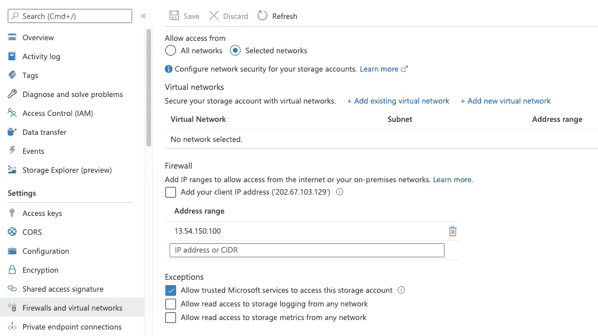

# 构建事件驱动的数据管道，将数据从亚马逊 S3 复制到 Azure Storage

> 原文：<https://towardsdatascience.com/building-an-automated-data-pipeline-to-copy-data-from-amazon-s3-to-azure-storage-2a1b8d1ac6eb?source=collection_archive---------18----------------------->

## [实践教程](https://towardsdatascience.com/tagged/hands-on-tutorials)

## 使用 AWS Data Wrangler、亚马逊 S3 库存、亚马逊 S3 批处理操作、Athena、Fargate 和 AzCopy 进行多云批量文件传输


[@jsweissphoto](https://unsplash.com/@jsweissphoto) 在 [Unsplash](https://unsplash.com/) 上的照片

您的企业可能需要定期将大量数据从一个公共云转移到另一个公共云。更具体地说，您可能会面临需要多云解决方案的要求。本文介绍了一种使用亚马逊 S3 库存、亚马逊 S3 批处理操作、Fargate 和 AzCopy 实现从 AWS S3 桶到 Microsoft Azure Blob 存储容器的自动化数据复制的方法。

# 方案

您的公司每天在内部生成新的 CSV 文件，压缩后总大小约为 100GB。所有文件的大小为 1-2gb，需要在每晚凌晨 3 点到 5 点之间的固定时间窗口上传到亚马逊 S3。在所有文件上传到 S3 后，您的企业决定将这些 CSV 文件从 S3 复制到 Microsoft Azure 存储。您必须找到一种简单快捷的方法来自动化数据复制工作流。

为了完成这项任务，我们可以建立一个数据管道，使用 AWS Data Wrangler、亚马逊 S3 库存、亚马逊 S3 批处理操作、Athena、Fargate 和 AzCopy 定期将数据从 S3 复制到 Azure 存储。

*下图展示了管道解决方案的高级架构:*


艾毅的建筑图

## 我们将涵盖的内容:

*   创建一个包含私有和公共子网、S3 端点和 NAT 网关的 VPC。
*   创建 Azure 存储帐户和 blob 容器，生成 SAS 令牌，然后添加防火墙规则以允许从 AWS VPC 到 Azure 存储的流量。
*   在 S3 存储桶上配置每日 S3 库存报告。
*   使用 Athena 仅过滤 S3 库存报告中的新对象，并将这些对象的存储桶名称和对象关键字导出到 CSV 清单文件中。
*   使用导出的 CSV 清单文件创建 S3 批处理操作 PUT 复制作业，该作业将对象复制到配置了生命周期策略到期规则的目标 S3 存储桶。
*   设置一个 Eventbridge 规则，调用 lambda 函数来运行 Fargate 任务，该任务将目标桶中具有相同前缀的所有对象复制到 Azure 存储容器。

# 先决条件

*   设置 AWS 帐户
*   设置 Azure 帐户
*   安装最新的 [AWS-CLI](https://docs.aws.amazon.com/cli/latest/userguide/installing.html)
*   安装自动气象站 [CDK-CLI](https://docs.aws.amazon.com/cdk/latest/guide/getting_started.html)
*   对 [AWS CDK](https://aws.amazon.com/cdk/) 的基本了解
*   对 Docker 的基本了解

# 我们开始吧！

# 创建来源和目标 S3 时段

我们使用 CDK 在 AWS 上构建我们的基础设施。首先，让我们创建一个源桶来接收来自外部提供者或内部的文件，并设置每日清单报告，提供对象和元数据的平面文件列表。

接下来，创建一个目标存储桶作为临时存储，并在前缀`/tmp_transition`上配置生命周期策略到期规则。所有带有前缀的文件(如`/tmp_transition/file1.csv`)将被复制到 Azure，并在 24 小时后被生命周期策略删除。

使用以下代码创建 S3 存储桶。

# 创建 AWS VPC

接下来，我们需要创建具有公共和私有子网的 VPC、NAT 网关、S3 端点，并附加一个端点策略，该策略允许访问 Fargate 容器，我们将数据复制到 Azure 的 S3 桶就位于该容器中。

现在使用下面的代码定义您的 VPC 和相关资源。

创建 NAT 网关时，将在 AWS 中创建一个弹性 IP 地址。我们将需要 IP 地址来在步骤 3 中设置 Azure 存储防火墙规则。

# 正在部署 Azure 存储帐户

为了简化资源管理，我们可以使用 Azure 资源管理器模板(ARM 模板)在我们的 Azure 订阅级别部署资源。

我会假设你已经有一个 Azure 订阅设置。我们将使用云外壳来部署资源组、Azure 存储帐户、容器和防火墙规则，以允许来自特定 IP 地址的流量。

点击 Azure 门户标题栏的云壳图标，就会打开云壳。


运行以下命令进行部署:

```
az group create --name **examplegroup** --location australiaeastaz deployment group create --resource-group **examplegroup** --template-uri [https://raw.githubusercontent.com/yai333/DataPipelineS32Blob/master/Azure-Template-DemoRG/template.json](https://raw.githubusercontent.com/yai333/DataPipelineS32Blob/master/Azure-Template-DemoRG/template.json)  --parameters storageAccounts_mydemostroageaccount_name=**mydemostorageaccountaiyi** --debug
```

一旦部署了模板，我们就可以通过探索 Azure 门户的资源组来验证部署。所有部署的资源都将显示在资源组的概述部分。


让我们为我们的存储帐户创建一个防火墙规则:

*   首先，转到我们刚刚部署的存储帐户。
*   其次，点击设置菜单中的防火墙和虚拟网络。
*   第三，检查您是否选择了允许来自选定网络的访问。
*   然后，要授予对互联网 IP 范围的访问权限，请输入 AWS VPC 的公共 IP 地址(步骤 2)并保存。



然后，我们将生成共享访问签名(SAS)来授予对 Azure 存储资源的有限访问权限。

在 Cloudshell 中运行以下命令:

```
**RG_NAME**='**examplegroup**'
**ACCOUNT_NAME**='**mydemostorageaccountaiyi**' 
**ACCOUNT_KEY**=`az storage account keys list --account-name=$ACCOUNT_NAME --query [0].value -o tsv`
**BLOB_CONTAINER**=democontainer**STORAGE_CONN_STRING**=`az storage account show-connection-string --name $ACCOUNT_NAME --resource-group $RG_NAME --output tsv`SAS=`az storage container generate-sas --connection-string $STORAGE_CONN_STRING -n $BLOB_CONTAINER --expiry '**2021-06-30**' --permissions **aclrw** --output tsv`echo **$SAS**
```

我们将获得授权 `(a)dd (d)elete (r)ead (w)rite` 访问 blob 容器`democontainer`所需的 sa 和 URL。

```
se=2021-06-30&sp=racwl&sv=2018-11-09&sr=c&sig=xxxxbBfqfEppPpBZPOTRiwvkh69xxxx/xxxxQA0YtKo%3D
```

让我们回到 AWS，将 sa 放到 AWS SSM 参数存储中。

在本地终止符中运行以下命令。

```
aws ssm put-parameter --cli-input-json '{
  "Name": "**/s3toblob/azure/storage/sas**",
  "Value": "**se=2021-06-30&sp=racwl&sv=2018-11-09&sr=c&sig=xxxxbBfqfEppPpBZPOTRiwvkh69xxxx/xxxxQA0YtKo%3D**",
  "Type": "**SecureString**"
}'
```

# 定义 Lambda 函数和 AWS 数据管理器层

现在，让我们来看看λ函数。我们将创建三个 lambda 函数和一个 lambda 层:

*   fn_create_s3batch_manifest 和 DataWranglerLayer
*   fn _ 创建 _ 批处理 _ 作业
*   fn _ 流程 _ 转移 _ 任务

## fn_create_s3batch_manifest 和 AWS Data Wrangler 层

这个 lambda 函数使用 AWS Data Wrangler 的 Athena 模块来过滤过去 UTC 日期的新文件，并将文件列表保存到 CSV 清单文件中。

将下面的代码复制到 CDK stack.py，从 [**这里**](https://github.com/yai333/DataPipelineS32Blob/tree/master/CDK-S3toblob/layers) 下载`awswranger-layer` zip 文件。

然后用下面的代码创建`./src/lambda_create_s3batch_manifest.py`:

在上面的代码中，我们使用 Athena query 创建 Glue 数据库、表，并每天向该表添加一个分区。然后 lambda 执行 except query 来返回两个日期分区之间的差异。

注意`start_query_execution`是异步的，因此不需要等待 Lambda 中的结果。一旦查询被执行，结果将作为 CSV 文件保存到`s3_output=f"s3://{os.getenv('DESTINATION_BUCKET_NAME')}/csv_manifest/dt={partition_dt}"`。

## fn_create_batch_job 和 S3 通知

在本节中，我们将创建一个 lambda 函数`fn_create_batch_job`，并使亚马逊 S3 能够在一个 CSV 文件被添加到亚马逊 S3 Bucket `/csv_manifest`前缀时发送一个通知来触发`fn_create_batch_job`。将下面的代码放到 CDK 的 stack.py 中:

用下面的代码创建`./src/lambda_create_batch_job.py`:

Lambda `fn_create_batch_job`函数创建 S3 批处理操作作业，将 CSV 清单中列出的所有文件复制到 S3 目的地桶`/tmp_transition prefix`。

S3 批处理操作是亚马逊 S3 的一项数据管理功能，可以让您大规模管理数十亿个对象。要启动一个 S3 批处理操作作业，我们还需要设置一个 IAM 角色`S3BatchRole`和相应的策略:

## fn_process_transfer_task 和 Eventbridge 自定义规则

我们将创建一个 Eventbridge 定制规则，通过 AWS CloudTrail 跟踪 Amazon EventBridge 中的 S3 批处理操作作业，并将处于完成状态的事件发送到目标通知资源`fn_process_transfer_task`。

Lambda `fn_process_transfer_task`然后会以编程方式启动一个 Fargate 任务，将前缀为`/tmp_transition`的文件复制到 Azure 存储容器`democontainer`。

用以下代码创建`./src/lambda_process_s3transfer_task.py`:

现在，我们已经设置了无服务器部分。让我们转到 Fargate 任务并处理数据复制。

# 创建 AWS Fargate 任务

我们将创建:

*   安装了带有 AzCopy 的 ECR 映像。 [AzCopy](https://docs.microsoft.com/en-us/azure/storage/common/storage-use-azcopy-v10?toc=/azure/storage/blobs/toc.json) 是一个命令行实用程序，可以用来将 blobs 或文件复制到存储帐户或从存储帐户复制。
*   具有 Fargte 任务的 ECS 集群。

让我们开始吧。

1.  构建 ECS、ECR 和 Fargate 堆栈。

2.构建一个 Docker 镜像并在那里安装 Azcopy。

注意，要使用来自 AWS 的 AzCopy 传输文件，我们需要在容器中设置 AWS 凭证。我们可以使用以下方法检索 AWS 凭据:

```
curl [http://169.254.170.2/$AWS_CONTAINER_CREDENTIALS_RELATIVE_URI](http://169.254.170.2/$AWS_CONTAINER_CREDENTIALS_RELATIVE_URI)
```

3.将 Docker 图像推送到 ECR

```
eval $(aws ecr get-login --region ap-southeast-2 --no-include-email)docker build . -t YOUR_ACCOUNT_ID.dkr.ecr.ap-southeast-2.amazonaws.com/YOUR_ECR_NAMEdocker push YOUR_ACCOUNT_ID.dkr.ecr.ap-southeast-2.amazonaws.com/YOUR_ECR_NAME
```

太好了！我们有我们需要的！你可以在我的 [Github Repo](https://github.com/yai333/DataPipelineS32Blob) 中找到 CDK 项目的完整解决方案。克隆存储库并部署堆栈:

```
cd CDK-S3toblob 
pip install -r requirements.txt
cdk deploy
```

一旦成功创建了堆栈，导航到 AWS CloudFormation [控制台](https://console.aws.amazon.com/cloudformation)，找到我们刚刚创建的堆栈，并转到 Resources 选项卡以找到部署的资源。


现在是时候测试我们的工作流程了；转到 S3 源斗`demo-databucket-source`。在不同的文件夹中上传尽可能多的文件(前缀)。等待 24 小时，等待下一份库存报告生成；然后，你会看到整个管道开始运行，文件最终会被复制到 Azure `democontainer`。

我们应该可以看到 Fargate 任务的日志，如下图所示。


我们还可以使用 CloudWatch Container Insights 对 ECS 资源进行监控、故障排除和设置警报。


# 结论

在本文中，我介绍了从 AWS S3 到 Microsoft Azure Storage 的自动化数据复制方法。我带你了解了如何使用 CDK 部署 VPC、AWS S3、Lambda、Cloudtrail、Fargte 资源，向你展示了如何使用 ARM 模板部署 Azure 服务。我向您展示了如何使用 AWS Wrangler 库和 Athena query 来创建表和查询表。

我希望这篇文章对你有用。你可以在我的 [**GitHub repo**](https://github.com/yai333/DataPipelineS32Blob/tree/master/CDK-S3toblob) 中找到完整的项目。