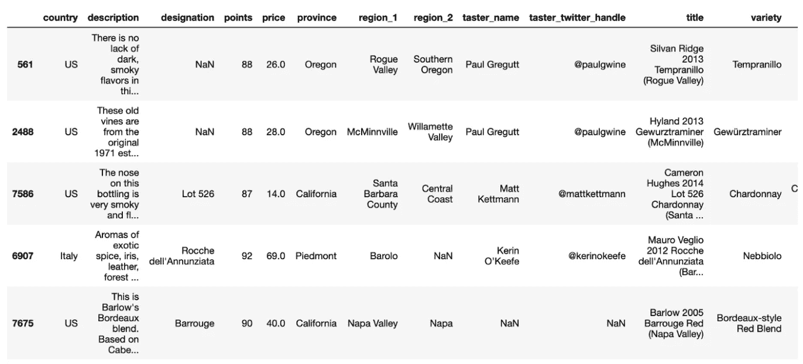
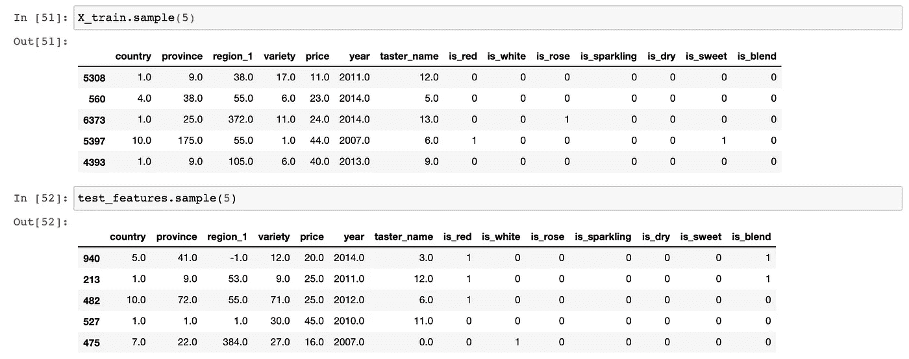
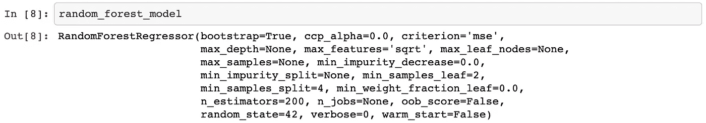
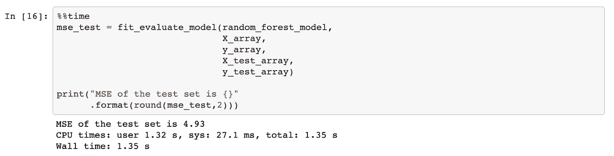
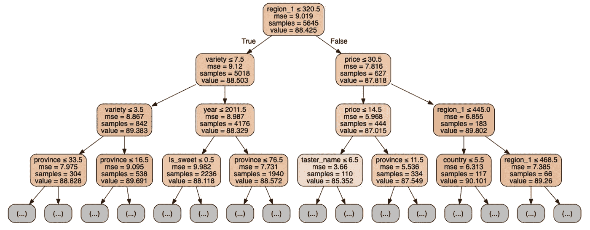
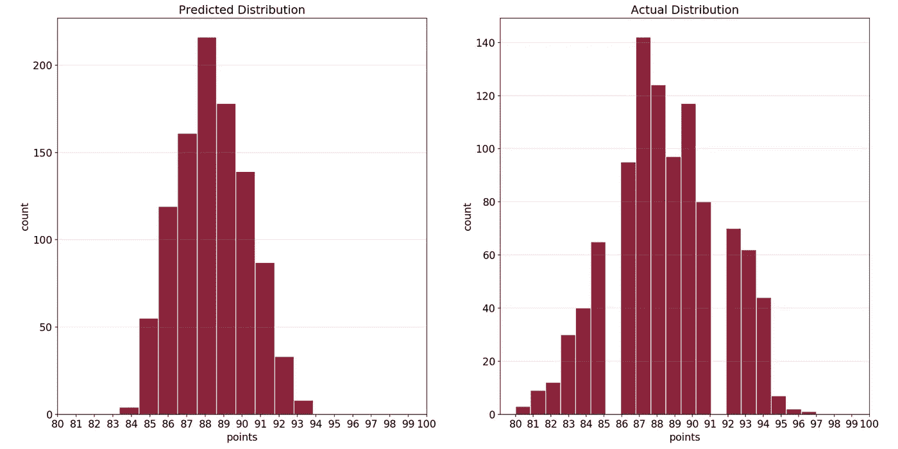
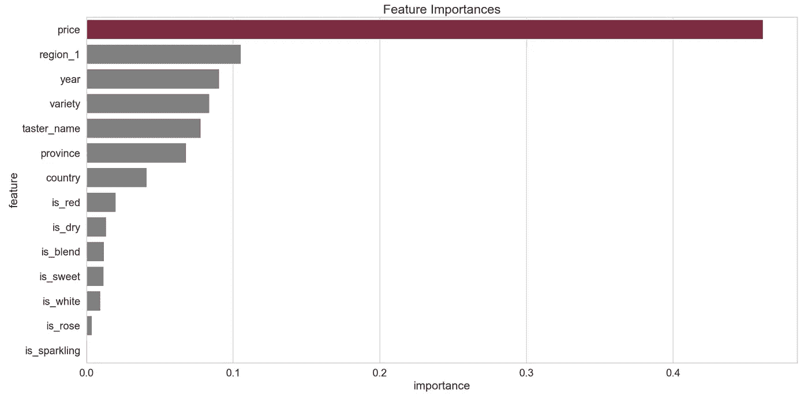
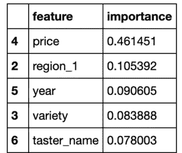
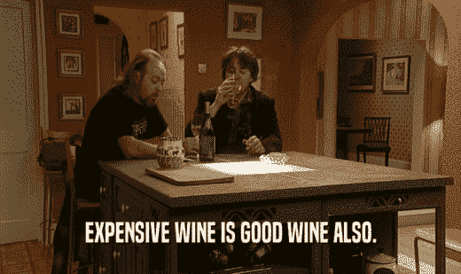
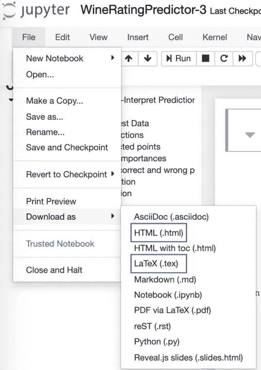

# 构建自动化机器学习管道:第三部分

> 原文：<https://towardsdatascience.com/building-an-automated-machine-learning-pipeline-a74acda76b98?source=collection_archive---------56----------------------->

## [机器学习](https://towardsdatascience.com/machine-learning/home)

## 训练和评估模型，解释模型结果和最终结论

*   [第 1 部分:理解、清理、探索、处理数据](/building-an-automated-machine-learning-pipeline-part-one-5c70ae682f35?source=friends_link&sk=8de05327eedb3d0dadcfa4b1a8e8cc75)
*   [第 2 部分:设置指标和基线，选择和调整模型](/building-an-automated-machine-learning-pipeline-part-two-1d3c86e6fe42?source=friends_link&sk=a005d5ead7a844adb7819403ddc6dc0e)
*   第三部分:训练、评估和解释模型(你现在正在阅读)
*   第 4 部分:使用 Docker 和 Luigi 自动化您的管道。)


[David Espina](https://unsplash.com/@davadventurelife?utm_source=medium&utm_medium=referral) 在 [Unsplash](https://unsplash.com?utm_source=medium&utm_medium=referral) 上拍摄的照片

在这个系列文章中，我们将我们的课程设置为构建一个 9 步机器学习(ML)管道，并使用 [Docker](https://www.docker.com/) 和 [Luigi](https://luigi.readthedocs.io/en/stable/) 来自动化它——只剩下一步了😉。我们将最终组装这些步骤，以便它可以在任何生产系统上运行，而不需要专门的配置和设置。

我们遵循直观的 ML 管道来构建葡萄酒评级预测器:

1.  理解、清理和格式化数据
2.  探索性数据分析
3.  特征工程和预处理
4.  设置评估指标并建立基线
5.  基于评估度量选择 ML 模型
6.  对所选模型执行超参数调整
7.  训练和评估模型
8.  解释模型预测
9.  得出结论并记录工作

这个问题本身是一个监督回归问题，因为我们试图使用定义的特征集来确定*点*(目标变量)。*点*是一个介于 80 和 100 之间的数字，表示葡萄酒的质量。

我们的原始数据看起来像这样:



我们从阐述业务问题和解释我们的目标开始:

> 该项目的目标是使用样本数据集建立一个葡萄酒评级预测器，以显示良好的预测是可能的，也许是作为一个更大项目的概念证明。

通过第一个笔记本中[所涵盖的管道的前三个步骤，我们清理、理解并格式化了数据集。此外，我们添加并转换了一些特性，为最终在任何 ML 模型中使用的训练和测试数据集做好了准备:](/building-an-automated-machine-learning-pipeline-part-one-5c70ae682f35?source=friends_link&sk=8de05327eedb3d0dadcfa4b1a8e8cc75)



在[的第二个笔记本](/building-an-automated-machine-learning-pipeline-part-two-1d3c86e6fe42?source=friends_link&sk=a005d5ead7a844adb7819403ddc6dc0e)中，我们选择的评估指标为***【MSE】***，这是一个适合我们问题的指标。然后，我们使用 ***集合评估指标&建立基线*** 中的均方差计算逻辑计算基线(结果为 *9.01* )。

然后，我们测试了几种不同的 ML 算法，并决定在 ***选择基于评估指标的 ML 模型*** 步骤中使用[随机森林回归器 form scikit-learn](https://scikit-learn.org/stable/modules/generated/sklearn.ensemble.RandomForestRegressor.html) 构建葡萄酒评级预测器。我们对所选算法进行了超参数调整，并在 ***对所选模型进行超参数调整*** 步骤中进一步改进了我们的模型性能。

> 我们已经显著降低了基线 MSE，从 9.01 降低到 4.99，从而实现了 45%的改善！

在本文中，我们将完成剩下的最后三个步骤:我们将在测试集上评估我们的模型并解释预测。我们将在最后一步总结整个流程并报告亮点。

这篇文章背后的代码可以在这个笔记本里找到[。GitHub 上提供了完整的项目:](https://github.com/cereniyim/Wine-Rating-Predictor-ML-Model/blob/master/notebooks/WineRatingPredictor-3.ipynb)

[](https://github.com/cereniyim/Wine-Rating-Predictor-ML-Model) [## cereniyim/葡萄酒评级预测模型

### 在这个项目中，我为一个在线葡萄酒卖家构建了一个葡萄酒评级预测器。这款葡萄酒预测器旨在显示良好的…

github.com](https://github.com/cereniyim/Wine-Rating-Predictor-ML-Model) 

页（page 的缩写）s:我鼓励你在我们开始之前阅读以前的文章，如果你还没有的话！

*   [第 1 部分:理解、清理、探索、处理数据](/building-an-automated-machine-learning-pipeline-part-one-5c70ae682f35?source=friends_link&sk=8de05327eedb3d0dadcfa4b1a8e8cc75)
*   [第 2 部分:设置指标和基线，选择和调整模型](/building-an-automated-machine-learning-pipeline-part-two-1d3c86e6fe42?source=friends_link&sk=a005d5ead7a844adb7819403ddc6dc0e)

# 在我们开始之前:

我们将要使用的数据集在`[notebooks/transformed](https://github.com/cereniyim/Wine-Rating-Predictor-ML-Model/tree/master/notebooks/transformed)`中提供。我们在之前的笔记本中保存的模型可在与本笔记本相同的目录中找到。

在本笔记本中，我们将需要以下 Python 库:

让我们加载数据集和模型:

```
X_train = pd.read_csv("transformed/X_train.csv")
y_train = pd.read_csv("transformed/y_train.csv")

X_valid = pd.read_csv("transformed/X_valid.csv")
y_valid = pd.read_csv("transformed/y_valid.csv")

test_features = pd.read_csv("transformed/test_features.csv")
test_target = pd.read_csv("transformed/test_target.csv")random_forest_model = (pickle
                       .load(
                           open('random_forest_model.sav', 
                                'rb')))
```



随机森林模型的参数

使用我们在第二篇文章中使用的相同函数将它们转换成数组:

```
X = pd.concat([X_train, X_valid]) 
y = pd.concat([y_train, y_valid])X_array = convert_features_to_array(X) 
y_array = convert_target_to_array(y)X_test_array = convert_features_to_array(test_features)
y_test_array = convert_target_to_array(test_target)
```

# 7.训练和评估模型

***训练集*** 将用于映射特征(`X_array`)和目标(`y_array`)之间的模式，并构建葡萄酒评级预测器。这个过程叫做 ***训练模型*** 或者 ***建立模型*** 。映射将通过在我们的随机森林模型上调用的`fit`方法来完成。

```
random_forest_model.fit(X_array, y_array)
```

在评估模型之前，实际目标值(`y_test_array`)从测试集(`X_test_array`)中拿出来，用作与预测值的比较。两者都将用于使用模型拟合期间发现的模式生成葡萄酒的*点/* 等级。

将测试集输入模型并生成预测称为 ***评估模型。*** 当我们在我们的随机森林模型上调用`predict`方法时，预测的数组就生成了。

```
predictions = random_forest_model.predict(X_test_array)
```

**让我们看看我们的模型在测试集(我们的模型从未见过的训练数据集的一部分)上的表现如何:**



# 8.解释模型预测

作为数据科学家，我们是机器学习技术的解释者。我们应该能够解释解决方案是如何工作的，以及需要进一步改进的地方。这发生在 ***解释模型预测*** 步骤。

我们将从以下角度解释模型预测:

1.  可视化单个决策树
2.  将*点的实际值与预测值进行比较*
3.  查看特性的重要性
4.  检查模型的单个预测

## 8.1.可视化单个决策树

我们已经在上一个笔记本中定义了随机森林算法的工作原理:

> ***随机森林回归器*** 是一种集成算法，它一次构建多个决策树，并在数据集的各种子样本和各种特征子集上训练它们。

我们的随机森林算法由 200 棵决策树组成。如果我们一次绘制所有的树，它可能不会给我们提供太多的信息。然而，可视化单个决策树足以理解葡萄酒评级预测器如何产生预测。

让我们将随机森林回归算法中决策树的前 3 个节点可视化，以进一步理解我们的算法是如何工作的:



看这张图，你可以把决策树想象成一系列的是/否问题，像流程图一样被问和回答。这个特定的树是使用总共 8948 个数据点中的 5645 个数据点构建的，这是完整数据集的随机子样本。

通过询问*区域 _1* 是否小于 320.5 来启动根节点。可以容易地认识到，初始 MSE 与 MSE 的基线估计相同。预测*分*是 88.425。

根节点被分成两个分别由 5018(初始子样本的 88%)和 627 个数据点(初始子样本的 12%)组成的真和假子节点。

根节点的假子节点询问*价格*是否小于 30.5，并使用初始子样本的 12%来回答这个问题。与前一个节点相比，MSE 略有改善，这表明节点更加连贯。预测*分*是 87.818。

这个过程迭代地继续，直到到达叶节点。当节点的 MSE 没有进一步提高时，或者当达到叶节点的指定标准(对于我们的模型，在叶节点中具有最少 2 个样本)时，该过程停止。

## 8.2.将 P *点*的实际值与预测值进行比较

为了理解实际的*点*和预测的*点*有什么不同，让我们用柱状图将它们并排可视化:

```
PlotPredictedVSActual(predictions, y_test_array)
```



回想一下*点*呈正态分布，95%的*点*位于 82.5–94.5 范围内。我们的模型成功预测了该范围内的*点*，但未能预测低于 84 的点和高于 94 的点，它们是分布的不太频繁的值。这也是预测分布较窄的原因。

这是我们的葡萄酒评级预测器的一个更进一步和有趣的改进领域，但我们现在不会触及它。

## 8.3.查看特性的重要性

评估模型的另一种方法是查看模型认为哪些特性最重要。以下是每个特征在确定一个*点*时的相对贡献值:

```
PlotFeatureImportances(random_forest_model, test_features.columns)
```



根据模型，最强的预测因子是*价格*。其次是 *region_1* 、 *year* 、 *variety* 和 *taster_name* 用于预测葡萄酒的*点*。

这些符合我们在 ***探索性数据分析*** 步骤中得出的初步观察结果。

> 价格是葡萄酒质量和年份的指标。因此，我们期望它成为该模型的一个基本特征。



前 5 大功能重要性

前 5 个特征占总重要性的 80%。这难道不是帕累托法则的又一个美丽例子吗？

从提取的特征来看，*年份*是其中最重要的，葡萄酒是否起泡是*点数*最不重要的预测因素。

另一个重要的观察结果是，从*品种*和*描述*中提取的与音符和味道相关的特征对我们的预测器来说成为中等重要的特征。综合运用自然语言处理和情感分析可能有助于从*描述*和*变化*特征中发现更多有价值的特征。

到目前为止，我们已经从总体的角度解释了我们的葡萄酒评级预测器的预测。现在，让我们从我们的模型中检验一个单独的预测。

## 8.4.检验单个预测

我们将从一个名为 [LIME(本地可解释的模型不可知解释)](https://github.com/marcotcr/lime)的解释器库中获得一些帮助来观察一个预测。这个库在数据点浓缩的地方创建一个近似的局部模型，并使用这个模型来解释任何 ML 算法的单个预测。

我们将观察从残差的最大值中检测到的最不正确的预测。然后，我们将创建`LimeTabularExplainer`对象。

```
*# find the residuals and wrong prediction*
residuals = abs(predictions - y_test_array)
wrong = X_test_array[np.argmax(residuals), :]*# Create a lime explainer object*
explainer = lime.lime_tabular.LimeTabularExplainer(
    training_data = X_array, 
    mode = 'regression',
    training_labels = y_array,
    feature_names = test_features.columns)
```

下面的代码块将描述葡萄酒评级预测器是如何得出错误预测的。它预测的是 90.3 分，而实际是 82 分。这是该模型最不正确的预测:

```
*# Display the predicted and true value for the wrong instance*
print('Prediction: **{}**'
      .format(random_forest_model.predict(wrong.reshape(1, -1))))
print('Actual Value: **{}**' 
      .format(y_test_array[np.argmax(residuals)]))

*# Explanation for wrong prediction*
wrong_exp = explainer.explain_instance(
    data_row = wrong, 
    predict_fn = random_forest_model.predict)

*# Plot the prediction explaination*
figsize(20, 10)
plt.rcParams['font.size'] = 24wrong_exp.as_pyplot_figure()
plt.title('Explanation of a Wrong Prediction', size = 24)
plt.xlabel('Effect on Prediction', size = 24)
```


该图显示了每个特征对错误预测示例的影响。积极的贡献用绿色表示，消极的贡献用红色表示。

由于*价格*是最强的预测值，并且该示例中的*价格*高于 40，这显著增加了模型对点数的预测。另一方面，*国家*，*是红色*和*是白色*通过减少来平衡预测。这是一个很好的例子，说明机器学习算法也可能像我们人类一样陷入常见的陷阱。你难道没有买过昂贵的酒来保证高质量吗🙂



**其实是吗？**图像来源:黑书系列—第一季第三集
blackbooks.gifglobe.com[上的愤怒的葡萄](https://blackbooks.gifglobe.com/scene/?id=dRJwMw2SMio6)

# 9.得出结论并记录工作

因为我们是机器学习技术的解释者，所以根据我们的受众来定制我们的信息和交付内容是很重要的。特别是，如果你向你的经理或客户展示你的结果，你必须非常简洁和相关。你可能期望他们会对你的推理和结果更感兴趣，所以在展示你的发现时，要关注他们😉

如果你还记得第一篇文章，我在 [Data Revenue](https://www.datarevenue.com/) 建立了这个项目作为 ML 工程师面试过程的带回家作业。作业的目标是通过观察葡萄酒等级预测器的结果来决定是否建立一个全面生产的解决方案。因此，我准备了一份报告，介绍了我的决定和 9 步 ML 流程中最关键的几个要点，并得出了结论。

**我提议依靠**构建完整的生产解决方案

> 给定样本数据集、确定的功能集和调整的随机森林回归器，答案是**是**，完全生产解决方案适用于这些。
> 
> 该模型显著降低了基线 MSE(45%)，并在测试集上产生了 4.93 MSE。这是构建全面生产解决方案的依据。

**..并且强调了最重要的两个发现:**

> -葡萄酒评级预测器可以推断出葡萄酒的分数，其合理方差(MSE)为 4.9。
> 
> -最有用的点数预测器被确定为价格、区域 _1、年份、品种和品尝者 _ 姓名。

**..并且我指出了进一步改进的地方:**

> **扩展预测范围:**以便模型可以预测不太频繁的目标值。当前的样本数据集主要是来自最主要国家(美国、意大利、法国、西班牙)的葡萄酒，输入更多来自非当前国家的数据可能有助于模型更好地学习不太频繁点的决定因素。
> 
> **利用 NLP 提取更强的预测因子:**目前最强的预测因子是“价格”。从与葡萄酒味道和注释相关的描述中提取更多特征可以帮助创建像价格这样的强预测器，从而减少模型的预测误差。

你可以在这里找到完整的报道[。](https://github.com/cereniyim/Wine-Rating-Predictor-ML-Model/blob/master/notebooks/ClientSummaryReport.2020.04.02.pdf)

它最终成为一份全面而简洁的报告。此外，我把代码放在一边，因为报告是为一个假设的客户准备的，他的统计学和 ML 知识是有限的。

你可以把你的 Jupyter 笔记本转换成文档，为你自己的项目或学习目的准备一份类似的总结报告(我准备了 PDF 格式)。您可以使用`File > Download As`中提供的各种下载选项。HTML 或 LaTeX 格式很容易使用。(如果您的机器上安装了 [LaTeX Studio](https://www.texstudio.org/) ，那么您可以稍后将其转换为 pdf 格式)。你可以在这里阅读更多关于那个[的内容。](https://nbconvert.readthedocs.io/en/latest/)



Jupyter 笔记本中提供了一些下载选项

我们应该永远记住，数据科学中的“科学”是有目的的，最终是为了非科学的目的。我们的工作主要用于支持商业决策过程或解决现实世界的问题。展示结果(口头或书面)并根据你的听众调整语言将是你拥有的一项有价值的技能。

# 完整的 9 步 ML 管道的结论

从构建原始数据到理解它们的意义，我们走过了漫长的道路。我们从清理和格式化数据开始，然后我们训练和调整选择的模型(随机森林回归)。通过评估模型和解释其结果，我们总结了 9 步流程。最后，我们在一份报告中强调了该项目的最重要成果。

1.  理解、清理和格式化数据
2.  探索性数据分析
3.  特征工程和预处理
4.  设置评估指标并建立基线
5.  基于评估度量选择 ML 模型
6.  对所选模型执行超参数调整
7.  训练和评估模型
8.  解释模型预测
9.  得出结论并记录工作

在本系列文章中，我们按顺序遵循了这些步骤。然而，当我在这个项目中工作的时候，我有 20%的时间在这些步骤之间来来回回。总而言之，我相信建立一个机器学习解决方案是一个迭代和实验的过程，所以不要犹豫改进和重温以前的步骤！

## **特别感谢**

在这里我要感谢[威尔·科尔森](https://medium.com/u/e2f299e30cb9?source=post_page-----a74acda76b98--------------------------------)。他是我写数据科学/机器学习项目的灵感来源之一。

我第一次从[的一篇文章](/a-complete-machine-learning-walk-through-in-python-part-one-c62152f39420)中了解到这个管道，并根据我自己的目标和问题进行了调整。现在，我在构建任何类型的机器学习/数据科学项目时，都使用这条管道作为指南。它帮助我组织我的思维过程，并看到机器学习的各个元素是如何连接的！

我们还有最后一篇文章要写，它将使用 [Docker](https://www.docker.com/) 和 [Luigi](https://luigi.readthedocs.io/en/stable/) 来自动化这条流水线。下周敬请关注！

[](/building-an-automated-machine-learning-pipeline-part-four-787cdc50a12d) [## 构建自动化机器学习管道:第四部分

### 利用 Docker 和 Luigi 实现管道自动化

towardsdatascience.com](/building-an-automated-machine-learning-pipeline-part-four-787cdc50a12d) 

感谢阅读🙂请随意使用这个管道，代码和[库](https://github.com/cereniyim/Wine-Rating-Predictor-ML-Model)用于你自己的项目。

对于评论或建设性的反馈，您可以通过回复、 [Twitter](https://twitter.com/cereniyim) 或 [Linkedin](https://www.linkedin.com/in/ceren-iyim) 联系我！

在那之前保持安全和健康👋