# 构建自动化机器学习管道:第四部分

> 原文：<https://towardsdatascience.com/building-an-automated-machine-learning-pipeline-part-four-787cdc50a12d?source=collection_archive---------29----------------------->

## [机器学习](https://towardsdatascience.com/machine-learning/home)

## 利用 Docker 和 Luigi 实现管道自动化

*   [第 1 部分:理解、清理、探索、处理数据](/building-an-automated-machine-learning-pipeline-part-one-5c70ae682f35?source=friends_link&sk=8de05327eedb3d0dadcfa4b1a8e8cc75)
*   [第 2 部分:设置指标和基线，选择和调整模型](/building-an-automated-machine-learning-pipeline-part-two-1d3c86e6fe42?source=friends_link&sk=a005d5ead7a844adb7819403ddc6dc0e)
*   [第三部分:培训、评估和解释模型](/building-an-automated-machine-learning-pipeline-a74acda76b98?source=friends_link&sk=1790d8dd404126a45828c3905f47432c)
*   第 4 部分:使用 Docker 和 Luigi 自动化您的管道(您现在正在阅读)

> **免责声明:**本文章系列不是关于 Docker 和 Luigi 的教程。这是“构建自动化机器学习管道”系列文章的最后一篇，该系列文章重点关注构建端到端的 ML 管道，并展示如何使用这两种工具的某些元素来自动化它。如果你阅读了上面链接中的前几篇文章，这篇文章会对你更有意义。

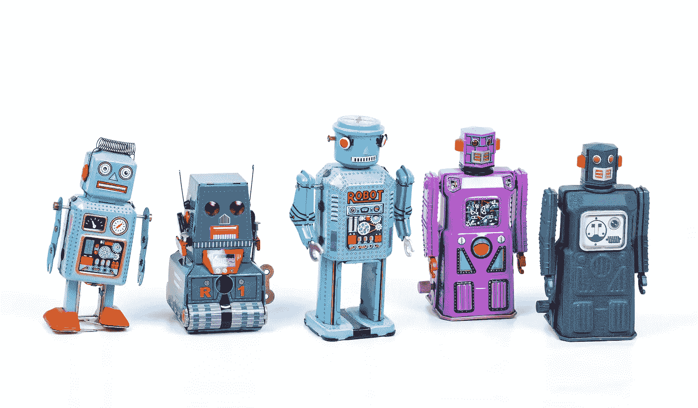

照片由[埃里克·克鲁尔](https://unsplash.com/@ekrull?utm_source=unsplash&utm_medium=referral&utm_content=creditCopyText)在 [Unsplash](https://unsplash.com/collections/10621375/medium-ejcuhcdfwrs?utm_source=unsplash&utm_medium=referral&utm_content=creditCopyText) 上拍摄

在这个系列文章中，我们将我们的课程设置为构建一个 9 步机器学习(ML)管道，并使用 Docker 和 Luigi 将其自动化。

1.  理解、清理和格式化数据
2.  探索性数据分析
3.  特征工程和预处理
4.  设置评估指标并建立基线
5.  基于评估度量选择 ML 模型
6.  对所选模型执行超参数调整
7.  训练和评估模型
8.  解释模型预测
9.  得出结论并记录工作

由于这个管道，我们构建了我们的 ML 解决方案，并将其命名为 ***葡萄酒评级预测器*** ，因为我们试图使用样本数据集[来推断用*点*表示的葡萄酒质量。在第一篇文章](https://github.com/cereniyim/Wine-Rating-Predictor-ML-Model/blob/master/data_root/raw/wine_dataset.csv)的[中，我们将葡萄酒评级预测器的要求定义为:](/building-an-automated-machine-learning-pipeline-part-one-5c70ae682f35?source=friends_link&sk=8de05327eedb3d0dadcfa4b1a8e8cc75)

> **-可以理解**因为我们的观众可能对统计学和 ML 了解有限。
> 
> **-高性能**因为完整的生产数据集可能有数百万行。
> 
> **-自动化**，可以在任何生产系统上运行，不需要专门的配置和设置。

到目前为止，我们已经满足了**的可理解性**并解决了**的性能**——在某种程度上:

*   我们选择了一个**可理解的**模型，随机森林回归器，作为葡萄酒评级预测器的底层 ML 算法。此外，我们已经在第二篇文章和第三篇文章中解释了随机森林回归器的工作原理及其超参数[。](/building-an-automated-machine-learning-pipeline-part-two-1d3c86e6fe42?source=friends_link&sk=a005d5ead7a844adb7819403ddc6dc0e)
*   我们通过对随机森林回归器执行超参数调优，构建了一个**性能**模型。尽管如此，我们仍然有它的空间。

今天，我们将戴上软件工程师的帽子，解决最后一个需求— **自动化。我们将从 ML 管道中采取以下步骤，在 Docker 容器上运行这些步骤，并将它们与 Luigi 任务连接起来。(不要担心，我们将在整篇文章中详细阐述它们🙂)**

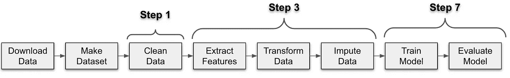

ML 管道的自动化流程

如果你已经注意到，我们有两个额外的步骤，因为一个典型的现实世界的 ML 管道开始于从一个源获取数据。此外，我们包括了训练-测试数据集分割，其余的是 ML 管道的已知步骤。

为了运行上面的流程，我们将首先查看 Docker 和 Luigi，并理解它们在本系列文章的上下文中的用法。因此，我们将从解释这些工具及其必要元素开始。

然后，我们将使用这些工具来连接这些点。最终，我们将把这些碎片放在一起，运行流程，这将完成我们的自动化任务！

1.  什么是 Docker，它是如何用于葡萄酒等级预测的？
2.  什么是 Luigi，为什么选择它作为编排工具？
3.  把 Docker 和 Luigi 的碎片放在一起
4.  运行和自动化管道！

您可以在这里找到 GitHub 资源库:

[](https://github.com/cereniyim/Wine-Rating-Predictor-ML-Model) [## cereniyim/葡萄酒评级预测模型

### 在这个项目中，我为一个在线葡萄酒卖家构建了一个葡萄酒评级预测器。这款葡萄酒预测器旨在显示良好的…

github.com](https://github.com/cereniyim/Wine-Rating-Predictor-ML-Model) 

在我们开始之前，还有一个免责声明:

> **免责声明:**库的结构和`download_data.py`、`util.py`、`docker-clean.sh`、`docker-compose.yml`文件提供给我作为代码挑战的基础。剩下的代码是我写的。

# 1.什么是 Docker，它是如何用于葡萄酒等级预测的？

## Docker 是什么？

[维基百科](https://en.wikipedia.org/wiki/Docker_(software))对 Docker 的官方定义如下:

> Docker 是一套平台即服务产品，它使用操作系统级虚拟化来交付名为**容器**的软件包中的软件。

我将它定义为为你的应用程序/软件/数据科学/ML 项目创建虚拟环境，这样它可以在任何有 Docker 的系统上无缝运行。

## **我们如何用 Docker 创建虚拟环境？**

经由**容器**。它们是运行您的应用程序的独立虚拟环境，对于我们的情况，是 ML 解决方案。

## 我们如何创建 Docker 容器？

来自**图像**。它们是用于创建容器的模板。它们包含关于底层操作系统、环境和库的信息，以及版本。

## 我们如何创建 Docker 图像？

通过阅读来自**档案的指令。**它是一组用户可以在命令行上调用来创建图像的指令和命令。你可以用`docker build Dockerfile -t <image_name>`命令在你的系统中创建一个本地镜像。

## 图像和容器是如何连接的？

**容器**是**图像**的运行实例。运行映像时，您会创建一个容器，它是一个隔离的环境。

## 我们是如何使用 Docker 构建葡萄酒评级预测器的？

我们使用 Docker 构建虚拟环境并管理库的依赖关系，这样我们就可以无缝地运行流程。下面的 ***自动化流程*** 被设计成每个盒子在一个单独的 Docker 容器上运行。

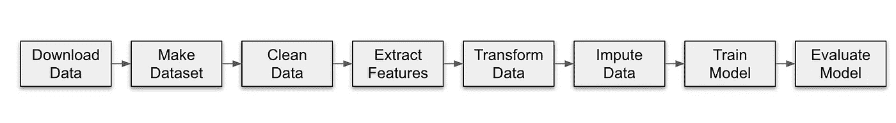

自动化流程


葡萄酒等级预测库的结构

我相信你已经注意到了存储库中一些我们还没有提到的目录和文件。您可以将`download_data`、`make_dataset`、`clean_data`、`extract_features`、`transform_data`、`impute_data`、`train_model`和`evaluate_model`目录视为自动化流程中盒子的边界，该流程包含 docker 文件和 Python 文件形式的源代码。

在看如何创建 Dockerfile 之前，我们先来了解一下`base_docker`在这里的用法。

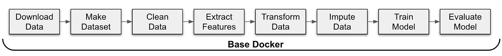

在自动化流程中使用基本 Docker

自动化流程的每一步都在一个单独的容器上运行。然而，它们是用 Python 编写的模块，它们之间唯一的区别是使用的库。因此，`base_docker`用于指定公共环境变量并安装所需的 Python 版本和库。它也有助于葡萄酒评级预测器的性能，只需安装一次所需的软件包，而不是每次都安装在单独的容器上。

## 如何写 Dockerfile 文件

当创建 docker 文件时，就像在您的机器上创建本地环境一样开始执行这些步骤。考虑到您的目标是使用 Python 部署 ML 解决方案，您可以在 [Docker Hub](https://hub.docker.com/search?q=python&type=image) 中的现有 Python 映像之上构建您的映像。这里很重要的一点是[选择一个适合你情况的现有 Python 图像](https://pythonspeed.com/articles/base-image-python-docker-images/)，因为有几个版本和大小可供选择。

```
FROM python:3.7-slim
ENV LC_ALL=C.UTF-8
ENV LANG=C.UTF-8
ENV PYTHONPATH=/opt/orchestrator:$PYTHONPATH

COPY requirements.txt /opt/base_docker/

RUN pip install -r /opt/base_docker/requirements.txt

WORKDIR /opt/base_docker/
```

选择了`slim`变量，并指定了 Python 版本`3.7`，与我的本地系统中的 Python 版本相同。

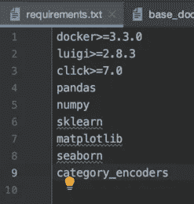

requirements.txt 截图

`ENV`命令用于更新容器安装的底层操作系统的`PATH`环境变量(对于我们的例子是`Python 3.7-slim`)。

带有`requirements.txt`中提到的版本的库被复制并与`pip_install`一起安装。除了前面提到的 Python 库之外，还安装了`click`——稍后将详细介绍它的用法。

作为最后一条指令，Docker 容器的工作目录用`WORKDIR` 命令定义。

现在，我们的`base_docker`已经准备好了，从自动化流程中探索任何**docker 文件**就足够了，因为所有其他**docker 文件**都是用相同的逻辑编写的。这里有一个来自`clean_data`的例子:

```
FROM code-challenge/base-dockerCOPY . /opt/clean_data/

WORKDIR /opt/clean_data/
```

现在我们的基地形象变成了`base_docker`。复制`clean_data`目录中的每个文件，并创建 Docker 容器的工作目录。

是时候看看 Spotify 心爱的 Luigi 了！

# 2.什么是 Luigi，为什么选择它作为编排工具？

## 什么是路易吉？

[来自文件](https://luigi.readthedocs.io/en/stable/)的官方定义如下:

> Luigi 是一个 Python 包，可以帮助您构建批处理作业的复杂管道。它处理依赖关系解析、工作流管理、可视化、处理故障、命令行集成等等。

它基本上是一个编排工具，将许多任务缝合在一个有向无环图(DAG)结构中:

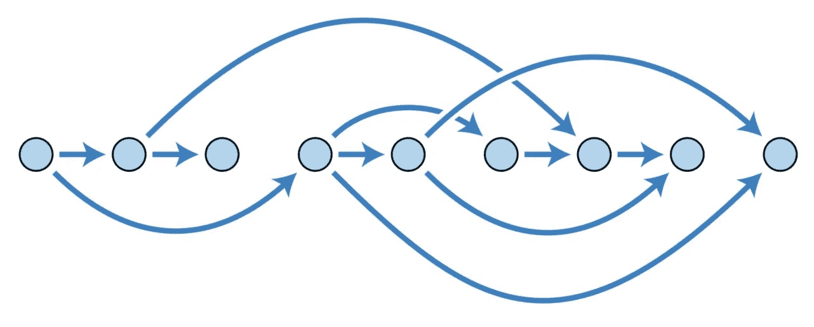

有向无环图示例。图片来源:[维基百科](https://en.wikipedia.org/wiki/Directed_acyclic_graph)

## 为什么选择它作为编排工具？

当你构建一个 ML 解决方案，随着规模的增长，这很容易变得复杂和混乱。Luigi 是一个健壮的工作流管理工具，可以防止混乱和复杂。

## Luigi 如何作为一个编排工具工作？

Luigi 有两个基本构件:**任务**和**目标**

## 什么是 Luigi 任务？

工作流的步骤是**任务**，通常是一个单独的工作单元，在这里完成计算。Luigi 工作流建立在任务之上。

## Luigi 任务是如何连接的？

每个任务都与一个**目标**相关联。目标可以是文件、工作流中的检查点或任务生成的任何类型的**输出**。

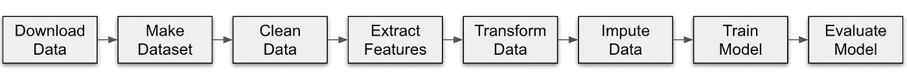

自动化流程中的每一步都是一项任务

我们正在转储`data_root`中每个任务生成的输出:

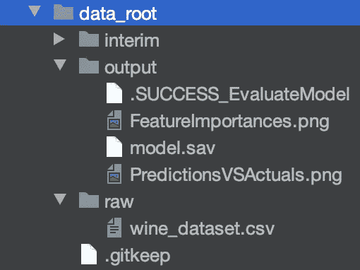

在流程中，除了初始任务`download_data`之外，每个任务都依赖于前一个任务的输出。每个文件都作为一个`Parameter`传递，这样它就可以被工作流中的后续步骤使用。

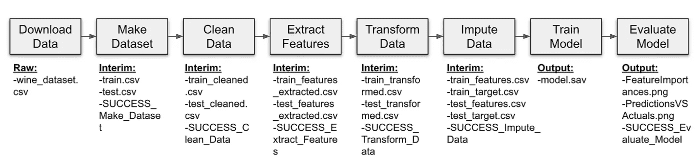

每个任务产生的输出

在设计工作流时，Luigi 推荐原子结构:每个任务应该有一个单独的文件作为输出，就像在`download_data`和`train_model`任务中一样。

对于其余的任务，我们用`SUCCESS`旗模拟原子性。当我们在训练和测试数据集上执行计算时，在将输出文件转储到目录中之后，我们创建一个`SUCCESS`标志作为任务的输出。这样，下一个任务只检查是否存在一个`SUCCESS`标志。

## 我们如何定义任务依赖关系？

任务依赖是用`requires()`方法定义的。以下是 Luigi 文档中的任务概要:

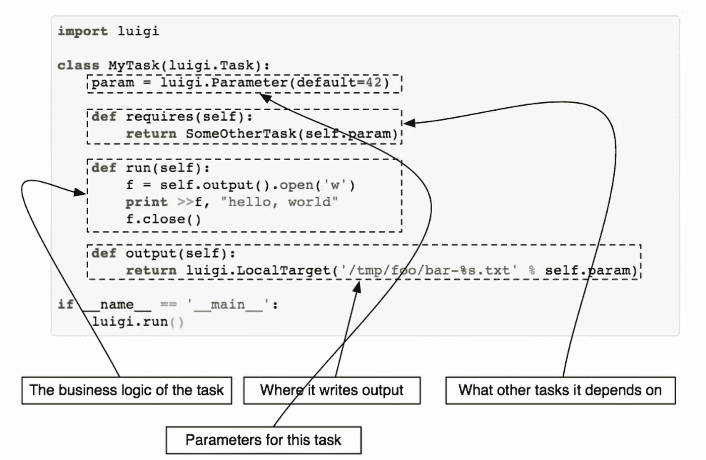

Luigi 任务的概要。图片来源: [luigi.readthedocs.io](https://luigi.readthedocs.io/en/stable/tasks.html)

对于我们的例子，任务依赖是显而易见的，因为我们定义了一个线性的自动化流程。

## 我们如何运行 Luigi 工作流？

不幸的是，Luigi 没有触发机制。如果要运行 Luigi 工作流，可以使用命令行指定模块名称和项目目录中的最后一项任务:

```
luigi --module <modul_name> <task_name> 
```

当工作流被触发时，Luigi 检查上一步的输出是否存在。如果没有，那么它向后检查前一步骤的输出是否存在。对于我们的例子，这将是`train_model`、`impute_data`、`transform_data`、`extract_features`、`clean_data`、`make_dataset`和`download_data`。

如果来自流程中任何一步的任务输出存在，Luigi 将从它离开的地方继续流程。这是一个非常有用和重要的特性，可以防止 ML 管道在包含部分数据时崩溃。

现在我们知道了 Luigi 和 Docker 的基本元素，我们可以继续完成这幅画了！

# 3.把 Docker 和 Luigi 的碎片放在一起

我们将把 Docker 和 Luigi 的片段放在`docker-compose.yml`和`orchestrator`目录中。

由[数据收入的令人敬畏的工程师](https://www.datarevenue.com/en-our-team#the-team)提供的效用函数已经使我能够连接 Docker 和 Luigi 的片断。`util.py`中可用的函数和类在连接 Docker 和 Luigi 的葡萄酒评级预测器中发挥了重要作用。例如，`DockerTask` —我们作为参数在任务之间传递的对象— [通常在 Luigi](https://luigi.readthedocs.io/en/stable/parameters.html) 中不能作为参数使用。

首先，让我们看看`orchestrator`目录中的`task.py`，在那里我使用实用程序构建了自动化流程。那么，让我们来理解一下`docker-compose.yml`的目的。

## 在 Task.py 中定义任务

*   **Luigi 参数:**每个任务都以一个 Luigi `Parameter`对象开始，我们在其中指定任务的输入/输出文件和目录。例如，我们使用测试集评估 ML 模型的最后一个任务`EvaluateModel`将`test_features`、`test_target`和经过训练的模型文件(`model.sav`)作为输入 Luigi `Parameter`。由于这个任务创建了多个文件作为输出(`PredictionsVSActuals.png`和`FeatureImportances.png`)，我们还定义了一个`SUCCESS`标志来模拟原子性。
*   **Image:** 我们定义使用哪个 Docker 图像来创建容器。
*   **依赖任务:**如果有依赖任务，在这里用`requires()`方法定义。`EvaluateModel`的从属任务是`TrainModel`。
*   **命令:**容器要执行的命令。此处命令用相关参数调用`evaluate_model.py`中可用的源代码。
*   **输出:**`output()`方法返回一个或多个目标对象(输出文件或`SUCCESS`标志)

回想一下，流程中每一步的源代码都以 Python 文件的形式存在于各自的目录中。我们来看看`train_model`的源代码:

在定义了助手函数`convert_features_to_array`和`convert_target_to_array`之后，我们定义了必要的点击命令。

[点击](https://click.palletsprojects.com/en/7.x/)，如官方文件中所定义:

> 这是一个 Python 包，用于以可组合的方式用尽可能少的代码创建漂亮的命令行界面。


如何使用点击命令。图片来源:[click.palletsprojects.com](https://click.palletsprojects.com/en/7.x/)

我们使用 Click 从命令行向 python 脚本传递参数。最后，我们使用我们在训练数据集上的 ***对所选模型步骤*** 执行超参数调整中决定的微调参数来训练模型。最后，我们将训练好的模型保存在`model.sav`文件中作为输出。

## Docker 编写器的使用

[根据 Docker 文档](https://docs.docker.com/compose/)编写 Docker 的官方定义如下:

> Compose 是一个定义和运行多容器 Docker 应用程序的工具。使用 Compose，[您可以使用一个 YAML 文件](/5-reasons-to-use-yaml-files-in-your-machine-learning-projects-d4c7b9650f27)来配置您的应用程序的服务。然后，只需一个命令，您就可以从您的配置中创建并启动所有服务。

这个定义适合我们的情况，因为我们在包括`base_docker`在内的 9 个容器上运行自动化流程。你可以在这里阅读更多关于`docker-compose`T20 的用法和命令。

这里对我们来说重要的部分运行 Luigi 任务的命令写在这里，所以当我们通过`docker-compose`运行容器时，它将通过`luigi — module task EvaluateModel-scheduler-host luigiid`命令触发自动化流程。

# 4.运行和自动化管道！

这是关键时刻！我们将运行自动化流程，并自动化 9 步 ML 管道。这是最后一步，再坚持一分钟😉

## **1。打开您的终端并导航到项目目录**

对我来说这是:

```
cd GitHub/Wine-Rating-Predictor-ML-Model
```

## 2.构建 Docker 容器

我们将使用一个 shell 脚本来构建 Docker 容器`build-task-images.sh`，而不是一个接一个地构建多个 Docker 容器

```
./build-task-images.sh 0.1
```

下面的消息显示容器构建成功。因此，我们可以触发自动化流程了。

```
**Successfully tagged code-challenge/evaluate-model:0.1**
```

## 4.从 Docker 编写触发自动化流程:

我们将通过以下方式触发工作流

```
docker-compose up orchestrator
```

在写这个命令时，Luigi 检查每个任务是否完成，并输出以下信息:

```
**Checking if EvaluateModel(
    no_remove_finished=False,
    in_test_features_csv=/usr/share/data/interim/test_features.csv,
    in_test_target_csv=/usr/share/data/interim/test_target.csv,
    in_trained_model=/usr/share/data/output/model.sav,
    out_dir=/usr/share/data/output/, 
    flag=.SUCCESS_EvaluateModel)** **is complete****Checking if TrainModel(
   no_remove_finished=False,
   in_train_features_csv=/usr/share/data/interim/train_features.csv,
   in_train_target_csv=/usr/share/data/interim/train_target.csv,
   out_dir=/usr/share/data/output/)** **is complete****Checking if ImputeData(
    no_remove_finished=False,
    in_train_csv=/usr/share/data/interim/train_transformed.csv,
    in_test_csv=/usr/share/data/interim/test_transformed.csv,
    out_dir=/usr/share/data/interim/, 
    flag=.SUCCESS_ImputeData)** **is complete****Checking if TransformData( 
  no_remove_finished=False,
  in_train_csv=/usr/share/data/interim/train_features_extracted.csv,
  in_test_csv=/usr/share/data/interim/test_features_extracted.csv,
  out_dir=/usr/share/data/interim/, 
  flag=.SUCCESS_TransformData)** **is complete****Checking if ExtractFeatures(
    no_remove_finished=False,
    in_train_csv=/usr/share/data/interim/train_cleaned.csv,
    in_test_csv=/usr/share/data/interim/test_cleaned.csv,
    out_dir=/usr/share/data/interim/, 
    flag=.SUCCESS_ExtractFeatures)** **is complete****Checking if CleanData(
    no_remove_finished=False,
    in_train_csv=/usr/share/data/interim/train.csv,
    in_test_csv=/usr/share/data/interim/test.csv,
    out_dir=/usr/share/data/interim/, 
    flag=.SUCCESS_CleanData)** **is complete****Checking if MakeDatasets(
    no_remove_finished=False,
    in_csv=/usr/share/data/raw/wine_dataset.csv,
    out_dir=/usr/share/data/interim/, 
    flag=.SUCCESS_MakeDatasets)** **is complete****Checking if DownloadData(
    no_remove_finished=False, 
    fname=wine_dataset, 
    out_dir=/usr/share/data/raw/,
    url=**[**https://github.com/datarevenue-berlin/code-challenge-2019/releases/download/0.1.0/dataset_sampled.csv**](https://github.com/datarevenue-berlin/code-challenge-2019/releases/download/0.1.0/dataset_sampled.csv)**)** **is complete**
```

然后一个接一个地运行任务。对我们来说另一个重要的信息是:

```
**INFO:evaluate-model:Mean square error of the model is: 4.95**
```

成功运行后，您会看到一个🙂：

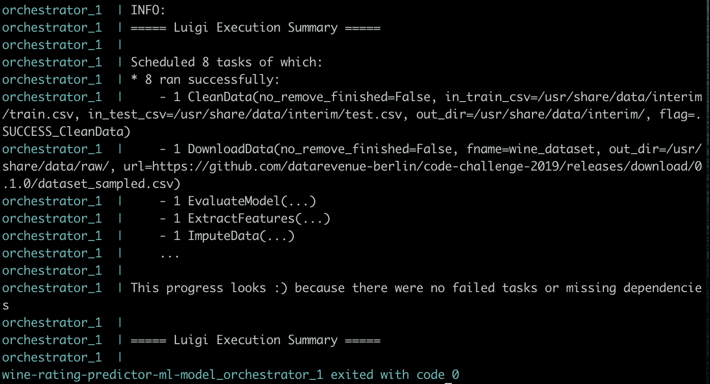

**奖励点:让我们看看 Luigi 是如何从**
的流程中恢复的。假设您准备了训练数据集并运行了自动化流程，然后您将从训练模型开始构建接下来的步骤。Luigi 不会重复成功运行之前的步骤，在这种情况下只会运行`TrainModel`和`EvaluateModel`任务。

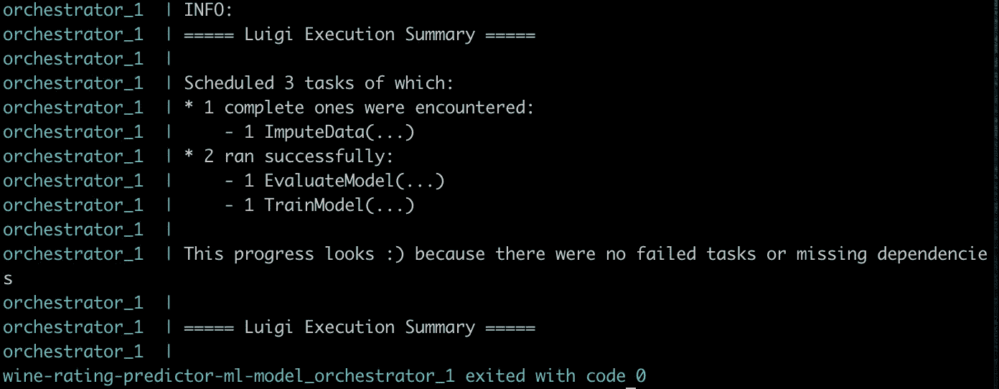

# 结论

我会说哇！

这是一个跨越 4 篇文章和一个月⛵️的旅程

我们从头开始，通过第一、第二和第三篇文章分析了 9 步 ML 管道的每一步。

[](/building-an-automated-machine-learning-pipeline-part-one-5c70ae682f35) [## 构建自动化机器学习管道:第一部分

### 数据清理、探索性数据分析和特征工程步骤

towardsdatascience.com](/building-an-automated-machine-learning-pipeline-part-one-5c70ae682f35) [](/building-an-automated-machine-learning-pipeline-part-two-1d3c86e6fe42) [## 构建自动化机器学习管道:第二部分

### 设置评估指标&建立基线、选择算法和执行超参数调整…

towardsdatascience.com](/building-an-automated-machine-learning-pipeline-part-two-1d3c86e6fe42) [](/building-an-automated-machine-learning-pipeline-a74acda76b98) [## 构建自动化机器学习管道

### 训练和评估模型，解释模型结果和最终结论

towardsdatascience.com](/building-an-automated-machine-learning-pipeline-a74acda76b98) 

在这最后一篇文章中，我们介绍了 Docker 和 Luigi 的相关元素，并解释了它们对于葡萄酒评级预测器的重要性和用途。我们完成了我们的综合管道的最后一个缺失部分，并对 ML 解决方案进行了试运行——就像它在生产系统上运行一样。

## 特别感谢

我想是时候感谢我的另一半了。在我的数据科学探险中，他是我最宝贵的导师、编辑和学习伙伴！

他帮助我克服了转行的起起落落。此外，我要感谢他对我完成这个系列文章的支持，以及他为我提供的勇气。谢谢你，亲爱的❤️

感谢阅读🙂请随意使用这个管道、代码和[库](https://github.com/cereniyim/Wine-Rating-Predictor-ML-Model)用于你自己的项目。

对于评论或建设性的反馈，您可以通过回复、 [Twitter](https://twitter.com/cereniyim) 或 [Linkedin](https://www.linkedin.com/in/ceren-iyim) 联系我！

在我们走之前，我还想分享一些我用来准备这个项目的有用资源。下一篇文章再见👋

## **了解 Docker 和 Luigi 更多信息的建议资源:**

*   [通过](https://www.datarevenue.com/en-blog/how-to-scale-your-machine-learning-pipeline)[数据收入](https://www.datarevenue.com/)来扩展你的机器学习管道
*   [面向初学者的 Docker:由](https://www.youtube.com/watch?v=zJ6WbK9zFpI&t=659s)[kode cloud](https://www.youtube.com/channel/UCSWj8mqQCcrcBlXPi4ThRDQ)提供的完整课程
*   [用你的机器学习模型](/build-a-docker-container-with-your-machine-learning-model-3cf906f5e07e)构建一个 Docker 容器 [Tina Bu](https://medium.com/u/e2511f99cdfc?source=post_page-----787cdc50a12d--------------------------------)
*   [路易吉文档](https://luigi.readthedocs.io/en/stable/index.html)
*   [Docker 文档](https://docs.docker.com/get-started/)
*   [用 Luigi 和 Jupyter 的笔记本构建数据科学管道](https://intoli.com/blog/luigi-jupyter-notebooks/)作者 [Mattia Ciollaro](https://mattiaciollaro.github.io/)