# 构建自动化机器学习管道:第一部分

> 原文：<https://towardsdatascience.com/building-an-automated-machine-learning-pipeline-part-one-5c70ae682f35?source=collection_archive---------21----------------------->

## [机器学习](https://towardsdatascience.com/machine-learning/home)

## 数据清理、探索性数据分析和特征工程步骤

*   第 1 部分:理解、清理、探索、处理数据(你现在正在阅读)
*   [第 2 部分:设置指标和基线，选择和调整模型](/building-an-automated-machine-learning-pipeline-part-two-1d3c86e6fe42?source=friends_link&sk=a005d5ead7a844adb7819403ddc6dc0e)(现场！)
*   [第三部分:培训、评估和解释模型](https://medium.com/p/building-an-automated-machine-learning-pipeline-a74acda76b98?source=email-287e9909d3b5--writer.postDistributed&sk=1790d8dd404126a45828c3905f47432c)(现场！)
*   第 4 部分:使用 Docker 和 Luigi 自动化您的管道。)


劳拉·佩鲁奇在 [Unsplash](https://unsplash.com?utm_source=medium&utm_medium=referral) 上拍摄的照片

在我的数据科学学习之旅中，我通过阅读关于走向数据科学的文章所学到的东西与我从在线课程和各种编码挑战中学到的一样多。跟踪这些不同的学习资源，伴随着他们对机器学习(ML)的解释，对我帮助很大。今天，我将带着我在整个旅程中提炼出的对 ML 应用程序的部分观点，开始一个系列文章。它将有希望展示如何用初学者友好的语言和结构构建一个自动化的 ML 管道。

我们将遵循一个直观的 ML 管道来构建 ***一个预测器来评定葡萄酒质量*** :

1.  理解、清理和格式化数据
2.  探索性数据分析
3.  特征工程和预处理
4.  设置评估指标并建立基线
5.  基于评估度量选择 ML 模型
6.  对所选模型执行超参数调整
7.  训练和评估模型
8.  解释模型预测
9.  得出结论并记录工作

第一篇文章涵盖了步骤 1、2 和 3。这篇文章背后的代码可以在这个笔记本里找到[。本系列的第二篇和第三篇文章将涵盖整个管道。](https://github.com/cereniyim/Wine-Rating-Predictor-ML-Model/blob/master/notebooks/WineRatingPredictor-1.ipynb)

在我们构建好管道之后，第四篇文章将关注如何用 [Docker](https://www.docker.com/) 和 [Luigi](https://luigi.readthedocs.io/en/stable/) 自动化 ***葡萄酒评级预测器*** 。这一部分尤其令我兴奋，因为它向我介绍了一些概念和工具，让我了解了 ML 解决方案是如何在生产系统上运行的。

> 声明:这种自动化的核心结构和实用程序来自于一个[编码挑战](https://github.com/datarevenue-berlin/code-challenge-2020)，这是我最近在一家名为 [Data Revenue](https://www.datarevenue.com/) 的神奇公司接受 ML 工程师面试过程的一部分。我没有得到这份工作，因为他们在寻找一个在工程方面更有重点和经验的人，而我在科学方面更有经验。最终，我戴上了软件工程师的帽子，在面试过程中学到了很多。

GitHub 上为没有耐心的人提供了完整的项目:

[](https://github.com/cereniyim/Wine-Rating-Predictor-ML-Model) [## cereniyim/葡萄酒评级预测模型

### 在这个项目中，我为一个在线葡萄酒卖家构建了一个葡萄酒评级预测器。这款葡萄酒预测器旨在显示良好的…

github.com](https://github.com/cereniyim/Wine-Rating-Predictor-ML-Model) 

# 问题定义和目标:

在这个项目中，我们提供了一个样本数据集。在现实世界的场景中，人们可能从网上资源如 [winemag](https://www.winemag.com/wine-ratings/) 中获得(也许[scrap](/web-scraping-is-now-legal-6bf0e5730a78))这些数据。

**该项目的目标是建立*一个葡萄酒评级预测器*使用样本数据集来显示良好的预测是可能的，也许是作为一个更大项目的概念证明。**

我们将使用葡萄酒评级预测器的结果来确认 ML 应用程序是商业问题的有效解决方案，例如为卖家优化葡萄酒组合。

我们应该永远记住，数据科学中的“科学”是有目的的，最终是为非科学家服务的。一个典型的项目有一些隐含的基本需求。

我们的葡萄酒评级预测器应该是**可以理解的**，因为我们的观众可能对统计学和 ML 了解有限。此外，它应该是**高性能的**，因为完整的生产数据集可能有数百万行。最后，它应该是自动化的，可以在任何生产系统上运行，不需要特殊的配置和设置。

# 在开始之前

这个项目的数据可以在存储库中的`[data_root/raw/wine_dataset](https://github.com/cereniyim/Wine-Rating-Predictor-ML-Model/blob/master/data_root/raw/wine_dataset.csv)`中找到。现在，我们将使用其中的 90%作为训练集，剩下的 10%作为测试集。它们在`data_root/interim`中都有`[train.csv](https://github.com/cereniyim/Wine-Rating-Predictor-ML-Model/blob/master/data_root/interim/train.csv)`和`[test.csv](https://github.com/cereniyim/Wine-Rating-Predictor-ML-Model/blob/master/data_root/interim/test.csv)`。

我们将使用 Python 3.7，并将需要本笔记本中的以下库:

# 1.理解、清理和格式化数据

在这一步中，我们将熟悉数据集，理解数据集传达的内容，并通过删除冗余的行和列来清理数据集。

让我们将训练和测试数据集加载到数据框中，并查看训练数据集的一些行:

```
train = pd.read_csv("../data_root/interim/train.csv") 
test = pd.read_csv("../data_root/interim/test.csv")
train.sample(5)
```

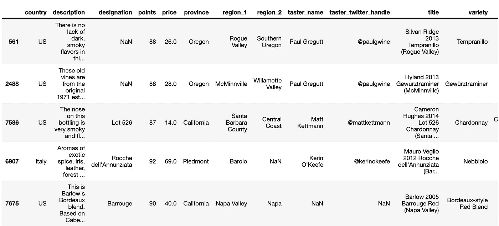

数据集中有一些空行，我们只有两个数字变量:*点数*和*价格*。

点数是我们试图预测的因变量，并将目标称为*。其余的是可用于确定目标的独立变量，将被称为 ***特征*** 。*

*我们试图掌握自变量和因变量之间的关系，并使用这种关系来生成预测，这使得葡萄酒评级预测器成为一个 ***监督回归机器学习模型*** :*

*   ****监督* :** 数据集包括葡萄酒评级(标为*分*)和可用于确定*分*的自变量。*
*   ****回归* :** 我们的目标变量——*点*由 80 到 100 的连续整数组成。*

*如果您曾经考虑过在超市购买哪种葡萄酒，大多数列名都是不言自明的。然而，我认为理解一种特定的葡萄酒如何获得*分*和特定领域的特征是很重要的。*

*品酒师给葡萄酒打分。同一个品酒师可能会给一款葡萄酒不同的分数。当品酒师给一款酒打分时，她/他还会提供一份关于该酒的注释和味道的描述。*

**标志*是葡萄园的名称，*region _ 1*&*region _ 2*特征描述了葡萄酒的葡萄生长的地方。这是一瓶巴洛 2005 巴鲁格红葡萄酒的样子:*

*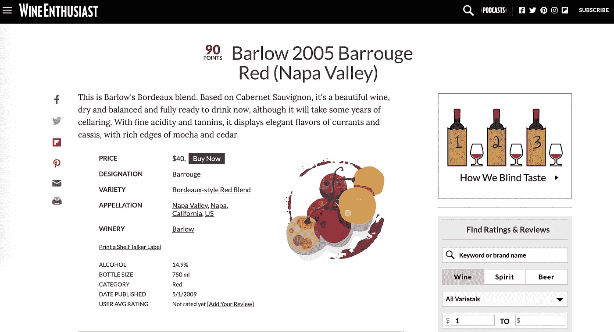*

*图片来源: [Winemag](https://www.winemag.com/buying-guide/barlow-2005-barrouge-red-napa-valley/) 上巴洛 2005 巴鲁格红的截图*

*现在，让我们看看训练和测试数据集的数据类型和非空(非 null)数:*

```
*train.info()*
```

*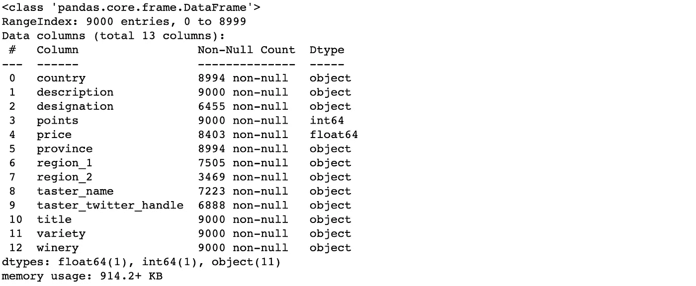*

```
*test.info()*
```

*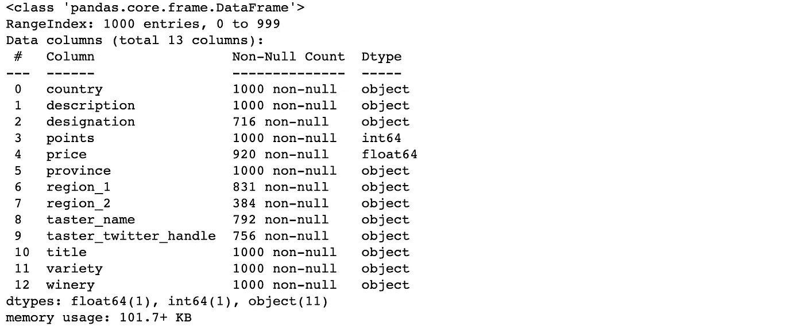*

*这是一个有趣的数据集，因为 90%的特征是 ***【分类】—*** 变量，它们位于*对象*数据类型中。ML 模型只能处理数字数据和非空值。因此，我们将在 ***特征工程&预处理*** 中开发一些策略来处理我们模型中的分类数据和缺失值。*

## ***1.1。数据集的缺失值:***

*下面的函数将使我们能够观察每个特性的缺失值的百分比。*

*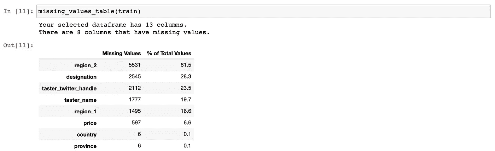**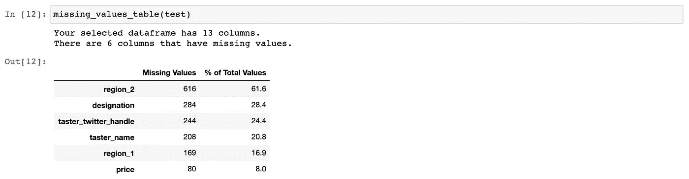*

*缺失值超过 50%的特征不太可能为我们的模型提供重要信息。因此， *region_2* 将从两个数据集中删除。*

*在此示例数据集中，目标值没有缺失值。如果我们在目标中有缺失的值，我们会删除所有缺失的值，以免扭曲目标的现有分布。*

## ***1.2。非数字特征的基数:***

****基数*** 是一个分类特征所具有的唯一值的数量。让我们来看看我们的训练数据集:*

```
*object_columns = (train
                  .select_dtypes(include="object")
                  .columns)

**for** column **in** object_columns:
    print("**{}** has **{}** unique values."
          .format(column, 
                  train[column]
                  .nunique()))*
```

*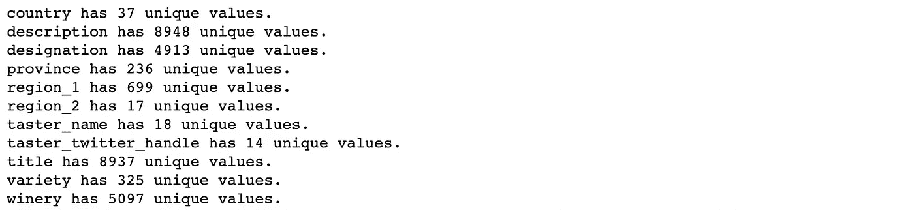*

*我们可以推断一个特征有一个*

*   ****高基数*** 如果在 9000 行中有 1000 行以上:*描述*，*称号*，*头衔*和*酒厂。**
*   ****中等基数*** 如果超过 100 行:*省*、 *region_1* 和*品种*。*
*   ****低基数*** 如果少于 100 行:*国家*，*地区 _2，* *taster_name* 和 *taster_twitter_handle。**

*当我们训练模型时，高基数特性可能会引起问题。即使我们将分类特征的每个唯一值转换成新特征，[它们也可能带来维数灾难](https://pkghosh.wordpress.com/2017/10/09/combating-high-cardinality-features-in-supervised-machine-learning/)。因此，我们将使用高基数要素来添加新要素，然后将它们从数据集中移除。*

*请记住，这是一个样本数据集。因此，我们不能保证在训练模型时已经看到了每个分类特征的所有可能值。如果我们的葡萄酒评级预测器在测试集中遇到一个新值，它将抛出错误。这就是为什么我们要在 ***特征工程&预处理中重新审视这一点。****

## ***1.3。移除共线特征:***

*如果两个变量之间存在线性关联，则称它们为 ***共线*** 。在分类特征的情况下，如果它们提供相同的信息来预测目标，则它们被称为 ***共线*** 。*

*共线特征降低了测试集的泛化性能和模型的可解释性。回想一下，我们对葡萄酒评级预测器的要求之一是可解释性。*

*在我们的样本数据集中， *taster_name* 和 *taster_twitter_handle* 表示共线性。在确保 *taster_twitter_handle* 的所有值都被 *taster_name* ( [此处未显示，但在笔记本](https://render.githubusercontent.com/view/ipynb?commit=b3a9024c9eba68c8d3ef63ae21fcb2eb3a30e16c&enc_url=68747470733a2f2f7261772e67697468756275736572636f6e74656e742e636f6d2f636572656e6979696d2f57696e652d526174696e672d507265646963746f722d4d4c2d4d6f64656c2f623361393032346339656261363863386433656636336165323166636232656233613330653136632f6e6f7465626f6f6b732f57696e65526174696e67507265646963746f722d312e6970796e62&nwo=cereniyim%2FWine-Rating-Predictor-ML-Model&path=notebooks%2FWineRatingPredictor-1.ipynb&repository_id=257017095&repository_type=Repository#Unique-values-of-taster_name-and-taster_twitter_handle)中检查过)覆盖后，它被移除以构建一个良好且可解释的葡萄酒评级预测器。*

## ***1.4。了解&清理&格式数据:***

*到目前为止，我们已经初步了解了数据集，并发现了要移除的要素:*

*   **称号*和*酒厂*由于基数高*
*   **region_2* 由于缺失值超过 50%*
*   **taster_twitter_handle* 由于共线性*

*此外，训练集包含一些重复的行。除了上面的列表，我们将删除它们，并用下面的函数清理数据:*

```
*drop_columns = ["designation", "winery", "taster_twitter_handle", "region_2"]train_cleaned = CleanDatat(train, drop_columns, "points")
test_cleaned = CleanData(test, drop_columns, "points"*
```

*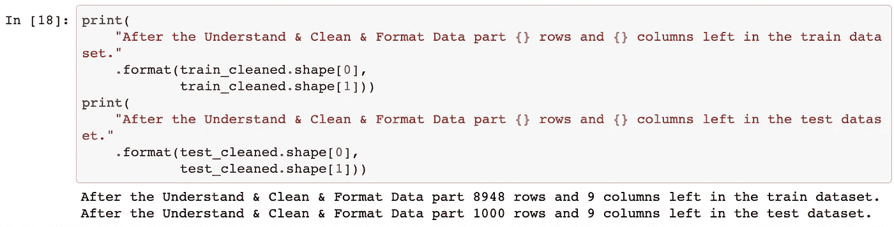*

*现在，我们将使用`train_cleaned.csv`和`test_cleaned.csv`在 ***探索性数据分析*** 中进一步可视化和探索特性和目标。*

# *2.探索性数据分析*

*探索性数据分析(EDA)是我们详细查看变量并可视化特征和目标之间关系的步骤。在这一步，我们将寻找和跟踪目标的强限定词的线索。在这一步的最后，我们将决定在 ***特征工程&预处理*** 中处理哪些特征。*

*首先，我们将检查*点*(目标)、数字特征以及它们之间的联系。然后，我们将研究低基数特性及其与目标的关系。当我们发现有价值的见解时，我们将通过 EDA 的步骤详细阐述它们。*

## ***2.1。积分分布:***

****分布*** 是对变量范围以及数据在该范围内如何分布的描述。通过绘制直方图，我们可以很容易地观察到分布情况:*

```
*figsize(10, 8)
plt.rcParams['font.size'] = 14
plot_histogram(train_cleaned, "points")*
```

*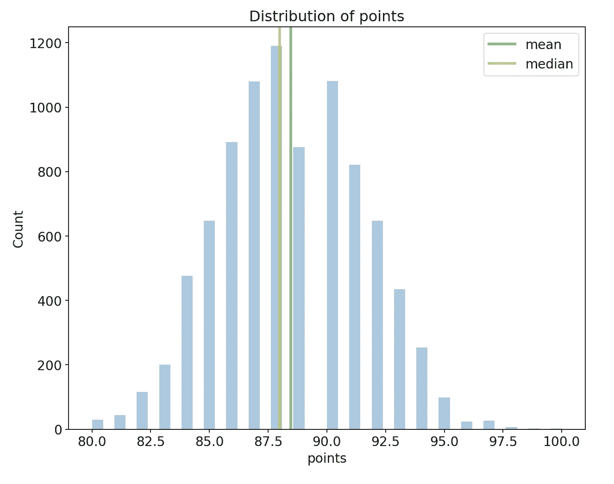*

*正如随机变量所预期的那样，点显示正态分布(分布中明显出现钟形曲线)。点数范围分布在 80 和 100 之间，平均值为 88.45，中位数为 88。此外，标准偏差——数据范围分布的度量值为 3.03，导致方差为 9.1 的平方偏差。基于正态分布，我们可以自信地说，95%的点位于 82.5–94.5 范围内。*

## ***2.2。价格分布:***

*当我们绘制*价格*的直方图时，它显示了一个模糊的画面，因为它高度右偏*(笔记本中有[)。为了得到一个合理的值，我们将在 0–200 范围内观察它:](https://render.githubusercontent.com/view/ipynb?commit=b3a9024c9eba68c8d3ef63ae21fcb2eb3a30e16c&enc_url=68747470733a2f2f7261772e67697468756275736572636f6e74656e742e636f6d2f636572656e6979696d2f57696e652d526174696e672d507265646963746f722d4d4c2d4d6f64656c2f623361393032346339656261363863386433656636336165323166636232656233613330653136632f6e6f7465626f6f6b732f57696e65526174696e67507265646963746f722d312e6970796e62&nwo=cereniyim%2FWine-Rating-Predictor-ML-Model&path=notebooks%2FWineRatingPredictor-1.ipynb&repository_id=257017095&repository_type=Repository#Distribution-of-price)**

```
**figsize(10, 8) 
plt.rcParams['font.size'] = 14
plot_histogram(train_cleaned, "price", 200) 
plt.xlim(0,200)**
```

**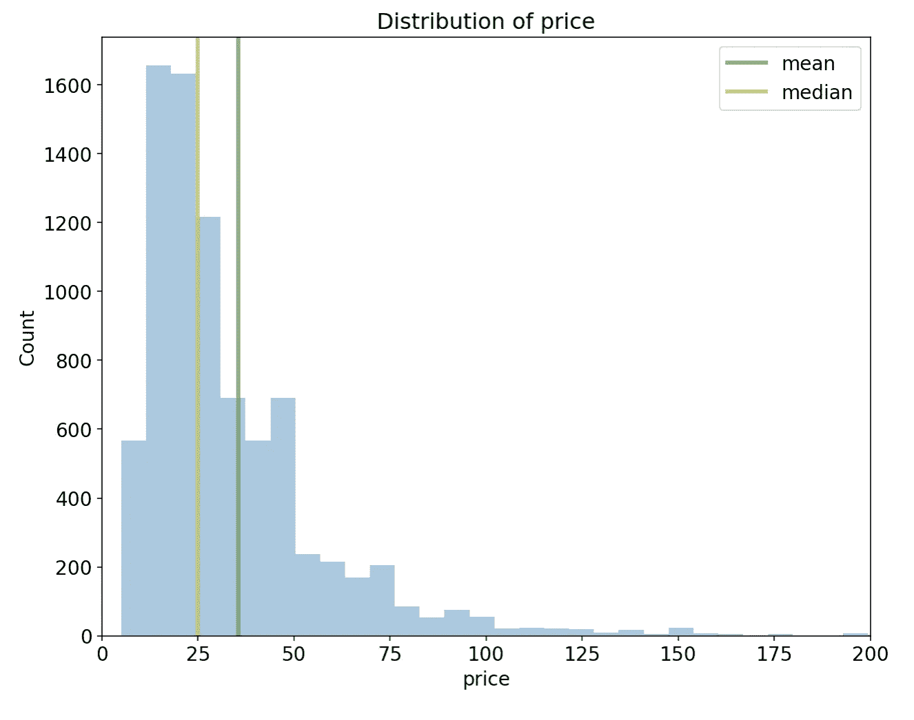**

**这仍然是一个右偏*或正偏*分布，其中右尾较长，大部分值集中在左侧。价格的中位数是 25，平均价格是 35.5。****

***为了使用*价格*作为预测值，我们需要假设收到的*点*不会引起任何价格变化。否则，这将导致[数据泄漏](https://machinelearningmastery.com/data-leakage-machine-learning/)，因为我们将在稍后的时间点包含一个预测器。这可能会破坏我们对*点*的未来预测。***

**尽管如此，假设*价格*不受品酒师分配的*点数*的影响，它是葡萄酒质量和年份的指标。因此，我们期望它成为该模型的一个基本特征。**

## **2.3.积分和国家:**

**为了可视化几个变量的关系，我们将使用 ***密度图*** ，其中我们绘制了分类特征的每个唯一值的目标分布。 ***密度图*** 可以解释为直方图的连续和平滑版本，其容易传达分布的形状。**

**为了保持图表的可解释性，我们将为出现次数超过 100 次的国家绘制*点*的分布图。**

```
**# make a list of countries that has most occurences
countries = (train_cleaned["country"]
             .value_counts())

freq_countries = list(
    countries[
        countries.values > 300]
    .index)

freq2_countries = list(
    countries[
        (countries.values <= 300) &
        (countries.values >= 100)]
    .index)**
```

```
**figsize(20, 10)
plt.rcParams['font.size'] = 14

*# plot points distribution for most frequent countries*
plt.subplot(1, 2, 1)
plot_distribution(train_cleaned, "points",
                  freq_countries, "country")

plt.subplot(1, 2, 2)
plot_distribution(train_cleaned, "points",
                  freq2_countries, "country")**
```

**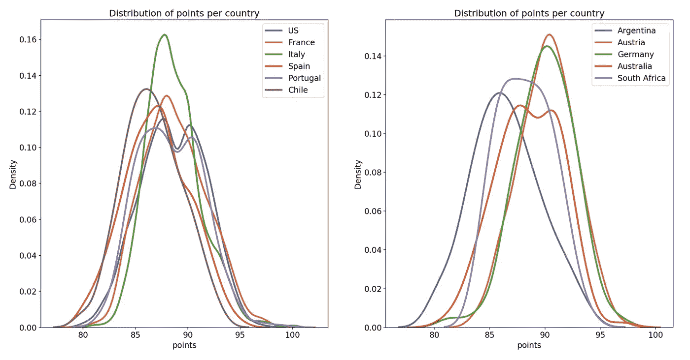**

**葡萄酒生产市场由美国、法国、意大利和西班牙主导，这从地块上很容易获得。*国家*是确定葡萄酒点数的区分特征。然而，也有一些例外:美国&葡萄牙或者奥地利&德国。**

## **2.4.不同国家的积分和价格**

**假设价格是*点数*的基本决定因素，我们将探讨*点数*和*价格*与*国家*的关系。**

```
***# create dataframe of most frequent countries*
points_freq_countries = train_cleaned[
    train_cleaned
    .country
    .isin(freq_countries)]figsize(20, 10)
plt.rcParams['font.size'] = 14

*# plot a scatterplot of Points and Price*
plt.subplot(1,2,1)
sns.scatterplot(x='price', y='points',
                hue='country', 
                data=points_freq_countries,
                alpha=0.7)
plt.xlabel("Price", size=14)
plt.ylabel("Points", size=14)
plt.title("Points vs Price for Most Frequent Countries", 
          size=16)

*# plot a scatterplot of Points and Price*
plt.subplot(1,2,2)
sns.scatterplot(x='price', y='points', 
                data=train_cleaned,
                alpha=0.7)
plt.xlabel("Price", size=14)
plt.ylabel("Points", size=14)
plt.title("Points vs Price for all Countries with price range 0-200", size=16)
plt.xlim(0,200)**
```

**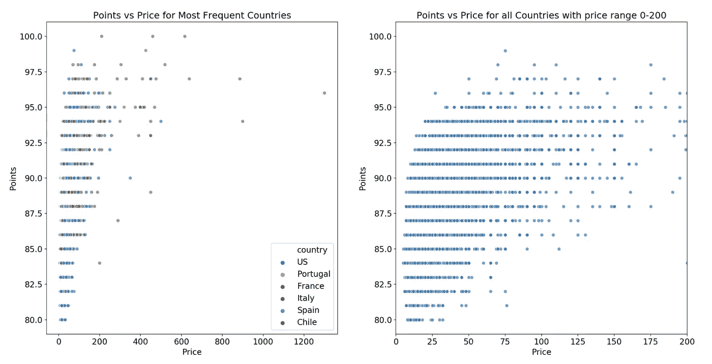**

**左侧的图表显示了在整个价格范围内，主要国家生产的葡萄酒的*点*和*价格*的关系。右边的图显示了所有国家在 0 和 200 价格范围内的点数和价格关系。**

**两个图都表明*点*和*价格*之间存在很强的正相关性，这证明*价格*是一个重要的预测指标。另一个有价值的发现是，有两种来自意大利的葡萄酒和一种来自法国的葡萄酒得到了品酒师的满分，它们的价格都超过了 200 英镑。**

## **2.5.点和品尝者姓名**

***点*，代表从品酒师处收到的特定葡萄酒的分数。因此，不同的品酒师可能对葡萄酒有不同的诠释。为了研究这一点，我们将绘制一个小提琴图。**

*****小提琴图*** 是[我最喜欢的图](/recipes-for-the-visualizations-of-data-distributions-a1527a0faf77)传达了数据形状的分布和[汇总统计](https://www.statisticshowto.com/summary-statistics/)分别是小提琴在外面，细长的长方形在里面。**

```
**figsize(14, 8)
plt.rcParams['font.size'] = 14

f = sns.violinplot(data=train_cleaned,
                   x="taster_name",
                   y="points")

f.set_xticklabels(f.get_xticklabels(),
                  rotation=90)

plt.title("Points from Different Tasters",
          size=16)**
```

**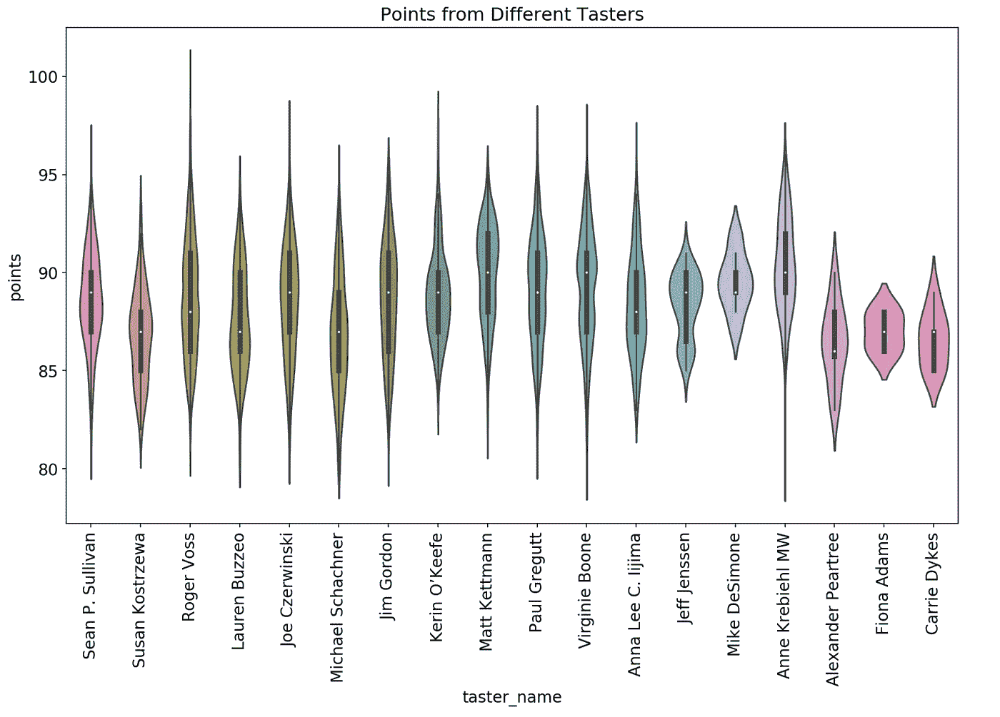**

**每个品酒师对*点数*的汇总统计和分配都是独一无二的，导致上面的小提琴不同。看这张图，我们期望它是模型的第二个最重要的预测器。**

## **2.6.探索性数据分析的结果**

**我们探讨了*积分*、*价格*、*国家*和*品酒师姓名*以及它们之间的关系。除此之外，*品种、区域 _1* 和*省份*将保留在最终特征列表中，因为:**

*   ***品种*和*区域 _1* 是区分葡萄酒中葡萄的主要因素，从而决定了葡萄酒的味道和质量**
*   ***省*结合*国*提供位置信息**

**此外，我们在*点*观察到一个正态分布并确定了它的均值和方差，这将有助于我们在**点*设置评估度量&建立基线。*** 我们预计*价格*和*品酒师姓名*是决定*点数*的两个最重要的预测因素。**

**现在，我们将继续进行期待已久的 ***特征工程&预处理*** 部分。**

# **3.特征工程和预处理**

*****特征工程*** 是从原始特征中提取和转换信息并潜在地创造出更多有用特征的过程。我们将利用我们在前面的部分中了解到的特性，并将这些信息编码到新的特性中。由于我们的特征大多是分类的，我们将在*描述*、*种类*和*标题*中搜索数字或二进制特征。**

**然后，我们将准备两个数据集，用作我们的葡萄酒评级预测器的输入。这个过程称为 ***特征预处理*** 。这是一个必要的步骤，因为 ML 模型只能处理数字数据和非缺失值。**

**建立一个好的葡萄酒评级预测器从识别最有用的特征开始，以确定*点*。在这一步的最后，我们将确定最有效的特征集，这将提供一个好的和可理解的 ***葡萄酒评级预测器*** 作为回报。我们将分别遵循特征提取、分类特征转换和缺失值填充。**

## **3.1.特征抽出**

*   ***描述:* 它包含了关于葡萄酒的颜色、味道和音符的信息(比如甜、干)。使用下面的功能从描述中搜索和提取与味道和颜色相关的单词。如果描述中存在与味道或颜色相关的词，则该词的相应特征被赋予值 1，否则为 0。**

*   ***标题:*包含酒的生产年份。如果标题*中没有年份信息，则年份*被指定为 0。**

*   ***品种:*包含不同类型的葡萄是否混合的信息。 *is_blend* 如果有几个葡萄品种，则赋 1，否则赋 0。**

**现在，使用上面的功能和下面的搜索关键字，我们将添加新的功能。**

```
***# create search terms for new features* 
*# to be extracted from description*
is_red_list = ["red", "Red", "RED",
               "noir", "NOIR", "Noir",
               "black", "BLACK", "Black"]

is_white_list = ["white", "WHITE", "White",
                 "blanc", "Blanc", "BLANC",
                 "bianco", "Bianco", "BIANCO",
                 "blanco", "Blanco", "BLANCO",
                 "blanca", "Blanca", "BLANCA"]

is_rose_list = ["rose", "ROSE", "Rose",
                "rosé", "Rosé", "ROSÉ"]

is_sparkling_list = ["sparkling", "SPARKLING", "Sparkling"]

is_dry_list = ["dry", "Dry", "DRY",
               "dried", "Dried", "DRIED"]

is_sweet_list = ["sweet", "Sweet", "SWEET"]

desc_extracting_dict = {
    "is_red": is_red_list,
    "is_white": is_white_list,
    "is_rose": is_rose_list,
    "is_sparkling": is_sparkling_list,
    "is_dry": is_dry_list,
    "is_sweet": is_sweet_list
}**
```

```
**train_features_added = ExtractFeatures(train_cleaned) test_features_added = ExtractFeatures(test_cleaned)**
```

**经过特征工程后，我们在`train_features_added`和`test_features_added`数据框中有 14 个特征:*国家、省份、地区 _1、* *品种、价格、* *年份、* *品酒师 _ 姓名、**is _ 红、**is _ 白、**is _ 干、**is _ 甜、is _ 闪闪、is_blend。***

## **3.2.特征预处理**

**作为特征预处理步骤的第一部分，分类特征(*国家*、*省份*、*地区 _1* 、*品酒师 _ 姓名*和*品种*)将被转化为数字特征。我们选择了 ***顺序编码*** 方法进行转换，这是一个从 1 开始连续地将正整数按照出现的顺序分配给特定特性的每个唯一值的过程。**

**请记住，这是一个样本数据集，因此我们必须考虑这个样本数据集中不存在但可能出现在测试数据集中的可能值。为了管理它们，我们将使用来自 [category_encoders 库](http://contrib.scikit-learn.org/category_encoders/)的序数编码器。**

**当我们将`handle_unknown`参数设置为`"value"`时，`ordinal_encoder`对象会将测试集的第一次看到的值赋为-1。然后，我们在训练集上运行`fit`方法，`ordinal_encoder`对象将给定特征的值映射到整数。然后，我们对两个数据集运行`transform`方法，根据拟合过程中完成的映射完成转换过程，并返回全数字数据集。**

```
**ordinal_encode_cols = ["country", "province", "region_1", "variety",  "taster_name"]data_encoded = EncodeCategoricalData(train_features_added,
                                     test_features_added)
train_encoded = data_encoded[0]
test_encoded = data_encoded[1]**
```

**作为特征预处理的第二部分，我们将处理缺失值。一个简单的选择是放弃它们。然而，我们已经只有 8500 个数据点来训练模型。因此，我们将继续填充它们。填补特征缺失值的过程称为 ***插补*** 。我们将针对不同的功能使用以下策略:**

*   ***taster_name* :因为我们期望 *taster_name* 是最重要的特征之一，所以它被赋予一个常数值(0 代表“未知的品尝者”)。这样，我们可以保持每个品尝者在确定*点*时的效果。**

*   ***价格*和*年份*:用中间值估算，因为它们是数字列，中间值不受极值的影响。**

*   ***国家*、*省*、*地区 _1* 和*品种*:用最频繁值估算，因为它们是分类的，并且每个特征的最频繁值对齐。分别是美国、加州、纳帕谷和黑皮诺。**

**在输入期间的一个重要考虑是，无论选择什么输入策略，训练集和测试集都被输入相同的值。例如，训练数据集中价格的中值是 25，并且该值被分配给训练数据集和测试数据集的缺失值，以防止数据泄漏到测试集中。**

```
**transformed_data = ImputeMissingValues(train_encoded, test_encoded)

train_features = transformed_data[0]
train_target = transformed_data[1]
test_features = transformed_data[2]
test_target = transformed_data[3]**
```

**在进入下一篇文章和下一节之前，我们将保留训练集的一部分作为验证集，以提供对模型的公正评估。**

**训练数据集将用于训练机器学习模型。 ***训练一个机器学习模型*** 就是我们的模型掌握特征和目标之间的模式，并利用它们进行进一步预测的过程。**

*****验证数据集*** —训练数据集的保留部分将用于衡量我们的模型将如何推广到第一次看到的数据集。该衡量标准将成为 ***根据评估指标*** 部分选择 ML 模型的客观选择标准之一。**

**我能听到你在想为什么我们不使用测试集来选择模型呢？因为，如果我们为此目的使用测试集，我们将选择一个经过训练完全适合我们的测试集的有偏模型。此外，模型性能不具有代表性。**

**当我们在 ***列车上评估我们完全指定的模型和评估模型*** 时，测试装置将发挥作用。**

**根据上面的信息，让我们通过随机分离 25%的训练集来创建验证集:**

```
**X_train, X_valid, y_train, y_valid = train_test_split(
    train_features, 
    train_target, 
    test_size=0.25, 
    random_state=42)**
```

**存储库中的`[notebooks/transformed](https://github.com/cereniyim/Wine-Rating-Predictor-ML-Model/tree/master/notebooks/transformed)`下提供了训练、验证和测试数据集。它们都准备好被输入葡萄酒评级预测器了！**

# **结论**

**在本文中，我们完成了机器学习流水线的前三个步骤。在定义了问题和目标之后，我们**

1.  **通过移除冗余和共线要素清理数据；和重复行**
2.  **浏览数据以详细了解目标、功能及其关系**
3.  **增加了更多有用的功能(希望如此！)，准备并转换了两个数据集**

**我们还完成了从训练集创建验证集的关键步骤。**

**第二篇文章将展示如何选择评估指标、建立基线、选择 ML 模型并通过优化所选模型的评估指标来调整其超参数(步骤 4、5 和 6)。**

**[](/building-an-automated-machine-learning-pipeline-part-two-1d3c86e6fe42) [## 构建自动化机器学习管道:第二部分

### 设置评估指标&建立基线、选择算法和执行超参数调整…

towardsdatascience.com](/building-an-automated-machine-learning-pipeline-part-two-1d3c86e6fe42) 

第三篇文章将分别用训练数据集和测试数据集对模型进行训练和评估。它将展示如何解释一个 ML 模型的预测并得出结论(步骤 7、8 和 9)。

[](/building-an-automated-machine-learning-pipeline-a74acda76b98) [## 构建自动化机器学习管道

### 训练和评估模型，解释模型结果和最终结论

towardsdatascience.com](/building-an-automated-machine-learning-pipeline-a74acda76b98) 

上一篇文章将使用 [Docker](https://www.docker.com/) 和 [Luigi](https://luigi.readthedocs.io/en/stable/) 来自动化这条流水线。

[](/building-an-automated-machine-learning-pipeline-part-four-787cdc50a12d) [## 构建自动化机器学习管道:第四部分

### 利用 Docker 和 Luigi 实现管道自动化

towardsdatascience.com](/building-an-automated-machine-learning-pipeline-part-four-787cdc50a12d) 

感谢阅读😊现在文章系列完成了，你可以阅读下一篇了！

对于评论或建设性的反馈，您可以通过回复、 [Twitter](https://twitter.com/cereniyim) 或 [Linkedin](https://www.linkedin.com/in/ceren-iyim) 联系我！

在那之前保持安全和健康👋**